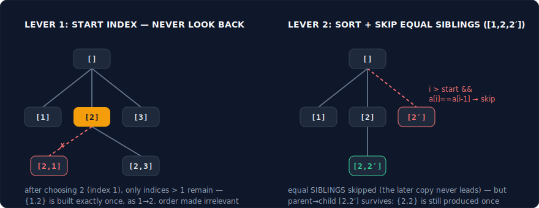
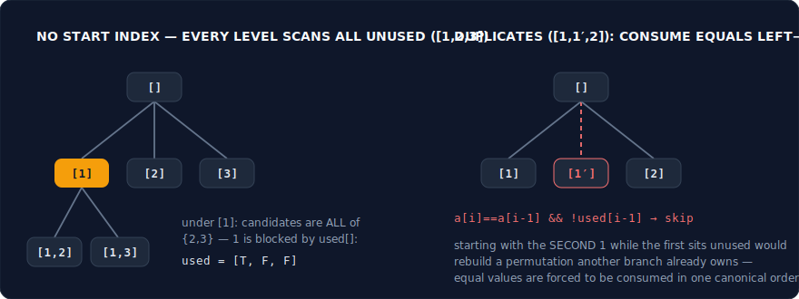
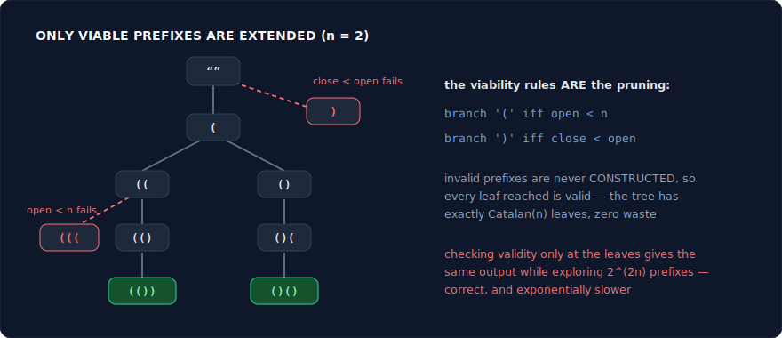
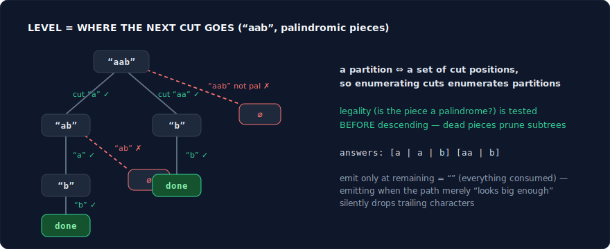
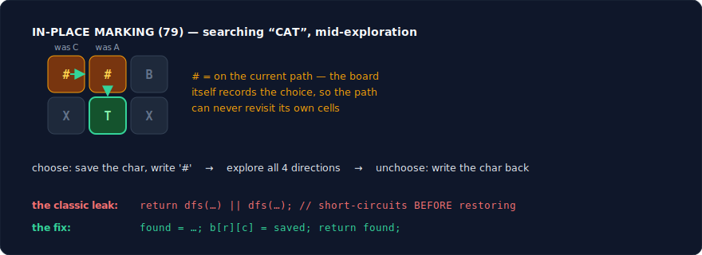

# Backtracking — The Complete Interview Pattern Guide (C++)

Backtracking is DFS over a **decision tree**: each level decides one element, position, or cut; each branch is one choice; the leaves are the solution space. Maintain one shared partial solution — **choose** (mutate it), **explore** (recurse), **unchoose** (restore it exactly) — and the recursion stack enumerates every possibility with one O(n) buffer instead of copying partial solutions everywhere. This guide covers the whole family: subsets/combinations, permutations, constrained string generation, partitioning, and constraint search on boards — the logic, the **core insight** (why it's correct), C++ templates, strong problem sets, and the pitfalls. Plain graph/grid DFS lives in the DFS guide; when the same recursion has overlapping *pure* subproblems, it stops being backtracking and becomes memoized DP (DFS guide P5, DP guide).

---

## What Backtracking Actually Is

> **A DFS over the tree of partial solutions, where entering a node means making a choice, leaving it means undoing that choice, and the shared buffer always mirrors the current root-to-here choice path.**

Three facts define everything below:

- **The bijection.** The decision tree's leaves correspond one-to-one with the solution space — every solution is reached by exactly one choice sequence. Enumeration is therefore complete and duplicate-free *by construction*: no generate-then-dedupe, ever. Every dedupe trick in this guide works by canonicalizing *which* choice sequence is allowed to produce a solution, not by filtering output.
- **The shared-buffer discipline.** One `path` vector, mutated on the way in, restored on the way out — the undo keeps the buffer perfectly synced with the recursion stack. Whatever you change in choose, you reverse in unchoose, *exactly*: buffer pushes, `used[]` flags, board cells, constraint sets. Asymmetry anywhere corrupts every branch that follows.
- **Exponential by necessity, feasible by pruning.** Branch count is exponential because the *answer* is exponential — backtracking is optimal for its job. Pruning doesn't change the complexity class; it discards subtrees *provably empty of answers*, and the leverage compounds with depth: a violation rejected at level 2 kills the entire subtree below it.

**Recognition signals:** the words "**all** / **every** / **generate**" (subsets, permutations, combinations, partitions, boards); n ≤ ~20 (2ⁿ or n! is *intended*); "return the solutions themselves," not just a count. **The negative signal:** if only a count/optimum is asked *and* subproblems repeat with pure arguments — that's DP; count the states and memoize instead (see the boundary section at the end).

![The decision tree for subsets of [1,2], with the choose/explore/unchoose buffer discipline](images/back-choose-unchoose.svg)

---

## The Two Dedupe Levers — Learn Once, Use Everywhere

1. **Start index** — makes order irrelevant. Passing `i + 1` (or `i` for reuse) means "never look backward": each subset/combination is generated in exactly one (sorted-position) order, killing the n! permutation duplicates of the same set. Presence of a start index = combination problem; absence = permutation problem. That one parameter is the diff between problem families.
2. **Sort + skip equal siblings** — kills duplicates from repeated *values*: `if (i > start && a[i] == a[i-1]) continue;`. Among equal values, only "take the earliest available copy" branches survive — a canonical-form argument, not a hack. Skip **siblings** (same tree depth), never parent-child: overskipping silently drops valid answers like {1,1,2}.



---

## Pattern 1: Subsets & Combinations — The Start Index

**Logic:** Level = "which element do I consider next," branch = each candidate at or after `start`. Subsets emit at **every** node (each partial path *is* a subset); combinations emit at target size or target sum. Reuse-allowed variants recurse with `i` instead of `i + 1` — one character encodes "may pick this value again."

**Core insight — why it works:** The start index imposes a canonical order — each subset is built in exactly one way (ascending position order), so the bijection holds without any duplicate checking. Everything else in this family is that template plus one twist: a size constraint (77), a sum constraint with pruning (39/40), duplicate values needing the skip-siblings lever (90/40). Learn the diffs *as diffs*: 39 vs 40 differ by exactly two tokens (`i` vs `i+1`, plus the skip line) — being able to say which token encodes which rule is the mastery test.

**Template (subsets — the master shape):**
```cpp
vector<vector<int>> res;
vector<int> path;
void dfs(int start, vector<int>& nums) {
    res.push_back(path);                       // every node IS a subset
    for (int i = start; i < (int)nums.size(); i++) {
        // duplicates version: if (i > start && nums[i] == nums[i-1]) continue;
        path.push_back(nums[i]);               // choose
        dfs(i + 1, nums);                      // explore (i+1: never look back)
        path.pop_back();                       // unchoose — restore exactly
    }
}
```

**Problems:**
| Problem | Difficulty | Note |
|---|---|---|
| 78. Subsets | Medium | The master template above. Also know the include/exclude binary-branch formulation — interviewers ask for the "other way." |
| 90. Subsets II | Medium | Sort + the skip-equal-siblings line. Understand *why* it works: among equal values, only "take the earliest available copy" branches survive. |
| 77. Combinations | Medium | Subsets constrained to size k, with the strong prune `n − i + 1 ≥ k − path.size()` (not enough elements left → abandon). Pruning arithmetic practice. |
| 39. Combination Sum | Medium | Reuse allowed → recurse with `i`, not `i+1`. Prune: break when the candidate exceeds the remaining target (requires sorting). |
| 40. Combination Sum II | Medium | No reuse + duplicate values: `i+1` recursion plus the skip-siblings line. 39 and 40 differ by exactly two tokens — diff them consciously. |
| 216. Combination Sum III | Medium | Both constraints at once (size k AND sum n) from digits 1–9 — a small, clean drill for stacking prune conditions without breaking completeness. |

**Pitfalls:**
- Pushing `path` into results without copying… is actually fine in C++ (`push_back(path)` copies) — the *real* C++ bug is keeping references/iterators into `path` across mutations. In any language: ensure results capture a snapshot, not the live buffer.
- Dedupe at the wrong level: the skip guard is `i > start`, not `i > 0` — the first candidate at each level must always be allowed, or valid answers containing repeated values vanish.
- `break` vs `continue` when pruning sorted candidates over a target: `break` (everything after is bigger too) — `continue` wastes the whole point of sorting.

---

## Pattern 2: Permutations — used[] and Ordering Rules

**Logic:** Order matters → no start index; every level scans **all** positions and branches on the unused ones. A `used[]` array (or in-place swapping) marks taken elements. Constrained-arrangement problems (526, 996) are permutations where the legality test at each level does the pruning.

**Core insight — why it works:** Without a start index, the decision tree's leaves are orderings — n choices, then n−1, then n−2: exactly n! leaves, the bijection again. The duplicate-values rule is subtler than the subsets one: `a[i]==a[i-1] && !used[i-1]` skips a value when its equal predecessor is *not yet used*, forcing equal values to be consumed strictly left-to-right — one canonical ordering per multiset arrangement. Derive it, don't memorize it: if the earlier copy is unused, some other branch already covers "later copy first," and that branch is the one being killed. The swap formulation (`swap(a[level], a[i])`, recurse, swap back) trades the `used[]` array for O(1) space but loses sortedness — which is why it can't dedupe; pick per problem.

**Picture — every level scans all unused, and the duplicate rule:**



**Template (permutations with used[]):**
```cpp
vector<vector<int>> res;
vector<int> path;
vector<bool> used;
void dfs(vector<int>& nums) {
    if (path.size() == nums.size()) { res.push_back(path); return; }
    for (int i = 0; i < (int)nums.size(); i++) {
        if (used[i]) continue;
        // duplicates version (sorted): if (i && nums[i]==nums[i-1] && !used[i-1]) continue;
        used[i] = true;  path.push_back(nums[i]);   // choose (two mutations!)
        dfs(nums);                                  // explore
        path.pop_back(); used[i] = false;           // unchoose — both, in reverse order
    }
}
```

**Problems:**
| Problem | Difficulty | Note |
|---|---|---|
| 46. Permutations | Medium | The template. Compare with 78 to see exactly which lever changed — no start index, `used[]` appears. |
| 47. Permutations II | Hard | Sort + `used` + the skip rule `a[i]==a[i-1] && !used[i-1]`. The subtlest dedupe rule in the guide; derive it aloud. |
| 526. Beautiful Arrangement | Medium | Permutation where position i only accepts values divisible-compatible with i — the legality test prunes at every level. Count-only, but the state (which values used, at which position) isn't small enough to force DP; plain backtracking with pruning wins. |
| 996. Number of Squareful Arrays | Hard | 47's dedupe + an adjacency constraint (neighboring sums must be perfect squares). Two rules composed — the graduation exam for this pattern. |
| 22-adjacent: 60. Permutation Sequence | Hard | The *anti*-problem: k-th permutation directly by factorial arithmetic, **no** backtracking — enumerating to the k-th is the trap. Knowing when not to backtrack is part of the pattern. |

**Pitfalls:**
- Two mutations per choose (`used[i]`, `path`) → two restores per unchoose, in reverse order. Missing one corrupts silently — the results look *almost* right.
- The dupe rule direction: `!used[i-1]` is correct; `used[i-1]` also "works" (opposite canonical order) but is slower and confuses the derivation — pick the standard form and be able to defend it.
- Swap-based permutations + duplicate values: the array loses sortedness mid-recursion, so the skip rule breaks. Sorted-input dedupe requires the `used[]` formulation.

---

## Pattern 3: Constrained Generation — Build Valid Strings Only

**Logic:** Generate strings position-by-position, but **only extend prefixes that can still lead to a valid answer**. The constraint is checked *before* branching, so invalid strings are never constructed at all — the constraint *is* the pruning. Cartesian-product problems (17) are the unconstrained baseline; parentheses/IP problems layer legality rules on top.

**Core insight — why it works:** For generation problems, validity is usually a *prefix-closed* property: every prefix of a valid string is "still viable" by some measurable condition (open ≥ close for parentheses; ≤ 4 segments each ≤ 255 for IPs). Branching only on viability-preserving extensions means every leaf reached is valid — zero wasted leaves, which turns "generate and filter 2²ⁿ strings" into "walk exactly the Catalan-many valid ones." State the viability condition first (e.g. "open < n allows '('; close < open allows ')'"), and the code writes itself; the condition, not the recursion, is the interview content.

**Picture — invalid prefixes are never constructed:**



**Template (generate parentheses — the constraint is the pruning):**
```cpp
vector<string> res;
string cur;
void dfs(int open, int close, int n) {
    if ((int)cur.size() == 2 * n) { res.push_back(cur); return; }
    if (open < n)      { cur.push_back('(');  dfs(open + 1, close, n); cur.pop_back(); }
    if (close < open)  { cur.push_back(')');  dfs(open, close + 1, n); cur.pop_back(); }
}
```

**Problems:**
| Problem | Difficulty | Note |
|---|---|---|
| 17. Letter Combinations of a Phone Number | Medium | Cartesian-product backtracking: level = digit, branches = its letters. The gentlest full-pattern problem — good first write. |
| 22. Generate Parentheses | Medium | The template. Invalid prefixes are never extended, so everything generated is valid — say that sentence before coding. |
| 93. Restore IP Addresses | Medium | Cut-position generation with hard constraints (≤3 digits, ≤255, no leading zeros, exactly 4 segments). Constraint-stacking drill; also readable as a partitioning problem (Pattern 4). |
| 784. Letter Case Permutation | Medium | Binary branch per letter (upper/lower), pass-through for digits. The include/exclude shape of 78 applied to string building. |
| 301. Remove Invalid Parentheses | Hard | Generation's boss fight: compute the *minimum* removals of each type first, then backtrack keeping/removing with balance pruning and skip-equal-siblings on runs of the same char. Every lever in this guide, composed. |

**Pitfalls:**
- Checking validity at the leaf instead of at the branch — correct output, exponentially slower. The whole pattern is *not constructing* the garbage.
- String buffers still need unchoose: `cur.push_back` / `cur.pop_back` around the recursion. Pass-by-value strings avoid the undo at an allocation cost — fine for interviews, say the tradeoff.
- 93-style numeric parsing: leading zeros ("0" is fine, "01" is not) and values > 255 are separate checks — collapsing them into one condition is the classic wrong answer.

---

## Pattern 4: Partitioning — Where Does the Next Cut Go?

**Logic:** Level = "where does the current segment end," branch = every legal end position; recurse on the remainder. The path holds segments, not elements. Grouping variants (698, 473) partition a *set* into k buckets instead of a string into pieces — level = "which bucket does this element join."

**Core insight — why it works:** A partition corresponds bijectively to a set of cut positions, so enumerating cut positions *is* enumerating partitions — same bijection, different decision. Legality tests (palindromic prefix, sum ≤ side length) prune before descending as always. The bucket variants add a symmetry problem: buckets are interchangeable, so identical bucket states are explored k! times unless canonicalized — the two standard breaks are "place each element in at most one *empty* bucket" and "skip a bucket whose sum equals a previously tried bucket's sum." Sorting descending first amplifies pruning (big items fail early, cheaply). Symmetry-breaking is *the* skill this pattern adds to the family.

**Picture — the cut-position tree on "aab":**



**Template (palindrome partitioning — cut positions):**
```cpp
vector<vector<string>> res;
vector<string> path;
void dfs(const string& s, int start) {
    if (start == (int)s.size()) { res.push_back(path); return; }  // fully cut
    for (int end = start; end < (int)s.size(); end++)
        if (isPalindrome(s, start, end)) {                         // legality before descent
            path.push_back(s.substr(start, end - start + 1));      // choose the segment
            dfs(s, end + 1);                                       // explore the remainder
            path.pop_back();                                       // unchoose
        }
}
```

**Problems:**
| Problem | Difficulty | Note |
|---|---|---|
| 131. Palindrome Partitioning | Medium | The template. Follow-up: precompute the palindrome table (DP guide) so the legality test is O(1) — a clean backtracking×DP hybrid. |
| 93. Restore IP Addresses | Medium | Cross-listed from Pattern 3 — exactly 4 cuts with numeric legality. Same skeleton, tighter constraints. |
| 842. Split Array into Fibonacci Sequence | Medium | Cut positions where each new segment must equal the sum of the previous two — the constraint depends on *earlier segments*, not just the current one. Overflow and leading-zero guards do the real work. |
| 698. Partition to K Equal Sum Subsets | Medium | Buckets: fill one bucket to target at a time (canonical), or element-by-element with the empty-bucket break. Also solvable as bitmask DP (DP guide) — know both and say when each wins. |
| 473. Matchsticks to Square | Medium | 698 with k=4: sort descending (big items first → early failure), skip equal-failed buckets. Pruning-order strategy as the difference between TLE and AC. |
| 1593. Split a String Into the Max Number of Unique Substrings | Medium | Cut positions + a running `unordered_set` as the choose/unchoose state. Maximization over partitions — track the best at full-cut leaves. |

**Pitfalls:**
- The base case is `start == s.size()` (everything consumed) — emitting at "path looks big enough" leaves trailing characters silently unpartitioned.
- Bucket symmetry: without a break, k identical buckets multiply work by k! — and the fix must be *provably* symmetric-only (skip empty buckets after the first, skip equal-sum buckets), or solutions disappear.
- 842-style numeric segments: use `long long` and cut off segments longer than the target's digits — string-to-int overflow is the hidden killer.

---

## Pattern 5: Constraint Search — Boards, Grids, and O(1) Legality

**Logic:** Backtracking where choices live on a 2-D board and constraints couple distant cells: word paths, queen placements, Sudoku digits. Same choose/explore/unchoose engine, plus two upgrades: **in-place marking** (mutate the board as the visited/choice record, restore on backtrack) and **constraint-aware pruning** (test legality *before* descending; track constraint sets incrementally so the test is O(1)).

**Core insight — why it works:** Correctness is the same bijection — completeness comes from trying every legal choice at every step. What's new is the *economics*: raw search spaces here are astronomical (9^81 Sudoku grids), and feasibility comes entirely from **early pruning** — rejecting a partial solution discards its whole exponential subtree, and the leverage compounds with depth: a violation caught at level 2 of N-Queens kills ~n⁶ descendants. So the engineering centerpiece is making legality checks O(1): three boolean sets (columns, diagonals r−c+n, anti-diagonals r+c) for queens; rows/cols/boxes sets for Sudoku — updated in choose, rolled back in unchoose, the same discipline as the path buffer. **Prune early, check cheap, undo exactly** is the whole pattern.

**Picture — the board is the choice record:**



**Template (word search — in-place marking):**
```cpp
bool dfs(vector<vector<char>>& b, int r, int c, const string& w, int k) {
    if (k == (int)w.size()) return true;                  // matched everything
    if (r < 0 || r >= m || c < 0 || c >= n || b[r][c] != w[k]) return false;
    char saved = b[r][c];
    b[r][c] = '#';                                        // choose: mark in place
    bool found = dfs(b, r+1, c, w, k+1) || dfs(b, r-1, c, w, k+1)
              || dfs(b, r, c+1, w, k+1) || dfs(b, r, c-1, w, k+1);
    b[r][c] = saved;                                      // unchoose: restore exactly
    return found;
}
```

**Problems:**
| Problem | Difficulty | Note |
|---|---|---|
| 79. Word Search | Medium | The template. Short-circuit `||` *is* the early exit; the restore must still run after it — note the template restores before returning. |
| 212. Word Search II | Hard | Many words → walk the board and a **Trie simultaneously**, so one traversal matches all words and dead prefixes prune instantly. Big upgrade habits: collect at trie-end nodes, and *remove found words from the trie* to keep pruning sharp. |
| 51. N-Queens | Hard | One queen per row → recursion level = row; legality = three O(1) lookups (cols, two diagonal families). The diagonal indexing (r−c offset, r+c) is the only real trick. |
| 52. N-Queens II | Hard | Count-only version — same search, integer instead of board reconstruction. Use it to time yourself on the pure engine. |
| 37. Sudoku Solver | Hard | Choose = next empty cell, branches = digits legal by row/col/box sets. The strong variant picks the **most-constrained cell first** (fewest legal digits) — order heuristics as pruning, worth mentioning. |
| 489. Robot Room Cleaner | Hard | Backtracking with a *physical* undo: to backtrack the robot must turn 180°, move, and restore orientation. The undo discipline made literal — a memorable design question. |
| 980. Unique Paths III | Hard | Hamiltonian-path counting on a grid: must cover every walkable cell. Track remaining count; prune when the end is reached early. Exhaustive coverage = no shortcuts exist, so backtracking is *the* tool. |

**Pitfalls:**
- Restore-after-short-circuit: `return dfs(...) || dfs(...);` before restoring leaks the mark. Compute into a variable, restore, then return (as the template does).
- N-Queens diagonal indexing: r−c is negative — offset by n (`diag[r−c+n]`). The +n is forgotten constantly.
- Pruning that's *almost* sound: a heuristic that can reject a state containing solutions breaks completeness silently. Distinguish "provably empty subtree" (safe) from "looks unpromising" (unsafe) explicitly.

---

## When Backtracking FAILS — Know the Boundary

| Situation | Why backtracking breaks | Use instead |
|---|---|---|
| Only a count/optimum asked + subproblems repeat with pure args | Exponential when polynomial existed | DFS + memo / DP — count the states (DP guide) |
| "k-th solution" directly (60) | Enumerating to the k-th wastes everything before it | Factorial/combinatorial arithmetic |
| n in the hundreds+ with "all solutions" | Output itself is astronomically large — no algorithm survives | Re-read the problem; it's asking for a count or a best |
| Shortest / minimum-steps to a goal state | DFS order ≠ distance order | BFS over the state graph (BFS guide) |
| Optimization with provable local choice | Enumeration is waste when greedy is provably right | Greedy with an exchange argument (greedy guide) |
| Constraint satisfaction at industrial scale | Interview backtracking ≠ real solvers | Mention CP-SAT/DLX as context, then solve the interview version |

**The purity test — backtracking vs DP in one question:** does the answer for the current arguments depend on *shared mutated state* (the path, the used set, the board)? If yes, the function isn't pure in its args and plain memoization is illegal — that's backtracking territory. If the args alone determine the answer and the distinct-argument count is polynomial, memoize — that's DP. Bitmask states (698) sit exactly on the border: the "shared state" *becomes* an argument, and both tools apply.

---

## Cheat Sheet: Problem Phrase → Pattern

| Phrase in the problem | Pattern |
|---|---|
| "all subsets / combinations summing to target" | Start index (P1) |
| "all orderings / arrangements" | used[] permutations (P2) |
| "input has duplicates, output must be unique" | Sort + skip equal siblings (P1/P2 — two different rules!) |
| "generate all valid strings (parentheses, IPs)" | Constrained generation — legality before branching (P3) |
| "split / partition a string or set into pieces" | Cut positions / buckets + symmetry breaking (P4) |
| "place pieces / fill the grid / find the word" | Board search + in-place marking + O(1) checks (P5) |
| "number of ways" + overlapping pure subproblems | NOT here — DFS+memo (DFS guide P5) / DP guide |
| "shortest sequence of moves" | NOT here — BFS over states (BFS guide) |

---

## Complexity Summary

- Subsets: **O(n · 2ⁿ)**. Permutations: **O(n · n!)**. Combinations: **O(k · C(n,k))**. Output-bound — optimal by necessity.
- Generate Parentheses: O(Catalan(n)) leaves — the constraint prunes 2²ⁿ down to ~4ⁿ/n^1.5.
- Word Search: O(m·n · 3^L) (3, not 4 — no immediate backstep). N-Queens: ~O(n!). Sudoku: exponential, saved by constraint propagation.
- Partition-to-buckets: O(k · 2ⁿ) as bitmask DP vs O(kⁿ) raw backtracking — pruning and symmetry-breaking close most of that gap in practice.
- Pruning never changes the complexity class — it changes the constant universe. Say both halves of that sentence.

---

## Interview Tips

1. **Narrate choose/explore/unchoose as you write it** — and make the undo structurally unskippable (same scope, after the recursion, no early `return` between them). The symmetry is what interviewers are watching for.
2. **Name the lever before using it**: "start index because order doesn't matter"; "sort + skip equal siblings for duplicate values." Naming the rule proves it's a tool, not a memorized incantation.
3. **State the viability condition first** in generation problems ("open < n, close < open") — the condition is the answer; the recursion is boilerplate.
4. **Count before you enumerate.** If only a count is asked, run the purity test out loud — converting 'hard backtracking' to routine DP mid-interview is one of the strongest signals there is.
5. **Every mutation pairs with a restore, in reverse order.** Two mutations in choose (flag + push) = two restores in unchoose (pop + unflag). Audit the pairs before running.
6. **For boards, lead with the O(1) legality design** ("three sets: columns, r−c+n diagonals, r+c anti-diagonals") — the data-structure choice, not the recursion, is the demonstration of seniority.

---

## Suggested Practice Order

**Week 1 — the engine:** 17 → 78 → 77 → 46 → 22 → 784
**Week 2 — dedupe & constraints:** 90 → 40 → 47 → 39 → 216 → 93
**Week 3 — partitioning & arrangements:** 131 → 1593 → 842 → 473 → 698 → 526
**Week 4 — boss fights:** 79 → 51 → 52 → 37 → 212 → 980 → 489 → 996 → 301

Good luck with the interviews!
