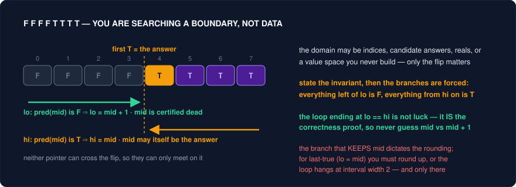
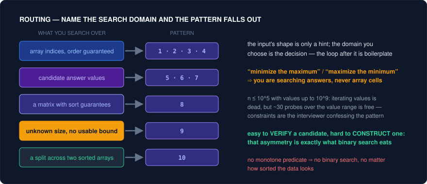
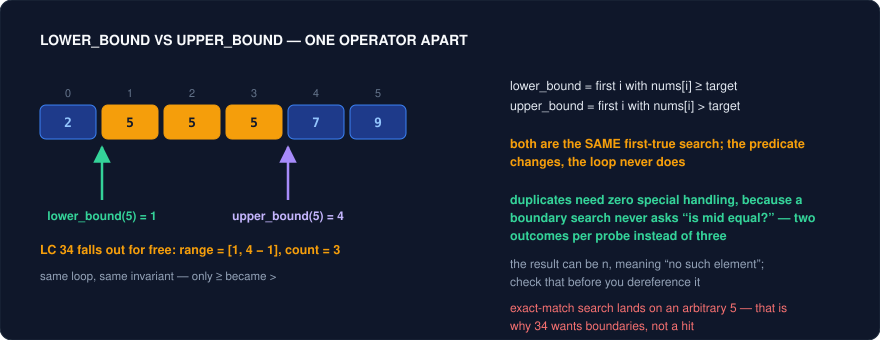
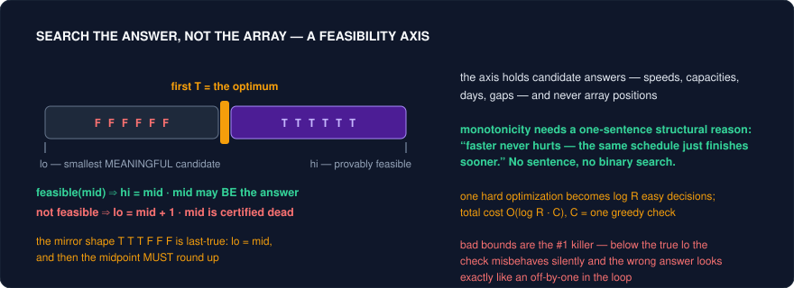
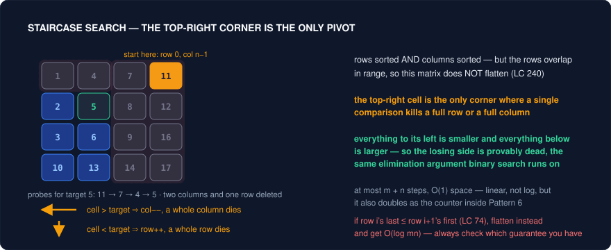

# Binary Search — The Complete Interview Pattern Guide (C++)

Binary search is far bigger than "find x in a sorted array." Its real form is: **any time you can ask a yes/no question whose answer flips exactly once across an ordered domain, you can find the flip point in O(log n) questions.** That domain might be array indices, a range of candidate answers, real numbers, or a virtual value space you never materialize. This guide covers every interview variation: the logic, the **core insight** (why it's correct), C++ templates, strong problem sets with descriptive notes, and the pitfalls — which in binary search are 90% of the difficulty.

---

## What Binary Search Actually Is

The schoolbook definition — "repeatedly halve a sorted array" — is the *least* useful way to think about it, because most interview binary searches don't involve a sorted array at all (Koko Eating Bananas, Find Peak Element, K-th Smallest Pair Distance). The better definition:

> **Binary search is a procedure for locating the boundary of a monotonic yes/no question over an ordered domain, using O(log n) evaluations of that question.**

Unpack each piece:

- **An ordered domain.** Something you can index from small to large: array positions `0..n−1`, candidate answers `1..10⁹`, a real interval `[0.0, 100.0]`, or a virtual space like "all n² pairwise distances". You never need the domain in memory — only the ability to name its midpoint.
- **A yes/no question (the predicate).** For each point x in the domain, `pred(x)` answers true or false. "Is `nums[x] >= target`?" "Can Koko finish at speed x?" "Are there ≥ k pairs with distance ≤ x?"
- **Monotonic.** As x sweeps the domain, the answer flips **at most once**: all falses, then all trues (`F F F F T T T T`). This is *the* condition — everything else is bookkeeping.
- **The boundary is the answer.** "First T" or "last F" is what the problem is really asking for: the insertion point, the minimum feasible speed, the k-th smallest value.

**Why it's O(log n) — the information view.** Finding one boundary among n positions requires distinguishing n possibilities, and each yes/no answer carries at most 1 bit of information — so ⌈log₂ n⌉ questions is the floor *any* method needs, and binary search achieves it by making each question split the remaining possibilities in half. This view explains things the "halve the array" view doesn't: why the data structure is irrelevant (only the question matters), why a sorted array helps (it makes `nums[mid] < target` a monotone predicate over indices), and why ranges like 1..10⁹ are searchable in ~30 probes (log₂ 10⁹ ≈ 30).

**The misconception to kill:** binary search does *not* require sorted data. It requires that **one evaluation at the midpoint provably eliminates half the domain** — a *certificate*. Sortedness is just the most common source of a certificate. Find Peak Element (162) runs binary search on a totally unsorted array, because the local slope at mid certifies which half must contain a peak.

---

## The Three Conditions — Is Binary Search Even Legal Here?

Before writing any code, verify all three. If one fails, binary search will run, terminate, and return confident garbage — its failure mode is silent.

**Condition 1: An ordered, boundable domain.**
You must be able to (a) order the candidates, and (b) bracket the answer with a `lo` you're sure is at-or-below it and a `hi` you're sure is at-or-above it. Domains in the wild: indices of an array; integer answer ranges (`[1, max(piles)]` for Koko, `[max(weights), sum(weights)]` for ship capacity); real intervals; value ranges of virtual spaces (`[matrix[0][0], matrix[n−1][n−1]]`). Bad bounds are the most common search-on-answer bug — `lo` must be a value where the predicate is *meaningful*, not just small.

**Condition 2: A monotonic predicate.**
The yes/no question must flip at most once across the domain. You verify this with a one-sentence implication proof, always of the form *"if true at x, then true at every x beyond it, because…"*:
- *Koko:* "If she can finish at speed s, she can finish at any speed > s — same schedule, every pile just finishes sooner." ✓
- *Ship capacity:* "If capacity c suffices in D days, any capacity > c also does — the same greedy packing still fits." ✓
- *Counter-example:* "Does the subarray ending at x have sum == k?" with negatives present — flips arbitrarily many times. ✗ Not binary-searchable; needs prefix sums + hashmap.

If you cannot produce that sentence, **stop**. This is the test that separates correct solutions from plausible-looking wrong ones.

**Condition 3: The predicate is cheap to evaluate.**
Total cost = (number of probes) × (cost per probe) = O(log R × C). The whole bargain only pays off if C is small — O(1) for array comparisons, O(n) for a greedy simulation or counting pass. If checking one candidate costs O(n²), binary search may still be the right tool, but do that math *before* committing, not after.

A slogan that compresses all three: **binary search converts one hard *optimization* problem into log R easy *decision* problems.** Your real job in the interview is designing the decision procedure; the search wrapper around it is ten lines of boilerplate.

---

## The Universal Mental Model: F F F F T T T T

Draw the domain as a line of predicate values:

```
domain:  1   2   3   4   5   6   7   8   9
pred:    F   F   F   F   T   T   T   T   T
                         ↑
                  the boundary = the answer
```

The same picture with the pointer mechanics drawn in — every probe deletes one side, and the two pointers can only meet on the boundary:



Every binary search in this guide is one of exactly two searches on this picture:

- **First true** (most common): minimum feasible answer, lower_bound, first bad version. Branches: `pred(mid) → hi = mid` (mid might be the answer — keep it), `!pred(mid) → lo = mid + 1` (mid is certified useless — discard it).
- **Last true** (the mirror, for `T T T T F F F` shapes): maximum feasible answer, e.g. "maximize the minimum gap". Branches: `pred(mid) → lo = mid`, `!pred(mid) → hi = mid − 1` — and this direction **requires the midpoint to round up** (`mid = lo + (hi − lo + 1) / 2`) or the loop hangs at interval size 2.

Two disciplines make the picture executable without bugs:

1. **The invariant.** At every moment, state what `lo` and `hi` *mean*: "everything left of `lo` is F; everything from `hi` onward is T." Each branch must preserve that meaning — and if it does, the loop ending with `lo == hi` is itself the correctness proof. When unsure whether to write `mid` or `mid + 1`, the invariant decides for you; never guess.
2. **The rounding rule.** Whichever branch *keeps* mid in the interval dictates the rounding: `hi = mid` → round down (the default formula); `lo = mid` → round up. Violating this produces a loop that passes every small test and hangs on the judge — the signature binary search failure.

Once you can (a) state the predicate, (b) prove it monotone, and (c) say whether you want first-true or last-true, the code is mechanical. That's why this guide spends its words on predicates and proofs, not loop syntax.

---

## How to Recognize a Binary Search Problem

Four kinds of signal, roughly in order of obviousness:

**1. Explicit structural signals — the data has order.**
Sorted array, rotated sorted array, mountain/bitonic array, matrix with sorted rows/columns, "every element appears twice except one" in sorted order. Anything where a comparison at one position tells you about a whole region.

**2. Phrasing signals — the ask matches a boundary.**
- "**Minimize the maximum** …" / "**maximize the minimum** …" — the single loudest tell on LeetCode; it's search-on-answer (Pattern 5) until proven otherwise.
- "Minimum speed / capacity / days / divisor **such that** ‹condition holds›" — same pattern: the answer is the first feasible value.
- "**K-th smallest/largest**" over a space too big to sort (all pairs, all products, all matrix entries) — value-space search with a counting predicate (Pattern 6).
- "First / last position of …", "smallest element ≥ x" — boundary search directly (Pattern 2).
- Answer is a real number "within 10⁻⁶" — real-valued search (Pattern 7).

**3. Constraint arithmetic — the numbers confess.**
Read constraints like a cipher. `n ≤ 10⁵` but values up to `10⁹`: looping over *values* is impossible, but a log over values (~30 probes) is fine → search the value range. Required complexity O(log n) or O(n log maxValue): the intended solution is a search. Brute force over all pairs at n = 10⁵ is ~10¹⁰ operations — dead; counting pairs under a threshold in O(n) inside a 30-probe search is ~3×10⁶ — comfortable. Interviewers pick constraints to force the intended pattern; decode them.

**4. The reverse check — you have a checker but not a finder.**
Sometimes you notice: "verifying a *given* answer would be easy — I just can't construct the optimal one." That asymmetry (easy verification, hard construction) is precisely the shape binary search exploits, *provided* feasibility is monotone. When you catch yourself thinking "if someone told me the answer was 7, I could confirm it in one pass," try searching for the 7.

Once a problem trips one of those signals, the routing question is only ever *what am I searching over*:



---

## Before You Code: The 5-Step Recipe

Run this checklist out loud in interviews — it demonstrates method, and each step kills a whole class of bugs:

1. **Name the domain.** "I'm searching over array indices / candidate speeds 1..max(piles) / the matrix's value range." (Searching the wrong space — indices when you need values — is a real and common error.)
2. **Define the predicate in one sentence.** "pred(x) = all packages ship within D days using capacity x."
3. **Prove monotonicity in one sentence.** "More capacity never hurts: the same packing finishes no later." If the sentence won't come, binary search is the wrong tool — saying so out loud and pivoting scores points.
4. **Choose first-true or last-true,** which fixes the loop shape and the midpoint rounding. Minimizing a feasible value = first true; maximizing = last true.
5. **Justify both bounds.** `lo` = smallest *meaningful* candidate (max single weight, not 1); `hi` = a value you can argue is always feasible (sum of all weights). Then hand-trace the loop once on a size-2 interval before trusting it.

---

## Pattern 1: Classic Exact-Match Search

**Logic:** Maintain an inclusive interval `[lo, hi]` that is guaranteed to contain the target if it exists. Compare the middle element to the target and discard the half that provably can't contain it.

**Core insight — why it works:** Sortedness makes one comparison globally informative: if `nums[mid] < target`, then *everything* at or left of `mid` is also `< target` — one comparison certifies mid+1 elements as non-answers. The invariant "target, if present, lies in `[lo, hi]`" is preserved by every branch, and the interval shrinks by half each step, so after ⌈log₂ n⌉ steps it's empty or pinpointed. Binary search bugs are almost never about this idea — they're about letting the invariant silently break (see pitfalls).

**Template:**
```cpp
int lo = 0, hi = (int)nums.size() - 1;
while (lo <= hi) {                       // interval [lo, hi] is non-empty
    int mid = lo + (hi - lo) / 2;        // overflow-safe midpoint
    if (nums[mid] == target) return mid;
    else if (nums[mid] < target) lo = mid + 1;   // mid certified too small
    else hi = mid - 1;                           // mid certified too big
}
return -1;
```

**Problems:**
| Problem | Difficulty | Note |
|---|---|---|
| 704. Binary Search | Easy | The reference implementation. Write it until you can produce a bug-free version in under two minutes — interviewers use it as a typing test for the harder variants. |
| 35. Search Insert Position | Easy | When the loop ends without a hit, `lo` is exactly the insertion point — a free fact worth internalizing: the failed exact-search leaves `lo` at lower_bound. |
| 374. Guess Number Higher or Lower | Easy | Same template with the comparison hidden behind an API call. Good drill for the "predicate as a black box" mindset that Pattern 5 depends on. |
| 367. Valid Perfect Square | Easy | Search over candidates 1..x for `mid*mid == x`. Use `long long` for the square — the overflow here is the actual test. |
| 69. Sqrt(x) | Easy | Find the **last** mid with `mid*mid <= x` — your first taste of boundary search (Pattern 2) disguised as exact search. |
| 441. Arranging Coins | Easy | Find the last k with `k(k+1)/2 <= n`. Closed-form formula exists, but the binary-search version drills last-true searching with overflow care. |

**Pitfalls:**
- `int mid = (lo + hi) / 2` overflows when `lo + hi > INT_MAX`. Always `lo + (hi - lo) / 2`. It's a one-line habit that interviewers absolutely notice.
- Mixing interval conventions: this template is inclusive-inclusive with `<=`. Pattern 2 uses half-open with `<`. Pick one convention per problem and never blend them — blending is where infinite loops come from.

---

## Pattern 2: Boundary Search — First True / Last False (lower_bound & upper_bound)

**Logic:** The most important binary search in interviews. The domain looks like `F F F F T T T T` under a monotonic predicate, and you want the index of the **first T**. Maintain the invariant: everything left of `lo` is F, everything from `hi` onward is T (half-open `[lo, hi)` thinking). Probe `mid`: if T, the first T is at or before mid (`hi = mid`); if F, it's strictly after (`lo = mid + 1`).

**Core insight — why it works:** Exact-match search has three outcomes per probe; boundary search has **two** — and that's a feature. Any question you can phrase as a monotonic predicate gets the same loop: no special cases, no equality branch, no duplicates headache. `lower_bound` is just first-T under `nums[i] >= target`; `upper_bound` is first-T under `nums[i] > target`; "first bad version" is first-T under `isBad(i)`. When the loop ends, `lo == hi` = the boundary, and the invariant *is* the proof of correctness. Mastering this single template makes Patterns 4–7 fall out as corollaries: they only change what the predicate is and what domain it's evaluated over.

On a duplicate-heavy array the two classic boundaries are the *same loop with a different comparison operator* — which is why duplicates need no special handling at all:



**Template (first index where predicate is true):**
```cpp
int lo = 0, hi = n;                 // half-open [lo, hi); hi = n means "no T exists"
while (lo < hi) {
    int mid = lo + (hi - lo) / 2;
    if (pred(mid)) hi = mid;        // first T is at mid or earlier — keep mid
    else lo = mid + 1;              // mid is F — first T is strictly after
}
return lo;                          // first T, or n if none
// last F = lo - 1.  last T (for T T T F F) = first F − 1 with the flipped predicate.
```

**Problems:**
| Problem | Difficulty | Note |
|---|---|---|
| 278. First Bad Version | Easy | The pattern in its purest form — the predicate is literally handed to you as an API. If `mid` is bad, the first bad is ≤ mid; never set `hi = mid − 1` here, you'd discard a possible answer. |
| 34. Find First and Last Position | Medium | Two boundary searches: first index with `nums[i] >= target` and first with `nums[i] > target`; the range is `[first, second − 1]`. Cleanly dodges the duplicate-handling mess that breaks exact-match approaches. |
| 744. Smallest Letter Greater Than Target | Easy | upper_bound with wraparound (`% n`) on the result. Drill for off-by-one comfort. |
| 2300. Successful Pairs of Spells and Potions | Medium | Sort potions; for each spell, lower_bound the minimal potion that reaches success. n independent boundary searches — the bread-and-butter "sort one side, binary search per query" shape. |
| 1095. Find in Mountain Array | Hard | Three boundary searches stacked: find the peak (Pattern 4), exact-search the ascending side, exact-search the descending side with a flipped comparator. Also tests API-call frugality. |
| 540. Single Element in Sorted Array | Medium | Predicate: "is the single element at or before index i?" — detectable from pairing parity (`nums[2k] == nums[2k+1]` before the single, broken after). A beautiful example of *inventing* the monotonic predicate. |
| 1283. Smallest Divisor Given a Threshold | Medium | First divisor d where `sum(ceil(a/d)) <= threshold` — boundary search over divisor values rather than indices, the bridge into Pattern 5. |

**Pitfalls:**
- The infinite-loop trap: with `lo < hi` and `hi = mid`, the midpoint must round **down** (it does, with this formula). If you ever write the mirrored loop `lo = mid` / `hi = mid − 1` (searching for *last* true), the midpoint must round **up**: `mid = lo + (hi - lo + 1) / 2` — otherwise `lo = mid` makes no progress when `hi = lo + 1`. Rule: *the side that keeps mid determines the rounding direction.*
- Returning without checking `lo == n` (no T exists) when the problem requires the element to actually exist.
- Writing four near-identical searches with `<=`, `<`, `>=`, `>` from scratch each time. Don't: define one first-true template and express everything as a predicate.

---

## Pattern 3: Rotated Sorted Arrays

**Logic:** A sorted array rotated at an unknown pivot is two sorted runs glued together. At every probe, compare `nums[mid]` against an endpoint (usually `nums[hi]` or `nums[lo]`): **at least one half of the interval is guaranteed to be properly sorted**, and you can check in O(1) whether the target lies inside that sorted half. If yes, recurse into it; if no, the target must be in the other (messy) half.

**Core insight — why it works:** Plain binary search needs the whole interval sorted; rotation seems to destroy that. The save: one comparison (`nums[mid]` vs `nums[hi]`) *classifies* the halves — if `nums[mid] < nums[hi]`, the right half `[mid, hi]` is sorted; otherwise the left half `[lo, mid]` is. A sorted half supports an exact range-membership test (`nums[mid] < target <= nums[hi]`), and a definitive yes/no about one half is logically a definitive answer about the other. So you still discard half the interval per probe with certainty — the certainty just comes from a two-step argument instead of one comparison.

The shape to keep in your head is two sorted runs split at the pivot, with every element of the left run above every element of the right — one comparison against `nums[hi]` tells you which run `mid` fell into:

![Two sorted runs joined at the pivot, with the nums[mid] versus nums[hi] test naming which half is fully sorted](images/bs-rotated.svg)

**Template (find minimum in rotated array — also locates the pivot):**
```cpp
int lo = 0, hi = (int)nums.size() - 1;
while (lo < hi) {
    int mid = lo + (hi - lo) / 2;
    if (nums[mid] > nums[hi]) lo = mid + 1;   // min is strictly right of mid
    else hi = mid;                            // right half sorted: min at mid or left
}
return nums[lo];
```

**Problems:**
| Problem | Difficulty | Note |
|---|---|---|
| 153. Find Minimum in Rotated Sorted Array | Medium | The template above. Compare against `nums[hi]`, not `nums[lo]` — comparing with `lo` can't distinguish "not rotated" from "min is to the right", a subtle but real bug source. |
| 33. Search in Rotated Sorted Array | Medium | The classic. Per probe: identify the sorted half, test membership in it, branch. Alternatively: find the pivot with 153, then one plain binary search in the correct segment — slower to write but harder to get wrong under pressure. |
| 81. Search in Rotated Sorted Array II | Medium | Duplicates break the classifier when `nums[lo] == nums[mid] == nums[hi]` — you genuinely can't tell which half is sorted. The fix: shrink both ends by one (`lo++, hi--`). Worst case degrades to O(n), and *saying so unprompted* is the point of the problem. |
| 154. Find Minimum in Rotated Array II | Hard | Same duplicate degradation applied to 153: when `nums[mid] == nums[hi]`, do `hi--` — safe because `nums[hi]` has a duplicate witness at mid, so the minimum can't be lost. |
| 1752. Check if Array Was Sorted and Rotated | Easy | Not a search — count "descents" (`nums[i] > nums[i+1]`, circularly): valid iff ≤ 1. Cheap warm-up for rotation reasoning. |

**Pitfalls:**
- Boundary direction in membership tests: the sorted-half check needs careful `<=` vs `<` at *both* ends (`nums[lo] <= target && target < nums[mid]`). Trace it on a 2-element array — virtually all rotated-search bugs reproduce at n = 2.
- Assuming O(log n) survives duplicates. It doesn't (81, 154) — the adversarial all-equal array forces linear time, and interviewers ask exactly this.

---

## Pattern 4: Peak Finding (Local Structure Instead of Global Order)

**Logic:** The array isn't sorted, but it has *slope*: comparing `nums[mid]` with `nums[mid + 1]` tells you which direction is "uphill". A peak is guaranteed to exist in the uphill direction, so discard the downhill half.

**Core insight — why it works:** Binary search doesn't actually require sortedness — it requires a **certificate**: a O(1) test at mid that proves which half must contain an answer. Here the certificate is the local slope plus the boundary conditions (`nums[-1] = nums[n] = −∞`): if `nums[mid] < nums[mid+1]`, walk uphill from mid+1 — either it climbs forever and hits the n-side cliff (peak at the end) or it turns down somewhere (peak at the turn). Either way a peak exists strictly right of mid. This generalizes the whole technique: *any* problem with a half-certifying probe is binary-searchable, sorted or not.

**Template (any peak element):**
```cpp
int lo = 0, hi = (int)nums.size() - 1;
while (lo < hi) {
    int mid = lo + (hi - lo) / 2;
    if (nums[mid] < nums[mid + 1]) lo = mid + 1;  // uphill to the right — peak there
    else hi = mid;                                 // mid could itself be the peak
}
return lo;
```

**Problems:**
| Problem | Difficulty | Note |
|---|---|---|
| 162. Find Peak Element | Medium | The canonical instance. The interview question behind it: "why does O(log n) work on unsorted data?" — answer with the certificate argument, not hand-waving. |
| 852. Peak Index in a Mountain Array | Easy | Strict mountain guarantee makes the same template even cleaner; the answer is the unique peak. |
| 1095. Find in Mountain Array | Hard | Peak search splits the array into an ascending and a descending sorted half; then two exact searches. Limited API calls force you to make each probe count. |
| 374 / 658-style "closest" variants | — | Once you can find the boundary/peak, "k closest to x" (658) follows by expanding or window-shrinking around the found position — search locates, two pointers harvest. |
| 4. Median of Two Sorted Arrays | Hard | Honorary member: binary search on *how many elements the first array contributes to the left half*. The certificate is the cross-pair test `a[i−1] <= b[j] && b[j−1] <= a[i]` — a valid partition proves the median's location. The hardest standard interview binary search; see **Pattern 10** for the full treatment. |

**Pitfall:** Accessing `nums[mid + 1]` requires `mid < n − 1` — the `lo < hi` loop guarantees it (mid never equals hi), which is precisely why this pattern uses the Pattern-2-style loop rather than `lo <= hi`. Swap loops carelessly and you read out of bounds.

---

## Pattern 5: Binary Search on the Answer (Parametric Search)

**Logic:** Forget the array — binary search the **space of candidate answers**. Define `feasible(x)`: "can the task be done with budget/speed/capacity x?" If feasibility is monotonic in x, the optimal answer is the boundary between infeasible and feasible, found with first-true search over `[loAnswer, hiAnswer]`. The feasibility check is usually a greedy O(n) simulation.

**Core insight — why it works:** The problem asks to *optimize*, which feels like search-over-strategies — intractable. The reframe: don't search strategies, search **outcomes**. For a fixed candidate outcome x, checking feasibility is easy (greedy simulation), and feasibility is monotonic for a structural reason you should articulate per problem (e.g., "anything a slower eater can finish, a faster eater can too — same schedule, finish earlier"). Monotonicity means the answer space is `F F F F T T T T`, so Pattern 2's template applies verbatim with domain = answer values. You've converted one hard optimization into O(log range) easy decision problems. **"Minimize the maximum" / "maximize the minimum" phrasing is this pattern's signature** — when you see it, your first question should be "what's the predicate?"

The whole pattern in one picture — the axis is *feasibility*, not data, and the bracket must be wide enough to contain the flip:



**Template (minimum feasible answer):**
```cpp
long long lo = minPossible, hi = maxPossible;     // bounds must bracket the answer
auto feasible = [&](long long x) -> bool {
    // greedy O(n) check: can we succeed with budget x?
};
while (lo < hi) {
    long long mid = lo + (hi - lo) / 2;
    if (feasible(mid)) hi = mid;                  // try smaller
    else lo = mid + 1;                            // need bigger
}
return lo;                                        // smallest feasible
```

**Problems:**
| Problem | Difficulty | Note |
|---|---|---|
| 875. Koko Eating Bananas | Medium | The gateway problem. Predicate: "at speed k, total hours `sum(ceil(pile/k)) <= h`?" Monotone because faster never hurts. Bounds: `[1, max(pile)]`. Use `(pile + k − 1) / k` for integer ceiling. |
| 1011. Capacity to Ship Packages in D Days | Medium | Predicate: "with capacity c, greedy-packing needs ≤ D days?" Lower bound is `max(weights)` — not 1 — or the greedy check breaks on a single oversized package. Bounds-setting *is* part of the problem. |
| 410. Split Array Largest Sum | Hard | "Minimize the maximum subarray sum over k splits" — the signature phrasing verbatim. Identical predicate to 1011; recognizing that 410 ≡ 1011 is the lesson. (Also a classic DP, but binary search + greedy is strictly better here.) |
| 1482. Minimum Days to Make m Bouquets | Medium | Predicate: "by day d, do adjacent-bloom runs yield ≥ m bouquets?" Feasibility check is a linear run-counting scan. Check `m*k > n` upfront for impossibility. |
| 1283. Smallest Divisor Given a Threshold | Medium | The minimal possible parametric problem — great for nailing the template before the greedy checks get complicated. |
| 2064. Minimized Maximum of Products in Stores | Medium | "Minimize the max products per store": predicate counts stores needed at cap x: `sum(ceil(q/x)) <= n`. Twin of 875 from the other direction. |
| 1552. Magnetic Force Between Two Balls | Medium | **Maximize the minimum** — the mirrored direction: predicate "can we place m balls with pairwise gaps ≥ d?" (greedy placement), and you search for the **last true**. Practice both directions; sign errors between them are rampant. |
| 774. Minimize Max Distance to Gas Station | Hard | Same idea over **real numbers** — see Pattern 7 for the loop change. Predicate: "with max gap d, stations needed = sum(floor(gap/d)) ≤ k?" |
| 1231. Divide Chocolate | Hard | Maximize-the-minimum sweetness across k+1 cuts — 410's mirror. Doing 410 and 1231 back-to-back cements the min-max ↔ max-min symmetry. |
| 2616. Minimize the Maximum Difference of Pairs | Medium | Predicate: "with difference cap x, can greedy form ≥ p disjoint adjacent pairs (after sorting)?" Sort + greedy check inside a parametric search — three techniques in one. |

**Pitfalls:**
- **Wrong bounds** are the #1 killer: `lo` must be a value where the check is *meaningful* (`max(weights)` in 1011, 1 in 875), `hi` must be provably feasible (`sum(weights)`, `max(pile)`). A check that silently misbehaves below the true lower bound produces wrong answers that look like search bugs.
- Direction confusion: minimize-feasible = first true (`hi = mid`); maximize-feasible = last true (`lo = mid`, **with the rounded-up midpoint** `lo + (hi - lo + 1) / 2`). Write the F/T picture in a comment before coding the loop.
- Overflow inside the predicate: sums like `capacity * days` or `sum(ceil(...))` blow through `int` long before the search itself does. Default the answer space and accumulators to `long long`.
- A non-monotonic "predicate": if you can't say *why* feasibility is monotonic in one sentence, stop — binary search on a non-monotonic predicate returns garbage with full confidence.

---

## Pattern 6: K-th Smallest via Counting (Value-Space Search)

**Logic:** "Find the k-th smallest X" where X ranges over a space too large to enumerate (all pairs, all matrix entries, all fractions). Binary search over the **value range**: for candidate v, count how many elements are ≤ v — if `count(v) >= k`, the k-th smallest is ≤ v. Find the first such v. The counting step exploits the structure (sorted rows, sorted array) to run in O(n) or O(n log n).

**Core insight — why it works:** Two ideas fused. First, `count(v) = |{x : x <= v}|` is monotonically non-decreasing in v — automatically, no problem-specific argument needed — so "count ≥ k" is a first-true predicate. Second, the returned boundary value is **guaranteed to be an actual element** even though you searched a continuous value range: at the answer v, `count(v) >= k > count(v − 1)`, which forces at least one element to equal exactly v. So you never need to materialize or sort the giant space — you only need a fast counter. Heap solutions cost O(k log n) and die when k ~ n²; counting search costs O(n log(range)) regardless of k.

**Template (k-th smallest in a row/col-sorted matrix):**
```cpp
long long lo = matrix[0][0], hi = matrix[n-1][n-1];
auto countLE = [&](long long v) {          // elements <= v, O(n) staircase walk
    long long cnt = 0; int row = 0, col = n - 1;
    while (row < n && col >= 0) {
        if (matrix[row][col] <= v) { cnt += col + 1; row++; }
        else col--;
    }
    return cnt;
};
while (lo < hi) {
    long long mid = lo + (hi - lo) / 2;
    if (countLE(mid) >= k) hi = mid;       // k-th smallest is <= mid
    else lo = mid + 1;
}
return lo;                                  // provably an existing matrix entry
```

**Problems:**
| Problem | Difficulty | Note |
|---|---|---|
| 378. Kth Smallest in a Sorted Matrix | Medium | The template problem. The O(n) staircase count (start at top-right, step left/down) is itself a reusable trick — it also solves 240 outright. |
| 668. Kth Smallest in Multiplication Table | Hard | The matrix is *virtual* — entries are `i*j`, never stored. `countLE(v) = sum over rows i of min(v / i, n)`. Demonstrates the pattern's superpower: searching a space that doesn't exist in memory. |
| 719. Find K-th Smallest Pair Distance | Hard | Space = all O(n²) pairwise distances. Sort the array; then `countLE(v)` = pairs within distance v, computed with a sliding window in O(n). Binary search outside, two pointers inside — a pattern sandwich. |
| 786. K-th Smallest Prime Fraction | Medium | Search over fraction *values* in [0,1]; count fractions ≤ v with a two-pointer sweep, tracking the largest fraction seen ≤ v to return the actual pair. Real-valued flavor of the same idea. |
| 1439. Kth Smallest Sum of a Matrix With Sorted Rows | Hard | Count-style search where the counter is a pruned DFS ("count sums ≤ v, give up past k"). Shows the counter can be *anything* fast, even a bounded search. |
| 2040. Kth Smallest Product of Two Arrays | Hard | Signs make `countLE` piecewise (negatives flip inequality direction). Brutal in details, but mechanically the same first-true skeleton — good final-boss practice. |

**Pitfalls:**
- Searching index space instead of value space — there's no "array" to index; the domain is the value range `[min, max]`.
- Believing the answer might not exist in the data: prove the `count(v) >= k > count(v−1)` squeeze to yourself once, then trust it. Many candidates bolt on an unnecessary "verify v exists" pass.
- The counting subroutine dominates correctness: off-by-ones in `countLE` (≤ vs <) shift the answer by whole ranks. Test the counter standalone on a tiny input before wiring it into the search.

---

## Pattern 7: Binary Search on Real Numbers

**Logic:** The answer is continuous (a distance, an average, a square root). Same first-true structure, but the loop terminates on **precision**, not interval emptiness: stop when `hi − lo < eps`, or — more robustly — run a fixed number of iterations (~100 halvings shrink any double range below any meaningful eps).

**Core insight — why it works:** Each iteration halves the interval, so after t iterations the uncertainty is `(hi₀ − lo₀) / 2^t` — convergence is guaranteed and *predictable*, which is why "just do 100 iterations" is both simpler and safer than epsilon games: it sidesteps floating-point edge cases where `lo` and `hi` get so close that `mid` rounds back to `lo` and an eps-based loop spins forever. There is no `mid ± 1` here because real intervals don't shrink by discrete steps — both branches assign `mid` directly, and progress comes purely from the halving.

**Template:**
```cpp
double lo = minVal, hi = maxVal;
for (int iter = 0; iter < 100; iter++) {     // fixed-iteration: immune to FP weirdness
    double mid = (lo + hi) / 2.0;
    if (feasible(mid)) hi = mid;
    else lo = mid;                           // no +1 — continuous domain
}
return lo;
```

**Problems:**
| Problem | Difficulty | Note |
|---|---|---|
| 69. Sqrt(x) (real-valued variant) | Easy | The drill: find r with `r*r = x` to within 1e-6. Integer 69 and real 69 side-by-side teach exactly which parts of the template are about discreteness. |
| 774. Minimize Max Distance to Gas Station | Hard | Parametric search (Pattern 5) over a real-valued answer: stations needed for gap d is `sum(floor(gap/d))`, monotone in d. The flagship real+parametric combination. |
| 644. Maximum Average Subarray II | Hard | Binary search the achievable average v; feasibility = "some subarray of length ≥ k has average ≥ v" ⇔ after subtracting v from every element, some long-enough subarray has sum ≥ 0 (prefix-min check). The subtract-the-candidate transform is a classic. |
| 1515. Best Position for a Service Centre | Hard | Honorable mention: 2-D continuous optimization — ternary search nested in ternary search (or gradient descent). Know that **ternary search** is binary search's sibling for unimodal (single-peak) real functions. |

**Pitfalls:**
- Epsilon chosen poorly: too large fails judges, too small (with eps-loops) risks infinite loops near double precision limits. Fixed iterations dodge the whole question.
- Printing/rounding: the judge may want the floor, a rounding, or fixed decimals — losing a solved problem at the output-formatting step is a real and avoidable tragedy.
- In 644-style problems, the feasibility transform (subtract v, ask about sums) is the hard part; the search wrapper is boilerplate. Budget your interview time accordingly.

---

## Pattern 8: Binary Search Over Structured 2-D Data

**Logic:** Matrices with sort guarantees admit either a direct binary search over a flattened index space, or a non-binary-search cousin — the staircase walk — depending on *how much* order the matrix has.

**Core insight — why it works:** Problem 74's matrix (each row sorted, each row's first element > previous row's last) is a sorted 1-D array wearing a matrix costume: index arithmetic `mid / cols, mid % cols` recovers the bijection, and ordinary binary search applies to the virtual flat array. Problem 240's weaker guarantee (rows sorted, columns sorted, but no inter-row relation) is **not** flattenable — instead, the top-right corner is a pivot where one comparison eliminates a full row or full column (everything left is smaller, everything below is bigger), giving the O(m+n) staircase. Knowing *which* guarantee you have — and therefore which tool applies — is the actual interview question.

When the matrix is *not* flattenable, the top-right corner is the only cell where a single comparison kills an entire row or an entire column — that is what makes the staircase a legitimate elimination argument:



**Template (74 — fully ordered matrix as virtual flat array):**
```cpp
int lo = 0, hi = rows * cols - 1;
while (lo <= hi) {
    int mid = lo + (hi - lo) / 2;
    int val = matrix[mid / cols][mid % cols];   // virtual flat index → 2-D
    if (val == target) return true;
    else if (val < target) lo = mid + 1;
    else hi = mid - 1;
}
return false;
```

**Problems:**
| Problem | Difficulty | Note |
|---|---|---|
| 74. Search a 2D Matrix | Medium | The flatten-and-search above: O(log(mn)). Don't write two stacked binary searches (row then column) when one virtual search is simpler and equivalent. |
| 240. Search a 2D Matrix II | Medium | Staircase from the top-right: `val > target` → step left; `val < target` → step down. O(m+n). Explaining *why* flattening fails here (rows overlap in range) is worth as much as the code. |
| 378. Kth Smallest in a Sorted Matrix | Medium | Cross-listed from Pattern 6 — the staircase walk reappears as the counting subroutine. The two matrix tools compose. |
| 1428. Leftmost Column with at Least a One | Medium | Binary-search each row for its first 1, or staircase from the top-right tracking the best column. The staircase wins under the problem's API-call budget. |

**Pitfall:** Pattern-matching "sorted matrix → flatten" without checking the inter-row guarantee. On 240-style input, the flattened array isn't sorted and the search returns nonsense. Always ask: *is row i's last element ≤ row i+1's first?*

---

## Pattern 9: Exponential / Galloping Search (Unbounded Domains)

**Logic:** Binary search needs a bracket, and sometimes you don't have one — the array's length is hidden behind an API, the stream is conceptually infinite, or the answer's upper bound isn't obvious. Fix it in two phases: **gallop** — start at 1 and double the probe (`1, 2, 4, 8, …`) until the predicate first turns true; then **search** — run an ordinary first-true search inside the last bracket `(lo, hi]`, which is guaranteed to contain the flip.

**Core insight — why it works:** The doubling phase is itself a binary search on the *magnitude* of the answer. If the boundary sits at position p, doubling reaches or passes it after ⌈log₂ p⌉ probes, and the surviving bracket `[p/2, p]` has width ≤ p — so the inner search costs another ⌈log₂ p⌉ probes. Total **O(log p)**, independent of the domain's true size, which may be infinite. Two properties make it safe: the predicate must still be monotone (so overshooting is detectable and never skips the flip), and out-of-range probes must be *answerable* — LC 702's reader returns `2^31 − 1` for out-of-bounds, which conveniently reads as "too big", i.e. as a `T`. This is also the honest fix for a search-on-answer problem whose `hi` you can only bound loosely: rather than guessing `1e18` and hoping the predicate doesn't overflow, double from a known-infeasible value until feasible.

**Template:**
```cpp
// Phase 1 — gallop: find any hi with pred(hi) == true.
long long lo = 0, hi = 1;
while (!pred(hi)) {                       // pred must be safe to call past the "end"
    lo = hi + 1;                          // hi was F, so everything up to hi is F
    hi <<= 1;                             // guard against overflow if the range is huge
}
// Phase 2 — ordinary first-true search in [lo, hi], which now brackets the boundary.
while (lo < hi) {
    long long mid = lo + (hi - lo) / 2;
    if (pred(mid)) hi = mid;
    else lo = mid + 1;
}
return lo;

// LC 702 shape: pred(i) = (reader.get(i) >= target), since out-of-range returns INT_MAX.
// Answer exists iff reader.get(lo) == target.
```

**Problems:**
| Problem | Difficulty | Note |
|---|---|---|
| 702. Search in a Sorted Array of Unknown Size | Medium | The canonical instance. Double `hi` while `reader.get(hi) < target`, then boundary-search `[lo, hi]`. The trick is realizing the sentinel `2^31 − 1` returned past the end *preserves monotonicity*, so out-of-bounds probes need no special casing at all. |
| Search in an infinite sorted stream | — | The interview-only phrasing of 702, usually asked without an API hint. Say "O(log p) where p is the target's position, not O(log n)" — that complexity statement is what's being tested. |
| 1201. Ugly Number III | Medium | `hi` is genuinely awkward to bound by hand (inclusion–exclusion over three divisors). Doubling from 1 until `count(hi) >= n` gets you a valid bracket without any arithmetic argument, then search inside. |
| 878. Nth Magical Number | Hard | Same story with lcm-based counting, plus a modulo on the *output only* — never inside the predicate, or monotonicity dies. Textbook case of "the answer range is unknown, so build it". |
| 349 / 350. Intersection of Two Arrays | Easy | When one sorted array is far shorter than the other, gallop from the previous match position instead of restarting each search: O(m log(n/m)) beats both the O(m log n) per-element search and the O(m+n) merge. This is exactly why real merge routines gallop. |
| 1539. Kth Missing Positive Number | Easy | Bounded, but the same reflex applies: the predicate `missingBefore(i) >= k` is monotone, and the answer can exceed the array — a good drill for "the answer lives outside the data". |

**Pitfalls:**
- Overflow in the doubling phase: `hi <<= 1` on a `long long` that's already near the top silently goes negative and the loop never terminates. Cap it (`hi = min(hi * 2, LIMIT)`) whenever a hard limit exists.
- Setting `lo = hi` instead of `lo = hi + 1` (or vice versa) after a failed probe. `hi` was evaluated F, so it's certified dead — but if you gallop *without* evaluating (pure doubling), the bracket is `[hi/2, hi]` and `lo` must stay at the previous `hi`. Pick one and comment which.
- Assuming out-of-range probes are free. If the API throws or the predicate is undefined past the end, you must guard the probe *before* calling it; 702's sentinel is a gift, not a rule.
- Galloping when a bound is already obvious. If `hi = sum(weights)` is one line, use it — exponential search is for when the bound costs real thought, not for showing off.

---

## Pattern 10: Partition Search Across Two Sorted Arrays

**Logic:** Given two sorted arrays, you want a statistic defined on their *merged* order — the median, or the k-th smallest — without merging. Binary search **the number of elements the shorter array contributes to the left part**. Fixing that count `i` forces the other array's count `j = k − i`, so one number determines an entire candidate partition of both arrays into a "left part" and a "right part" of the right sizes. Search for the `i` that makes the partition valid.

**Core insight — why it works:** A partition is correct exactly when *every element on the left is ≤ every element on the right*, and because each array is already sorted internally, that reduces to just two cross-comparisons: `a[i−1] <= b[j]` and `b[j−1] <= a[i]`. That's the certificate — O(1), no merging. Monotonicity comes free: if `a[i−1] > b[j]`, array A donated too many elements and *every* larger `i` is also wrong, so you move `hi` left; if `b[j−1] > a[i]`, A donated too few. The validity test is therefore cleanly directional over `i ∈ [0, m]` — no `F F T F F` surprises. Always binary search the **shorter** array — that bounds the loop at O(log min(m, n)) *and* keeps `j` in range. The ±∞ sentinels for `i = 0`, `i = m`, `j = 0`, `j = n` are not defensive coding; they are what makes the empty-side cases obey the same two inequalities as everything else, which is what collapses a dozen edge cases into zero.

**Template (median of two sorted arrays; the k-th variant is the same loop with a different `half`):**
```cpp
double findMedian(vector<int>& a, vector<int>& b) {
    if (a.size() > b.size()) return findMedian(b, a);   // always search the shorter one
    int m = a.size(), n = b.size(), half = (m + n + 1) / 2;   // size of the left part
    int lo = 0, hi = m;                                  // i = elements A puts on the left
    while (lo <= hi) {
        int i = lo + (hi - lo) / 2;
        int j = half - i;                                // forced by i
        long long aL = (i == 0) ? LLONG_MIN : a[i - 1];
        long long aR = (i == m) ? LLONG_MAX : a[i];
        long long bL = (j == 0) ? LLONG_MIN : b[j - 1];
        long long bR = (j == n) ? LLONG_MAX : b[j];
        if (aL <= bR && bL <= aR) {                      // valid partition — done
            if ((m + n) % 2) return (double)max(aL, bL); // odd: left part holds the median
            return (max(aL, bL) + min(aR, bR)) / 2.0;
        }
        if (aL > bR) hi = i - 1;                         // A donated too many
        else         lo = i + 1;                         // A donated too few
    }
    return 0.0;                                          // unreachable for valid input
}
```

**Problems:**
| Problem | Difficulty | Note |
|---|---|---|
| 4. Median of Two Sorted Arrays | Hard | The flagship. Required complexity O(log(m+n)) is the tell that merging is off the table. Learn the **partition invariant** (`aL <= bR && bL <= aR`) rather than memorizing the code — under pressure the invariant regenerates the code, but memorized code doesn't regenerate the invariant. Recursing on the shorter array in line 1 removes half the edge cases for free. |
| 88. Merge Sorted Array | Easy | The O(m+n) baseline you should state *first* in the interview ("merge and index — linear; now let me beat it"). Also the sanity oracle: brute-force merge on random small inputs is how you unit-test a partition search. |
| K-th element of two sorted arrays | — | The generalization: set `half = k` and return `max(aL, bL)` when the partition validates. Classic phone-screen follow-up to 4; if you wrote 4 with `half` as a named variable, this is a one-line change. |
| 2387. Median of a Row Wise Sorted Matrix | Medium | The trap: partition search does **not** extend to m arrays — the cross-comparisons blow up combinatorially. Switch to Pattern 6 (binary search the value, count elements ≤ v across all rows). Knowing where this pattern stops is worth as much as knowing it. |
| 378. Kth Smallest in a Sorted Matrix | Medium | Cross-listed contrast: counting-based rank search costs O(n log range) and generalizes to any number of sorted sequences; partition search costs O(log min(m,n)) but only works for two. Pick by the arity of the input. |

**Pitfalls:**
- Searching the longer array: `j = half − i` can go negative or exceed `n`, and you'll paper over it with clamps that quietly return wrong medians. The `if (a.size() > b.size()) swap` line is load-bearing.
- Using `INT_MIN` / `INT_MAX` as sentinels while comparing against values that can equal them. Promote to `long long` (as above) so the sentinels are strictly outside the value range.
- `half = (m + n + 1) / 2` (not `(m + n) / 2`): the `+1` makes the left part hold the extra element on odd totals, so the odd case is `max(aL, bL)` with no second branch.
- Using `lo < hi` with `hi = m`: this search terminates on *finding a valid partition*, not on interval collapse, so it wants the inclusive `lo <= hi` form. Mixing it with the Pattern 2 loop is the standard way people break this problem.

---

## When Binary Search FAILS — Know the Boundary

| Situation | Why it breaks | Use instead |
|---|---|---|
| Predicate isn't monotonic (feasibility flips multiple times) | The F/T picture has multiple boundaries — search converges to an arbitrary one | Linear scan, DP, or restructure the predicate |
| Unsorted data, no certificate at mid | A probe proves nothing about either half | Hashing, sorting first, selection algorithms |
| "K-th smallest" but you need *all* top-k, not just the value | Counting search yields one value, not a set | Heap / quickselect / partial sort |
| Unimodal real function, want the max (not a boundary) | First-true search needs a flip, not a peak | **Ternary search** or derivative + binary search |
| Answer space bounds unknown or unbounded | Can't bracket the search | **Exponential search** (Pattern 9): double `hi` until feasible, then binary search inside |

One-sentence litmus test: **binary search applies iff you can state a yes/no question about a single candidate, prove its answer flips exactly once across an ordered domain, and evaluate it quickly.** No monotone predicate → no binary search, no matter how sorted things look.

---

## Cheat Sheet: Problem Phrase → Pattern

| Phrase in the problem | Pattern |
|---|---|
| "sorted array, find target / insert position" | Classic exact / boundary search |
| "first/last occurrence", "first bad version" | Boundary (first-true) search |
| "rotated sorted array" | Sorted-half classification |
| "peak", "mountain array" | Certificate-based peak search |
| "minimize the maximum …" / "maximize the minimum …" | Binary search on the answer |
| "minimum speed/capacity/days such that …" | Binary search on the answer |
| "k-th smallest pair/entry/fraction" | Value-space search + counting |
| answer is a real number to given precision | Real-valued search, fixed iterations |
| "m × n matrix, rows and columns sorted" | Flatten (74) vs staircase (240) — check the guarantee |
| "array of unknown size", "infinite stream", no bound on the answer | Exponential bracket, then boundary search |
| "median / k-th element **of two sorted arrays**", O(log(m+n)) demanded | Partition search across the two arrays |
| O(log n) demanded, data looks unsorted | Hunt for the hidden monotone predicate (540, 162) |

---

## Complexity Summary

- Classic / boundary / rotated / peak: **O(log n)**, O(1) space.
- Rotated with duplicates (81, 154): **O(n) worst case** — duplicates destroy the half-classifier.
- Search on answer: **O(n log R)** — R = answer range, n = cost of one feasibility check.
- K-th smallest counting: **O(C log R)** — C = counter cost (O(n) staircase, O(n) window, …).
- Real-valued: **O(n · iterations)**, iterations ≈ 100 or log₂(range/eps).
- Exponential / galloping: **O(log p)** — p = position of the boundary, *not* the size of the domain; the bracket phase and the search phase each cost ≈ log₂ p probes.
- Partition search across two sorted arrays (4, k-th of two): **O(log min(m, n))**, O(1) space — always search the shorter array.

---

## Interview Tips

1. **State the predicate and its monotonicity proof before any code.** "feasible(c) = greedy days ≤ D; monotone because extra capacity never increases days." If you can't produce that sentence, binary search is the wrong tool — and discovering that *out loud* scores points.
2. **Declare your loop convention and stick to it.** "Half-open `[lo, hi)`, `while (lo < hi)`, first-true" — then every `mid + 1` vs `mid` decision is forced by the convention instead of guessed. Convention-mixing is the root cause of nearly all binary search bugs.
3. **The rounding rule:** the branch that *keeps* mid dictates the midpoint rounding. `hi = mid` → round down (default). `lo = mid` → round up (`+ (hi - lo + 1) / 2`). Violate it and you get an infinite loop precisely at interval size 2 — which is why broken searches pass small tests and hang on the judge.
4. **Trace n = 2 by hand.** Two elements, target at each position and absent — five traces, thirty seconds, catches the overwhelming majority of off-by-ones before the interviewer does.
5. **Overflow checklist:** midpoint (`lo + (hi - lo)/2`), squares (`mid*mid` in 69/367), products and sums inside feasibility checks. Reach for `long long` the moment values can exceed ~4×10⁴ squared.
6. **For search-on-answer, justify the bounds.** `lo = max(weights)` in 1011 isn't pedantry — below it the greedy check is meaningless. Bad bounds are wrong-answer bugs disguised as search bugs, and they're miserable to debug live.

---

## Suggested Practice Order

**Week 1 — templates cold:** 704 → 35 → 278 → 34 → 69 → 367 → 744
**Week 2 — structural variants:** 153 → 33 → 81 → 162 → 852 → 540 → 74 → 240 → 702
**Week 3 — search on answer:** 1283 → 875 → 1011 → 410 → 1482 → 1552 → 2064 → 1231 → 1201
**Week 4 — boss fights:** 378 → 719 → 668 → 786 → 644 → 774 → 878 → 1095 → 4 (Median of Two Sorted Arrays) → k-th element of two sorted arrays

Good luck with the interviews!
