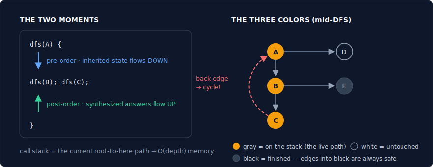
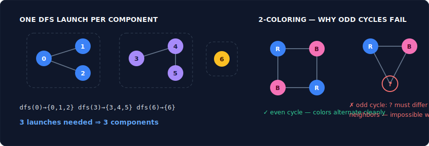
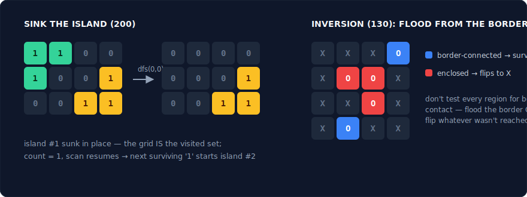
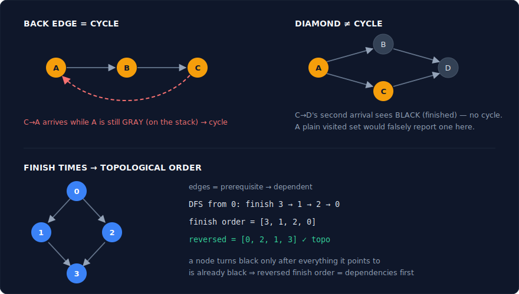
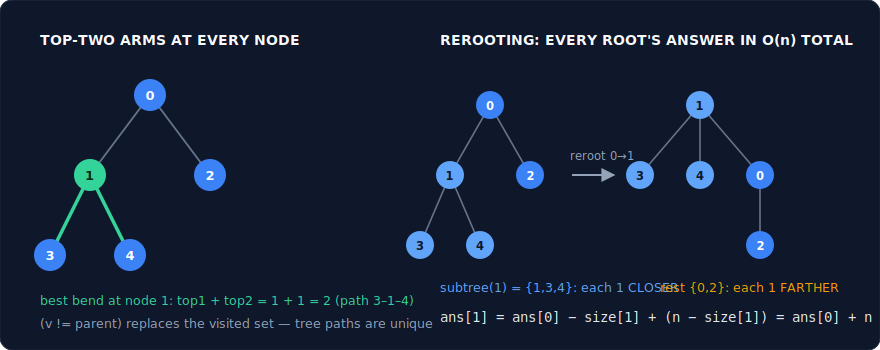
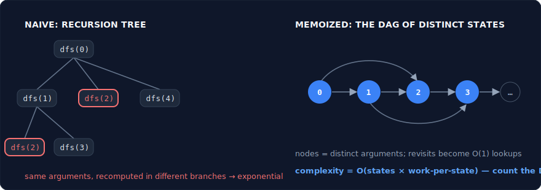
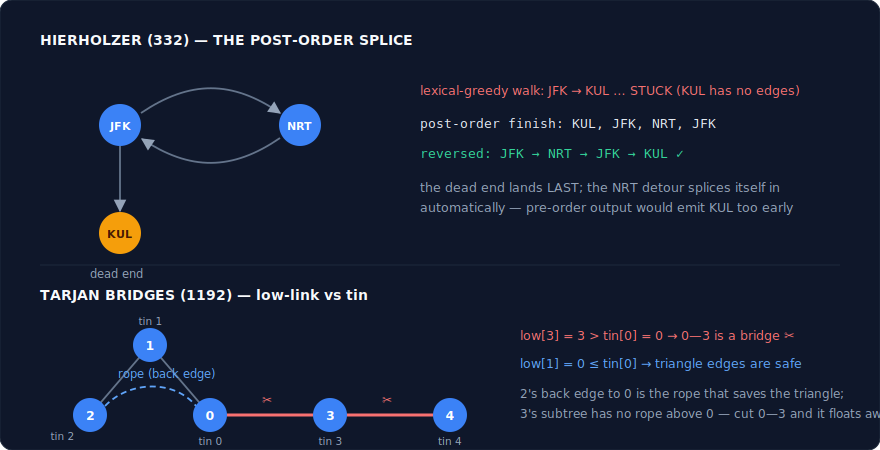

# Depth-First Search — The Complete Interview Pattern Guide (C++)

DFS commits: it follows one path as deep as it can go, and only when stuck does it back up to the last choice point and try the next option. That commit-and-backtrack rhythm makes it the engine behind an enormous share of interview problems — connectivity checks, cycle detection, topological ordering, exhaustive enumeration, and top-down DP are DFS wearing different costumes. This guide covers the graph and grid side of that territory: the logic, the **core insight** (why it's correct), C++ templates, strong problem sets with descriptive notes, and the pitfalls. Two DFS families have their own dedicated guides: binary-tree and BST recursion (the **Binary Tree** and **BST** guides), and enumeration over decision trees (the **Backtracking** guide) — this one stays off those except where general (adjacency-list) trees behave like graphs.

---

## What DFS Actually Is

> **DFS is a traversal that fully explores one branch before considering its siblings — equivalently, a stack-driven search where the most recently discovered node is expanded next.**

The deeper way to see it: **DFS is recursion itself.** Any recursive function exploring a structure — graphs, grids, decision sequences, subproblem spaces — *is* a DFS, whether or not you call it that. Three consequences define everything below:

- **Memory = one path.** At any moment, the call stack holds exactly the current root-to-here path: O(depth) memory, versus BFS's O(width) frontier. On deep-narrow structures DFS is light; on a 10⁵-cell snake-shaped grid it overflows the call stack — know both edges of that blade.
- **Two moments per node, and they are not interchangeable.** Each node is touched on the way **down** (pre-order: before its descendants) and on the way **up** (post-order: after them). Pre-order is where *inherited* state flows down (the path so far, choices made). Post-order is where *synthesized* answers flow up — and in graphs, post-order finish times are what make topological sort and Tarjan's algorithms work. **Choosing which moment your logic belongs to is 80% of designing a DFS.**
- **Backtracking is built in.** When a call returns, its local state vanishes — the algorithm has automatically "undone" the descent. Explicit backtracking (the Backtracking guide) extends this to *shared* state: whatever you mutate on the way in, you restore on the way out, keeping the shared state in sync with the stack.

**DFS vs BFS — the decision rule** (mirror of the BFS guide's table): shortest path / fewest moves / per-level questions → BFS; existence, exhaustive enumeration, connectivity, anything needing the **path itself** or **post-order finish times** → DFS. The structural reason: BFS's frontier knows distances but no paths; DFS's stack *is* a path but knows nothing about minimality.

**The three colors — DFS's state vocabulary for graphs.** White = untouched; **Gray = currently on the stack** (discovery started, not finished); Black = fully explored. The gray set is DFS's superpower: it's the live path, and meeting a gray node means you've found a **back edge** — a cycle through your own ancestry. BFS has no analogue; this is why directed-cycle detection is DFS territory.



---

## How to Recognize a DFS Problem

**1. Structural signals.** Graphs given as adjacency lists/matrices or edge lists; grids where regions matter. Binary-tree problems → the Binary Tree guide (BSTs → the BST guide); "generate all …" decision-tree problems → the Backtracking guide; they're DFS too, but with their own pattern vocabulary.

**2. Phrasing signals.**
- "Does a path **exist**", "is it connected", "can A reach B" — plain graph DFS (Pattern 1).
- "Island / region / area / flood" on a grid — grid DFS (Pattern 2).
- "Detect a **cycle**" in a directed graph, "order the tasks / courses" — gray-set DFS + topological sort (Pattern 3).
- "A tree with n nodes and n−1 edges" given as an edge list — general-tree DFS (Pattern 4).
- "Number of ways / min cost" over choices with **overlapping subproblems** — DFS + memo (Pattern 5).
- "Use every **edge** once", "critical connection" — Eulerian path / bridges (Pattern 6).
- "**All** paths / **all** combinations / generate **every** valid …" — the Backtracking guide.

**3. Constraint arithmetic.** n ≤ 10⁵ with a graph or tree → linear DFS. Exponential-looking recursion but the **distinct argument count is small** (n·k states) → memoize it (Pattern 5). n ≤ ~20 with "all subsets/orderings" → enumeration is *intended*: the Backtracking guide.

**4. The negative signal.** "Shortest / minimum number of moves" with unit steps — that's BFS; DFS finds *a* path, not the best one, and depth-first order gives no minimality guarantee.

---

## Pattern 1: Graph DFS — Connectivity, Cloning, Coloring

**Logic:** DFS on graphs = recursion + a `visited` set (graphs have cycles; without the set you recurse forever). Connectivity: one DFS visits exactly one component; an outer scan counts them. Bipartiteness: replace the boolean with a 2-color assignment — neighbors must alternate, and a same-color neighbor is a proof of impossibility (an odd cycle).

**Core insight — why it works:** For connectivity, the argument is the equivalence-class one: a DFS from any node visits exactly its component — no more, no less — so "number of DFS launches needed" *is* "number of components." For cloning, a `original → copy` map does double duty as the visited set: clone-on-first-visit, return the mapped copy on revisits — cycles are exactly why the map must be checked *before* recursing. For 2-coloring, DFS propagates a forced constraint: each edge forces its endpoints to differ, so colors are determined component-wide by the first choice, and any conflict found is a genuine odd cycle, not an artifact of traversal order.

**Picture — one DFS launch per component; 2-coloring and the odd cycle:**



**Template (component counting):**
```cpp
vector<bool> visited;
void dfs(int u, vector<vector<int>>& adj) {
    visited[u] = true;
    for (int v : adj[u])
        if (!visited[v]) dfs(v, adj);
}
// caller: components = number of i with !visited[i] that trigger a dfs(i)
```

**Problems:**
| Problem | Difficulty | Note |
|---|---|---|
| 547. Number of Provinces | Medium | Component counting on an adjacency *matrix* — the canonical scan-plus-DFS. (Union-Find is the equal-credit alternative; offer both.) |
| 841. Keys and Rooms | Medium | Pure reachability from node 0: can DFS touch everything? The minimal graph-DFS problem. |
| 133. Clone Graph | Medium | DFS with a `original → copy` map doing double duty as the visited set — clone-on-first-visit, return the mapped copy on revisits. |
| 399. Evaluate Division | Medium | Weighted reachability: DFS from numerator to denominator multiplying edge ratios. Graph modeling (variables = nodes, equations = weighted edges) is the actual problem. |
| 785. Is Graph Bipartite? | Medium | 2-coloring DFS: color neighbors oppositely; a same-color edge = odd cycle = not bipartite. Remember disconnected graphs — launch from every uncolored node. |
| 886. Possible Bipartition | Medium | 785 with a modeling step: "dislike" edges, then bipartiteness verbatim. Recognizing the reduction *is* the problem. |
| 1319. Number of Operations to Make Network Connected | Medium | Components again, plus one observation: connecting c components needs c−1 spare cables; total edges ≥ n−1 or it's impossible. Counting + arithmetic. |
| 721. Accounts Merge | Medium | Emails as nodes, accounts as cliques; components = merged accounts. DFS or DSU — the graph-construction step dominates the difficulty. |

**Pitfalls:**
- Forgetting to launch DFS from *every* unvisited node — reachability-from-0 problems (841) are the exception, not the rule; component and coloring problems need the outer scan.
- Clone Graph: inserting into the map *after* recursing into neighbors → infinite loop on any cycle. Map-insert first, recurse second.
- Bipartite check on a disconnected graph: an isolated clean component doesn't vouch for the others.

---

## Pattern 2: Grid DFS — Flood Fill & Islands

**Logic:** A grid is a graph in disguise: cells are nodes, the 4-neighborhood is the edge set. DFS from a cell "floods" its entire region. The signature economy move: **mark visited in place** — sink the island (`'1' → '0'`), overwrite the color — so the grid itself is the visited set and no extra structure exists.

**Core insight — why it works:** Flood fill is component-finding where the component is defined by cell values instead of an explicit edge list — the equivalence-class argument transfers verbatim. In-place marking is safe because region membership is monotone: once a cell is claimed by a region it can never belong to another, so destroying its original value costs nothing (and if the problem forbids mutation, say so and fall back to a visited array — noticing that constraint is part of the test). The pattern's second weapon is **inversion**: when the question is about regions *not* touching the border (130, 1020), don't test each region for border contact — flood *from the border inward* and whatever survives is the answer. Complementing the query is often the whole solution.

**Picture — sinking in place, and the border inversion:**



**Template (flood fill / sink the island):**
```cpp
int m, n;
void dfs(vector<vector<char>>& g, int r, int c) {
    if (r < 0 || r >= m || c < 0 || c >= n || g[r][c] != '1') return;
    g[r][c] = '0';                      // mark in place — the grid IS the visited set
    dfs(g, r+1, c); dfs(g, r-1, c);
    dfs(g, r, c+1); dfs(g, r, c-1);
}
```

**Problems:**
| Problem | Difficulty | Note |
|---|---|---|
| 733. Flood Fill | Easy | The literal pattern. One guard worth stating: if newColor == oldColor, return immediately or recurse forever. |
| 200. Number of Islands | Medium | Scan + sink + count. DFS is shorter than BFS here; the caveat — recursion depth on snake-shaped islands — is the discussion point that distinguishes candidates. |
| 695. Max Area of Island | Medium | The DFS *returns* the flooded size: `1 + sum of four directions`. Component counting upgraded to component measuring — post-order synthesis on a grid. |
| 130. Surrounded Regions | Medium | The inversion flagship: flood from border 'O's, mark survivors safe, flip the rest. Testing each region for border contact is the clumsy version — say why inversion is better. |
| 1020. Number of Enclaves | Medium | 130's counting twin: sink from borders, count what remains. Drill the inversion until it's reflexive. |
| 417. Pacific Atlantic Water Flow | Medium | Two reverse-flow DFS sweeps from opposite borders, intersect the reachable sets. Same inversion as the BFS guide — the traversal is interchangeable, the inversion isn't. |
| 1905. Count Sub Islands | Medium | Flood grid2's islands; a flood is a sub-island iff every cell sits on grid1 land. Careful: `&=` the check but *keep flooding* — early exit leaves half-sunk islands that double-count. |
| 827. Making a Large Island | Hard | Two phases: label each island with an id and size map, then for each 0-cell sum the *distinct* neighboring ids + 1. Component labeling as a reusable product, not just a count. |

**Pitfalls:**
- Bounds-check order: test `r/c` in range *before* reading `g[r][c]` — the guard clause pattern in the template does this in one line; separate checks in the wrong order segfault.
- Diagonal neighbors: read the problem — most islands are 4-directional, some (regions problems elsewhere) are 8. Assuming is a silent wrong answer.
- 827-style double counting: a 0-cell touching the same island on two sides must count it once — collect neighbor ids in a small set first.
- Recursion depth: a 300×300 all-land grid is 90,000 deep. Flag it and offer iterative/BFS — this is the most commonly probed DFS liability.

---

## Pattern 3: Cycle Detection & Topological Sort — The Gray Set and Finish Times

**Logic:** Directed-cycle detection: upgrade `visited` to three **colors** — meeting a **gray** (in-progress) node means a back edge into your own ancestry: a cycle. Topological sort falls out of the *same* DFS for free: append each node to a list at the moment it turns **black** (post-order finish), then reverse the list — that's a valid topological order.

**Core insight — why it works:** Gray nodes are precisely the current recursion stack — your live ancestry. An edge into a *black* node points at a finished, cycle-free exploration (fine); an edge into a *gray* node closes a directed loop — and **every directed cycle must reveal itself this way** (consider the first cycle node the DFS enters; the cycle's edge back into it arrives while it's still gray). For topological order: a node turns black only after *everything it points to* is already black, so finish order is "dependencies first" — reversed, it's "prerequisites before dependents." One DFS, two products: cycle certificate or valid ordering, never both. Note the asymmetry: in *undirected* graphs a cycle is just reaching a visited node that isn't your immediate parent — colors unnecessary.

**Picture — a back edge vs. a diamond, and finish times becoming topo order:**



**Template (three colors + topo order in one pass):**
```cpp
vector<int> color, order;               // 0 white, 1 gray, 2 black
bool dfs(int u, vector<vector<int>>& adj) {     // returns false on cycle
    color[u] = 1;                       // gray: on the current path
    for (int v : adj[u]) {
        if (color[v] == 1) return false;            // back edge → cycle
        if (color[v] == 0 && !dfs(v, adj)) return false;
    }
    color[u] = 2;                       // black: finished, provably cycle-free below
    order.push_back(u);                 // finish time — everything u needs is already in
    return true;
}
// run from every white node; reverse(order) = topological order
```

**Problems:**
| Problem | Difficulty | Note |
|---|---|---|
| 207. Course Schedule | Medium | Cycle detection verbatim (template above). Pairs with the Kahn's/BFS version — be able to write both and say when you'd pick which (DFS gives the cycle path; Kahn gives the order incrementally). |
| 210. Course Schedule II | Medium | The template's `order` vector, reversed. If you wrote 207 with three colors, 210 is two extra lines — that's the argument for learning the DFS flavor first. |
| 802. Find Eventual Safe States | Medium | "Safe" = not on/leading-to a cycle = comes out **black** with no gray encounters. The three colors *are* the answer encoding — a beautiful re-read of the template. |
| 269. Alien Dictionary (premium) | Hard | Build edges from the first differing character of adjacent words, then topo-sort. The edge-extraction step (and the invalid case: word followed by its own prefix) is the real problem. |
| 2360. Longest Cycle in a Graph | Hard | Functional graph (out-degree ≤ 1): DFS with per-node timestamps; on hitting a gray node, cycle length = time difference. The gray set upgraded from boolean to clock. |
| 1857. Largest Color Value in a Directed Graph | Hard | Topo-order DP: count[node][color] maximized over predecessors, cycle → −1. The standard "DP over a DAG runs in topological order" showcase. |

**Pitfalls:**
- Two-boolean shortcut confusion: `visited` alone detects cycles in *undirected* graphs but gives false positives in directed ones (a diamond A→B→D, A→C→D is not a cycle). Directed needs the gray/in-stack distinction — this exact example is a common interview probe.
- Forgetting to un-gray (mark black) on return — every node looks like a back edge forever after.
- Emitting topo order in pre-order ("push when first visiting") — that's just DFS order, and it's wrong; only *finish* order carries the guarantee. Push at black, reverse at the end.

---

## Pattern 4: DFS on General Trees — Adjacency Lists, No Pointers

**Logic:** A "tree" given as n nodes and n−1 undirected edges is a graph that happens to be acyclic — build an adjacency list, pick a root (usually 0), and DFS with a `parent` parameter instead of a visited set: the only way back is the edge you came from. All the post-order synthesis machinery (subtree sums, diameters, DP states) transfers from binary trees, generalized from left/right to "track the top-two among all children."

**Core insight — why it works:** In a tree there is exactly one path between any two nodes, so excluding the parent *provably* prevents revisits — no visited array needed, and the DFS visits each node once from its unique parent side. Rooting is free: any node works, and the rooted structure exposes subtree decomposition for DP. The advanced move is **rerooting**: compute subtree answers for one root in a first pass, then in a second pass "move" the root across each edge, updating answers in O(1) per move — turning n separate O(n) computations ("answer if rooted at v, for every v") into O(n) total. That two-pass structure is a genuinely different skill from single-root DP and a frequent hard-problem backbone.

**Picture — rooting an edge list, and what rerooting recomputes:**



**Template (n-ary diameter — top-two child depths):**
```cpp
int best = 0;
int dfs(int u, int parent, vector<vector<int>>& adj) {
    int top1 = 0, top2 = 0;                        // two deepest child arms
    for (int v : adj[u]) if (v != parent) {        // parent check replaces visited set
        int d = dfs(v, u, adj) + 1;
        if (d > top1) { top2 = top1; top1 = d; }
        else if (d > top2) top2 = d;
    }
    best = max(best, top1 + top2);                 // best path bending at u
    return top1;                                   // best straight arm for the parent
}
```

**Problems:**
| Problem | Difficulty | Note |
|---|---|---|
| 1245. Tree Diameter (premium) | Medium | The template. Same return/record split as binary-tree diameter, unshackled from binary structure — the bridge problem between this guide and the Binary Tree guide. |
| 1443. Minimum Time to Collect All Apples | Medium | Post-order: a subtree is worth entering iff it contains an apple; cost += 2 per useful edge. Subtree predicates synthesized upward. |
| 2246. Longest Path With Different Adjacent Characters | Hard | Diameter with a constraint: only extend arms whose child character differs. Top-two tracking + a predicate — the two levers of this pattern composed. |
| 1519. Number of Nodes in the Sub-Tree With the Same Label | Medium | Return a 26-count frequency vector per subtree, combine at the parent. Heavier synthesized state; note the cost of copying vs merging counts. |
| 834. Sum of Distances in Tree | Hard | The rerooting flagship: pass 1 computes subtree sizes and root-0 distances; pass 2 rolls the answer across each edge — `ans[child] = ans[parent] + (n − 2·size[child])`. Derive that formula, don't memorize it. |
| 2467. Most Profitable Path in a Tree | Medium | Two DFS actors: precompute Bob's fixed path (timestamps to root), then DFS Alice comparing arrival times. Tree DFS as simulation infrastructure. |

**Pitfalls:**
- Building the adjacency list one-directional: edges are undirected — push both ways or half the tree is unreachable.
- Using node 0 as `parent` sentinel: 0 is a real node — use −1.
- Rerooting sign errors: moving the root toward a child makes `size[child]` nodes closer and `n − size[child]` nodes farther. Write the delta as a comment before coding pass 2.
- Recursion depth: a path-shaped tree with 10⁵ nodes overflows the stack — the iterative fallback matters here more than anywhere.

---

## Pattern 5: DFS + Memoization — Top-Down DP

**Logic:** A recursive solution explores a decision space, but the same **subproblem** (same arguments) recurs across branches. Cache each result the first time (`memo[args]`); return the cached value on every revisit. The recursion is unchanged — only the redundancy is gone.

**Core insight — why it works:** The exponential blowup of naive recursion comes from solving identical subproblems in different branch contexts — but if the function is **pure given its arguments** (the answer depends only on the args, not the path that produced them), recomputation is pure waste. Memoization collapses the recursion *tree* into the recursion *DAG* of distinct states: complexity drops from O(branches^depth) to O(states × work-per-state). The recognition skill is **counting states before coding**: word-break has n suffixes; target-sum has n × (sum range) pairs; grid longest-path has m·n cells — if the count is polynomial, memoize and you're done. And the purity test doubles as the *path-state boundary*: if the answer depends on choices carried in shared mutated state (the Backtracking guide's `path`), the function isn't pure in its args and plain memoization is illegal — that's exactly the line between backtracking and DP.

**Picture — the recursion tree collapsing into the DAG of states:**



**Template (word break):**
```cpp
unordered_map<int, bool> memo;                 // start index → breakable?
bool dfs(const string& s, int start, unordered_set<string>& dict) {
    if (start == (int)s.size()) return true;
    auto it = memo.find(start);
    if (it != memo.end()) return it->second;   // subproblem seen — reuse
    for (int end = start + 1; end <= (int)s.size(); end++)
        if (dict.count(s.substr(start, end - start)) && dfs(s, end, dict))
            return memo[start] = true;
    return memo[start] = false;
}
```

**Problems:**
| Problem | Difficulty | Note |
|---|---|---|
| 139. Word Break | Medium | The gateway: naive is exponential, but only n distinct suffixes exist → n states. Diff the memoized and unmemoized versions to *feel* the tree→DAG collapse. |
| 329. Longest Increasing Path in a Matrix | Hard | DFS-per-cell memoized; the strict increase means no cycles, so no visited set is needed — the memo alone suffices. The cleanest "DFS+memo on a grid" specimen, and a frequent hard. |
| 494. Target Sum | Medium | State = (index, running sum); memo on the pair (offset the sum to index an array). Counting version of top-down DP. |
| 140. Word Break II | Hard | Memoize *lists of sentences* per suffix. Honest caveat: worst cases are exponential in output size — saying "memoization can't beat the size of the answer" is exactly the right boundary statement. |
| 312. Burst Balloons | Hard | The famous reframe: recurse on which balloon bursts **last** in (i, j) — making subintervals independent. Memo on the interval. The reframe, not the memo, is the problem. |
| 1143. Longest Common Subsequence (top-down) | Medium | States = (i, j) pairs. Write it top-down first, then convert to the table — the conversion drill that demystifies bottom-up DP generally. |
| 698. Partition to K Equal Sum Subsets | Medium | Memo on a **bitmask** of used elements — state-space DP where DFS+memo is far more natural than a table. Sits exactly on the backtracking/DP border (cross-listed in the Backtracking guide). |
| 87. Scramble String | Hard | Memo on (i, j, length) triples over a wild branching recursion — the "memo rescues an absurd-looking recursion" showcase. |
| 851. Loud and Rich | Medium | DFS+memo on an explicit DAG: quietest person among all richer-or-equal, memoized per node. The graph flavor of the pattern — memo works because DAGs, like strict increase in 329, guarantee no cycles. |

**Pitfalls:**
- Memoizing impure functions: if shared path state influences the answer, the cache poisons later branches with answers from different contexts. Run the purity test first, always.
- Caching only `true` (139-style searches): negative results recur just as much — cache both or keep the exponential blowup on unbreakable inputs.
- Map-key cost: encode multi-field states into one integer (`i * W + j`) or use arrays over `unordered_map` when ranges are dense — the difference between AC and TLE on tight limits.

---

## Pattern 6: Advanced Graph DFS — Eulerian Paths & Bridges

**Logic:** Two famous algorithms that are "just DFS" with one twist each. **Hierholzer** (use every *edge* exactly once): DFS consuming edges as you go, and append each node to the answer in **post-order** — when it has no unused edges left — then reverse. **Tarjan bridges** (which edges, if removed, disconnect the graph): DFS recording discovery times `tin[u]` and low-links `low[u]` = earliest discovery time reachable from u's subtree; edge (u,v) is a bridge iff `low[v] > tin[u]`.

**Core insight — why it works:** Hierholzer: a greedy walk from the start can only get stuck back where a vertex has odd remaining degree — and post-order insertion splices every detour cycle into the main path automatically; the "stuck" vertex is finished first and thus lands at the *end* of the reversed answer. The recognition test is the phrase "use every **edge** once" (vs. every node — that's Hamiltonian, which is NP-hard and means backtracking). Tarjan: `low[v] > tin[u]` says v's entire subtree, even using back edges, cannot climb above u — so the tree edge (u,v) is the *only* connection between v's world and the rest: cut it and the graph splits. One DFS, O(V+E), no edge-removal experiments needed. The same low-link machinery powers articulation points and SCCs — mention the family, code the bridge version.

**Picture — Hierholzer's post-order splice, and what a bridge looks like:**



**Template (Tarjan bridges — low-link):**
```cpp
int timer = 0;
vector<int> tin, low;                          // init to -1 / 0
vector<pair<int,int>> bridges;
void dfs(int u, int parent, vector<vector<int>>& adj) {
    tin[u] = low[u] = timer++;
    for (int v : adj[u]) {
        if (v == parent) continue;             // don't climb the tree edge you came down
        if (tin[v] == -1) {                    // tree edge
            dfs(v, u, adj);
            low[u] = min(low[u], low[v]);
            if (low[v] > tin[u]) bridges.push_back({u, v});  // v's subtree can't reach above u
        } else low[u] = min(low[u], tin[v]);   // back edge — a rope to an ancestor
    }
}
```

**Problems:**
| Problem | Difficulty | Note |
|---|---|---|
| 332. Reconstruct Itinerary | Hard | Hierholzer verbatim: multiset/sorted adjacency for lexical order, consume edges, post-order push airports, reverse. Knowing this is "every *edge* once, not every node" is the recognition test. |
| 1192. Critical Connections in a Network | Hard | Tarjan bridges verbatim (template above). The `low[v] > tin[u]` inequality — strict, not ≥ — is the line to be able to justify. |
| 753. Cracking the Safe | Hard | De Bruijn sequence = Eulerian circuit on the graph of (k−1)-length states. The modeling leap (passwords as edges) is the entire problem; Hierholzer finishes it. |
| 2097. Valid Arrangement of Pairs | Hard | Eulerian path with explicit start selection: start where out-degree − in-degree = 1. The degree-condition bookkeeping that 332 lets you skip. |

**Pitfalls:**
- Hierholzer with pre-order output: appending airports when first *reaching* them produces invalid itineraries on graphs with detour cycles — post-order + reverse is not optional.
- 332 edge consumption: erase the edge (or advance an iterator) *before* recursing, or the walk reuses it; with multiset adjacency, erase by iterator, not by value (parallel edges exist).
- Tarjan parent-edge handling: skipping `v == parent` by *vertex* breaks on parallel edges between the same pair — skip by edge id when the graph allows multi-edges.
- Confusing bridges (`low[v] > tin[u]`) with articulation points (`low[v] >= tin[u]`, plus the root special case) — related but not interchangeable.

---

## When DFS FAILS — Know the Boundary

| Situation | Why DFS breaks | Use instead |
|---|---|---|
| Shortest path / fewest moves, unit edges | DFS finds *a* path; depth order ≠ distance order | BFS |
| Weighted shortest path | Same, worse | Dijkstra |
| Recursion depth ~10⁵+ (deep lists/grids/path-shaped trees) | Call-stack overflow | Iterative DFS with explicit stack, or BFS |
| Overlapping subproblems but you didn't notice | Exponential when polynomial existed | Add the memo (Pattern 5) — count states! |
| Per-level / ring-structured questions | DFS has no level notion | BFS level loop |
| Dynamic connectivity (edges added over time) | Re-running DFS per query is O(V) each | Union-Find |
| "Visit every **node** exactly once" (Hamiltonian) | No polynomial algorithm exists — don't reach for Hierholzer | Backtracking/bitmask DP (small n only) |

One-sentence litmus test: **DFS is the answer when you need the path itself, post-order finish times, or every solution — and the wrong tool whenever "shortest" or "level" appears with unit steps.**

---

## Cheat Sheet: Problem Phrase → Pattern

| Phrase in the problem | Pattern |
|---|---|
| "connected components / can reach / clone the graph" | Graph DFS (P1) |
| "split into two groups / no conflict pairs" | 2-coloring / bipartite DFS (P1) |
| "islands / regions / flood / area" on a grid | Grid DFS + in-place marking (P2) |
| "not connected to the border" | Inversion: flood from the border (P2) |
| "detect cycle" in a **directed** graph / "order the courses" | Three-color DFS + finish times (P3) |
| "n nodes, n−1 edges" as an edge list | General-tree DFS, parent parameter (P4) |
| "answer for **every** node as root" | Rerooting, two passes (P4) |
| "number of ways / longest / can it be done" + overlapping subproblems | DFS + memo (P5) |
| "use every **edge** exactly once / itinerary" | Hierholzer (P6) |
| "critical connection / removing it disconnects" | Tarjan bridges, low-link (P6) |
| "all subsets / permutations / place queens / solve the board" | NOT here — the Backtracking guide |
| any binary-tree computation | NOT here — the Binary Tree guide |
| any BST computation (validate, kth, insert/delete) | NOT here — the BST guide |
| "shortest / minimum moves" | NOT DFS — go to the BFS guide |

---

## Complexity Summary

- Graph / grid DFS: **O(V + E)** time (grids: O(m·n)); **O(depth)** stack (worst O(V) on degenerate shapes).
- Three-color cycle detection / topo sort: **O(V + E)** — one pass, both products.
- DFS + memo: **O(states × work-per-state)** — the whole point; count states first.
- Rerooting: **O(n)** total for all n roots — that's its entire reason to exist.
- Hierholzer / Tarjan: **O(V + E)** — one pass, no retries.
- Enumeration complexities (subsets 2ⁿ, permutations n!): the Backtracking guide.
- Iterative conversion: same complexity; trades call stack for an explicit one.

---

## Interview Tips

1. **State the function's contract before writing it.** "Returns the size of the flooded region from this cell" — then take the recursive leap of faith and verify only single-step logic. Tracing into recursive calls out loud reads as not trusting recursion.
2. **The gray set is your cycle vocabulary:** "visited alone fails on directed graphs — a diamond isn't a cycle; I need in-stack marking." That one sentence is a known checkpoint.
3. **Topo order = reversed finish order.** Say it before coding 210 and the interviewer knows you understand *why*, not just how.
4. **Before accepting exponential, count the states.** "Branches look exponential, but only n·k distinct (i, sum) pairs exist — memoize." The habit converts half of 'hard backtracking' into routine DP.
5. **Edge vs node coverage decides everything advanced:** every edge once → Hierholzer, polynomial; every node once → Hamiltonian, exponential. Confusing them is a hard fail on 332-class problems.
6. **Flag recursion-depth risk yourself** on big inputs (10⁵-node graphs, long path-trees, snake grids) and offer the iterative or BFS fallback — it's a senior-signal exactly because it bites in production, not just on judges.

---

## Suggested Practice Order

**Week 1 — graphs:** 547 → 841 → 133 → 399 → 785 → 886 → 1319 → 721
**Week 2 — grids:** 733 → 200 → 695 → 130 → 1020 → 417 → 1905 → 827
**Week 3 — cycles, topo & general trees:** 207 → 210 → 802 → 2360 → 1245 → 1443 → 1519 → 2246
**Week 4 — boss fights:** 139 → 494 → 329 → 698 → 312 → 834 → 332 → 1192 → 753

Good luck with the interviews!
