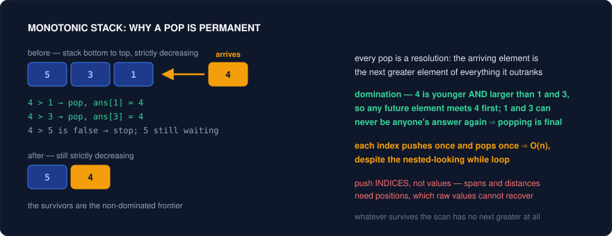
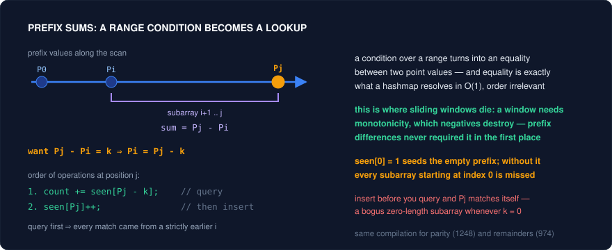
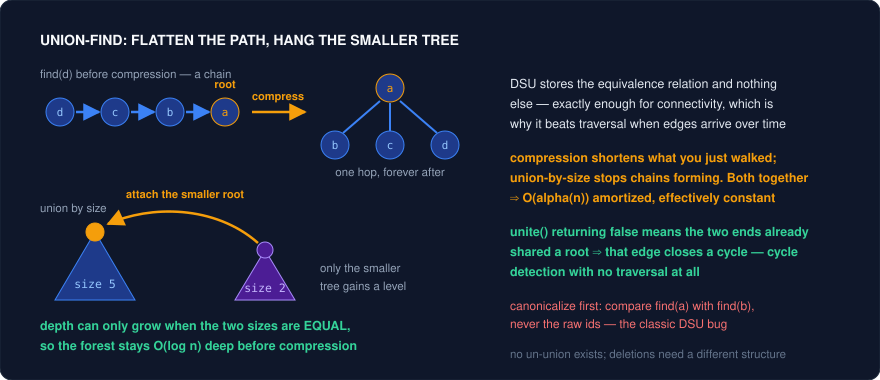
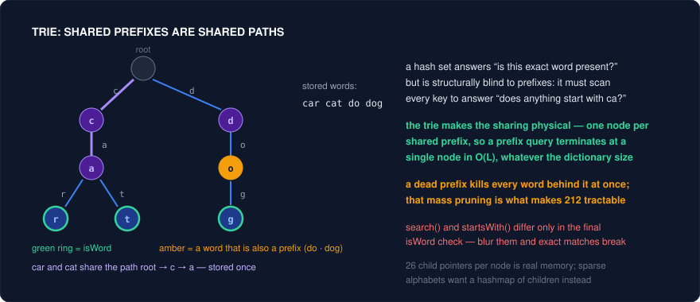
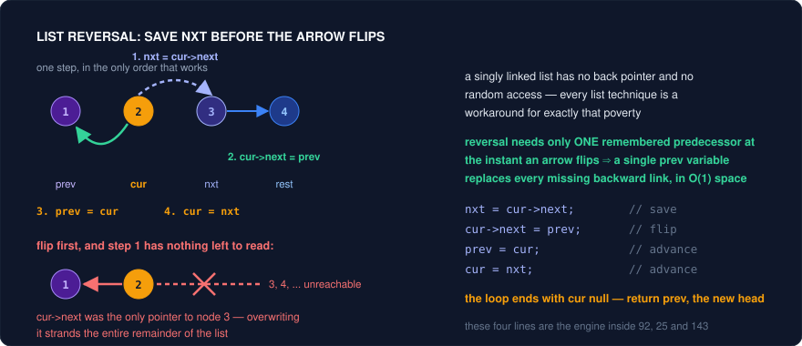

# The Remaining Essentials — High-Frequency Interview Patterns (C++)

The previous guides covered the seven big families: two pointers, sliding window, binary search, heap, BFS, DFS/backtracking, and DP. This guide collects everything else that shows up constantly in interviews — eleven compact patterns, each a frequent favorite, each with the same treatment: the logic, the **core insight** (why it's correct), C++ templates, strong problem sets with descriptive notes, and the pitfalls. Bit manipulation is deliberately absent — XOR sweeps, popcount and lowest-set-bit, power-of-two masks, bitmask-as-set, and arithmetic without operators now have their own dedicated guide in `bit-manipulation-patterns.md`.

---

## Pattern 1: Monotonic Stack — Next Greater / Span Problems

**Logic:** Scan the array once, maintaining a stack whose elements (usually **indices**) are kept in monotonic order of value. Each new element **pops everything it beats** before being pushed — and each pop is a *resolution*: "element x just found its next greater element; it's me." Decreasing stack → finds next greater; increasing stack → finds next smaller.

**Core insight — why it works:** When element x arrives and y < x sits on the stack, y's fate is sealed twice over: x *is* y's next greater element (resolve it now), and y can never again be anyone's answer — any future element would meet x first, and x dominates y (newer **and** bigger). So popping y is permanently safe, and the stack holds exactly the **non-dominated frontier**: elements still waiting for their answer, necessarily in decreasing order. Every element pushes once and pops once → O(n) total, despite the nested-looking while loop — the same amortized accounting as sliding window. This is the deque-domination argument from the heap guide's Pattern 5, specialized to one direction. **Recognition cue:** any "next/previous greater/smaller," "how many days until," "span of," or "largest rectangle" phrasing.



**Template (next greater element / daily temperatures):**
```cpp
vector<int> ans(n, 0);
stack<int> st;                              // indices; values strictly decreasing
for (int i = 0; i < n; i++) {
    while (!st.empty() && nums[i] > nums[st.top()]) {
        ans[st.top()] = i - st.top();       // resolved: i is st.top()'s answer
        st.pop();                           // dominated — never useful again
    }
    st.push(i);
}
// anything left on the stack has no next greater (ans stays 0 / -1)
```

<details>
<summary>Java</summary>

```java
int[] ans = new int[n];                         // zero-initialized by default
Deque<Integer> st = new ArrayDeque<>();         // indices; values strictly decreasing
for (int i = 0; i < n; i++) {
    while (!st.isEmpty() && nums[i] > nums[st.peek()]) {
        ans[st.peek()] = i - st.peek();         // resolved: i is st.peek()'s answer
        st.pop();                               // dominated — never useful again
    }
    st.push(i);
}
// anything left on the stack has no next greater (ans stays 0 / -1)
```

</details>

**Problems:**
| Problem | Difficulty | Note |
|---|---|---|
| 739. Daily Temperatures | Medium | The template verbatim — answer in days (index difference). The cleanest first monotonic-stack problem. |
| 496 / 503. Next Greater Element I / II | Easy/Med | 503's circular trick: iterate `i` from 0 to 2n−1 using `i % n`, pushing only in the first lap. Simulating wraparound without copying the array. |
| 901. Online Stock Span | Medium | Streaming version: store (price, span) pairs; popping accumulates the popped spans. Shows the stack carrying *aggregated* payloads, not just indices. |
| 84. Largest Rectangle in Histogram | Hard | The boss: an increasing stack; popping bar h when a shorter bar arrives fixes h's rectangle — width spans from the new stack top to the current index. Append a virtual 0-height bar to flush the stack. One of the most-asked hards in existence. |
| 85. Maximal Rectangle | Hard | Run 84 on each row's "histogram of consecutive 1s above." Reduction-to-84 is the entire problem. |
| 42. Trapping Rain Water (stack version) | Hard | Decreasing stack; popping a valley floor when a taller right wall arrives adds a horizontal water layer bounded by min(walls) − floor. Compare with the two-pointer version — same answer, orthogonal reasoning. |
| 316 / 1081. Remove Duplicate Letters | Medium | Greedy + monotonic stack: pop a larger letter if it recurs later (recorded in last-occurrence counts) and the current letter is smaller. The stack builds the lexicographically smallest result — stack as *greedy output buffer*. |
| 402. Remove K Digits | Medium | Same greedy-buffer idea: pop bigger digits while you still have removals left. Edge cases: leading zeros, leftover k (trim from the end). |
| 907. Sum of Subarray Minimums | Medium | Contribution counting: each element is the minimum of (left span) × (right span) subarrays, both spans from monotonic stacks. Strict-vs-non-strict on one side prevents double-counting ties — a subtle classic. |
| 1856. Maximum Subarray Min-Product | Medium | 907's spans + prefix sums: min × sum over its dominance range. Two patterns composing cleanly. |

**Pitfalls:**
- Store **indices**, not values — almost every answer needs a distance or a span, and values can't recover positions.
- Strict (`>`) vs non-strict (`>=`) popping changes how ties resolve; in contribution problems (907) it's the difference between correct and double-counted. Decide per side, deliberately.
- Forgetting the flush (virtual sentinel bar in 84, or a post-loop drain) leaves the stack's survivors unresolved — the most common "works on examples, fails submission" cause.

---

## Pattern 2: Prefix Sums + Hashmap — Subarrays Without Windows

**Logic:** Precompute `pre[i]` = sum of the first i elements; any subarray sum is a difference: `sum(i..j) = pre[j+1] − pre[i]`. For "count/find subarrays with sum k," scan once keeping a hashmap of *previously seen prefix values*: at each position, the number of valid subarrays ending here = `count[pre − k]`.

**Core insight — why it works:** This is exactly what picks up where sliding window fails. Windows need monotonicity — adding an element must push the sum one way — which negatives destroy. Prefix sums sidestep monotonicity entirely by turning a **range condition into an equality between two point values**: "some subarray ending at j sums to k" ⇔ "some earlier prefix equals pre[j] − k" — and equality lookups are what hashmaps do in O(1), order be damned. The same compilation works for any invertible accumulation: counts of parity (odd elements → 1248), remainders mod m (974, 523 — where "sum divisible by m" becomes "two prefixes share a remainder"), and balance encodings (equal 0s and 1s → map 0 to −1, seek repeated prefix values — 525). **Recognition cue:** subarray + sum/count/divisibility condition + negatives allowed (or any non-monotone accumulation).



**Template (count subarrays summing to k — LC 560):**
```cpp
unordered_map<long long, int> seen;
seen[0] = 1;                                 // empty prefix — the crucial seed
long long pre = 0;
int count = 0;
for (int x : nums) {
    pre += x;
    auto it = seen.find(pre - k);            // earlier prefixes pairing with me
    if (it != seen.end()) count += it->second;
    seen[pre]++;                             // register AFTER querying (j > i strictly)
}
return count;
```

<details>
<summary>Java</summary>

```java
Map<Long, Integer> seen = new HashMap<>();
seen.put(0L, 1);                             // empty prefix — the crucial seed
long pre = 0;
int count = 0;
for (int x : nums) {
    pre += x;
    Integer hit = seen.get(pre - k);         // earlier prefixes pairing with me
    if (hit != null) count += hit;
    seen.merge(pre, 1, Integer::sum);        // register AFTER querying (j > i strictly)
}
return count;
```

</details>

**Problems:**
| Problem | Difficulty | Note |
|---|---|---|
| 560. Subarray Sum Equals K | Medium | The template, and the single most important "window-killer" problem — negatives allowed is precisely why no window works. Top-5 interview frequency. |
| 525. Contiguous Array | Medium | Equal 0s and 1s: map 0 → −1; a zero-sum subarray ⇔ a repeated prefix value. Store *first occurrence index* (longest, not count). The transform is the problem. |
| 974. Subarray Sums Divisible by K | Medium | Hash the **remainder** of the prefix; equal remainders pair up: add C(cnt, 2) or count online. Normalize C++'s negative `%` with `((pre % k) + k) % k`. |
| 523. Continuous Subarray Sum | Medium | 974 with a length-≥2 constraint: store first index per remainder and require a gap ≥ 2. The k = 0 historical edge case deserves a read of the current constraints. |
| 1248. Count Nice Subarrays | Medium | "Exactly k odd numbers": map elements to parity bits and it's 560 verbatim. Cross-listed with sliding window's atMost trick — two valid compilations of one problem. |
| 303 / 304. Range Sum Query (1-D / 2-D) | Easy/Med | The precompute-then-O(1)-query foundation; 2-D uses inclusion-exclusion: `pre[r2][c2] − pre[r1][c2] − pre[r2][c1] + pre[r1][c1]`. Draw the rectangle once and the signs are obvious. |
| 238. Product of Array Except Self | Medium | Prefix *products* meeting suffix products — two sweeps, no division. The prefix idea generalized beyond sums; an interview perennial. |
| 1074. Number of Submatrices That Sum to Target | Hard | Fix a row pair (O(n²)), compress columns into a 1-D array, run 560 on it. The standard 2-D → 1-D reduction; 560 as a subroutine. |
| 437. Path Sum III | Medium | 560 transplanted onto a tree via DFS with map-undo — cross-listed from the Binary Tree guide as the crossover showcase. |
| 862. Shortest Subarray with Sum ≥ K | Hard | Inequality (not equality) over signed prefixes: hashmap can't help; a **monotonic deque** over prefix sums can. The boundary post between this pattern and Pattern 1's machinery. |

**Pitfalls:**
- `seen[0] = 1` (or index −1 for the longest-variant): omitting the empty-prefix seed silently misses every subarray starting at index 0 — the canonical 560 bug.
- Query **before** registering the current prefix, or a zero-length "subarray" pairs with itself when k = 0.
- C++ `%` on negatives is negative — normalize remainders or your hashmap fragments into wrong buckets.
- Prefix sums overflow `int` casually (10⁵ elements × 10⁴ values) — `long long` by default.

---

## Pattern 3: Intervals — Sort, Then Sweep or Merge

**Logic:** Problems about ranges [start, end]: merging overlaps, counting removals, scheduling, hitting points. Step one is nearly always **sort** — by start (for merging) or by end (for greedy selection) — after which a single left-to-right pass with O(1) state (the current merged interval, or the last accepted end) resolves everything.

**Core insight — why it works:** Sorted by start, all overlap structure becomes **local and sequential**: interval i can only merge with the *current* growing block, never with something already closed — because if `cur.end < next.start`, every later interval starts even further right, so the block is closed *forever*. That one-pass finality is what sorting buys. For selection problems the key theorem is **earliest-end-first greedy**: to fit the most non-overlapping intervals, always keep the one ending soonest — an exchange argument (any optimal solution's first interval can be swapped for the earliest-ending one without losing feasibility, since an earlier end only leaves *more* room). The companion tool is the **sweep line**: convert intervals to +1/−1 events at their endpoints, sort events, and a running counter gives concurrent-interval counts — turning geometric overlap into 1-D bookkeeping.

**Template (merge intervals):**
```cpp
sort(iv.begin(), iv.end());                       // by start
vector<vector<int>> merged;
for (auto& cur : iv) {
    if (!merged.empty() && cur[0] <= merged.back()[1])
        merged.back()[1] = max(merged.back()[1], cur[1]);  // overlap → extend block
    else
        merged.push_back(cur);                              // gap → block closes forever
}
```

<details>
<summary>Java</summary>

```java
Arrays.sort(iv, (a, b) -> Integer.compare(a[0], b[0]));   // by start (int[][] takes a comparator directly)
List<int[]> merged = new ArrayList<>();
for (int[] cur : iv) {
    if (!merged.isEmpty() && cur[0] <= merged.get(merged.size() - 1)[1]) {
        int[] last = merged.get(merged.size() - 1);
        last[1] = Math.max(last[1], cur[1]);                // overlap → extend block
    } else {
        merged.add(cur);                                    // gap → block closes forever
    }
}
```

</details>

**Problems:**
| Problem | Difficulty | Note |
|---|---|---|
| 56. Merge Intervals | Medium | The template; asked everywhere. Remember the `max` on extension — a fully contained interval must not shrink the block's end. |
| 57. Insert Interval | Medium | Already-sorted input, no re-sort: three phases — copy intervals ending before the new one, absorb all overlappers into it (min/max), copy the rest. O(n) and pointer discipline. |
| 435. Non-Overlapping Intervals | Medium | Min removals = n − (max non-overlapping kept) → earliest-end-first greedy. Be ready to *state* the exchange argument, not just code it. |
| 452. Minimum Arrows to Burst Balloons | Medium | 435's twin: an arrow at each accepted interval's end; touching counts as overlap (`<=` vs `<` differs from 435 — read the boundary semantics). |
| 252 / 253. Meeting Rooms I / II | Easy/Med | I: sort, check adjacent overlap. II: min-heap of end times (heap guide P4) **or** the sweep line (sort starts and ends separately, two pointers) — same answer, present both. |
| 1288. Remove Covered Intervals | Medium | Sort by start asc, **end desc on ties**, then count intervals extending the max end seen. The tie-break is load-bearing (same trick as Russian Doll Envelopes). |
| 986. Interval List Intersections | Medium | Two sorted lists → parallel pointers (two-pointers guide P5): intersect = [max starts, min ends]; advance whichever ends first. |
| 1851. Min Interval Including Each Query | Hard | Sort intervals and queries; sweep queries while a min-heap (by length) holds active intervals, lazily evicting expired ones — intervals + heap + lazy deletion in one problem. |
| 729 / 731. My Calendar I / II | Medium | Booking with overlap limits: ordered map of boundary deltas (sweep line as a *persistent structure*) or interval set with binary search. Design-flavored intervals. |
| 1094. Car Pooling | Medium | Pure difference-array sweep: +passengers at pickup, − at dropoff, prefix-scan against capacity. Sweep line in its simplest costume. |

**Pitfalls:**
- Touching endpoints: [1,3] and [3,5] — overlap or not? It flips between problems (435 says no-overlap is fine at equality; 452 says touching balloons share an arrow). Read it; don't assume.
- Sorting by start when the greedy needs **end** (435/452): start-sorted greedy has clean counterexamples — a long early-starting interval blocks two short ones.
- Sweep-line event ordering at equal coordinates (does an end at t process before a start at t?) encodes the touching-semantics — make the comparator express the rule explicitly.

---

## Pattern 4: Union-Find (Disjoint Set Union) — Dynamic Connectivity

**Logic:** Maintain a partition of elements into groups under two operations: `find(x)` — which group is x in (returns a canonical root) — and `unite(x, y)` — merge two groups. Implemented as a parent-pointer forest with two accelerations: **path compression** (point nodes met during find directly at the root) and **union by rank/size** (hang the shorter tree under the taller).

**Core insight — why it works:** The structure stores only the *equivalence relation*, nothing else — exactly enough for connectivity and not a bit more, which is why it beats graph traversal when edges arrive **incrementally**: BFS/DFS answers "connected?" for a frozen graph in O(V+E) per query, while DSU absorbs each new edge in near-O(1) and answers queries instantly forever after. The two optimizations together drive amortized cost to O(α(n)) — the inverse Ackermann function, ≤ 4 for any conceivable n; "effectively constant" is the interview phrase. The bonus capability: `unite` returning *false* (both already in one group) means the new edge closed a **cycle** — undirected cycle detection without any traversal. **Recognition cues:** "connected components" + edges added over time; "merge accounts/groups by shared attribute"; "is this edge redundant"; equations/equivalences to propagate.



**Template (DSU with both optimizations):**
```cpp
struct DSU {
    vector<int> parent, sz;
    DSU(int n) : parent(n), sz(n, 1) { iota(parent.begin(), parent.end(), 0); }
    int find(int x) {
        while (parent[x] != x) {
            parent[x] = parent[parent[x]];   // path compression (halving)
            x = parent[x];
        }
        return x;
    }
    bool unite(int a, int b) {               // returns false ⇔ already connected
        a = find(a); b = find(b);
        if (a == b) return false;            // this edge closes a cycle
        if (sz[a] < sz[b]) swap(a, b);       // union by size
        parent[b] = a; sz[a] += sz[b];
        return true;
    }
};
```

<details>
<summary>Java</summary>

```java
class DSU {
    int[] parent, sz;
    DSU(int n) {
        parent = new int[n]; sz = new int[n];
        for (int i = 0; i < n; i++) { parent[i] = i; sz[i] = 1; }   // no iota in Java
    }
    int find(int x) {
        while (parent[x] != x) {
            parent[x] = parent[parent[x]];   // path compression (halving)
            x = parent[x];
        }
        return x;
    }
    boolean unite(int a, int b) {            // returns false ⇔ already connected
        a = find(a); b = find(b);
        if (a == b) return false;            // this edge closes a cycle
        if (sz[a] < sz[b]) { int t = a; a = b; b = t; }   // union by size (no std::swap)
        parent[b] = a; sz[a] += sz[b];
        return true;
    }
}
```

</details>

**Problems:**
| Problem | Difficulty | Note |
|---|---|---|
| 547. Number of Provinces | Medium | Components = n minus successful unions. The DSU hello-world; compare against the DFS version and say when DSU wins (incremental edges). |
| 684. Redundant Connection | Medium | The cycle-closing edge is the first `unite` returning false — the bonus capability as a whole problem. |
| 721. Accounts Merge | Medium | Union accounts sharing any email (email → first-owner map), then group by root and sort. The grouping-after-union phase is where the implementation effort actually lives. |
| 990. Satisfiability of Equality Equations | Medium | Two passes: union all `a==b`, then check every `a!=b` doesn't share a root. Equivalence-relation modeling in its purest form. |
| 1971. Find if Path Exists | Easy | Connectivity query after offline edges — DSU or one BFS; articulate the static-vs-dynamic trade-off. |
| 305. Number of Islands II | Hard | *The* dynamic version: land appears cell by cell; each addition unions with adjacent land, updating a live component count. The problem BFS fundamentally can't do efficiently. |
| 128. Longest Consecutive Sequence | Medium | Solvable with DSU (union x with x+1), but the hashset start-of-run scan is simpler at the same O(n) — practice arguing *against* the fancier tool. |
| 399. Evaluate Division | Medium | **Weighted** DSU: store ratio-to-parent, compose along find paths. Heavier bookkeeping; the DFS version (DFS guide P1) is interview-safer — know both exist. |
| 1202. Smallest String With Swaps | Medium | Union swap-pair indices; within each component, sort characters and positions independently and reassign — components as free-rearrangement zones. |
| 947. Most Stones Removed | Medium | Union stones sharing a row or column (model rows/cols as nodes!); answer = stones − components. The modeling leap — rows as virtual nodes — is the entire problem. |

**Pitfalls:**
- Comparing raw ids instead of roots (`if (a == b)` before find) — the classic; always canonicalize first.
- Skipping both optimizations degrades find to O(n) chains; either alone gives O(log n), both give α(n) — know the hierarchy when asked.
- String/coordinate keys: map them to dense ints first (or use a hashmap-backed parent), and in 947-style modeling, offset column ids so they don't collide with row ids.
- DSU can't *split* groups — un-union doesn't exist. Deletion-flavored problems need offline reversal tricks or different structures; recognizing that boundary matters.

---

## Pattern 5: Greedy — Local Choices with a Global Proof

**Logic:** Build the solution one irrevocable choice at a time, each chosen by a simple local rule (farthest reach, earliest deadline, largest remaining). No table, no backtracking — but **every greedy needs a proof sketch**, almost always one of: an **exchange argument** (any optimal solution can be morphed into the greedy one without losing value) or an **invariant** (greedy maintains "best possible state so far" by induction).

**Core insight — why it works:** Greedy is legal exactly when the problem has the *greedy-choice property*: some locally best option is provably part of *an* optimal solution — making lookahead unnecessary. That's a theorem per problem, not a vibe; the interview skill is producing the two-sentence version ("suppose an optimal solution doesn't take the earliest-ending interval; swap its first interval for ours — still feasible since we end no later, same count — contradiction"). The practical heuristics for *finding* the rule: sort by the dimension that constrains (deadlines → by deadline; intervals → by end), prefer choices that **keep the most options open** (farthest reach, smallest tail), and when a sort key isn't obvious, test "would swapping adjacent items ever help?" — the pairwise-swap comparator (`a+b > b+a` in Largest Number) is an exchange argument compiled into `sort`.

**Template (jump game — reach as the invariant):**
```cpp
int reach = 0;
for (int i = 0; i < n; i++) {
    if (i > reach) return false;          // invariant broken: i unreachable
    reach = max(reach, i + nums[i]);      // invariant: max index reachable using 0..i
}
return true;
```

<details>
<summary>Java</summary>

```java
int reach = 0;
for (int i = 0; i < n; i++) {
    if (i > reach) return false;             // invariant broken: i unreachable
    reach = Math.max(reach, i + nums[i]);    // invariant: max index reachable using 0..i
}
return true;
```

</details>

**Problems:**
| Problem | Difficulty | Note |
|---|---|---|
| 55. Jump Game | Medium | The invariant template above — `reach` summarizes everything the past can do for the future. |
| 45. Jump Game II | Medium | Min jumps via implicit BFS layers: track the current layer's edge and the next layer's reach; a "jump" is crossing the edge. Greedy that is secretly BFS — say so. |
| 134. Gas Station | Medium | If total gas ≥ total cost, an answer exists; whenever the running tank goes negative, no station in the failed stretch can be the start — restart after it. The "failure invalidates the whole prefix" lemma is the proof to narrate. |
| 763. Partition Labels | Medium | Precompute each char's last occurrence; extend the current chunk to the max last-occurrence seen; cut when i reaches it. Greedy cut points via a reach variable — 55's invariant in a string costume. |
| 406. Queue Reconstruction by Height | Medium | Sort tall-first (k ascending on ties), insert each at index k: shorter people are invisible to taller ones, so earlier placements stay correct. A pure, beautiful exchange/invariance argument. |
| 179. Largest Number | Medium | Custom comparator `a+b > b+a` (as strings). Mention transitivity needs justification — interviewers enjoy that rabbit hole; have the one-line answer ("the relation is a total order via numeric value of a/10^len normalization"). |
| 621. Task Scheduler (formula) | Medium | The closed form `max(n_tasks, (maxFreq−1)(n+1) + ties)` — greedy counting versus the heap simulation (heap guide P4); know when each is asked. |
| 968. Binary Tree Cameras | Hard | Greedy on a tree: place cameras at parents of uncovered leaves — exchange argument: a leaf camera covers a subset of what its parent's would. Cross-listed with tree DP; greedy is the O(1)-state version. |
| 871. Min Refueling Stops | Hard | Cross-listed regret greedy (heap guide P7) — the reminder that greedy's hardest form keeps an undo heap. |
| 605 / 455 / 860. Can Place Flowers / Assign Cookies / Lemonade Change | Easy | The fluency tier: small greedy rules with small proofs. Fast wins for building the proof-stating habit. |

**Pitfalls:**
- Greedy without a proof is a guess: counterexample-hunting is the interviewer's favorite counterplay. Before committing, *try* to break your own rule on 5-element inputs — finding the break yourself is recoverable; having it found for you isn't.
- Sorting by the intuitive key instead of the constraining one (intervals by start instead of end) — the classic 435 failure.
- When greedy fails, the fallback ladder is: regret greedy (heap), then DP. Knowing the ladder turns a dead end into a pivot.

---

## Pattern 6: Trie (Prefix Tree) — Strings Sharing Structure

**Logic:** A tree where each edge is a character and each root-to-node path spells a prefix; nodes carry an end-of-word flag (and often payloads: counts, indices, the word itself). Insert/search/startsWith all walk one node per character: O(L) regardless of how many words are stored.

**Core insight — why it works:** A hashset answers "is this exact word present?" but is structurally blind to **prefixes** — checking "does any word start with pre" requires scanning everything. The trie's move is to make sharing physical: all words with a common prefix share that path, so prefix queries terminate at one node, and — the deeper payoff — *a dead prefix kills every word behind it simultaneously*. That mass-pruning is why tries transform multi-pattern search (Word Search II: thousands of words pruned per board step), autocomplete, and wildcard matching (a `.` fans out across children — branching exactly where ambiguity exists, sharing everywhere else). **Recognition cues:** "prefix" anywhere in the problem; many patterns matched against one text/board; dictionary + character-level operations.



**Template (array-children trie):**
```cpp
struct TrieNode {
    TrieNode* child[26] = {};
    bool isWord = false;
};
struct Trie {
    TrieNode* root = new TrieNode();
    void insert(const string& w) {
        TrieNode* cur = root;
        for (char c : w) {
            int i = c - 'a';
            if (!cur->child[i]) cur->child[i] = new TrieNode();
            cur = cur->child[i];
        }
        cur->isWord = true;
    }
    bool search(const string& w) {           // exact word
        TrieNode* cur = walk(w);
        return cur && cur->isWord;
    }
    bool startsWith(const string& p) { return walk(p) != nullptr; }
    TrieNode* walk(const string& s) {
        TrieNode* cur = root;
        for (char c : s) {
            cur = cur->child[c - 'a'];
            if (!cur) return nullptr;
        }
        return cur;
    }
};
```

<details>
<summary>Java</summary>

```java
class TrieNode {
    TrieNode[] child = new TrieNode[26];
    boolean isWord = false;
}
class Trie {
    TrieNode root = new TrieNode();
    void insert(String w) {
        TrieNode cur = root;
        for (char c : w.toCharArray()) {
            int i = c - 'a';
            if (cur.child[i] == null) cur.child[i] = new TrieNode();
            cur = cur.child[i];
        }
        cur.isWord = true;
    }
    boolean search(String w) {               // exact word
        TrieNode cur = walk(w);
        return cur != null && cur.isWord;
    }
    boolean startsWith(String p) { return walk(p) != null; }
    TrieNode walk(String s) {
        TrieNode cur = root;
        for (char c : s.toCharArray()) {
            cur = cur.child[c - 'a'];
            if (cur == null) return null;
        }
        return cur;
    }
}
```

</details>

**Problems:**
| Problem | Difficulty | Note |
|---|---|---|
| 208. Implement Trie | Medium | The template — write it cold; everything below assumes it as muscle memory. |
| 211. Design Add and Search Words | Medium | `.` wildcard → DFS over all children at that position. Trie + backtracking; complexity honest-talk: worst case touches many nodes, and saying so is correct. |
| 212. Word Search II | Hard | The flagship: board DFS and trie walk in lockstep, multi-word matching with shared-prefix pruning (Backtracking guide P5). Pro habits: store the word at end-nodes, null it after collection, optionally prune empty leaves. |
| 648. Replace Words | Medium | Walk each word, stop at the first isWord node — shortest-root replacement is a single trie descent. |
| 677. Map Sum Pairs | Medium | Carry a running sum payload per node (with delta-updates on re-insert) — payload-bearing tries. |
| 1268. Search Suggestions System | Medium | Autocomplete: keep up-to-3 lexicographically smallest words per node (or skip the trie: sort + binary search per prefix — present the trade-off). |
| 421. Maximum XOR of Two Numbers | Medium | **Bitwise trie** (children 0/1 over 32 bits): for each number, greedily walk toward the opposite bit. The trie idea escaping strings entirely — a memorable range-extension. |
| 720. Longest Word in Dictionary | Easy | Buildable-letter-by-letter = every prefix node is itself a word — a property *of paths*, trie-native. |
| 1032. Stream of Characters | Hard | Insert words **reversed**; query walks backward from the newest character. Direction-flipping as a design move. |

**Pitfalls:**
- Memory: 26 pointers/node × many nodes is real; mention `unordered_map<char, Node*>` children for sparse alphabets, arrays for dense — the trade-off question is standard.
- `search` vs `startsWith` differ only in the final isWord check — blurring them fails exact-match tests.
- In 212, collecting a word multiple times (revisits via different paths) — null the stored word on first collection; it doubles as dedupe and pruning.

---

## Pattern 7: Linked List Surgery — Pointers In Place

**Logic:** Rewiring `next` pointers without auxiliary arrays: reversal (iterate with prev/cur, flipping each arrow), the **dummy head** (a sentinel before the real head so "modify the first node" stops being a special case), and composite operations (find a position → cut → transform → splice) built from those primitives plus the fast/slow tools from the two-pointers guide.

**Core insight — why it works:** A singly linked list's defining poverty is **no backward access and no random access** — every technique is a workaround for that. Reversal works because each node needs only its predecessor remembered (one `prev` variable) at the moment its arrow flips: O(1) state replaces the missing back-pointers. The dummy head works because it makes the head an ordinary node *with a predecessor*, collapsing the "empty list / modify head / delete head" case explosion into the general case — one allocation that eliminates a third of all linked-list bugs. And the composite problems (reverse k-groups, reorder, rotate) are revealing precisely *because* they're compositions: interviews use them to watch you decompose into find-middle, reverse, splice, and merge — each individually rehearsable.



**Template (reverse a list — the primitive):**
```cpp
ListNode* prev = nullptr, *cur = head;
while (cur) {
    ListNode* nxt = cur->next;   // save before overwriting
    cur->next = prev;            // flip the arrow
    prev = cur;                  // advance both
    cur = nxt;
}
return prev;                     // new head
```

<details>
<summary>Java</summary>

```java
ListNode prev = null, cur = head;
while (cur != null) {
    ListNode nxt = cur.next;     // save before overwriting
    cur.next = prev;             // flip the arrow
    prev = cur;                  // advance both
    cur = nxt;
}
return prev;                     // new head
```

</details>

**Problems:**
| Problem | Difficulty | Note |
|---|---|---|
| 206. Reverse Linked List | Easy | The primitive, iterative and recursive. Asked constantly as a warm-up *and* as a building block — it must be reflexive, not reconstructed. |
| 92. Reverse Linked List II | Medium | Reverse [left, right] only: dummy head, walk to the node before left, reverse the sublist, reconnect both seams. The two reconnection pointers are where it's lost. |
| 25. Reverse Nodes in k-Group | Hard | 92 in a loop with a "are there k more?" check. A pure composition test — decompose out loud. |
| 21. Merge Two Sorted Lists | Easy | Dummy-head splicing (two-pointers guide P5) — the merge primitive reused inside 23 and 148. |
| 19. Remove Nth From End | Medium | Gap pointers + dummy (two-pointers guide P4) — cross-listed because deletion *needs* the predecessor, which is the dummy's whole point. |
| 2. Add Two Numbers | Medium | Parallel walk with carry; dummy head; the final-carry node is the classic missed case. |
| 138. Copy List with Random Pointer | Medium | Either old→new hashmap (clean, O(n) space) or the interleaving trick (clone after each original, wire randoms via `orig->random->next`, unzip) for O(1) space. Present the map; offer the trick. |
| 143. Reorder List | Medium | Middle (fast/slow) + reverse second half + alternate merge — three primitives, one problem; the canonical composition. |
| 148. Sort List | Medium | Merge sort on lists: split via fast/slow, recurse, merge via 21. O(n log n), O(log n) stack — the "sort a list" answer. |
| 146. LRU Cache | Medium | Doubly linked list + hashmap-to-nodes: O(1) get/put by moving touched nodes to the front and evicting the tail. The most-asked design question in interviews, and it *is* linked-list surgery — bridge to Pattern 8. |

**Pitfalls:**
- Losing the rest of the list by overwriting `next` before saving it — the reversal template's `nxt` line exists for exactly this; never reorder it.
- Skipping the dummy head "to save a line" and then special-casing head operations — buy the sentinel, delete the branches.
- Even-length middle ambiguity (`fast = head` vs `head->next`) changes which node 143/148 split at — pick deliberately per problem (cross-referenced in the two-pointers guide).
- In 146, forgetting to *move on get* (not just on put) quietly breaks recency — the most common LRU bug.

---

## Pattern 8: Stack Fundamentals & O(1) Design

**Logic:** Two related families. (a) **Matching/nesting via stack:** the most recent unresolved opener is always the one a closer must match — LIFO is literally the grammar of nesting (parentheses, decode-string, path simplification, calculators). (b) **Design for O(1) everything:** compose two structures so each covers the other's blind spot — hashmap (O(1) lookup, no order) + vector or linked list (order/random access, no lookup).

**Core insight — why it works:** For (a): nested structures close in reverse order of opening — that's the *definition* of well-nestedness — so a stack's top is always the unique candidate for the next closer, and one pass with push-on-open/pop-on-close validates or evaluates any properly nested input. Auxiliary-payload stacks extend this: Min Stack pushes the *running minimum alongside each element*, so popping automatically reverts to the min "as of" the new top — history snapshots, not recomputation. For (b): the composition trick in 380 is the **swap-with-last deletion** — a vector deletes its *last* element in O(1), so to delete an arbitrary one, swap it to the back first and patch the hashmap's index for the swapped element. Each structure's weakness is the other's strength; the interview is whether you can articulate which structure provides which O(1).

**Template (min stack — payload snapshots):**
```cpp
stack<pair<int,int>> st;                       // (value, min at-and-below)
void push(int x) { st.push({x, st.empty() ? x : min(x, st.top().second)}); }
void pop()       { st.pop(); }
int  top()       { return st.top().first; }
int  getMin()    { return st.top().second; }   // history travels with the stack
```

<details>
<summary>Java</summary>

```java
Deque<int[]> st = new ArrayDeque<>();          // (value, min at-and-below); int[2] stands in for pair
void push(int x) { st.push(new int[]{x, st.isEmpty() ? x : Math.min(x, st.peek()[1])}); }
void pop()       { st.pop(); }
int  top()       { return st.peek()[0]; }
int  getMin()    { return st.peek()[1]; }      // history travels with the stack
```

</details>

**Problems:**
| Problem | Difficulty | Note |
|---|---|---|
| 20. Valid Parentheses | Easy | The matching reference: push openers, match closers against the top. Asked in nearly every pipeline's first round; the empty-stack-on-close and non-empty-at-end checks are the two failure exits. |
| 155. Min Stack | Medium | The payload-snapshot template above. The two-stack and the O(1)-extra-space delta encodings are the standard follow-ups. |
| 394. Decode String | Medium | Nested `k[...]`: stack of (multiplier, string-so-far) pairs; `]` pops and splices. Nesting-with-state — the natural step up from 20. |
| 71. Simplify Path | Medium | Tokenize on '/'; `..` pops, names push; rebuild. The stack as a *path* — clean and frequent. |
| 224 / 227. Basic Calculator I / II | Hard/Med | Operator-precedence evaluation: 227 stacks terms (multiply/divide collapse into the top); 224 adds parentheses by stacking (result, sign) on '('. The expression-evaluation duo every big-tech loop seems to include one of. |
| 232 / 225. Queue via Stacks / Stack via Queues | Easy | 232's amortized-O(1) two-stack trick (transfer only when the out-stack empties) is the answer *and* the amortized-analysis conversation. |
| 380. Insert Delete GetRandom O(1) | Medium | Vector + hashmap with swap-with-last deletion — the composition flagship. getRandom is *why* the vector must stay dense. |
| 146. LRU Cache | Medium | Cross-listed: hashmap + doubly linked list. With 380, the pair that teaches "compose structures so each covers the other's gap." |
| 295. Median from Stream | Hard | Cross-listed (heap guide P3) — design problems recruit whichever structure guide fits; the *design framing* (state the per-operation costs first) is what's shared. |
| 735. Asteroid Collision | Medium | Simulation where only the stack top can collide with a new left-mover; the while-loop of destructions is monotonic-stack reasoning with physics flavor. |

**Pitfalls:**
- 20's three exits: closer with empty stack (fail), mismatched pair (fail), non-empty stack at end (fail) — implementations routinely catch two of three.
- 380: deleting from the vector middle (O(n)) instead of swap-with-last, or forgetting to update the *moved* element's index in the map — the two ways the O(1) claim silently dies.
- Calculator sign handling: treat unary minus and the expression's leading sign by seeding the previous-operator state to '+' — patching signs reactively under pressure is the time sink.
- For design problems generally: state the required complexity per operation *before* choosing structures; the structures fall out of the requirements, not vice versa.

---

## Pattern 9: Cyclic Sort / Index-as-Hash — The Array Is the Hashmap

**Logic:** When the values are guaranteed to live in a small range tied to the length — 1..n or 0..n — the array can *be* its own hashmap: value `v` belongs at index `v − 1`. Either swap each value into its home slot (**cyclic sort**), or mark presence destructively in place (**sign-marking**: negate `nums[|v| − 1]`). Afterwards, any index whose contents disagree with the placement rule names a missing, duplicated, or corrupted value.

**Core insight — why it works:** The 1..n guarantee is a hidden **bijection** between the index space and the value space. A hashmap exists to translate a large key domain into a small slot domain; here that translation is already free (`slot = value − 1`), so allocating a hashmap or a boolean array is paying for a mapping the constraints handed you. That's what converts the standard O(n) *space* solution into O(1) space. Cyclic sort terminates in O(n) despite the nested `while` for the usual amortized reason: **every swap places at least one value permanently into its correct home**, so there are at most n swaps in total across the entire run, and each non-swapping iteration advances `i`. Sign-marking is the cheaper cousin — it records "index j was seen" in the *sign bit* of a value you no longer need positive — and it's the reason 41 First Missing Positive can hit O(1) space at all. **Recognition cues:** "array of n integers where each is in range 1..n," "find all missing/duplicate," "without extra space and in O(n) time" — that constraint pair is a near-certain tell.

**Template (cyclic sort, then read off the anomalies):**
```cpp
int i = 0, n = nums.size();
while (i < n) {
    int home = nums[i] - 1;                             // value v wants index v-1
    if (nums[i] >= 1 && nums[i] <= n && nums[home] != nums[i])
        swap(nums[i], nums[home]);                      // send it home, retry index i
    else
        ++i;                                            // in place, or out of range, or a dup
}
for (int j = 0; j < n; j++)
    if (nums[j] != j + 1) { /* j+1 is missing; nums[j] is a duplicate */ }
```

<details>
<summary>Java</summary>

```java
int i = 0, n = nums.length;
while (i < n) {
    int home = nums[i] - 1;                             // value v wants index v-1
    if (nums[i] >= 1 && nums[i] <= n && nums[home] != nums[i]) {
        int t = nums[i]; nums[i] = nums[home]; nums[home] = t;   // send it home, retry index i (no std::swap)
    } else {
        ++i;                                            // in place, or out of range, or a dup
    }
}
for (int j = 0; j < n; j++)
    if (nums[j] != j + 1) { /* j+1 is missing; nums[j] is a duplicate */ }
```

</details>

```cpp
// Sign-marking variant (448/442) — no swaps, one pass to mark, one to read
for (int x : nums) {
    int idx = abs(x) - 1;
    if (nums[idx] > 0) nums[idx] = -nums[idx];          // "value idx+1 was present"
    else duplicates.push_back(idx + 1);                 // marked twice -> seen twice
}
for (int j = 0; j < n; j++) if (nums[j] > 0) missing.push_back(j + 1);
```

<details>
<summary>Java</summary>

```java
// Sign-marking variant (448/442) — no swaps, one pass to mark, one to read
// duplicates / missing are List<Integer>: their size is not known up front, so no int[]
for (int x : nums) {
    int idx = Math.abs(x) - 1;
    if (nums[idx] > 0) nums[idx] = -nums[idx];          // "value idx+1 was present"
    else duplicates.add(idx + 1);                       // marked twice -> seen twice
}
for (int j = 0; j < n; j++) if (nums[j] > 0) missing.add(j + 1);
```

</details>

**Problems:**
| Problem | Difficulty | Note |
|---|---|---|
| 448. Find All Numbers Disappeared | Easy | The pattern's clearest statement: sign-mark, then every still-positive slot names a missing value. O(1) extra space if the output doesn't count — say that caveat out loud. |
| 442. Find All Duplicates | Medium | Same sweep, opposite read: hitting an already-negative slot means that value arrived twice. 448 and 442 are one algorithm with two report lines. |
| 41. First Missing Positive | Hard | The boss. Cyclic-sort only values in 1..n (ignore negatives and anything larger — they provably can't be the answer), then return the first index whose value is wrong. O(n) time, O(1) space is the *required* bar, and interviewers ask exactly for that. |
| 268. Missing Number | Easy | Placement version of the XOR-pairing solution in the bit manipulation guide — values are 0..n so the home index is `v` itself, not `v − 1`. Off-by-one discipline in miniature. |
| 645. Set Mismatch | Easy | One value duplicated, one missing: cyclic sort and the single wrong index reports both at once. The cleanest demo that "wrong slot" is a two-sided signal. |
| 287. Find the Duplicate Number | Medium | The trap: index-as-hash solves it but **mutates the input**, which the problem forbids. The sanctioned answers are Floyd cycle detection (two-pointers guide) or binary search on the value range (binary-search guide). Know why this pattern is *disqualified* here — that is the interview point. |
| 1539. Kth Missing Positive Number | Easy/Med | Sorted input turns the same "value vs index" gap reasoning into a binary search on `nums[i] − i − 1` missing-count. The index-arithmetic idea escaping O(n) scanning. |
| 765. Couples Holding Hands | Hard | Cyclic-sort-flavored greedy: swap each mismatched partner directly into place; the minimum swaps equal n minus the number of cycles. Also solvable with DSU (Pattern 4) — the cycle-counting equivalence is worth stating. |

**Pitfalls:**
- The swap loop must **not** advance `i` after a swap — the newly arrived value at `i` still needs a home. Advancing is the classic bug and it silently drops values.
- Compare **values** (`nums[home] != nums[i]`), not indices, in the swap guard. With duplicates present, an index-based check spins forever.
- Guard the range before indexing: 41's input contains negatives and values greater than n, and `nums[nums[i] - 1]` on those is out-of-bounds memory access, not a wrong answer.
- Sign-marking needs `abs()` on every read afterwards — the array is now carrying two channels of information in one slot.
- Both variants destroy the input. If the problem says read-only (287), the pattern is off the table; if it doesn't say, ask.

---

## Pattern 10: Fenwick / Segment Tree — Range Queries That Survive Updates

**Logic:** Prefix sums answer range queries in O(1) but die on updates: changing one element rebuilds the whole suffix in O(n). A **Fenwick tree (BIT)** stores partial sums over power-of-two-aligned blocks so both point-update and prefix-query touch O(log n) blocks. A **segment tree** generalizes the same idea to any associative merge (min, max, gcd, assignment with lazy propagation) at ~2× the code.

**Core insight — why it works:** The tension is a trade: a raw array is O(1) update / O(n) query; a prefix array is O(n) update / O(1) query. Both are extremes of the same spectrum, and the fix is to store sums over *overlapping scales* so no single write invalidates many entries and no single read touches many entries — O(log n) each, meeting in the middle. Fenwick's indexing is the elegance: node `i` covers the `i & -i` elements ending at `i` (the lowest-set-bit trick from the bit manipulation guide, doing structural work), so `i += i & -i` walks the ancestors that must absorb an update, and `i -= i & -i` walks the disjoint blocks that tile the prefix `1..i`. The second, subtler use is **counting problems in disguise**: "how many earlier elements are smaller than me" becomes a BIT over the *value* domain — insert values as you scan and query the prefix count — which is how 315 and 493 get from O(n²) to O(n log n). Coordinate-compress first if values are sparse. **Recognition cues:** interleaved updates and range queries; "count of smaller/greater elements to the right"; counting inversions; range sums of ranks.

**Template (Fenwick tree, 0-indexed API):**
```cpp
struct BIT {
    int n; vector<long long> t;
    BIT(int n) : n(n), t(n + 1, 0) {}
    void add(int i, long long v) {                       // point update: nums[i] += v
        for (++i; i <= n; i += i & -i) t[i] += v;         // walk covering blocks upward
    }
    long long sum(int i) {                               // prefix sum of nums[0..i]
        long long s = 0;
        for (++i; i > 0; i -= i & -i) s += t[i];          // disjoint blocks tiling the prefix
        return s;
    }
    long long range(int l, int r) { return sum(r) - sum(l - 1); }   // sum(-1) == 0 safely
};
```

<details>
<summary>Java</summary>

```java
class BIT {
    int n; long[] t;
    BIT(int n) { this.n = n; t = new long[n + 1]; }
    void add(int i, long v) {                            // point update: nums[i] += v
        for (++i; i <= n; i += i & -i) t[i] += v;         // walk covering blocks upward
    }
    long sum(int i) {                                    // prefix sum of nums[0..i]
        long s = 0;
        for (++i; i > 0; i -= i & -i) s += t[i];          // disjoint blocks tiling the prefix
        return s;
    }
    long range(int l, int r) { return sum(r) - sum(l - 1); }   // sum(-1) == 0 safely
}
```

</details>

```cpp
// 315: count of smaller numbers after self — BIT over compressed VALUES, scanned right to left
vector<int> srt(nums); sort(srt.begin(), srt.end());
srt.erase(unique(srt.begin(), srt.end()), srt.end());
BIT bit(srt.size());
vector<int> ans(nums.size());
for (int i = nums.size() - 1; i >= 0; --i) {
    int r = lower_bound(srt.begin(), srt.end(), nums[i]) - srt.begin();
    ans[i] = r > 0 ? (int)bit.sum(r - 1) : 0;            // already-inserted values strictly smaller
    bit.add(r, 1);
}
```

<details>
<summary>Java</summary>

```java
// 315: count of smaller numbers after self — BIT over compressed VALUES, scanned right to left
int[] srt = nums.clone(); Arrays.sort(srt);
int m = 0;                                              // no erase/unique in Java: compact in place
for (int i = 0; i < srt.length; i++)
    if (i == 0 || srt[i] != srt[i - 1]) srt[m++] = srt[i];
srt = Arrays.copyOf(srt, m);
BIT bit = new BIT(srt.length);
int[] ans = new int[nums.length];
for (int i = nums.length - 1; i >= 0; --i) {
    int r = Arrays.binarySearch(srt, nums[i]);          // exact hit guaranteed: nums[i] is in srt
    ans[i] = r > 0 ? (int) bit.sum(r - 1) : 0;          // already-inserted values strictly smaller
    bit.add(r, 1);
}
```

</details>

**Problems:**
| Problem | Difficulty | Note |
|---|---|---|
| 307. Range Sum Query — Mutable | Medium | The reason this pattern exists: 303's prefix array is O(n) per update, so it fails here. State the O(1)/O(n) vs O(log n)/O(log n) trade before writing anything. |
| 315. Count of Smaller Numbers After Self | Hard | The flagship: BIT over the *value* domain (compressed), scanned right to left. Also solvable with merge sort's merge step — mention both; the BIT is shorter to write correctly under time pressure. |
| 493. Reverse Pairs | Hard | 315 with the condition `nums[i] > 2 * nums[j]` — compress both `v` and `2v` into the coordinate set, or use merge sort with a two-pointer count. The compression detail is where submissions fail. |
| 327. Count of Range Sum | Hard | Prefix sums (Pattern 2) *plus* a BIT: count earlier prefixes falling in `[pre − upper, pre − lower]`. The clean composition of the two range techniques in one problem. |
| Count Inversions (classic, not on LeetCode) | Medium | Asked verbatim in interviews: it is 315 summed. Worth being able to write from scratch in either the BIT or the merge-sort form. |
| 699. Falling Squares | Hard | Needs **range assign + range max** — a BIT can't do it; this is the problem that forces a segment tree with lazy propagation (or an ordered-map coordinate sweep). Knowing which structure the operation set demands is the whole lesson. |
| 732. My Calendar III | Hard | Maximum concurrent bookings: lazy segment tree over a large coordinate range, or a `map<int,int>` of deltas with a running max — the ordered-map sweep is the interview-sized answer (Pattern 3's sweep line, upgraded). |
| 2251 / 1649. Flowers in Bloom / Create Sorted Array | Med/Hard | 1649 is a BIT counting strictly-smaller and strictly-greater per insertion; 2251 is a pure sweep. Together they calibrate when a BIT is genuinely needed versus overkill. |

**Pitfalls:**
- BIT is 1-indexed internally. Mixing conventions is *the* bug here — pick one external API (the template's is 0-indexed) and never index `t` directly outside the class.
- `add` is a **delta**, not an assignment. For "set `nums[i] = v`," call `add(i, v − old)` and keep your own copy of `old`.
- Coordinate-compress when values are large or sparse; a BIT sized to the value range blows memory on `10^9`-bounded inputs.
- Sums overflow `int` fast — `long long` in the tree by default.
- A BIT does prefix-invertible operations only (sum, XOR, count). Min/max over an arbitrary range, range assignment, or anything non-invertible needs a segment tree — recognize this *before* you have written 30 lines of the wrong structure.
- Reach for these only when updates genuinely interleave with queries. On a static array, prefix sums are simpler and strictly faster; proposing a BIT for 303 is a red flag.

---

## Pattern 11: Matrix & In-Place Array Manipulation

**Logic:** Grid problems with no search in them — the difficulty is purely **index discipline and space constraints**: rotate a matrix in place, traverse in a spiral, zero out rows and columns without a marker array, advance a cellular automaton simultaneously. The recurring devices are **decomposition into simpler transforms** (rotate = transpose + reverse), **shrinking boundary pointers** (spiral), and **encoding extra state inside the data** (first row/column as markers, or a second bit per cell).

**Core insight — why it works:** Every one of these is a fight against a hidden dependency. Rotation looks like it needs a copy because writing a cell destroys a value someone else still needs — but rotation *factors* into two involutions (transpose, then reverse each row), each of which is a pure pairwise swap, and pairwise swaps never lose data. The set-zeroes problem has the same shape: naively zeroing a row corrupts the evidence for later rows, so you must **separate detection from application** — one pass to record which rows and columns are doomed, one to apply — and the O(1)-space version just relocates that record into the matrix's own first row and column (cells that are getting zeroed anyway). Game of Life is the same principle in its purest form: simultaneous update requires old and new state to coexist, so store both in one cell with a second bit (`newState << 1 | oldState`) and shift down at the end. **Recognition cue:** the words "in place," "O(1) extra space," or "simultaneously" attached to a grid.

**Template (rotate, and the spiral boundary walk):**
```cpp
// 48. Rotate 90° clockwise = transpose, then reverse each row.
int n = m.size();
for (int i = 0; i < n; i++)
    for (int j = i + 1; j < n; j++) swap(m[i][j], m[j][i]);   // j > i: swap each pair once
for (auto& row : m) reverse(row.begin(), row.end());
// counter-clockwise: transpose, then reverse the row ORDER instead.

// 54. Spiral order via four shrinking boundaries.
int top = 0, bot = rows - 1, left = 0, right = cols - 1;
vector<int> out;
while (top <= bot && left <= right) {
    for (int j = left; j <= right; j++) out.push_back(m[top][j]);
    ++top;
    for (int i = top; i <= bot; i++) out.push_back(m[i][right]);
    --right;
    if (top <= bot) {                                   // re-check: a single row must not replay
        for (int j = right; j >= left; j--) out.push_back(m[bot][j]);
        --bot;
    }
    if (left <= right) {                                // re-check: a single column must not replay
        for (int i = bot; i >= top; i--) out.push_back(m[i][left]);
        ++left;
    }
}
```

<details>
<summary>Java</summary>

```java
// 48. Rotate 90° clockwise = transpose, then reverse each row.
int n = m.length;
for (int i = 0; i < n; i++)
    for (int j = i + 1; j < n; j++) {                   // j > i: swap each pair once
        int t = m[i][j]; m[i][j] = m[j][i]; m[j][i] = t;
    }
for (int[] row : m)                                     // no reverse() for int[]: swap ends inward
    for (int l = 0, r = n - 1; l < r; l++, r--) { int t = row[l]; row[l] = row[r]; row[r] = t; }
// counter-clockwise: transpose, then reverse the row ORDER instead.

// 54. Spiral order via four shrinking boundaries.
int top = 0, bot = rows - 1, left = 0, right = cols - 1;
List<Integer> out = new ArrayList<>();
while (top <= bot && left <= right) {
    for (int j = left; j <= right; j++) out.add(m[top][j]);
    ++top;
    for (int i = top; i <= bot; i++) out.add(m[i][right]);
    --right;
    if (top <= bot) {                                   // re-check: a single row must not replay
        for (int j = right; j >= left; j--) out.add(m[bot][j]);
        --bot;
    }
    if (left <= right) {                                // re-check: a single column must not replay
        for (int i = bot; i >= top; i--) out.add(m[i][left]);
        ++left;
    }
}
```

</details>

**Problems:**
| Problem | Difficulty | Note |
|---|---|---|
| 48. Rotate Image | Medium | Transpose + reverse, in place. The four-way ring swap is the alternative — present the decomposition first, because it is impossible to get wrong under pressure. |
| 54 / 59. Spiral Matrix / Spiral Matrix II | Medium | The boundary template; 59 writes instead of reads. The two mid-loop re-checks are what separate a passing submission from one that duplicates the middle row of an odd-height matrix. |
| 73. Set Matrix Zeroes | Medium | Detection then application; the O(1)-space upgrade stores flags in row 0 and column 0, with one extra boolean for column 0 itself because the corner cell is overloaded. That overloading is the entire interview discussion. |
| 289. Game of Life | Medium | Simultaneity via a second bit per cell, then one shift-down pass. The follow-up ("infinite board") wants a hashset of live coordinates instead — a genuinely different data model. |
| 867. Transpose Matrix | Easy | Non-square transpose needs a new matrix — a useful reminder of *why* 48's in-place trick requires squareness. |
| 240. Search a 2D Matrix II | Medium | Staircase from the top-right: each step eliminates a full row or column, O(m+n). Cross-listed with binary search; the pointer walk is the elegant answer, not the binary search. |
| 498. Diagonal Traverse | Medium | Index arithmetic on `i + j` (the diagonal id) with direction flipping on parity. Pure bookkeeping — the value is in writing it cleanly on the first attempt. |
| 36. Valid Sudoku | Medium | Three bitmask sets per constraint group, with box index `(i / 3) * 3 + j / 3`. That box formula and the bitmask-as-set trick (bit manipulation guide) are the two things being tested. |
| 1886. Determine Whether Matrix Can Be Obtained By Rotation | Easy | Apply the in-place rotation up to four times and compare. Any "rotate or reflect the grid" variant reduces to a composition of transpose and reversal — say which two, then write them. |

**Pitfalls:**
- Transposing over the **full** index range instead of `j > i` swaps every pair twice, leaving the matrix unchanged — a silent no-op that passes compilation and fails everything.
- Spiral without the two re-checks double-prints the last row or column when the remaining region is one row or one column tall/wide.
- 73's O(1) version: the cell `m[0][0]` serves both row 0 and column 0, so one of them needs a separate boolean, and the write-back pass must go **backwards** (or handle row 0 and column 0 last) or the flags get destroyed before they are read.
- Non-square matrices: `rows` and `cols` are different variables and mixing them is the most common index error here. Never write `n` for both.
- 289: reading `m[i][j] & 1` for neighbor counts after some cells already hold two bits is what makes the encoding work — using the raw value instead corrupts the generation.

---

## Cheat Sheet: Problem Phrase → Pattern

| Phrase in the problem | Pattern |
|---|---|
| "next greater / days until / span / largest rectangle" | Monotonic stack (P1) |
| "count subarrays with sum/parity/divisibility …" (negatives allowed) | Prefix sums + hashmap (P2) |
| "merge / insert / remove overlapping intervals", "min rooms" | Intervals: sort + sweep (P3) |
| "connected groups with edges arriving / accounts to merge" | Union-Find (P4) |
| "is this edge redundant / does it close a cycle" (undirected) | Union-Find's false-unite (P4) |
| "minimum X such that…" with an obvious local rule | Greedy — with a proof (P5) |
| "prefix", autocomplete, many words vs one text | Trie (P6) |
| "maximum XOR pair" | Bitwise trie (P6) |
| reverse / reorder / merge / k-group on a linked list | List surgery (P7) |
| "valid parentheses / decode / calculator" | Matching stack (P8) |
| "design X with O(1) operations" | Structure composition (P8) |
| "n integers each in 1..n", "find missing/duplicate in O(1) space" | Cyclic sort / index-as-hash (P9) |
| range sum **with updates**, "count of smaller to the right", inversions | Fenwick tree (P10) |
| range min/max/assign with updates | Segment tree with lazy propagation (P10) |
| "in place", "O(1) extra space", "simultaneously" on a grid | Matrix manipulation (P11) |

---

## Complexity Summary

- Monotonic stack: **O(n)** — push once, pop once.
- Prefix + hashmap: **O(n)** time, O(n) map; 2-D variant O(n²·m) via row-pair fixing.
- Intervals: **O(n log n)** for the sort, O(n) sweep.
- Union-Find: **O(α(n)) ≈ O(1)** amortized per op with both optimizations.
- Greedy: usually **O(n log n)** (the sort) or O(n).
- Trie: **O(L)** per word/query; memory O(total characters × children width).
- List surgery: **O(n)** time, **O(1)** space — the whole point.
- Design targets: every flagship (146, 380) is **O(1)** per operation by construction.
- Cyclic sort / index-as-hash: **O(n)** time, **O(1)** extra space — at most n placing swaps total.
- Fenwick tree: **O(log n)** per update and per prefix query, O(n) space; segment tree the same with a larger constant, O(4n) space.
- Matrix in place: **O(rows × cols)** time, **O(1)** extra space by construction.

---

## Interview Tips

1. **Monotonic stack:** narrate the domination argument ("popped elements are older *and* smaller — they can never be an answer again") and the push-once/pop-once amortization. Those two sentences are the pattern.
2. **Prefix sums:** the moment a subarray-sum problem allows negatives, say "windows break here — prefix sums + hashmap" and seed `seen[0] = 1` out loud. Both are graded checkpoints.
3. **Intervals:** announce the sort key *and why* ("by end, because earliest-end-first keeps the most room — exchange argument"). The key choice is the solution.
4. **Union-Find:** write the 15-line DSU from memory, quote α(n), and flag what it can't do (splits, paths) before someone asks.
5. **Greedy:** never present a rule without its two-sentence proof sketch; and when you can't produce one, *say* you're falling back to regret-greedy or DP — the pivot is the senior signal.
6. **Design problems:** open with the per-operation cost table ("get O(1), put O(1), evict O(1)"), then derive the structures from it. Requirements → structures, never the reverse.
7. **Linked lists:** buy the dummy head immediately, and decompose composite problems into named primitives ("find middle, reverse back half, zip-merge") before writing any of them.

---

## Suggested Practice Order

**Week 1 — stacks & prefixes:** 20 → 155 → 739 → 496 → 901 → 394 → 560 → 525 → 238 → 974
**Week 2 — intervals & DSU:** 56 → 57 → 252 → 253 → 435 → 452 → 1094 → 547 → 684 → 990 → 721
**Week 3 — greedy, trie, lists:** 55 → 45 → 134 → 763 → 406 → 208 → 211 → 648 → 206 → 92 → 21 → 2 → 143
**Week 4 — placement & grids:** 448 → 442 → 645 → 268 → 41 → 48 → 54 → 59 → 73 → 289
**Week 5 — boss fights:** 84 → 85 → 42 (stack) → 907 → 1074 → 212 → 421 → 25 → 138 → 148 → 146 → 380 → 224 → 305 → 307 → 315 → 493 → 327

Good luck with the interviews!
