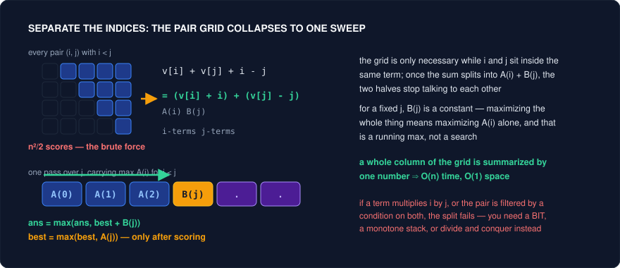
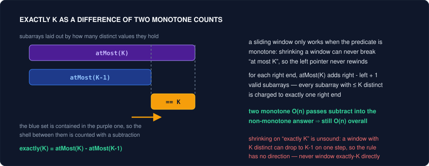

# Algebraic Reformulation — Rewriting the Constraint Until the Algorithm Is Obvious

Most "hard" problems are easy problems wearing an unhelpful algebraic form. The setter writes the condition in the shape that reads naturally in English — `values[i] + values[j] + i - j`, `|a[i]-a[j]| + |b[i]-b[j]| + |i-j|`, "exactly K distinct" — and that shape happens to couple every variable to every other one. Coupled variables mean nested loops, and nested loops mean O(n²) on an input sized for O(n log n). The instinct at that point is to reach for a heavier algorithm. The correct move is usually the opposite: leave the algorithm alone and *rewrite the expression* until an algorithm you already own becomes applicable.

This is a distinct skill from pattern recognition. You can know two pointers, prefix sums, and sliding window cold and still stall on LC 1131, because nothing in the statement says "two pointers" — the statement says "absolute values". The gap is closed by three lines of high-school algebra: `|x| = max(x, -x)`, distribute, group the `i`-terms apart from the `j`-terms. Now it says two pointers. The algorithm was never the hard part; the *form* was.

The six moves below are the ones that pay off repeatedly in interviews: separating coupled indices, eliminating absolute values by enumerating signs, converting a non-monotone count into a difference of monotone ones, remapping values so the target becomes zero, counting the complement, and fixing the right endpoint. They share a philosophy — **change the expression, not the algorithm** — and each one ends with a problem that a textbook technique now solves in one pass. When you're stuck with the right pattern and no way to apply it, walk this list before you escalate.

---

## Trick 1: Separate the two indices

**The tell:** An objective or condition mentions `i` and `j` in the same arithmetic expression — `nums[i] + nums[j] + i - j`, `nums[j] - nums[i] > j - i`, `A[i] * B[j] + i + j` — and the natural loop is "for every pair". Constraints say n up to 10⁵, which forbids the pair loop and tells you the setter expects the split.

**The trick:** Move every term containing `i` to one side and every term containing `j` to the other, so the expression becomes `A(i) + B(j)` (or `A(i) - B(j)`) with no shared factor. For LC 1014 the score of a pair `i < j` is `values[i] + values[j] + i - j`; regroup as `(values[i] + i) + (values[j] - j)`, so `A(i) = values[i] + i` and `B(j) = values[j] - j`. Now sweep `j` from left to right: `B(j)` is a constant at that moment, so the best partner is whichever `i < j` maximizes `A(i)` — a single running max. O(n²) pairs collapse into O(n) with one extra variable.

**Why it works:** For a fixed `j`, the objective is `max_i A(i) + B(j)`, and `B(j)` doesn't participate in the inner maximization at all. That means an entire column of the pair grid is fully summarized by *one number*: the best `A(i)` over the prefix. Summarizability is the whole game — the reason the brute force felt necessary was that you believed each pair carried independent information, and the regrouping proves it doesn't. The same argument explains the boundary: if a term multiplies `i` by `j`, or if the pair is filtered by a predicate touching both indices, no regrouping separates them and you genuinely need a stack, a BIT, or divide-and-conquer.



**Template:**
```cpp
// LC 1014: maximize values[i] + values[j] + i - j  over i < j
// = (values[i] + i) + (values[j] - j)
int maxScoreSightseeingPair(vector<int>& v) {
    int best = INT_MIN;                 // max of A(i) = v[i] + i over all i < j
    int ans  = INT_MIN;
    for (int j = 0; j < (int)v.size(); j++) {
        if (j > 0)                                      // need a legal partner first
            ans = max(ans, best + (v[j] - j));          // A(i) + B(j)
        best = max(best, v[j] + j);                     // only NOW may j serve as an i
    }
    return ans;
}
```

<details>
<summary>Java</summary>

```java
// LC 1014: maximize values[i] + values[j] + i - j  over i < j
// = (values[i] + i) + (values[j] - j)
int maxScoreSightseeingPair(int[] v) {
    int best = Integer.MIN_VALUE;       // max of A(i) = v[i] + i over all i < j
    int ans  = Integer.MIN_VALUE;
    for (int j = 0; j < v.length; j++) {
        if (j > 0)                                          // need a legal partner first
            ans = Math.max(ans, best + (v[j] - j));         // A(i) + B(j)
        best = Math.max(best, v[j] + j);                    // only NOW may j serve as an i
    }
    return ans;
}
```

</details>

**Problems:**
| Problem | Difficulty | How the trick applies |
|---|---|---|
| 1014. Best Sightseeing Pair | Medium | The canonical instance. `values[i]+values[j]+i-j` &#8594; `(values[i]+i) + (values[j]-j)`; one running max of the first group. Say the regrouping out loud before you code — that sentence *is* the solution. |
| 121. Best Time to Buy and Sell Stock | Easy | The degenerate case: `p[j] - p[i]` is already separated (`A(i) = -p[i]`, `B(j) = p[j]`), which is why "track the min so far" feels obvious here and mysterious in 1014. Same theorem, trivial algebra. |
| 2016. Maximum Difference Between Increasing Elements | Easy | Identical to 121 with a strict-positivity guard; useful as the sanity check that the running-min variable must be updated *after* scoring, never before. |
| 123. Best Time to Buy and Sell Stock III | Hard | Two transactions = two chained separations: the second buy's "best so far" carries the first transaction's profit. Shows the pattern composing with itself rather than needing a 2D table. |
| 1937. Maximum Number of Points with Cost | Medium | Row-to-row transfer `dp[i-1][j'] - abs(j-j')` couples the two column indices; split the absolute value (Trick 2) into `j' &#8804; j` and `j' > j`, and each half separates into a prefix/suffix running max. Two sweeps per row turn O(m·n²) into O(m·n). |

**Pitfalls:**
- Update order. `best` must absorb index `j` *after* `j` has been scored as the right endpoint, or you'll pair an element with itself and violate `i < j`.
- Seeding with `INT_MIN` then adding to it overflows. Guard the first iteration (as above) or seed `best` from element 0 and start the loop at `j = 1`.
- Regrouping is only legal when the pair is unconstrained apart from `i < j`. A condition like "and `j - i <= k`" turns the running max into a sliding-window max — correct answer, different data structure (monotone deque).
- Signs flip silently. Write the regrouped identity on the whiteboard and substitute a two-element example before coding; an off-by-one-sign here is invisible in the code but wrong on every test.

---

## Trick 2: Kill the absolute value by enumerating signs

**The tell:** The objective contains one or more `abs(...)` terms over pair differences, and you're asked for a maximum. Manhattan distance, `|i - j|`, or "maximum of |a[i]-a[j]| + ..." are all this shape.

**The trick:** Use `|x| = max(x, -x)`. An expression with `k` absolute values becomes a maximum over `2^k` sign patterns, and *each pattern is a plain linear expression* — which Trick 1 then separates. For LC 1131, `|a[i]-a[j]| + |b[i]-b[j]| + |i-j|` equals `max over s1,s2,s3 in {+1,-1} of s1(a[i]-a[j]) + s2(b[i]-b[j]) + s3(i-j)`, which regroups to `P_s(i) - P_s(j)` with `P_s(k) = s1*a[k] + s2*b[k] + s3*k`. Since ordered pairs cover both directions, fixing `s3 = +1` leaves four patterns; for each, the answer is `max_k P_s(k) - min_k P_s(k)`. Total work: four linear scans.

**Why it works:** The identity is one-sided in a way that makes the whole thing safe. For any sign choice, `s1(a_i-a_j) + ... <= |a_i-a_j| + ...`, so no pattern ever *overshoots* the true value; and the pattern matching the actual signs of the differences achieves it exactly. So the max over patterns is neither too big nor too small — it's equal. You are trading a case analysis you can't do (the signs depend on the unknown optimal pair) for a constant-factor enumeration you can. The 2D cousin is the same idea geometrically: rotating a point to `(x+y, x-y)` converts Manhattan distance into Chebyshev distance, `max(|dx'|, |dy'|)`, because the rotation is exactly the sign enumeration applied once and baked into the coordinates — after which the two axes become independent.

**Template:**
```cpp
// LC 1131: max over i,j of |a[i]-a[j]| + |b[i]-b[j]| + |i-j|
int maxAbsValExpr(vector<int>& a, vector<int>& b) {
    int n = a.size(), ans = 0;
    for (int s1 : {1, -1})
        for (int s2 : {1, -1}) {                 // s3 fixed to +1 by i/j symmetry
            long long hi = LLONG_MIN, lo = LLONG_MAX;
            for (int k = 0; k < n; k++) {
                long long p = 1LL * s1 * a[k] + 1LL * s2 * b[k] + k;
                hi = max(hi, p);
                lo = min(lo, p);                 // best i and best j, independently
            }
            ans = max<long long>(ans, hi - lo);
        }
    return ans;
}
```

<details>
<summary>Java</summary>

```java
// LC 1131: max over i,j of |a[i]-a[j]| + |b[i]-b[j]| + |i-j|
int maxAbsValExpr(int[] a, int[] b) {
    int n = a.length;
    long ans = 0;
    for (int s1 : new int[]{1, -1})
        for (int s2 : new int[]{1, -1}) {        // s3 fixed to +1 by i/j symmetry
            long hi = Long.MIN_VALUE, lo = Long.MAX_VALUE;
            for (int k = 0; k < n; k++) {
                long p = (long) s1 * a[k] + (long) s2 * b[k] + k;
                hi = Math.max(hi, p);
                lo = Math.min(lo, p);            // best i and best j, independently
            }
            ans = Math.max(ans, hi - lo);        // a fresh hi/lo per sign pattern
        }
    return (int) ans;
}
```

</details>

**Problems:**
| Problem | Difficulty | How the trick applies |
|---|---|---|
| 1131. Maximum of Absolute Value Expression | Medium | Three absolute values &#8594; eight sign triples &#8594; four after symmetry, each solved by `max - min` of one derived array. The reference implementation of the trick. |
| 624. Maximum Distance in Arrays | Medium | `\|b - a\|` = `max(b - a, a - b)`, so run the sweep twice (or track running max and min across arrays) with the different-array constraint enforced by index. The two-term baby case that makes the identity concrete. |
| 296. Best Meeting Point | Hard | Manhattan cost separates into an independent x-problem and y-problem; each is minimized at the median, where the sign split (points left of the median vs right) is exactly the enumeration made explicit. |
| 462. Minimum Moves to Equal Array Elements II | Medium | `sum \|x - t\|` minimized at the median for the same reason: sorting fixes every term's sign relative to `t`, turning a non-smooth objective into a linear one. Pairing outermost elements is the clean argument. |

**Pitfalls:**
- Do not enumerate all `2^k` when the problem is symmetric in `i` and `j` — you'll do double the work for no gain, but note the reverse mistake is worse: dropping a pattern that isn't actually redundant.
- Each sign pattern needs its *own* running max/min; reusing one accumulator across patterns silently mixes them.
- Overflow. Sums of several coordinates plus an index exceed `int` on large constraints; derive into `long long`.
- The trick maximizes. For a *minimum* of absolute values, `|x| = max(x,-x)` is the wrong lever (min of a max isn't a max of mins) — sort and use the median, or binary search the answer.

---

## Trick 3: Exactly K = atMost(K) - atMost(K-1)

**The tell:** "Count the subarrays/substrings with **exactly** K \_\_\_" — exactly K distinct integers, sum exactly S over non-negatives, exactly K odd numbers. You reach for a sliding window and discover you cannot decide when to move `left`.

**The trick:** Write a helper `atMost(K)` that counts subarrays with **at most** K, which *is* windowable, then return `atMost(K) - atMost(K-1)`. Inside `atMost`, for each `right` you shrink until the window is valid and add `right - left + 1` — the number of valid subarrays ending at `right`. Two O(n) passes; the subtraction cancels everything with `K-1` or fewer and leaves precisely the exactly-K count.

**Why it works:** Sliding window requires a **monotone** predicate: if a window is valid, every sub-window must be valid too, so the left pointer never needs to rewind and the whole sweep is amortized O(n). "At most K" has that property; "exactly K" does not — shrinking a window with K distinct values can drop you to K-1, so the shrink rule has no direction and the pointer would have to move both ways. The subtraction restores monotonicity by *decomposing the non-monotone set as a difference of two nested monotone sets*: every subarray with at most K-1 distinct is also one with at most K, so subtracting removes each of them exactly once and leaves the shell. This is inclusion-exclusion on a chain, and it is the general escape hatch whenever a window predicate is an equality rather than an inequality.



**Template:**
```cpp
// LC 992: count subarrays with exactly k distinct integers
int atMostK(vector<int>& nums, int k) {
    if (k < 0) return 0;                       // makes atMost(K-1) safe at K = 0
    unordered_map<int,int> cnt;
    int left = 0, distinct = 0;
    long long res = 0;
    for (int right = 0; right < (int)nums.size(); right++) {
        if (cnt[nums[right]]++ == 0) distinct++;
        while (distinct > k)
            if (--cnt[nums[left++]] == 0) distinct--;
        res += right - left + 1;               // all subarrays ending at right
    }
    return (int)res;
}
int subarraysWithKDistinct(vector<int>& nums, int k) {
    return atMostK(nums, k) - atMostK(nums, k - 1);
}
```

<details>
<summary>Java</summary>

```java
// LC 992: count subarrays with exactly k distinct integers
int atMostK(int[] nums, int k) {
    if (k < 0) return 0;                       // makes atMost(K-1) safe at K = 0
    HashMap<Integer,Integer> cnt = new HashMap<>();
    int left = 0, distinct = 0;
    long res = 0;
    for (int right = 0; right < nums.length; right++) {
        // merge returns the NEW value as a boxed Integer: unbox with intValue() before
        // comparing, because == on two Integers compares references, not values
        if (cnt.merge(nums[right], 1, Integer::sum).intValue() == 1) distinct++;
        while (distinct > k) {
            int out = nums[left++];
            if (cnt.merge(out, -1, Integer::sum).intValue() == 0) distinct--;
        }
        res += right - left + 1;               // all subarrays ending at right
    }
    return (int) res;
}
int subarraysWithKDistinct(int[] nums, int k) {
    return atMostK(nums, k) - atMostK(nums, k - 1);
}
```

</details>

**Problems:**
| Problem | Difficulty | How the trick applies |
|---|---|---|
| 992. Subarrays with K Different Integers | Hard | The flagship. Rated Hard only because of the reformulation; with `atMost` in hand it is an ordinary two-pointer Medium. The alternative (tracking two left pointers) is the same idea inlined. |
| 930. Binary Subarrays With Sum | Medium | `atMost(goal) - atMost(goal-1)` on the sum. Works only because entries are non-negative, which is what makes the sum monotone in window width — state that condition, it's the graded insight. |
| 1248. Count Number of Nice Subarrays | Medium | Map odd &#8594; 1, even &#8594; 0 (Trick 4), then it *is* 930: exactly k odds = at most k minus at most k-1. Two reformulations stacked. |

**Pitfalls:**
- `atMost(k-1)` with `k = 0` must return 0, not run with a negative bound. Guard at the top of the helper.
- The count added per `right` is `right - left + 1`, not 1 — forgetting this counts windows instead of subarrays and is the single most common bug in the family.
- Negative numbers break it. Sliding window on sums assumes non-negativity; with negatives, switch to prefix sums plus a hash map (Trick 6).
- `cnt[nums[right]]++ == 0` inserts a zero on first touch — that's intended here, but the same reflex inside a `find`-style read elsewhere silently grows the map.

---

## Trick 4: Remap the values so the target becomes zero

**The tell:** "Longest/count of subarrays where \_\_\_ is equal/balanced/divisible/even." The property is about a *relationship* between counts rather than a raw sum.

**The trick:** Replace each element with a value that turns the property into "the prefix sums at the two ends are equal", then a single hash map of prefix-value &#8594; earliest index (for longest) or count (for counting) answers it in one pass. LC 525: map `0` to `-1`, so equal counts of 0s and 1s becomes prefix sum `0`, and a balanced subarray is exactly a pair of indices with the same prefix. LC 974 and 523: store `prefix % k` instead of `prefix`, because `(P[j] - P[i]) % k == 0` is the same statement as `P[j] % k == P[i] % k`. LC 1371: the value is a 5-bit parity mask XORed along the way, and "all vowels even" is again "two prefixes equal".

**Why it works:** Every one of these problems is secretly the same problem — *find two prefix states that collide* — and remapping is the act of choosing the state so that the property becomes equality. Equality is the only relation a hash map can answer in O(1); "differs by at most k" or "is a multiple of" cannot be looked up directly, so you push the arithmetic into the key. That's the real lesson: **you're designing a hash key, and the design goal is to make the interesting relation into `==`.** The residue and parity versions also show why the state space stays small — `k` residues, or `2^5` vowel masks — which is what keeps the map O(k) rather than O(n).

**Template:**
```cpp
// LC 525: longest subarray with equal 0s and 1s
int findMaxLength(vector<int>& nums) {
    unordered_map<int,int> first{{0, -1}};      // prefix value -> EARLIEST index
    int sum = 0, best = 0;
    for (int i = 0; i < (int)nums.size(); i++) {
        sum += (nums[i] == 1 ? 1 : -1);         // the remap: 0 becomes -1
        auto it = first.find(sum);
        if (it != first.end()) best = max(best, i - it->second);
        else first[sum] = i;                    // never overwrite: longest needs earliest
    }
    return best;
}
```

<details>
<summary>Java</summary>

```java
// LC 525: longest subarray with equal 0s and 1s
int findMaxLength(int[] nums) {
    HashMap<Integer,Integer> first = new HashMap<>();
    first.put(0, -1);                           // prefix value -> EARLIEST index
    int sum = 0, best = 0;
    for (int i = 0; i < nums.length; i++) {
        sum += (nums[i] == 1 ? 1 : -1);         // the remap: 0 becomes -1
        Integer seen = first.get(sum);          // boxed: may be null, and == would compare refs
        if (seen != null) best = Math.max(best, i - seen.intValue());
        else first.put(sum, i);                 // never overwrite: longest needs earliest
    }
    return best;
}
```

</details>

**Problems:**
| Problem | Difficulty | How the trick applies |
|---|---|---|
| 525. Contiguous Array | Medium | 0 &#8594; -1 converts "equal counts" into "prefix sum repeats". The cleanest demonstration that the remap *is* the algorithm. |
| 523. Continuous Subarray Sum | Medium | Key on `prefix % k`; a repeat means a multiple-of-k subarray. Length-&#8805;-2 requirement means you compare indices, so store earliest index rather than a count. |
| 974. Subarray Sums Divisible by K | Medium | Same key, counting instead of measuring: `C(c,2)` summed over residue classes, or accumulate on the fly. Normalize negative residues with `((r % k) + k) % k`. |
| 1371. Find the Longest Substring Containing Vowels in Even Counts | Medium | The key is a 5-bit parity bitmask, XOR-updated per character; equal masks mean every vowel appeared an even number of times in between. Proof that "prefix state" need not be a sum. |
| 1248. Count Number of Nice Subarrays | Medium | Odd &#8594; 1, even &#8594; 0 turns "k odd numbers" into "sum equals k" — remap first, then either Trick 3 or Trick 6 finishes it. |

**Pitfalls:**
- For *longest*, store the earliest index and never overwrite; for *counting*, store frequencies and always increment. Mixing the two is the classic wrong answer.
- Seed the map with the empty prefix (`{0, -1}` for indices, `{0, 1}` for counts) or you'll miss every subarray that starts at index 0.
- C++ `%` yields negative results for negative operands — always normalize residues before using them as keys (974).
- Modulo keys with `k = 0` (523 permits it) need a separate "two consecutive zeros" reading of the statement; check the constraints.

---

## Trick 5: Count the complement

**The tell:** The ask is a *minimum removal / deletion / insertion / number of operations*, and the constraint describes what the survivors must look like ("non-overlapping", "sorted", "balanced", "a palindrome").

**The trick:** Write `answer = n - (maximum kept)` and solve the maximization instead, because the maximization is almost always a named pattern you already own. LC 435: minimum intervals removed = `n - ` maximum non-overlapping set, which is earliest-end-first greedy. Minimum deletions to make an array sorted = `n - ` LIS. Minimum insertions to make a string a palindrome (1312) = `n - ` longest palindromic subsequence (516). The rewriting is one line; the algorithm is off the shelf.

**Why it works:** Minimization over *removals* is a search over subsets to delete — exponential-looking, with no obvious greedy order, because deleting an element doesn't locally improve anything measurable. Maximization over *what stays* is a selection problem, and selection problems have optimal substructure and exchange arguments: the earliest-ending interval leaves the most room, the LIS recurrence extends the best prefix. The complement is a bijection between the two search spaces — every valid kept-set corresponds to exactly one removed-set of size `n - |kept|` — so the optimum transfers exactly. You aren't approximating; you're renaming the objective into the coordinate system where the theorem lives. Whenever a minimization has no natural greedy rule, ask what the survivors look like.

**Template:**
```cpp
// LC 435: minimum intervals to remove so the rest don't overlap
int eraseOverlapIntervals(vector<vector<int>>& iv) {
    sort(iv.begin(), iv.end(),
         [](const auto& a, const auto& b) { return a[1] < b[1]; });   // by END
    int kept = 0;
    long long freeAt = LLONG_MIN;
    for (auto& it : iv)
        if (it[0] >= freeAt) { kept++; freeAt = it[1]; }              // touching is OK here
    return (int)iv.size() - kept;                                     // the complement
}
```

<details>
<summary>Java</summary>

```java
// LC 435: minimum intervals to remove so the rest don't overlap
int eraseOverlapIntervals(int[][] iv) {
    Arrays.sort(iv, (a, b) -> Integer.compare(a[1], b[1]));           // by END
    int kept = 0;
    long freeAt = Long.MIN_VALUE;
    for (int[] it : iv)
        if (it[0] >= freeAt) { kept++; freeAt = it[1]; }              // touching is OK here
    return iv.length - kept;                                          // the complement
}
```

</details>

**Problems:**
| Problem | Difficulty | How the trick applies |
|---|---|---|
| 435. Non-overlapping Intervals | Medium | `n - ` max non-overlapping set. The greedy is provable by exchange; the removal version is not directly provable at all. |
| 452. Minimum Number of Arrows to Burst Balloons | Medium | Complement of a *partition* rather than a subset: each arrow covers one group, so arrows = number of groups formed by the same end-sorted sweep. Touching balloons share an arrow, so the comparison is `>` here versus `>=` in 435. |
| 1653. Minimum Deletions to Make String Balanced | Medium | Keep the longest "all a's then all b's" subsequence; `n - ` that. Equivalently sweep a split point counting b's on the left and a's on the right — the same complement seen from the other side. |
| 300. Longest Increasing Subsequence | Medium | The engine: minimum deletions to sort an array is exactly `n - LIS`, and the patience-sorting O(n log n) version makes the derived problem cheap. |
| 516. Longest Palindromic Subsequence | Medium | The engine for palindrome edits: LCS of the string with its reverse. |
| 1312. Minimum Insertion Steps to Make a String Palindrome | Hard | `n - LPS(s)`. Insertions rather than deletions, and the complement still holds because every character outside the palindromic core needs exactly one mirror inserted. |

**Pitfalls:**
- Confirm the correspondence is a bijection. "Minimum arrows" is a partition count, not `n - kept`, so the arithmetic differs even though the sweep is identical — read what each unit of the answer buys you.
- Sorting by start instead of end for interval selection is the standing counterexample (one long interval blocking two short ones); if you type `a[0] < b[0]`, stop.
- Boundary semantics (`>=` vs `>`) encode whether touching intervals conflict, and 435 and 452 genuinely disagree. Don't carry one over.
- The complement only rescues you when the kept-set constraint is *hereditary* (every subset of a valid set stays valid). If removing an element can make the rest invalid, the maximization has no substructure either.

---

## Trick 6: Fix the right endpoint and ask how many lefts qualify

**The tell:** "Count the subarrays/pairs such that \_\_\_." The brute force enumerates both endpoints, and you need a single sweep.

**The trick:** Iterate `right` from 0 to n-1 and, at each step, compute *how many* `left` values make `[left, right]` valid; sum those counts. The bookkeeping depends on the predicate: a hash map of prefix sums when validity is an equality (LC 560 &#8594; the count of previous prefixes equal to `sum - k`), a two-pointer when validity is monotone in the window (LC 713 &#8594; `right - left + 1`), a monotone stack when validity is about extremes (LC 907 &#8594; the previous-smaller index bounds the legal lefts). One pass, one accumulator.

**Why it works:** Every subarray has exactly one right endpoint, so partitioning the answer by right endpoint is a partition of the *answer set* — the counts are disjoint and exhaustive, which is a proof of no double counting and no misses, for free. That guarantee is why the technique is so reliable in an interview: correctness is a one-sentence argument rather than a case analysis. It also explains why the inner quantity is always a *count* rather than a search: fixing `right` freezes the predicate's right-hand side, and the set of qualifying lefts is then either a contiguous range (bounded by a pointer or a stack index, so its size is subtraction) or a hash-map bucket (so its size is a lookup). Both are O(1) after amortization, so the sweep is O(n).

**Template:**
```cpp
// LC 560: number of subarrays summing to k (values may be negative)
int subarraySum(vector<int>& nums, int k) {
    unordered_map<long long,int> cnt{{0, 1}};    // the empty prefix counts once
    long long sum = 0;
    int ans = 0;
    for (int x : nums) {
        sum += x;
        auto it = cnt.find(sum - k);             // lefts that qualify for THIS right
        if (it != cnt.end()) ans += it->second;
        cnt[sum]++;                              // only now is this prefix a legal left
    }
    return ans;
}
```

<details>
<summary>Java</summary>

```java
// LC 560: number of subarrays summing to k (values may be negative)
int subarraySum(int[] nums, int k) {
    HashMap<Long,Integer> cnt = new HashMap<>();   // prefix sums are long, so the key is Long
    cnt.put(0L, 1);                                // the empty prefix counts once
    long sum = 0;
    int ans = 0;
    for (int x : nums) {
        sum += x;
        // getOrDefault unboxes to int, avoiding both a null check and an Integer == comparison
        ans += cnt.getOrDefault(sum - k, 0);       // lefts that qualify for THIS right
        cnt.merge(sum, 1, Integer::sum);           // only now is this prefix a legal left
    }
    return ans;
}
```

</details>

**Problems:**
| Problem | Difficulty | How the trick applies |
|---|---|---|
| 560. Subarray Sum Equals K | Medium | Equality predicate &#8594; hash map of prefix counts. Negative values are allowed precisely because no monotonicity is assumed — this is the fallback when the window in Trick 3 is illegal. |
| 713. Subarray Product Less Than K | Medium | Monotone predicate &#8594; two pointers; the qualifying lefts form the range `[left, right]`, so add `right - left + 1`. Requires strictly positive values, and `k <= 1` must return 0. |
| 1248. Count Number of Nice Subarrays | Medium | After the odd/even remap it is 560 with `k` = the odd count; the same hash-map sweep, no window needed. |
| 795. Number of Subarrays with Bounded Maximum | Medium | Count subarrays ending at `right` whose max lies in `[L, R]` by tracking the last index that broke the upper bound and the last index that satisfied the lower one — the qualifying lefts are the gap between them. |
| 907. Sum of Subarray Minimums | Medium | Charge each element as the minimum of every subarray where it wins; previous-smaller and next-smaller indices from a monotone stack give the count of legal lefts and rights. Strict on one side, non-strict on the other, to break ties exactly once. |
| 862. Shortest Subarray with Sum at Least K | Hard | Optimizing rather than counting, but the same frame: for each right, a monotone deque of prefix sums holds only the lefts that could ever be best; pop from the front when a candidate qualifies, from the back when it's dominated. |

**Pitfalls:**
- Insert the current prefix into the map *after* querying, or a subarray will count itself (and `k = 0` will produce phantom answers).
- Seed the map with `{0, 1}`; without it every subarray starting at index 0 is lost.
- The two-pointer version needs the predicate to be monotone in window width; products with a zero or a value `< 1`, or sums with negatives, void it (that's exactly when 862 needs a deque rather than a pointer).
- Prefix sums overflow `int` at n = 10⁵ with 10⁴-magnitude values in some variants — use `long long` keys.
- In monotone-stack counting, using non-strict comparison on both sides double-counts subarrays with duplicate minima. Pick one side to be strict and stay consistent.

---

## Family Cheat Sheet

| Trick | Tell | Move |
|---|---|---|
| Separate the two indices | `i` and `j` appear in one arithmetic expression; n forbids the pair loop | Regroup into `A(i) + B(j)`; sweep `j`, carry the running best `A(i)` |
| Kill the absolute value by enumerating signs | `abs(...)` over pair differences, maximization | `\|x\| = max(x,-x)` &#8594; `2^k` linear cases, each separable; or rotate `(x+y, x-y)` for Manhattan |
| Exactly K = atMost(K) - atMost(K-1) | "exactly K" with a window that won't shrink | Write the monotone `atMost` helper, call it twice, subtract |
| Remap the values so the target becomes zero | "equal counts", "divisible", "even counts" | Choose a prefix state (sign flip, residue, parity mask) that makes the property `==`, then hash it |
| Count the complement | "minimum removals/deletions/insertions" | `answer = n - (max kept)`; the maximization is a known greedy or DP |
| Fix the right endpoint | "count the subarrays/pairs such that ..." | For each right, count qualifying lefts via hash map, two pointers, or monotone stack |
