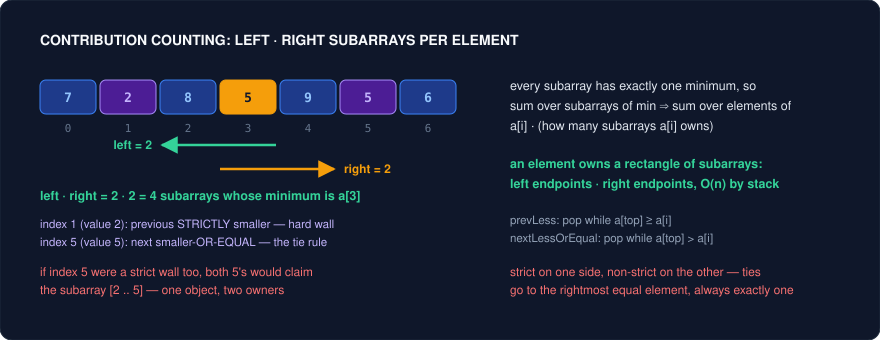

# Counting by Contribution — Reframing What You Iterate Over

Every counting problem has two formulations, and they are duals of each other. The hard direction is **"for each object, compute a property"** — for each subarray find its minimum, for each substring count its distinct characters, for each pair decide whether it inverts. That direction enumerates objects, and there are usually O(n^2) or O(n^3) of them, so the loop is dead before you write the body. The easy direction is **"for each element, count the objects it is responsible for"** — this element is the minimum of how many subarrays? This index is the right endpoint of how many valid windows? This boundary is crossed by how many intervals? There are only n elements, so if each one's count is answerable in O(1) or O(log n), the whole problem collapses.

Knowing the pattern is not the bottleneck. You already know monotonic stacks, prefix sums, and BITs. What separates a stuck candidate from a solved one is the **reframe**: realizing that the object you were told to enumerate is not the object you should iterate over. LC 907 is not a "find the minimum" problem, it is a "who owns this subarray" problem. LC 560 is not a "check every subarray" problem, it is a "for each right endpoint, how many prefixes complete it" problem. The algorithm was never the hard part.

Every trick below lives or dies on a **charging argument**. You are redistributing a sum over objects into a sum over owners, and that is only valid when each object is charged to **exactly one** owner — not zero (you undercount), not two (you double count). Before you write a line of code, say out loud who owns each object and why nobody else can claim it. Ties are where the argument breaks: equal elements both want to be "the minimum", equal prefix sums both want to be "the start", overlapping windows both want the same subarray. The fix is always the same shape — break the symmetry by making one side strict and the other non-strict, or by fixing one endpoint canonically. If you cannot state the ownership rule, you do not yet have a solution; you have an approximation.

---

## Trick 1: Count each element's contribution instead of enumerating subarrays

**The tell:** The answer is a sum or count aggregated over *all* subarrays (or all substrings), and the per-subarray quantity is an extremum or a distinctness measure — minimum, maximum, range, number of unique characters. `n` is up to 1e5, so the O(n^2) enumeration is explicitly ruled out.

**The trick:** Flip the loop. Instead of "for each subarray, find its minimum", ask "for each element, over how many subarrays is it the minimum?" That count is `left * right`, where `left = i - prevSmaller(i)` is the number of legal left endpoints and `right = nextSmaller(i) - i` is the number of legal right endpoints — both computed for all `i` in one O(n) monotonic-stack pass. The answer is `sum(a[i] * left_i * right_i)`. For max-based sums, run the mirrored stack; for a range (max minus min), run both and subtract.

**Why it works:** Every subarray has exactly one minimum *value*, so partitioning subarrays by "which element is the minimum" is a genuine partition — provided you resolve which *index* owns a subarray when the minimum value appears more than once. That is the strict-versus-non-strict rule: extend the left boundary past **strictly smaller** elements only (pop while `a[top] >= a[i]`) and the right boundary past **strictly greater** elements only (pop while `a[top] > a[i]`). The consequence is that among equal elements, the **rightmost** one is the owner: the left scan lets a later duplicate reach across an earlier equal, while the right scan stops an earlier duplicate at the later equal. Use the same comparison on both sides and every subarray spanning two equal minima gets counted twice; use strict on both sides and it gets counted zero times. One strict, one non-strict is the only pairing that yields exactly one owner.



**Template:**
```cpp
// 907 Sum of Subarray Minimums: sum over all subarrays of their minimum.
// left[i]  = # legal left endpoints  = i - prevStrictlySmaller(i)
// right[i] = # legal right endpoints = nextSmallerOrEqual(i) - i
long long sumSubarrayMins(vector<int>& a) {
    const long long MOD = 1'000'000'007;
    int n = a.size();
    vector<int> pl(n), nl(n);
    vector<int> st;                                  // stack of indices

    for (int i = 0; i < n; i++) {                    // previous STRICTLY smaller
        while (!st.empty() && a[st.back()] >= a[i]) st.pop_back();
        pl[i] = st.empty() ? -1 : st.back();
        st.push_back(i);
    }
    st.clear();
    for (int i = n - 1; i >= 0; i--) {               // next smaller OR EQUAL
        while (!st.empty() && a[st.back()] > a[i]) st.pop_back();
        nl[i] = st.empty() ? n : st.back();
        st.push_back(i);
    }

    long long ans = 0;
    for (int i = 0; i < n; i++) {
        long long left = i - pl[i], right = nl[i] - i;
        ans = (ans + a[i] * (left * right % MOD)) % MOD;   // left*right < 1e10, fits
    }
    return ans;
}
```

<details>
<summary>Java</summary>

```java
// 907 Sum of Subarray Minimums: sum over all subarrays of their minimum.
// left[i]  = # legal left endpoints  = i - prevStrictlySmaller(i)
// right[i] = # legal right endpoints = nextSmallerOrEqual(i) - i
long sumSubarrayMins(int[] a) {
    final long MOD = 1_000_000_007L;
    int n = a.length;
    int[] pl = new int[n], nl = new int[n];
    ArrayDeque<Integer> st = new ArrayDeque<>();     // stack of indices

    for (int i = 0; i < n; i++) {                    // previous STRICTLY smaller
        while (!st.isEmpty() && a[st.peek()] >= a[i]) st.pop();
        pl[i] = st.isEmpty() ? -1 : st.peek();
        st.push(i);
    }
    st.clear();
    for (int i = n - 1; i >= 0; i--) {               // next smaller OR EQUAL
        while (!st.isEmpty() && a[st.peek()] > a[i]) st.pop();
        nl[i] = st.isEmpty() ? n : st.peek();
        st.push(i);
    }

    long ans = 0;
    for (int i = 0; i < n; i++) {
        long left = i - pl[i], right = nl[i] - i;
        ans = (ans + a[i] * (left * right % MOD)) % MOD;   // left*right < 1e10, fits
    }
    return ans;
}
```

</details>

Character-flavoured variant — for distinct-character counting, the "boundaries" are the previous and next occurrence of the *same character*:

```cpp
// 828 Count Unique Characters of All Substrings: charge each occurrence of c the
// substrings in which c appears EXACTLY once.
int uniqueLetterString(string s) {
    vector<vector<int>> pos(26, {-1});                // sentinel before the string
    for (int i = 0; i < (int)s.size(); i++) pos[s[i] - 'A'].push_back(i);
    long long ans = 0;
    for (int c = 0; c < 26; c++) {
        auto& p = pos[c];
        p.push_back(s.size());                        // sentinel after
        for (int k = 1; k + 1 < (int)p.size(); k++)
            ans += 1LL * (p[k] - p[k - 1]) * (p[k + 1] - p[k]);
    }
    return (int)ans;
}
```

<details>
<summary>Java</summary>

```java
// 828 Count Unique Characters of All Substrings: charge each occurrence of c the
// substrings in which c appears EXACTLY once.
int uniqueLetterString(String s) {
    List<List<Integer>> pos = new ArrayList<>();
    for (int c = 0; c < 26; c++) {
        pos.add(new ArrayList<>());
        pos.get(c).add(-1);                           // sentinel before the string
    }
    for (int i = 0; i < s.length(); i++) pos.get(s.charAt(i) - 'A').add(i);
    long ans = 0;
    for (int c = 0; c < 26; c++) {
        List<Integer> p = pos.get(c);
        p.add(s.length());                            // sentinel after
        for (int k = 1; k + 1 < p.size(); k++)
            ans += (long) (p.get(k) - p.get(k - 1)) * (p.get(k + 1) - p.get(k));
    }
    return (int) ans;
}
```

</details>

**Problems:**
| Problem | Difficulty | How the trick applies |
|---|---|---|
| 907. Sum of Subarray Minimums | Medium | The canonical statement. `sum(a[i] * left * right)` with one strict and one non-strict stack pass. If you can derive the tie rule at the whiteboard, you own the whole family. |
| 2104. Sum of Subarray Ranges | Medium | Range = max - min, and sums are linear, so it is literally (contribution sum for max) - (contribution sum for min). Two mirrored stack passes, one subtraction — the clearest demonstration that contributions superpose. |
| 828. Count Unique Characters of All Substrings of a Given String | Hard | The owner is not an extremum but an *occurrence*: character at `i` contributes to substrings that contain `i` and neither the previous nor next occurrence of that same letter, giving `(i - prev) * (next - i)`. Same rectangle, different walls. |
| 891. Sum of Subsequence Widths | Hard | Subsequences, not subarrays — sort first (order is irrelevant to max-min), then `a[i]` is the max of `2^i` subsequences and the min of `2^(n-1-i)`, so the answer is `sum(a[i] * (2^i - 2^(n-1-i)))`. The rectangle becomes a power of two. |
| 1856. Maximum Subarray Min-Product | Medium | Contribution's cousin: for each `i` compute the *maximal* span in which `a[i]` is the minimum (same two stacks), then score `a[i] * prefixSum(span)`. You take a max over owners instead of a sum, but the ownership machinery is identical. |
| 2262. Total Appeal of A String | Hard | Sum over substrings of distinct-character count, phrased as a per-index charge: at each `i`, the character `s[i]` newly appears in `i - lastSeen[s[i]]` substrings ending at `i`. Contribution counting fused with Trick 2's fixed right endpoint. |

**Pitfalls:**
- Same comparison on both sides. This is *the* bug: duplicates either double count or vanish. Write the two loops with visibly different operators (`>=` then `>`) and check a hand input like `[2, 2]` — the answer must be 6 for LC 907, not 8 and not 4.
- Sentinels. `prevSmaller = -1` and `nextSmaller = n` are what make `left` and `right` correct at the array edges; forgetting them silently truncates the boundary elements' rectangles.
- Overflow. `left * right` can reach ~2.5e9 and the product with `a[i]` far more. Compute in `long long` and reduce modulo *after* the multiplication order you intend, not before.
- Assuming this works for sums. "Sum of subarray sums" has no owner structure to exploit; use `sum(a[i] * (i+1) * (n-i))`, which is the same rectangle but with no boundaries at all — recognise when the walls are trivial.
- Subsequence problems need sorting first, and then the rectangle is exponential, not linear. Precompute powers of two modulo the prime.

---

## Trick 2: Fix the right endpoint

**The tell:** "Count the number of subarrays/substrings such that ...". The predicate is about a whole contiguous range — sum equals K, product below K, contains all of a, b, c, exactly K distinct values.

**The trick:** Iterate `r` from 0 to n-1 and, at each step, count only the objects **whose right endpoint is exactly `r`**. Now the question is one-dimensional: how many `l <= r` make `[l, r]` valid? Answer it with whichever structure fits the predicate — a hash map of prefix sums for equality predicates, a monotone left pointer for monotone predicates (product, distinct count, length), or a running "last position of X" counter for containment predicates. Sum the per-`r` answers.

**Why it works:** The charging argument is trivial and therefore bulletproof: every subarray has exactly one right endpoint, so grouping by `r` partitions the object set with no overlap and no gaps. That is the entire content of the trick — the reframe buys you a *fixed* end, which turns a two-dimensional search over `(l, r)` into n independent one-dimensional questions. For monotone predicates the second dimension collapses too: if `[l, r]` is valid then `[l', r]` is valid for all `l' >= l`, so the count is `r - l + 1` and `l` never moves backwards, giving amortized O(n) total. For containment predicates ("must contain all three"), the count is `min(last[a], last[b], last[c]) + 1`, because any start at or before that minimum still sees all three.

**Template:**
```cpp
// 560 Subarray Sum Equals K — equality predicate, hash map of prefix sums.
int subarraySum(vector<int>& nums, int k) {
    unordered_map<long long, int> cnt{{0, 1}};   // empty prefix: sum 0 seen once
    long long pre = 0; int ans = 0;
    for (int x : nums) {
        pre += x;
        auto it = cnt.find(pre - k);             // how many l give sum(l..r) == k
        if (it != cnt.end()) ans += it->second;
        cnt[pre]++;                              // AFTER counting, never before
    }
    return ans;
}

// 713 Subarray Product Less Than K — monotone predicate, sliding left pointer.
int numSubarrayProductLessThanK(vector<int>& nums, int k) {
    if (k <= 1) return 0;
    long long prod = 1; int l = 0, ans = 0;
    for (int r = 0; r < (int)nums.size(); r++) {
        prod *= nums[r];
        while (prod >= k) prod /= nums[l++];
        ans += r - l + 1;                        // every start in [l, r] works
    }
    return ans;
}

// 1358 Substrings Containing All Three Characters — containment, last-seen table.
int numberOfSubstrings(string s) {
    int last[3] = {-1, -1, -1}; long long ans = 0;
    for (int r = 0; r < (int)s.size(); r++) {
        last[s[r] - 'a'] = r;
        ans += min({last[0], last[1], last[2]}) + 1;   // -1 contributes 0
    }
    return (int)ans;
}
```

<details>
<summary>Java</summary>

```java
// 560 Subarray Sum Equals K — equality predicate, hash map of prefix sums.
int subarraySum(int[] nums, int k) {
    Map<Long, Integer> cnt = new HashMap<>();
    cnt.put(0L, 1);                              // empty prefix: sum 0 seen once
    long pre = 0; int ans = 0;
    for (int x : nums) {
        pre += x;
        ans += cnt.getOrDefault(pre - k, 0);     // how many l give sum(l..r) == k
        cnt.merge(pre, 1, Integer::sum);         // AFTER counting, never before
    }
    return ans;
}

// 713 Subarray Product Less Than K — monotone predicate, sliding left pointer.
int numSubarrayProductLessThanK(int[] nums, int k) {
    if (k <= 1) return 0;
    long prod = 1; int l = 0, ans = 0;
    for (int r = 0; r < nums.length; r++) {
        prod *= nums[r];
        while (prod >= k) prod /= nums[l++];
        ans += r - l + 1;                        // every start in [l, r] works
    }
    return ans;
}

// 1358 Substrings Containing All Three Characters — containment, last-seen table.
int numberOfSubstrings(String s) {
    int[] last = {-1, -1, -1}; long ans = 0;
    for (int r = 0; r < s.length(); r++) {
        last[s.charAt(r) - 'a'] = r;
        ans += Math.min(last[0], Math.min(last[1], last[2])) + 1;   // -1 contributes 0
    }
    return (int) ans;
}
```

</details>

**Problems:**
| Problem | Difficulty | How the trick applies |
|---|---|---|
| 560. Subarray Sum Equals K | Medium | Fix `r`, ask how many earlier prefixes equal `pre - k`. The map counts *owners of the left end*; inserting `pre` before querying would let a subarray own itself when `k == 0`. |
| 713. Subarray Product Less Than K | Medium | Monotone predicate, so the valid starts form a suffix `[l, r]` and the per-`r` answer is a length, not a search. Note the positives-only precondition that makes it monotone. |
| 1358. Number of Substrings Containing All Three Characters | Medium | The per-`r` count is `min(lastA, lastB, lastC) + 1` in O(1) — no window, no map. The cleanest example of "fix `r` and the inner question evaporates". |
| 930. Binary Subarrays With Sum | Medium | Two ways, both the same reframe: prefix-count map like 560, or `atMost(goal) - atMost(goal - 1)` (Trick 4) because the raw predicate is an equality and equalities are not monotone. |
| 974. Subarray Sums Divisible by K | Medium | Same as 560 with prefix sums bucketed by residue. Count pairs per residue class, and normalise C++'s negative `%` with `((pre % k) + k) % k`. |
| 992. Subarrays with K Different Integers | Hard | "Exactly K" is not monotone, so fix `r`, count `atMost(K)`, and subtract `atMost(K-1)`. The bridge problem between this trick and Trick 4. |
| 1248. Count Number of Nice Subarrays | Medium | "Exactly k odd numbers" maps to 560 by replacing each value with its parity — the reframe twice over: first re-encode elements, then fix the right endpoint. |
| 2444. Count Subarrays With Fixed Bounds | Hard | Per `r`, track the last index of `minK`, of `maxK`, and of any out-of-range value; the answer is `max(0, min(lastMin, lastMax) - lastBad)`. Three pointers, still O(1) per right endpoint. |

**Pitfalls:**
- Insert-then-query ordering in the hash-map form. Update the map *after* reading it, or the current prefix answers its own query.
- Seeding `cnt[0] = 1`. Without the empty-prefix sentinel you lose every subarray that starts at index 0.
- Assuming monotonicity you do not have. Sliding windows require that extending `r` can only push `l` forwards. Negative numbers destroy this for sums, and zeros destroy it for products — those need the map or Trick 4, not a window.
- Counting `r - l + 1` when the predicate is "exactly" rather than "at most". The suffix-of-valid-starts structure only exists for "at most" style predicates.
- Overflow on the accumulator: the count of subarrays is O(n^2) and exceeds `int` at n around 1e5 even when the final answer fits. Accumulate in `long long`.

---

## Trick 3: Count the boundaries, not the states

**The tell:** You are asked for a per-point quantity across a large coordinate range — how many intervals cover each point, the maximum simultaneous overlap, the profile of a set of ranges — and the ranges are long while the *number* of ranges is small. Coordinates up to 1e9 with only 1e5 intervals is the loudest version of this tell.

**The trick:** Never materialise the states. For each interval `[l, r]` record two events, `+1` at `l` and `-1` at `r + 1`, then sweep the events in coordinate order accumulating a running total. The value at any point is the prefix sum of the events before it, so an O(range) update becomes O(1) update plus one O(n log n) sort or one O(range) final pass. Every "add v to all of `[l, r]`" is two writes, not `r - l + 1` writes.

**Why it works:** The coverage function is piecewise constant, and it can only change at the endpoints of the intervals — with `n` intervals there are at most `2n` change points regardless of how wide the range is. So the information content of the answer is O(n), not O(range), and the events *are* that information in compressed form. The charging argument shows up as telescoping: each interval contributes `+1` to every prefix sum at or after `l` and `-1` to every prefix sum at or after `r + 1`, and the two cancel exactly outside `[l, r]`, so no point is over- or under-credited. The half-open convention (`-1` at `r + 1`, not at `r`) is what makes the cancellation land on the correct side; get it wrong and every interval is short or long by one unit.

**Template:**
```cpp
// Difference array: dense, integer coordinates in [0, n).
vector<int> rangeAdd(int n, vector<vector<int>>& ops) {   // ops: {l, r, val}
    vector<long long> diff(n + 1, 0);
    for (auto& o : ops) {
        diff[o[0]] += o[2];
        diff[o[1] + 1] -= o[2];                 // half-open: cancel AFTER r
    }
    vector<int> res(n);
    long long run = 0;
    for (int i = 0; i < n; i++) { run += diff[i]; res[i] = (int)run; }
    return res;
}

// Sweep line: sparse or huge coordinates — sort the events instead.
int maxOverlap(vector<vector<int>>& iv) {       // iv: {start, end}, end exclusive
    vector<pair<int,int>> ev;                   // {coord, delta}
    for (auto& x : iv) { ev.push_back({x[0], +1}); ev.push_back({x[1], -1}); }
    sort(ev.begin(), ev.end());                 // ties: -1 sorts before +1, so
                                                // touching intervals do not overlap
    int cur = 0, best = 0;
    for (auto& [c, d] : ev) { cur += d; best = max(best, cur); }
    return best;
}
```

<details>
<summary>Java</summary>

```java
// Difference array: dense, integer coordinates in [0, n).
int[] rangeAdd(int n, int[][] ops) {            // ops: {l, r, val}
    long[] diff = new long[n + 1];
    for (int[] o : ops) {
        diff[o[0]] += o[2];
        diff[o[1] + 1] -= o[2];                 // half-open: cancel AFTER r
    }
    int[] res = new int[n];
    long run = 0;
    for (int i = 0; i < n; i++) { run += diff[i]; res[i] = (int) run; }
    return res;
}

// Sweep line: sparse or huge coordinates — sort the events instead.
int maxOverlap(int[][] iv) {                    // iv: {start, end}, end exclusive
    List<int[]> ev = new ArrayList<>();         // {coord, delta}
    for (int[] x : iv) { ev.add(new int[]{x[0], +1}); ev.add(new int[]{x[1], -1}); }
    ev.sort((p, q) -> p[0] != q[0]             // ties: -1 sorts before +1, so
            ? Integer.compare(p[0], q[0])      // touching intervals do not overlap
            : Integer.compare(p[1], q[1]));
    int cur = 0, best = 0;
    for (int[] e : ev) { cur += e[1]; best = Math.max(best, cur); }
    return best;
}
```

</details>

**Problems:**
| Problem | Difficulty | How the trick applies |
|---|---|---|
| 1109. Corporate Flight Bookings | Medium | The textbook difference array: `n` bookings over `n` flights, each a `+seats` and a `-seats`, one prefix-sum pass at the end. Naive per-flight updates are O(n^2); events are O(n). |
| 1094. Car Pooling | Medium | Identical machinery with a capacity check during the sweep. The `-1` belongs at the drop-off coordinate, not after it, because a passenger leaving frees the seat at that stop — read the semantics before choosing the offset. |
| 253. Meeting Rooms II | Medium | Maximum simultaneous overlap = maximum running total over the event sweep. The heap-of-end-times solution is the same theorem in a different costume; the sweep makes the boundary-counting explicit. |
| 732. My Calendar III | Hard | Online maximum overlap: a sorted map from coordinate to delta, re-swept per booking. Shows that the events, not the states, are the persistent data structure. |
| 218. The Skyline Problem | Hard | The output *is* the list of boundaries. Sweep x-coordinates with a multiset of active heights and emit a point only where the running maximum changes — states are infinite, transitions are 2n. |
| 370. Range Addition | Medium | The stripped-down statement of the trick with nothing else in it: `k` range updates, one final prefix pass, O(n + k). |

**Pitfalls:**
- Off-by-one on the closing event. Decide up front whether the interval is `[l, r]` (close at `r + 1`) or `[l, r)` (close at `r`) and write the convention in a comment; almost every wrong answer here is that single index.
- Tie ordering at a shared coordinate. If touching intervals must *not* count as overlapping, process the `-1` before the `+1` at the same coordinate — sorting `pair<int,int>` gives this for free since `-1 < +1`. If they must overlap, flip it.
- Sizing the difference array `n` instead of `n + 1`, then writing out of bounds at `diff[r + 1]`.
- Reaching for a segment tree when a difference array suffices. If all updates come before all queries, no tree is needed — offline range-add plus one prefix pass is O(n).
- Coordinates up to 1e9 with a dense array. Sort events or compress coordinates; do not allocate the range.

---

## Trick 4: Total minus bad (inclusion-exclusion)

**The tell:** The valid set is defined by "exactly K", "at least one", or "avoiding" — awkward, non-monotone constraints — while the *complement* is a clean, structured, easily-counted set. Also: you have a fast `atMost(k)` routine and the problem asks for `exactly(k)`.

**The trick:** Count everything, then subtract what you should not have counted. In its two-term form: `exactly(k) = atMost(k) - atMost(k - 1)`, and `atLeastOne = total - none`. In its three-term form for overlapping bad sets: `|A or B or C| = |A| + |B| + |C| - |AB| - |AC| - |BC| + |ABC|`, which for divisibility means intersections are least common multiples. The point is to convert a predicate with no monotone structure into a difference of two predicates that each have it.

**Why it works:** "At most k" is monotone in the window's left endpoint — shrink the window and it stays valid — so a sliding window computes it in O(n). "Exactly k" has no such structure: shrinking can move you *out* of validity from either side, so no single window is right. Subtraction restores the charging argument: a subarray with at most `k` distinct values is counted once in `atMost(k)`; if it has at most `k - 1` it is also counted once in `atMost(k - 1)` and the two cancel, leaving exactly the subarrays with precisely `k`. Every object is charged `+1` and `-1`, or `+1` and `0` — never anything else. The three-term form generalises the same bookkeeping: an element in two bad sets is added twice and removed once, netting one, so the alternating signs are just the requirement that each object's total charge be exactly one.

**Template:**
```cpp
// exactly(k) = atMost(k) - atMost(k-1). Write atMost once; call it twice.
int subarraysWithKDistinct(vector<int>& nums, int k) {
    auto atMost = [&](int cap) -> int {
        if (cap < 0) return 0;
        unordered_map<int,int> cnt;
        int l = 0, res = 0;
        for (int r = 0; r < (int)nums.size(); r++) {
            if (++cnt[nums[r]] == 1) cap--;
            while (cap < 0) if (--cnt[nums[l++]] == 0) cap++;
            res += r - l + 1;                    // Trick 2 inside Trick 4
        }
        return res;
    };
    return atMost(k) - atMost(k - 1);
}

// Three-term form: how many of 1..n are divisible by a, b, or c (LC 1201).
long long countBad(long long n, long long a, long long b, long long c) {
    auto L = [](long long x, long long y) { return x / gcd(x, y) * y; };
    return n/a + n/b + n/c
         - n/L(a,b) - n/L(a,c) - n/L(b,c)
         + n/L(L(a,b),c);
}
```

<details>
<summary>Java</summary>

```java
// exactly(k) = atMost(k) - atMost(k-1). Write atMost once; call it twice.
int subarraysWithKDistinct(int[] nums, int k) {
    return atMost(nums, k) - atMost(nums, k - 1);
}

// C++ inlined this as a capturing lambda; Java takes the captured array as a parameter
int atMost(int[] nums, int cap) {
    if (cap < 0) return 0;
    Map<Integer, Integer> cnt = new HashMap<>();
    int l = 0, res = 0;
    for (int r = 0; r < nums.length; r++) {
        if (cnt.merge(nums[r], 1, Integer::sum) == 1) cap--;
        while (cap < 0) if (cnt.merge(nums[l++], -1, Integer::sum) == 0) cap++;
        res += r - l + 1;                    // Trick 2 inside Trick 4
    }
    return res;
}

// Three-term form: how many of 1..n are divisible by a, b, or c (LC 1201).
long countBad(long n, long a, long b, long c) {
    return n/a + n/b + n/c
         - n/lcm(a,b) - n/lcm(a,c) - n/lcm(b,c)
         + n/lcm(lcm(a,b),c);
}

long lcm(long x, long y) { return x / gcd(x, y) * y; }   // reduce first: no overflow
long gcd(long x, long y) { return y == 0 ? x : gcd(y, x % y); }
```

</details>

**Problems:**
| Problem | Difficulty | How the trick applies |
|---|---|---|
| 992. Subarrays with K Different Integers | Hard | The flagship two-term application. `atMost` is a clean sliding window; `exactly` is not a window at all. Say the sentence "exactly K is a difference of two at-mosts" and the solution writes itself. |
| 930. Binary Subarrays With Sum | Medium | Same difference-of-at-mosts, with the sum as the monotone quantity. Works because the array is non-negative, which is exactly the condition that makes `atMost` monotone. |
| 1248. Count Number of Nice Subarrays | Medium | Map values to parities, then "exactly k odds" is `atMost(k) - atMost(k-1)`. Two reframes stacked: re-encode, then complement. |
| 1201. Ugly Number III | Medium | Binary search on the answer, with the count of "divisible by a, b, or c below x" supplied by full three-term inclusion-exclusion over lcms. The intersection structure is what makes the inner count O(1). |
| 878. Nth Magical Number | Hard | The two-term restriction of 1201: `x/a + x/b - x/lcm(a,b)`, binary searched. Reduces to one subtraction because there are only two bad sets. |
| 62. Unique Paths | Medium | The baseline "total" that the complement is measured against: `C(m+n-2, m-1)` lattice paths, no subtraction needed. Know it cold before you try to subtract from it. |
| 63. Unique Paths II | Medium | With a *single* obstacle, the answer is `total - (paths through the obstacle)`, and paths through a cell factor into two binomials. With many obstacles the corrections overlap and you fall back to DP — knowing where inclusion-exclusion stops being cheaper is the real lesson. |

**Pitfalls:**
- Calling `atMost(k - 1)` with `k == 0` and reading garbage. Guard the negative cap explicitly.
- Subtracting counts that were computed under different conventions — one counting empty subarrays, one not. Both terms must count the same object universe or the cancellation is off by n.
- Forgetting that inclusion-exclusion for `d` bad sets has `2^d - 1` terms. It is a great tool for `d <= 3` and a trap beyond that; past three or four, switch to DP.
- Using lcm without reducing first: `a / gcd(a, b) * b` avoids the overflow that `a * b / gcd(a, b)` invites.
- Assuming the complement is simpler. Check it — sometimes "bad" is just as unstructured as "good", and the subtraction buys nothing.

---

## Trick 5: Count inversions with a BIT or merge sort

**The tell:** The question is about *pairs* `(i, j)` with `i < j` and a comparison between `a[i]` and `a[j]` — how many smaller after self, how many `a[i] > 2 * a[j]`, how many pairs out of order. Or the problem is about ranges of prefix sums, which is the same question after one substitution.

**The trick:** Sweep the array once, maintaining a Fenwick tree (BIT) over the *values* you have already seen. At each new element, one prefix-sum query answers "how many seen values are less than / greater than this one", then one point update inserts it. Values can be huge or negative, so coordinate-compress first: sort the distinct values, map each to its rank, and index the BIT by rank. Merge sort is the alternative implementation — during the merge, when you take an element from the right half you know exactly how many left-half elements remain and therefore outrank it — with the same O(n log n) and no compression step.

**Why it works:** The reframe is Trick 2 in a different alphabet: instead of enumerating pairs, fix the later index `j` and ask how many earlier `i` satisfy the comparison. Each pair has exactly one later index, so grouping by `j` is a partition — no pair is missed and none is counted twice. The BIT makes the inner question O(log n) because "how many earlier values are less than v" is a prefix sum over the value axis, and a BIT maintains prefix sums under point updates. Merge sort achieves the same charging differently: it charges each inverted pair to the single merge step where its two elements first land in different halves, and each pair splits at exactly one level of the recursion.

**Template:**
```cpp
struct BIT {
    int n; vector<int> t;
    BIT(int n) : n(n), t(n + 1, 0) {}
    void add(int i, int v) { for (++i; i <= n; i += i & -i) t[i] += v; }
    int sum(int i) { int s = 0; for (++i; i > 0; i -= i & -i) s += t[i]; return s; }
};

// 315 Count of Smaller Numbers After Self: sweep RIGHT to LEFT so that
// "already inserted" means "strictly to the right of j".
vector<int> countSmaller(vector<int>& nums) {
    int n = nums.size();
    vector<int> vals(nums);
    sort(vals.begin(), vals.end());
    vals.erase(unique(vals.begin(), vals.end()), vals.end());   // compress
    auto rank = [&](int x) {
        return int(lower_bound(vals.begin(), vals.end(), x) - vals.begin());
    };

    BIT bit(vals.size());
    vector<int> res(n);
    for (int j = n - 1; j >= 0; j--) {
        int r = rank(nums[j]);
        res[j] = r ? bit.sum(r - 1) : 0;     // seen values with rank < r
        bit.add(r, 1);
    }
    return res;
}
```

<details>
<summary>Java</summary>

```java
static class BIT {
    int n; int[] t;
    BIT(int n) { this.n = n; this.t = new int[n + 1]; }
    void add(int i, int v) { for (++i; i <= n; i += i & -i) t[i] += v; }
    int sum(int i) { int s = 0; for (++i; i > 0; i -= i & -i) s += t[i]; return s; }
}

// 315 Count of Smaller Numbers After Self: sweep RIGHT to LEFT so that
// "already inserted" means "strictly to the right of j".
List<Integer> countSmaller(int[] nums) {
    int n = nums.length;
    int[] vals = nums.clone();
    Arrays.sort(vals);
    int m = 0;                                                  // compress: unique() in place
    for (int i = 0; i < n; i++) if (i == 0 || vals[i] != vals[i - 1]) vals[m++] = vals[i];
    final int uniq = m;

    BIT bit = new BIT(uniq);
    List<Integer> res = new ArrayList<>(Collections.nCopies(n, 0));
    for (int j = n - 1; j >= 0; j--) {
        int r = lowerBound(vals, uniq, nums[j]);                // rank(nums[j])
        res.set(j, r > 0 ? bit.sum(r - 1) : 0);                 // seen values with rank < r
        bit.add(r, 1);
    }
    return res;
}

// Java has no lower_bound over a sub-range with duplicates, so hand-roll it
int lowerBound(int[] vals, int hiExcl, int x) {
    int lo = 0, hi = hiExcl;
    while (lo < hi) { int mid = (lo + hi) >>> 1; if (vals[mid] < x) lo = mid + 1; else hi = mid; }
    return lo;
}
```

</details>

Merge-sort variant when the comparison is not a plain `<` (LC 493 needs `a[i] > 2 * a[j]`, which no single BIT index answers directly):

```cpp
long long reversePairsRec(vector<int>& a, int lo, int hi) {      // [lo, hi)
    if (hi - lo < 2) return 0;
    int mid = lo + (hi - lo) / 2;
    long long cnt = reversePairsRec(a, lo, mid) + reversePairsRec(a, mid, hi);
    int j = mid;
    for (int i = lo; i < mid; i++) {                 // both halves sorted already
        while (j < hi && (long long)a[i] > 2LL * a[j]) j++;
        cnt += j - mid;                              // count BEFORE merging
    }
    inplace_merge(a.begin() + lo, a.begin() + mid, a.begin() + hi);
    return cnt;
}
```

<details>
<summary>Java</summary>

```java
long reversePairsRec(int[] a, int lo, int hi) {      // [lo, hi)
    if (hi - lo < 2) return 0;
    int mid = lo + (hi - lo) / 2;
    long cnt = reversePairsRec(a, lo, mid) + reversePairsRec(a, mid, hi);
    int j = mid;
    for (int i = lo; i < mid; i++) {                 // both halves sorted already
        while (j < hi && (long) a[i] > 2L * a[j]) j++;
        cnt += j - mid;                              // count BEFORE merging
    }
    inplaceMerge(a, lo, mid, hi);
    return cnt;
}

// Java has no inplace_merge, so merge through a scratch buffer
void inplaceMerge(int[] a, int lo, int mid, int hi) {
    int[] buf = new int[hi - lo];
    int i = lo, j = mid, k = 0;
    while (i < mid && j < hi) buf[k++] = a[i] <= a[j] ? a[i++] : a[j++];
    while (i < mid) buf[k++] = a[i++];
    while (j < hi)  buf[k++] = a[j++];
    System.arraycopy(buf, 0, a, lo, buf.length);
}
```

</details>

**Problems:**
| Problem | Difficulty | How the trick applies |
|---|---|---|
| 315. Count of Smaller Numbers After Self | Hard | The definitional statement. Sweep right to left with a BIT over compressed ranks; the direction of the sweep is what encodes "after self". |
| 493. Reverse Pairs | Hard | The comparison is `a[i] > 2 * a[j]`, so the count-then-merge form is cleaner than the BIT (a BIT needs a second compressed axis for the doubled values). Count before merging, or the halves are no longer "left" and "right". |
| 327. Count of Range Sum | Hard | Substitute `pre[j] - pre[i]` in `[lower, upper]`: now it is "how many earlier prefix sums lie in `[pre[j] - upper, pre[j] - lower]`", a BIT range query over compressed prefix sums. The reframe is the substitution, not the data structure. |
| 775. Global and Local Inversions | Medium | The joke version: global inversions equal local ones iff no element is ever more than one position from its sorted place, so a single running max check answers it in O(n). Knowing when *not* to reach for the BIT is worth as much as knowing how to write one. |
| 2426. Number of Pairs Satisfying Inequality | Hard | `nums1[i] - nums1[j] <= nums2[i] - nums2[j] + diff` rearranges to `d[i] <= d[j] + diff` for `d = nums1 - nums2` — a plain inversion count on a derived array. Almost every "pairs satisfying an inequality" problem is this rearrangement. |
| 2179. Count Good Triplets in an Array | Hard | Triplets, handled by fixing the middle element and multiplying "how many valid before" by "how many valid after" — two BIT sweeps, then Trick 1's rectangle. The two tricks compose. |
| 307. Range Sum Query - Mutable | Medium | Not a counting problem, but the BIT drill. Write `add` and `sum` from memory here so they are free when a Hard needs them. |

**Pitfalls:**
- Compression that drops duplicates when you needed ranks with multiplicity, or keeps them when you needed distinct ranks. Decide whether equal values count as inversions and pick `lower_bound` vs `upper_bound` accordingly.
- Sweep direction. "Smaller *after* self" needs a right-to-left sweep; "greater *before* self" needs left-to-right. Writing the wrong one gives a plausible but wrong array.
- Overflow in the comparison: `a[i] > 2 * a[j]` overflows `int` for values near 2^31. Cast to `long long` inside the comparison, not after.
- Counting after the merge in the merge-sort form. Once merged, the half boundary is gone and the pairing information with it.
- 1-indexing. A BIT must be 1-indexed internally; the `++i` in both `add` and `sum` is what lets you pass 0-based ranks safely, and dropping one of the two breaks only some inputs.

---

## Family Cheat Sheet

| Trick | Tell | Move |
|---|---|---|
| Count each element's contribution | Sum or count over *all* subarrays of an extremum or distinctness measure; n up to 1e5 | For each `i`, monotonic stack for `prevSmaller` and `nextSmaller`; add `a[i] * left * right`. Strict on one side, non-strict on the other |
| Fix the right endpoint | "Count subarrays such that P" | Iterate `r`; count only objects ending at `r` with a prefix map, a monotone left pointer, or a last-seen table |
| Count the boundaries, not the states | Per-point coverage over a huge coordinate range with few intervals | Emit `+1` at `l` and `-1` at `r + 1`; sweep and prefix-sum. O(n) events, not O(range) states |
| Total minus bad | "Exactly K", "at least one", "avoiding"; the complement is structured | `exactly(k) = atMost(k) - atMost(k-1)`; for overlapping bad sets, alternating-sign inclusion-exclusion over intersections |
| Count inversions | Pairs `(i, j)`, `i < j`, compared by value; or ranges of prefix sums | Compress values, sweep in the direction that makes "already inserted" mean "on the correct side", query a BIT prefix sum. Or count during a merge |

The five share one skeleton: **choose the owner, prove it is unique, then make the per-owner question O(1) or O(log n)**. When a counting problem stalls, do not look for a new algorithm — look for a different thing to iterate over.
