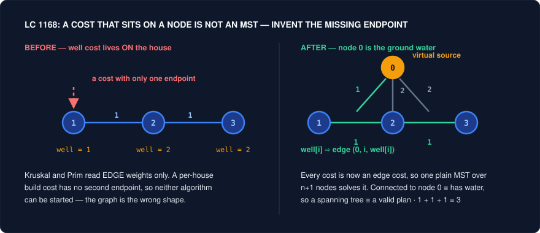

# Graph Modeling — Seeing the Graph Nobody Mentioned

Knowing the pattern is not the same as solving the problem. In graph interviews this gap is at its widest, because the traversal is a commodity: BFS, DFS, Dijkstra, Kahn, union-find are two dozen lines each, you can write them half asleep, and every candidate in the pipeline can too. Nothing is being tested there. What is being tested is whether you can look at a village of houses that need wells, a bus network described by routes, or a list of `a == b` and `a != b` assertions, and say *that is a graph* — and then say precisely **which** graph.

The modelling is the whole difficulty, and it collapses into four questions you should ask out loud before writing a line of code. **What is a node?** Usually not the object the statement names — it may be a route rather than a stop, a board configuration rather than a tile, a pair rather than a cell. **What is an edge?** Anything the statement calls a relation: a pipe, a flight, an equation, "these two strings are similar". **What is the weight?** Whatever quantity accumulates along the relation — and note that a cost attached to a *node* is a modelling error you must repair before any MST or Dijkstra will accept the input. **What makes two visits different?** If arriving at the same place in two different conditions leaves you with genuinely different futures, then the place is not the node; the place paired with the condition is.

The six tricks below are the six recurring answers. Trick 1 fixes a missing endpoint by inventing a node. Trick 2 fixes an under-specified node by folding the condition into it. Trick 3 fixes a dense graph by picking a different vertex set entirely. Tricks 4 and 5 recognise a graph hiding inside plain English — statements of sameness are union-find edges, statements of ratio or difference are weighted ones. Trick 6 is the fingerprint table: the small number of phrasings that name a classical structure outright. In every case the algorithm at the end is one you already own. The move is upstream of it.

---

## Trick 1: Add a virtual node

**The tell:** A cost with no natural source — "the cost of building a well *in* house `i`", "the price of starting a route from anywhere". Or the opposite: *many* natural sources, so the question is "distance to the **nearest** gate / land cell / rotten orange" and you catch yourself planning one BFS per source.

**The trick:** Invent a node that does not exist in the statement — call it node `0`, the super-source, the ground water — and attach the orphan costs to it as ordinary edges. For multi-source shortest path, do not build it explicitly: push **every** source into the BFS queue at distance 0 before the loop starts, which is exactly a super-source with 0-weight edges to each, minus the bookkeeping.

**Why it works:** MST and shortest-path algorithms are defined over edge weights only; they have no slot for a weight that lives on a vertex, and no notion of "several starts". Both gaps are the same gap — a missing endpoint — and both are closed by manufacturing the endpoint. In LC 1168, `wells[i]` becomes edge `(0, i, wells[i])`, and now "house `i` has water" is literally "house `i` is connected to node `0`", so a spanning tree of the `n+1` node graph *is* a valid plan and the minimum one is the answer. Nothing about Kruskal changes. In multi-source BFS the super-source is even cheaper: since every source-to-super edge has weight 0, all sources sit in layer 0 together, the first time any of them reaches a cell that distance is `min` over all sources, and you get all-pairs-to-nearest in a single O(V + E) sweep instead of `k` sweeps.



**Template:**
```cpp
// LC 1168 — wells become edges from the virtual node 0, then plain Kruskal
struct DSU {
    vector<int> p, r;
    DSU(int n) : p(n), r(n, 0) { iota(p.begin(), p.end(), 0); }
    int find(int x) { return p[x] == x ? x : p[x] = find(p[x]); }
    bool unite(int a, int b) {
        a = find(a); b = find(b);
        if (a == b) return false;
        if (r[a] < r[b]) swap(a, b);
        p[b] = a; if (r[a] == r[b]) r[a]++;
        return true;
    }
};

int minCostToSupplyWater(int n, vector<int>& wells, vector<vector<int>>& pipes) {
    vector<array<int,3>> e;                       // {w, u, v}
    for (int i = 0; i < n; i++)
        e.push_back({wells[i], 0, i + 1});        // THE TRICK: node 0 = the ground
    for (auto& p : pipes)
        e.push_back({p[2], p[0], p[1]});

    sort(e.begin(), e.end());
    DSU d(n + 1);
    int cost = 0;
    for (auto& [w, u, v] : e)
        if (d.unite(u, v)) cost += w;             // n edges chosen over n+1 nodes
    return cost;
}

// Multi-source BFS — the super-source, implicit: seed the queue with ALL sources
queue<pair<int,int>> q;
for (int i = 0; i < m; i++)
    for (int j = 0; j < n; j++)
        if (isSource(i, j)) { dist[i][j] = 0; q.push({i, j}); }   // layer 0 together
while (!q.empty()) { /* ordinary BFS */ }
```

**Problems:**
| Problem | Difficulty | How the trick applies |
|---|---|---|
| 1168. Optimize Water Distribution in a Village | Hard | The flagship. `wells[i]` is a node weight, which is not a thing; edge `(0, i, wells[i])` makes it one and the problem becomes textbook MST over `n+1` nodes. |
| 1584. Min Cost to Connect All Points | Medium | The same MST with no modelling to do — every pair is already an edge. Write this one first so that at 1168 the *only* new thing is the virtual node. |
| 542. 01 Matrix | Medium | "Distance to the nearest 0" — every 0 is a source. Push all of them at distance 0; one BFS answers every cell. Per-cell BFS is O((mn)^2) and times out. |
| 1162. As Far from Land as Possible | Medium | Same seeding, opposite reduction: BFS from all land at once and take the **max** distance reached. The last layer popped is the answer. |
| 286. Walls and Gates | Medium | All gates seeded at 0, walls never enqueued. The rooms fill in with their nearest-gate distance by construction. |
| 994. Rotting Oranges | Medium | Every rotten orange is a source; the number of BFS layers is the elapsed time. Track the layer count, then check no fresh orange survives. |
| 130. Surrounded Regions | Medium | The union-find phrasing: create one virtual "border" node, union every `O` on the boundary to it, and flip exactly the `O`s that are not connected to it. Replaces a "did this region touch the edge?" flag with a connectivity query. |

**Pitfalls:**
- Sizing the DSU at `n` instead of `n + 1` after adding node 0, or forgetting to shift the houses to `1..n`. Fix the indexing convention in a comment before you type the loop.
- Seeding multi-source BFS with sources at distance 0 but forgetting to mark them visited immediately — they get re-enqueued by their neighbours and the "first arrival is shortest" invariant still holds, but the queue blows up.
- Using multi-source BFS with **weighted** edges. The super-source trick is fine, but the traversal must then be Dijkstra with all sources pushed at key 0; plain BFS is wrong the moment weights differ.
- Adding the virtual node and then counting edges as if the graph had `n` nodes: an MST over `n + 1` nodes has `n` edges, and that is the well-plus-pipes count you expect.

---

## Trick 2: Put the extra condition inside the node

**The tell:** You are running BFS on a grid or graph and the statement adds a carried quantity — keys collected, walls you may still break, stops remaining, cities already visited. The symptom is that `visited[cell]` feels wrong: you can see a path that must revisit a square, and your visited set forbids it.

**The trick:** Redefine the node as the pair `(place, situation)`. The visited set is keyed on the pair, the queue holds the pair, and the answer is the first time you pop a pair whose place is the target. Pack the situation into an integer so it can index an array — a bitmask for a set of keys or visited cities, a small integer for a remaining budget.

**Why it works:** BFS is correct because the first arrival at a node is the cheapest one, and that guarantee only holds when arriving at a node twice really means the same thing twice. If two arrivals leave you with different capabilities, they are different vertices of the true graph, and a visited set keyed on the place alone does not merely lose efficiency — it **deletes the optimal path**, because the first, weaker arrival permanently claims the square. Folding the condition in restores the invariant exactly: over the enlarged vertex set `V x S` every arrival at a given vertex is genuinely interchangeable, so ordinary BFS is correct again with no modification. The cost is a factor of `|S|`, which is why the constraints are always small enough to make `|S|` tiny — 6 keys means 64 states, `k <= 40` eliminations means 41 — and reading that suspiciously small bound in the constraints is itself the tell.


**Template:**
```cpp
// LC 864 — node = (cell, key bitmask)
int shortestPathAllKeys(vector<string>& g) {
    int m = g.size(), n = g[0].size(), all = 0, sr = 0, sc = 0;
    for (int i = 0; i < m; i++)
        for (int j = 0; j < n; j++) {
            char c = g[i][j];
            if (c == '@') { sr = i; sc = j; }
            else if (islower(c)) all |= 1 << (c - 'a');
        }

    vector<vector<vector<char>>> seen(m, vector<vector<char>>(n, vector<char>(1 << 6, 0)));
    queue<array<int,3>> q;                        // {r, c, mask}
    q.push({sr, sc, 0});
    seen[sr][sc][0] = 1;

    int steps = 0, dr[] = {1,-1,0,0}, dc[] = {0,0,1,-1};
    while (!q.empty()) {
        for (int sz = q.size(); sz--; ) {
            auto [r, c, mask] = q.front(); q.pop();
            if (mask == all) return steps;
            for (int d = 0; d < 4; d++) {
                int nr = r + dr[d], nc = c + dc[d];
                if (nr < 0 || nr >= m || nc < 0 || nc >= n) continue;
                char ch = g[nr][nc];
                if (ch == '#') continue;
                if (isupper(ch) && !(mask >> (ch - 'A') & 1)) continue;   // locked
                int nm = mask | (islower(ch) ? 1 << (ch - 'a') : 0);
                if (seen[nr][nc][nm]) continue;                          // keyed on PAIR
                seen[nr][nc][nm] = 1;
                q.push({nr, nc, nm});
            }
        }
        steps++;
    }
    return -1;
}

// LC 1293 — same shape, situation = eliminations left. The dominance prune:
// if best[r][c] >= k you have been here before with at least as much budget, skip.
```

**Problems:**
| Problem | Difficulty | How the trick applies |
|---|---|---|
| 864. Shortest Path to Get All Keys | Hard | The canonical one. Node is `(r, c, keyMask)`; at most 6 keys, so 64 masks, so `m * n * 64` states. Target test is `mask == all`, not a cell. |
| 1293. Shortest Path in a Grid with Obstacles Elimination | Hard | Node is `(r, c, k)`. The strengthening worth knowing: keep `best[r][c]` = most budget ever seen here and prune when `best[r][c] >= k` — a dominance argument that collapses the third axis in practice. |
| 787. Cheapest Flights Within K Stops | Medium | The stop count *is* the extra axis. Either `dist[city][stops]` under Dijkstra, or Bellman-Ford relaxed exactly `k + 1` times over a snapshot of the previous round — the snapshot is what stops one round from feeding itself. |
| 847. Shortest Path Visiting All Nodes | Hard | Node is `(current, visitedMask)`; start by seeding **all** `n` starts at distance 0 (Trick 1 again). `n <= 12`, so 12 * 4096 states, and revisiting a city is legal precisely because the mask differs. |
| 1129. Shortest Path with Alternating Colors | Medium | Situation = colour of the edge you arrived on, so the node is `(city, lastColour)`. Two arrivals at the same city with different last colours have different legal continuations. |
| 1654. Minimum Jumps to Reach Home | Medium | Situation = whether the previous move was backwards, since two backward jumps in a row are illegal. One extra bit; the hard part is arguing the position bound, roughly `max(x, max(forbidden)) + a + b`. |

**Pitfalls:**
- Keying `visited` on the cell "to save memory". This is the defining bug of the family and it produces wrong answers on the sample cases, not just slow ones.
- Sizing the mask dimension by the keys *present* rather than `1 << 6`, then indexing out of range on a grid that has fewer keys than letters used.
- In 787, relaxing edges in place during a Bellman-Ford round, which lets a path use two edges in one round and silently exceeds `k` stops. Copy the distance array at the top of every round.
- Returning as soon as the target **cell** is dequeued in 864. The target is the state `mask == all`, which can be reached at any cell.
- Forgetting that the enlarged graph can need more memory than you think: `m * n * |S|` chars is fine, `m * n * |S|` ints in a `vector<vector<vector<int>>>` on a big grid is not always.

---

## Trick 3: Choose a different vertex set

**The tell:** The obvious modelling produces a graph you cannot afford — thousands of stops on shared routes give a near-complete graph, or "all words differing in one letter" is `O(n^2 * L)` just to build. The edge count, not the traversal, is what blows the budget.

**The trick:** Ask what other objects the problem contains and make *those* the nodes. In LC 815 the answer is not stops but **routes**: two routes are adjacent when they share any stop, and the answer is the number of routes ridden, so the BFS depth is the answer directly. Where no natural alternative exists, manufacture one — bucket nodes that share a property behind a single intermediate node, which is Trick 1 applied to de-densify rather than to attach a cost.

**Why it works:** The complexity of a graph algorithm is `O(V + E)`, and modelling choices move mass between the two terms. A stop that `r` routes pass through creates `C(r, 2)` stop-to-stop edges; making the routes the vertices replaces that clique with `r` memberships. The same arithmetic drives the bucket trick: `k` words sharing the pattern `h*t` need `C(k, 2)` direct edges but only `k` edges to a shared `h*t` node, at the cost of doubling every path length — a constant you divide out at the end. The general rule is that a **clique induced by a shared property should be replaced by a node representing that property.** Once the vertex set is right, the traversal is the same BFS you were always going to write.

**Template:**
```cpp
// LC 815 — nodes are ROUTES; stopToRoutes gives the adjacency for free
int numBusesToDestination(vector<vector<int>>& routes, int source, int target) {
    if (source == target) return 0;
    unordered_map<int, vector<int>> stopToRoutes;
    for (int i = 0; i < (int)routes.size(); i++)
        for (int s : routes[i]) stopToRoutes[s].push_back(i);

    queue<int> q;                                  // queue of ROUTE ids
    vector<char> usedRoute(routes.size(), 0);
    unordered_set<int> seenStop{source};
    for (int r : stopToRoutes[source]) { usedRoute[r] = 1; q.push(r); }

    int buses = 1;
    while (!q.empty()) {
        for (int sz = q.size(); sz--; ) {
            int r = q.front(); q.pop();
            for (int s : routes[r]) {
                if (s == target) return buses;
                if (!seenStop.insert(s).second) continue;   // stop already expanded
                for (int nr : stopToRoutes[s])
                    if (!usedRoute[nr]) { usedRoute[nr] = 1; q.push(nr); }
            }
        }
        buses++;
    }
    return -1;
}

// LC 127 — bucket nodes: "h*t" is a virtual vertex joining hot, hat, hit
// unordered_map<string, vector<string>> bucket;  key = word with one letter starred
```

**Problems:**
| Problem | Difficulty | How the trick applies |
|---|---|---|
| 815. Bus Routes | Hard | The headline. Routes as nodes: BFS depth = buses taken, which is the quantity asked for. Stops as nodes gives a quadratic edge set and an answer you then have to reconstruct. |
| 127. Word Ladder | Hard | Nodes are words, but the edges must not be built pairwise. Either generate the 25 * L neighbours of each word directly, or introduce `h*t`-style bucket nodes — the same de-densifying move, and remember to halve the resulting depth. |
| 752. Open the Lock | Medium | The node is a 4-digit **configuration**, not a wheel. There is no graph in the input at all; the edges are the 8 legal turns, generated on demand. Recognising an implicit graph is the whole problem. |
| 773. Sliding Puzzle | Hard | The node is the entire board serialised to a string; neighbours are the legal moves of the blank. 6! = 720 states, so BFS over configurations is trivial once you stop thinking of tiles as nodes. |
| 1345. Jump Game IV | Hard | Equal values form a clique. Group indices by value, and after expanding a value **clear its bucket** — that erasure is what turns the clique into amortised linear work and is the difference between passing and TLE. |

**Pitfalls:**
- In 815, marking only routes as visited and re-expanding the same stop through many routes, or only stops and re-riding routes. Mark both.
- In 1345, forgetting to clear the value bucket after its first expansion. The algorithm stays correct and becomes quadratic.
- Building the pairwise edge list "just to get it working" in 127. On the real test set that step alone is the timeout.
- Serialising a board state inconsistently (different orderings on different code paths) so that identical states hash differently and BFS never terminates early.

---

## Trick 4: Read statements of sameness as union-find edges

**The tell:** The statement asserts relations of the form "`a` and `b` are the same / equal / connected / belong together / are directly friends", and the question asks how many groups, whether the assertions are consistent, or which items end up together. There is no path to find, no distance to minimise — only membership.

**The trick:** Union every asserted pair, then answer with `find`. Two rules cover the family: **process all the positive assertions before any negative one**, since a contradiction is only detectable against a finished partition; and when the "items" are not integers, map them to indices with a hash map first and keep a canonical representative per component.

**Why it works:** Equality is an equivalence relation — reflexive, symmetric, transitive — and a disjoint-set structure is the exact data-structure encoding of an equivalence relation, so the translation is not an analogy but an isomorphism. Transitivity is the part you cannot get any other way cheaply: `a == b` and `b == c` implying `a == c` is precisely path compression doing its job, and it is why an inequality can only be checked once every equality has been absorbed. The corollary is the shape of LC 990's solution — two passes, never one — and the shape of LC 684's — the first edge whose endpoints already share a root is the redundant one, because it closes a cycle by definition.

**Template:**
```cpp
// LC 990 — all equalities first, then test every inequality against the finished partition
bool equationsPossible(vector<string>& eq) {
    vector<int> p(26); iota(p.begin(), p.end(), 0);
    function<int(int)> find = [&](int x) { return p[x] == x ? x : p[x] = find(p[x]); };

    for (auto& e : eq)                                  // PASS 1: build the partition
        if (e[1] == '=') p[find(e[0] - 'a')] = find(e[3] - 'a');
    for (auto& e : eq)                                  // PASS 2: only now, contradictions
        if (e[1] == '!' && find(e[0] - 'a') == find(e[3] - 'a')) return false;
    return true;
}

// Non-integer items: intern them once, then union as usual
unordered_map<string, int> id;
auto idx = [&](const string& s) {
    auto it = id.find(s);
    return it != id.end() ? it->second : id[s] = id.size();
};
```

**Problems:**
| Problem | Difficulty | How the trick applies |
|---|---|---|
| 990. Satisfiability of Equality Equations | Medium | The purest statement of the trick. Two passes; interleaving them fails on `["a!=b","b==a"]`, which is the test the problem is built around. |
| 721. Accounts Merge | Medium | "These accounts share an email" is sameness. Union each account with the first account that owns each email, then group by root and sort each bucket. The map from email to owner is the whole implementation. |
| 839. Similar String Groups | Hard | Sameness is defined by a predicate rather than given: compare all `O(n^2)` pairs, union those differing in at most two positions, count roots. Transitivity is supplied by the DSU, which is why you never compare beyond one hop. |
| 547. Number of Provinces | Medium | The adjacency matrix version — union `i, j` wherever `isConnected[i][j]`, answer is the number of distinct roots. The starter problem; write the DSU here from memory. |
| 684. Redundant Connection | Medium | Scan edges in order and return the first whose endpoints already share a root. `n` edges over `n` nodes forces exactly one cycle, so the first failure to unite is the answer. |
| 200. Number of Islands | Medium | Solvable by flood fill, but the DSU version is the one that generalises to the streaming variant (LC 305) where cells arrive one at a time and only incremental union works. |
| 952. Largest Component Size by Common Factor | Hard | Sameness is "shares a prime factor". Do not compare pairs — union each number with each of its **prime factors** as virtual nodes, which is Tricks 1 and 4 composed, then count the largest component among the real numbers. |
| 1319. Number of Operations to Make Network Connected | Medium | Components minus one cables needed, feasible when `edges >= n - 1`. Counting redundant edges is counting failed unions. |

**Pitfalls:**
- Mixing equality and inequality in a single pass. The canonical bug of 990.
- `find` without path compression **and** without union by rank/size on `n = 1e5`. One of the two is usually enough in practice; neither is a genuine `O(n)` per query in the worst case.
- Counting components by counting `p[i] == i` after mutating `p` outside `find`. Recompute with `find(i)` on every element instead.
- In 952, unioning numbers with their factors and then counting **all** roots, including the prime pseudo-nodes. Count only the original numbers.
- Reaching for a DSU when the question actually asks for distances or paths. Union-find answers "same group?" and nothing else — no path, no length, no direction.

---

## Trick 5: Read statements of ratio or difference as weighted edges

**The tell:** A relation between two items carries a *number* — "`a / b = 2.0`", "the effort between adjacent cells is the height difference", "these two people became friends at time `t`", "this edge is usable only below limit `L`". The relation is not merely present, it is quantified.

**The trick:** Make the number the edge weight and choose the combining rule the statement dictates. Multiplicative relations (ratios) compose by product and invert by reciprocal, so store `w(a, b) = a / b` and `w(b, a) = 1 / w(a, b)` and multiply along the path. Minimax relations ("the worst step on the route") compose by `max`, and Dijkstra works verbatim once you replace `d + w` with `max(d, w)`. Threshold relations sort by weight and replay as an offline union-find.

**Why it works:** Dijkstra never actually assumes addition — it assumes the path cost function is **monotone**, that extending a path cannot make it cheaper. Sum, `max`, and product-of-values-at-least-one all satisfy that, so the same relaxation loop and the same "first settled is final" argument survive the substitution unchanged; you are swapping the semiring, not the algorithm. The ratio case makes the point sharply: `a/c = (a/b) * (b/c)` is transitivity with a weight attached, so LC 399 is exactly Trick 4 with a multiplier riding on every union, and the weighted DSU's path compression must multiply the accumulated ratios as it re-parents. And when the weight is a *time* or a *limit* rather than a cost, sorting queries and edges together turns "was it connected under constraint X" into one forward sweep, because connectivity only ever grows as the constraint relaxes.

**Template:**
```cpp
// LC 399 — weighted DFS over the ratio graph
double dfs(const string& cur, const string& dst, double acc,
           unordered_map<string, vector<pair<string,double>>>& g,
           unordered_set<string>& seen) {
    if (!g.count(cur) || !g.count(dst)) return -1.0;
    if (cur == dst) return acc;
    seen.insert(cur);
    for (auto& [nxt, w] : g[cur])
        if (!seen.count(nxt)) {
            double r = dfs(nxt, dst, acc * w, g, seen);   // ratios COMPOSE by product
            if (r > 0) return r;
        }
    return -1.0;
}
// build: g[a].push_back({b, v});  g[b].push_back({a, 1.0 / v});

// Minimax weight — Dijkstra with max instead of +  (LC 1631 / 778)
priority_queue<pair<int,int>, vector<pair<int,int>>, greater<>> pq;
// ... nd = max(d, abs(h[nr][nc] - h[r][c]));   if (nd < dist[nr][nc]) relax
```

**Problems:**
| Problem | Difficulty | How the trick applies |
|---|---|---|
| 399. Evaluate Division | Medium | The definitional case. Weighted DFS is the readable answer; weighted union-find (`ratio[x]` = value of `x` divided by value of its parent) is the one that handles many queries and is worth writing once. |
| 1631. Path With Minimum Effort | Medium | The weight is `abs` height difference and the path cost is the **max** edge on it, not the sum. Dijkstra with `max` relaxation, or binary search the threshold and BFS the feasibility check. |
| 778. Swim in Rising Water | Hard | Same minimax family with the weight on the cell rather than the edge; `max(t, grid[nr][nc])`. Solve it right after 1631 to see that the two are one problem. |
| 1697. Checking Existence of Edge Length Limited Paths | Hard | Weight as a **threshold**: sort edges by weight and queries by limit, then sweep, adding edges below the current limit into a DSU. Offline processing turns `q` connectivity questions into one pass. |
| 1101. The Earliest Moment When Everyone Become Friends | Medium | The weight is a timestamp. Sort by time, union, and report the moment the component count first reaches one — the same offline sweep with a different stopping rule. |
| 743. Network Delay Time | Medium | The plain additive baseline with nothing hidden: signal times are edge weights, answer is the max finalised distance. Keep it as the control case for what "no modelling needed" looks like. |

**Pitfalls:**
- Omitting the reciprocal edge in 399, or building it as `-v` out of habit. The inverse of a ratio is `1 / v`.
- Querying a variable that never appears in any equation. It must return `-1.0`, not `1.0`, even when the query is `x / x`.
- Writing minimax Dijkstra as `d + w` on autopilot. The relaxation is `max(d, w)`, and the bug passes small cases.
- Floating point equality on accumulated ratios. Never compare products for equality; return them.
- Trying to answer threshold queries online when the input is fully known. Sorting the queries is legal and is the entire point of 1697.

---

## Trick 6: Recognize the classical structures by their fingerprints

**The tell:** A phrase that maps one-to-one onto a named structure. "Split into two groups so that no pair that dislikes each other shares a group" — **bipartite**. "Use every edge exactly once" or "every combination of length `n` must appear" — **Eulerian path**. "Before you can do X you must do Y" — **topological order**. "Repeatedly remove the outermost items" — **leaf peeling**.

**The trick:** Learn the phrasings, not the proofs. Bipartite means two-colour with BFS/DFS and fail on a same-colour edge. "Every edge exactly once" means Hierholzer, and the answer is built **in reverse** — push a node after its edges are exhausted, then reverse the list. "Prerequisites" means Kahn: in-degrees, a queue, and a cycle iff fewer than `n` nodes are emitted. Say the name out loud in the interview before you start typing; the naming is the graded step.

**Why it works:** These structures each have a crisp characterisation that a natural-language statement almost always paraphrases word for word, and once named, the implementation is a memorised twenty lines. Bipartite is "no odd cycle", which is why a single BFS colouring decides it: a conflict is detected exactly when an edge joins two nodes of equal parity. Eulerian is a degree condition, which is why LC 753 — asking for a string containing every `k`-length password — becomes a **de Bruijn sequence**: make each `(k-1)`-prefix a node and each full password an edge, and "every password appears" is literally "every edge used once", so the thing you were trying to construct greedily is an Euler circuit that is guaranteed to exist because every node has equal in- and out-degree. Topological order is "a DAG has one, a cycle has none", which is why the same code answers both "can it be done" and "in what order". The mismatch to watch for is that Hamiltonian questions — every *vertex* once — have no such fingerprint and no polynomial algorithm, which is exactly why LC 847 comes with `n <= 12` and belongs to Trick 2 instead.

**Template:**
```cpp
// FINGERPRINT: "two hostile groups" -> BFS two-colouring
bool isBipartite(vector<vector<int>>& g) {
    int n = g.size();
    vector<int> col(n, -1);
    for (int s = 0; s < n; s++) {
        if (col[s] != -1) continue;
        col[s] = 0;
        queue<int> q; q.push(s);
        while (!q.empty()) {
            int u = q.front(); q.pop();
            for (int v : g[u]) {
                if (col[v] == col[u]) return false;      // odd cycle found
                if (col[v] == -1) { col[v] = col[u] ^ 1; q.push(v); }
            }
        }
    }
    return true;
}

// FINGERPRINT: "use every edge exactly once" -> Hierholzer, built backwards
void hierholzer(const string& u, map<string, multiset<string>>& g, vector<string>& out) {
    while (!g[u].empty()) {
        string v = *g[u].begin();
        g[u].erase(g[u].begin());                        // consume the edge
        hierholzer(v, g, out);
    }
    out.push_back(u);                                    // post-order, then reverse
}

// FINGERPRINT: "prerequisites" -> Kahn; emitted < n means a cycle
```

**Problems:**
| Problem | Difficulty | How the trick applies |
|---|---|---|
| 785. Is Graph Bipartite? | Medium | The fingerprint stated outright. Loop over all start nodes — the graph may be disconnected, and forgetting that is the only real trap. |
| 886. Possible Bipartition | Medium | The same question wearing a story. Build adjacency from the dislike list and two-colour; the modelling step is one line and the recognition is the whole problem. |
| 207. Course Schedule | Medium | "Prerequisites" means DAG check. Kahn and count emissions, or DFS with three colours and look for a back edge. |
| 210. Course Schedule II | Medium | Same machinery, now returning the order. Emit the queue pops; an empty return means a cycle. |
| 269. Alien Dictionary | Hard | The edges are not given: compare adjacent words at the first differing character. Two traps — a prefix appearing after its extension is invalid input, and characters with no constraints still belong in the output. |
| 310. Minimum Height Trees | Medium | Fingerprint: peel degree-1 nodes layer by layer until one or two remain. Those are the centroids; there are never three, and knowing that bound is the check that you found the right structure. |
| 332. Reconstruct Itinerary | Hard | "Use every ticket exactly once" is Eulerian by definition. Hierholzer with lexicographic tie-breaking, output reversed. Plain backtracking is exponential on the adversarial cases. |
| 753. Cracking the Safe | Hard | De Bruijn sequence: nodes are `(k-1)`-length prefixes, edges are the `k`-length passwords, so an Euler circuit visits every password once and the answer has the minimum possible length. |
| 1203. Sort Items by Group Respecting Dependencies | Hard | Two topological sorts stacked — one over groups, one over items inside each group — after giving every ungrouped item its own private group. The fingerprint appears twice in one problem. |

**Pitfalls:**
- Two-colouring only from node 0 and missing a disconnected component that is not bipartite.
- Forgetting that Hierholzer's output is reversed. The route looks almost right, which makes it hard to spot.
- Using a `multiset`/priority queue in 332 but not erasing the edge before recursing, producing an infinite descent.
- In 269, deriving no constraint from `["abc", "ab"]` instead of returning `""`. The invalid-prefix case is tested.
- Assuming a topological order is unique. It is not; any valid one is accepted unless the statement says otherwise.
- Reaching for an Eulerian algorithm when the ask is "every **vertex** once". That is Hamiltonian, it is NP-hard, and the constraint bound will tell you so.

---

## Family Cheat Sheet

| Trick | Tell | Move |
|---|---|---|
| 1. Add a virtual node | A cost attached to a node, or "distance to the **nearest** of many sources" | Invent node 0 and hang the orphan costs on it as edges; or seed every source into the queue at distance 0 |
| 2. Put the condition inside the node | BFS plus a carried quantity (keys, budget, stops); you can see a path that must revisit a cell | Node becomes `(place, situation)`; `visited` is keyed on the pair; bitmask the situation |
| 3. Choose a different vertex set | The natural nodes induce a clique or `O(n^2)` edges; the count asked for is not the number of hops | Make the shared property a node — routes not stops, configurations not tiles, `h*t` buckets not word pairs |
| 4. Sameness is a union-find edge | "`a` and `b` are equal / belong together"; the ask is groups, consistency, or membership | Intern the items, union every positive assertion, and only **then** test the negative ones |
| 5. Ratio or difference is a weight | The relation carries a number: a ratio, a height gap, a timestamp, a limit | Weight the edge and swap the combining rule — product for ratios, `max` for minimax, sorted sweep for thresholds |
| 6. Match the fingerprint | "two hostile groups", "every edge exactly once", "prerequisites", "peel the outside" | Name the structure first — bipartite / Eulerian / topological / leaf-peeling — then write the memorised twenty lines |

All six answer the same four questions: **what is a node, what is an edge, what is the weight, what makes two visits different.** When a graph problem stalls, the traversal is almost never the culprit. Re-ask the four questions and the graph you should have built usually falls out of the second one.
