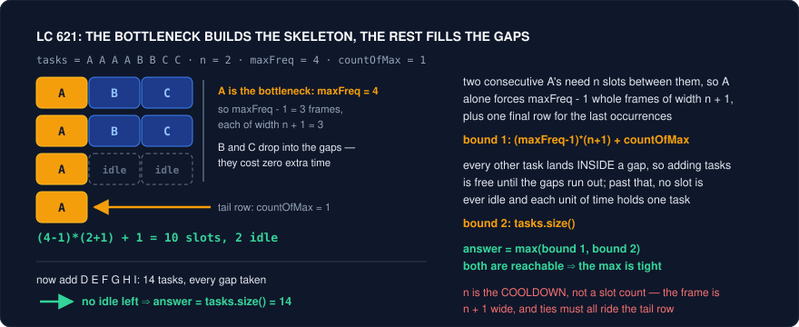

# Invariants and Proofs — When the Argument *Is* the Solution

Knowing the pattern is not the same as solving the problem. This folder catalogues **reframing moves** — the questions that unlock a problem after you have already correctly identified its family. This file covers the sharpest of them: the cases where there is no algorithm to find at all. The submission is a formula, a parity check, a comparator, or a five-line loop, and every minute of the interview lives in the *argument* that produced it.

These problems are unusually punishing because the normal debugging loop does not work. You cannot write a plausible-looking function and fix it against the examples: `n % 4 != 0` and `n % 3 != 0` both pass a hand-picked case, and `(maxFreq - 1) * n + countOfMax` looks exactly as reasonable as the correct `(maxFreq - 1) * (n + 1) + countOfMax` until a test disagrees. There is nothing to step through, no state to print, no intermediate structure whose corruption tells you where you went wrong. The failure mode is therefore always the same — **reaching for the editor before you have the reason** — and it is fatal, because the reason is the only thing that distinguishes the right formula from the four wrong ones sitting next to it.

The six moves below are the arguments that generate those formulas. Three of them prove things about *values*: a lower bound you then match by construction (Trick 1), a quantity that never changes so states with a different value are unreachable (Trick 2), and a quantity that only moves one way so the process must terminate (Trick 3). Two are counting and ordering arguments: pigeonhole turns an existence claim into a construction (Trick 4), and the exchange argument literally hands you a comparator (Trick 5). The last is a habit rather than a theorem: interrogate the largest or smallest element, because it has the fewest options and therefore leaks the most information (Trick 6). When a problem's expected output is one integer, one boolean, or one ordering, stop typing and ask which of these six is being tested — the code follows in under a minute once you know.

---

## Trick 1: Prove an upper bound, then construct something that reaches it

**The tell:** The output is a single number that looks like a *formula* — minimum time, minimum rooms, shortest possible length — and the input is a multiset of counts rather than a structure. Constraints are large enough (10^4, 10^5) that simulating or searching the schedule is clearly not intended, and the examples' answers scale suspiciously linearly with the largest count.

**The trick:** Find the **bottleneck** — the single element whose own requirements force a floor on the answer — and write that floor down as an inequality. Then find the other, usually trivial, floor (you cannot finish faster than the total amount of work). The answer is the max of the floors, and you earn it by exhibiting a schedule that actually achieves the max. Two bounds plus one construction is the whole proof, and the construction is what upgrades "this is a lower bound" into "this is the answer".

**Why it works:** A lower bound alone proves nothing about achievability, and a construction alone proves nothing about optimality; together they pin the answer from both sides. In LC 621, the bottleneck is the most frequent task. Two occurrences of it must be at least `n + 1` units apart, so if it appears `maxFreq` times, it alone lays out `maxFreq - 1` complete frames of width `n + 1`, followed by a final row holding the last occurrence of every task tied for most frequent. That skeleton is `(maxFreq - 1) * (n + 1) + countOfMax` units long, and **no schedule can be shorter**, because that count only used the constraints imposed by one task. The second bound is `tasks.size()`: each unit of time runs at most one task.



Now the construction, which is the half people skip. Every frame has `n` free slots after its leading `A`. Fill them with the remaining tasks in decreasing order of frequency, sweeping across frames (row-major into the gaps), and no task ever repeats inside a single frame — so no two identical tasks land within `n` of each other. If the other tasks fit, the schedule has length exactly the skeleton and the first bound is achieved. If they overflow, then every gap is occupied and there is **no idle time anywhere**; a schedule with zero idle slots has length exactly `tasks.size()`, and it is still legal because overflow means there are at least `n + 1` distinct tasks to cycle through. So each bound is achieved in exactly the regime where it dominates, and `max(skeleton, tasks.size())` is tight. Notice the shape of the argument: extra distinct tasks **fill the gaps rather than extend them**, which is why the answer stops growing with the skeleton and starts growing with the total.

LC 767 is the same argument with `n = 1`. The bound is that no letter may occupy more than `ceil(len / 2)` positions, i.e. `maxFreq <= (len + 1) / 2`; the construction is "write the most frequent letter into indices 0, 2, 4, ..., then wrap to 1, 3, 5, ... and continue with the rest", which provably never places equal letters adjacently because two copies of a letter written into the even chain are 2 apart, and the wrap only happens after the even chain is exhausted. LC 358 generalises it back to arbitrary `k`: the same skeleton reasoning gives feasibility, and the construction is a greedy that always emits the currently available letter with the highest remaining count while holding used letters in a cooldown queue of size `k - 1`.

**Template:**
```cpp
// LC 621 — the entire solution is the two bounds
int leastInterval(vector<char>& tasks, int n) {
    vector<int> cnt(26, 0);
    for (char c : tasks) cnt[c - 'A']++;

    int maxFreq   = *max_element(cnt.begin(), cnt.end());
    int countOfMax = (int)count(cnt.begin(), cnt.end(), maxFreq);

    long long skeleton = 1LL * (maxFreq - 1) * (n + 1) + countOfMax;  // bottleneck bound
    return (int)max<long long>(skeleton, (long long)tasks.size());    // work bound
}

// LC 767 — bound first (feasibility), then the construction that meets it
string reorganizeString(string s) {
    int len = s.size();
    vector<int> cnt(26, 0);
    for (char c : s) cnt[c - 'a']++;

    int best = (int)(max_element(cnt.begin(), cnt.end()) - cnt.begin());
    if (cnt[best] > (len + 1) / 2) return "";      // the bound says it is impossible

    string res(len, ' ');
    int i = 0;
    auto place = [&](int letter) {                  // even indices first, then odd
        while (cnt[letter]-- > 0) {
            res[i] = char('a' + letter);
            i += 2;
            if (i >= len) i = 1;                    // wrap only after evens are full
        }
    };
    place(best);                                    // the bottleneck goes down first
    for (int c = 0; c < 26; c++) if (c != best) place(c);
    return res;
}
```

<details>
<summary>Java</summary>

```java
// LC 621 — the entire solution is the two bounds
int leastInterval(char[] tasks, int n) {
    int[] cnt = new int[26];
    for (char c : tasks) cnt[c - 'A']++;

    int maxFreq = 0;
    for (int v : cnt) maxFreq = Math.max(maxFreq, v);
    int countOfMax = 0;
    for (int v : cnt) if (v == maxFreq) countOfMax++;

    long skeleton = (long)(maxFreq - 1) * (n + 1) + countOfMax;   // bottleneck bound
    return (int)Math.max(skeleton, (long)tasks.length);           // work bound
}

// LC 767 — bound first (feasibility), then the construction that meets it
// C++ captured `res`, `cnt` and `i` by reference in a lambda; Java lambdas cannot
// capture mutable locals, so `place` is a method that returns the new cursor `i`.
int place(char[] res, int[] cnt, int letter, int i) {   // even indices first, then odd
    while (cnt[letter]-- > 0) {
        res[i] = (char)('a' + letter);
        i += 2;
        if (i >= res.length) i = 1;                 // wrap only after evens are full
    }
    return i;
}

String reorganizeString(String s) {
    int len = s.length();
    int[] cnt = new int[26];
    for (char c : s.toCharArray()) cnt[c - 'a']++;

    int best = 0;
    for (int c = 0; c < 26; c++) if (cnt[c] > cnt[best]) best = c;
    if (cnt[best] > (len + 1) / 2) return "";      // the bound says it is impossible

    char[] res = new char[len];
    int i = 0;
    i = place(res, cnt, best, i);                   // the bottleneck goes down first
    for (int c = 0; c < 26; c++) if (c != best) i = place(res, cnt, c, i);
    return new String(res);
}
```

</details>

**Problems:**
| Problem | Difficulty | How the trick applies |
|---|---|---|
| 621. Task Scheduler | Medium | The flagship. Bound 1 is the skeleton the most frequent task forces; bound 2 is `tasks.size()`. Answer is the max because extra distinct tasks fill gaps instead of lengthening them. |
| 767. Reorganize String | Medium | Bound: `maxFreq <= (len + 1) / 2`. Construction: most frequent letter into even indices, wrap to odd. Solve this before 621 if the frame picture will not click — it is 621 with `n = 1`. |
| 358. Rearrange String k Distance Apart | Hard | Same skeleton with general `k`, but you must *output* the arrangement, so the construction is mandatory: greedy on remaining count with a cooldown queue of length `k - 1`. Returns `""` exactly when the bound is violated. |
| 1054. Distant Barcodes | Medium | 767 with integers and a guaranteed-feasible input, so only the construction remains. Writing the same even/odd fill twice is the point — it makes the placement argument automatic. |
| 984. String Without AAA or BBB | Medium | Bound: the majority letter cannot exceed `2 * (minority + 1)`. Construction: emit the majority letter in pairs and interleave. A clean small case for stating the bound out loud before coding. |
| 517. Super Washing Machines | Hard | Two bounds again: no machine can move more than one dress per move, so the answer is at least `max(surplus at a single machine)` and at least `max(|prefix imbalance|)` over every cut. Their max is achievable. The purest "two bounds, take the max" problem on the site. |
| 1953. Maximum Number of Weeks for Which You Can Work | Medium | If the largest pile exceeds the rest, it is the bottleneck and the answer is `2 * rest + 1`; otherwise nothing blocks and the answer is the total. Identical `max`/`min`-of-two-bounds shape, one line of code, all argument. |

**Pitfalls:**
- `n` is the **cooldown**, not the frame width. The frame is `n + 1` wide because it includes the task itself. Writing `(maxFreq - 1) * n` is the single most common 621 bug and it passes the first sample.
- Forgetting `countOfMax`. Every task tied for most frequent rides the final row, so the tail contributes `countOfMax`, not `1`.
- Skipping the construction and asserting the bound is the answer. The interviewer's follow-up is always "why is that achievable?" — a lower bound with no matching schedule is half a solution, and sometimes (weighted variants) the bound genuinely is not tight.
- Overflow: `(maxFreq - 1) * (n + 1)` with `n` up to 100 and counts up to 10^4 fits in `int`, but promote to `long long` reflexively rather than auditing.
- Assuming the bottleneck is unique. In 517 the two bounds come from *different* machines; taking only the local surplus bound fails on inputs where the imbalance is spread thin across a long prefix.

---

## Trick 2: Find the quantity that never changes

**The tell:** A game with optimal play and a boolean answer, or a reachability question ("can you transform s into t with these operations?") where the operations look local and harmless. Constraints are enormous or absent, the expected output is one bit, and any search you sketch has a branching factor that explodes immediately.

**The trick:** Take one legal move and ask what it *fails* to change. If some function of the state — a parity, a residue, a gcd, a multiset, an XOR, a relative ordering — has the same value before and after **every** legal move, it is an invariant. Any target whose invariant differs from the start's is unreachable, no search required. For games, look for an invariant that one player can always restore and the other can always break: that player controls the game.

**Why it works:** An invariant partitions the state space into classes that moves cannot cross. Proving unreachability normally means exhausting a search tree; an invariant proves it by evaluating one function twice. The work is in verifying it against *every* move type, and the payoff is that an O(1) test replaces an exponential search. Concretely:

- **LC 292 Nim.** The invariant is the residue `n % 4`, and the claim is that `n % 4 == 0` is exactly the set of losing positions. From a multiple of 4, every legal move (remove 1, 2, or 3) leaves a non-multiple — you cannot hand your opponent a losing position. From a non-multiple, you can always remove `n % 4` stones and hand back a multiple of 4. So the second player restores the invariant every round, and the pile shrinks to 0 on your turn. `return n % 4 != 0;`
- **LC 1025 Divisor Game.** The invariant is the **parity of `n`**, and the claim is that odd `n` loses. Every divisor of an odd number is odd, so `n - x` is even: from odd you must hand over an even number. From even, `1` is always a legal choice, so you can always hand back odd. Even is therefore a forced win by repeatedly passing odd numbers down until the opponent faces `n = 1` with no legal move. `return n % 2 == 0;`
- **LC 877 Stone Game.** The invariant is that **the two ends always have opposite index parity**. With an even number of piles, the row Alice sees at every one of her turns has one even-indexed end and one odd-indexed end — taking either end preserves this for her next turn, whatever Bob does. So Alice can decide up front to take *only* even-indexed piles or *only* odd-indexed piles, and she can execute either plan to completion. The total is odd, so those two sums differ; she picks the larger. `return true;`
- **LC 810 Chalkboard XOR Game.** The invariant is the XOR of the board, and the lemma is: if the XOR is nonzero and the count is even, some number can be erased without zeroing the XOR. Suppose not — then erasing any `a[i]` gives `X ^ a[i] == 0`, so every `a[i] == X`; XOR-ing an even number of copies of `X` gives `0`, contradicting `X != 0`. So with `n` even Alice never has to lose, and the board empties on her turn, which is a win by the rules. `return x == 0 || nums.size() % 2 == 0;`
- **LC 1657 Determine if Two Strings Are Close.** Operation 1 permutes characters; operation 2 swaps the identities of two letters. Neither changes the **set of characters used** nor the **multiset of frequencies** — operation 1 preserves both trivially, operation 2 permutes which letter carries which count. Those two invariants are also sufficient, so the answer is: same character set, and same sorted frequency vector.
- **LC 1247 Minimum Swaps to Make Strings Equal.** A swap exchanges `s1[i]` with `s2[j]`. If the two characters are equal it is a no-op; if they differ, both positions flip mismatch status, so the mismatch count changes by an even amount. The **parity of the mismatch count** is invariant, and the target has 0 mismatches — an odd total is unreachable, return `-1` before doing any counting.
- **LC 780 Reaching Points.** `(x, y) -> (x + y, y)` and `(x, y) -> (x, x + y)` both preserve `gcd(x, y)`. So `gcd(sx, sy) != gcd(tx, ty)` is an instant no, and the surviving cases are handled by walking backwards with modulo.

**Template:**
```cpp
// The invariant collapses each of these to one expression
bool canWinNim(int n)             { return n % 4 != 0; }   // 292: residue mod 4
bool divisorGame(int n)           { return n % 2 == 0; }   // 1025: parity of n
bool stoneGame(vector<int>& p)    { return true; }         // 877: end-index parity

bool xorGame(vector<int>& nums) {                          // 810: XOR of the board
    int x = 0;
    for (int v : nums) x ^= v;
    return x == 0 || nums.size() % 2 == 0;
}

// 1657: two invariants, both necessary and together sufficient
bool closeStrings(string w1, string w2) {
    if (w1.size() != w2.size()) return false;
    vector<int> a(26, 0), b(26, 0);
    for (char c : w1) a[c - 'a']++;
    for (char c : w2) b[c - 'a']++;
    for (int i = 0; i < 26; i++)
        if ((a[i] == 0) != (b[i] == 0)) return false;      // same character SET
    sort(a.begin(), a.end());
    sort(b.begin(), b.end());
    return a == b;                                          // same frequency MULTISET
}
```

<details>
<summary>Java</summary>

```java
// The invariant collapses each of these to one expression
boolean canWinNim(int n)        { return n % 4 != 0; }   // 292: residue mod 4
boolean divisorGame(int n)      { return n % 2 == 0; }   // 1025: parity of n
boolean stoneGame(int[] p)      { return true; }         // 877: end-index parity

boolean xorGame(int[] nums) {                            // 810: XOR of the board
    int x = 0;
    for (int v : nums) x ^= v;
    return x == 0 || nums.length % 2 == 0;
}

// 1657: two invariants, both necessary and together sufficient
boolean closeStrings(String w1, String w2) {
    if (w1.length() != w2.length()) return false;
    int[] a = new int[26], b = new int[26];
    for (char c : w1.toCharArray()) a[c - 'a']++;
    for (char c : w2.toCharArray()) b[c - 'a']++;
    for (int i = 0; i < 26; i++)
        if ((a[i] == 0) != (b[i] == 0)) return false;    // same character SET
    Arrays.sort(a);
    Arrays.sort(b);
    return Arrays.equals(a, b);                          // same frequency MULTISET
}
```

</details>

**Problems:**
| Problem | Difficulty | How the trick applies |
|---|---|---|
| 292. Nim Game | Easy | `n % 4` is preserved as a losing class: from a multiple of 4 you cannot produce one, from anything else you always can. |
| 1025. Divisor Game | Easy | Parity of `n`. Divisors of odd numbers are odd, so odd forces you to hand over even; `1` always lets you hand back odd. |
| 877. Stone Game | Medium | The ends always have opposite index parity, so Alice can commit to all-even or all-odd piles; an odd total means the two sums differ. |
| 810. Chalkboard XOR Game | Hard | XOR of the board. If it is already 0 Alice wins outright; otherwise an even count guarantees a safe erase every turn by the "all equal to X" contradiction. |
| 754. Reach a Number | Medium | After `k` steps the reachable sums all share the parity of `k(k+1)/2`, and flipping step `i` shifts the sum by `2i`. Advance `k` until `S >= |target|` **and** `S - |target|` is even. |
| 1657. Determine if Two Strings Are Close | Medium | Character set and frequency multiset survive both operations, and nothing else does — the invariants are exactly the answer. |
| 1247. Minimum Swaps to Make Strings Equal | Medium | Mismatch-count parity is invariant, so odd is `-1`; the rest is counting `xy`/`yx` pairs (`xy/2 + yx/2` plus 2 if both are odd). |
| 780. Reaching Points | Hard | `gcd` is invariant under both moves, which prunes instantly; the backwards walk with `%` then finishes in log time. |
| 869. Reordered Power of 2 | Medium | Permuting digits preserves the sorted digit string, so compare that signature against all 31 powers of two. Invariant as a hashing key. |

**Pitfalls:**
- Checking the invariant against one move type and forgetting the other. In 1657 the frequency multiset survives *both* operations but the character set only matters because operation 2 cannot introduce a letter — verify each operation separately, in writing.
- Confusing necessary with sufficient. An invariant proves states are **unreachable**; it never proves reachability on its own. 1657 needs the extra argument that the two invariants are also sufficient, and skipping that step is a real gap, not a formality.
- Guessing the modulus. `n % 4` in 292 comes from "the maximum move is 3, so `3 + 1 = 4`" — derive it from the move set rather than pattern-matching the examples, or you will write `% 3` on the variant with moves up to 2.
- Answering 877 with `return true;` and nothing else. The one-liner is correct and the interviewer wants the end-parity argument; without it you have memorised a leaderboard trick.
- Assuming games are always invariant problems. When the move set is irregular (464, 486, 1140), no clean invariant exists and it is genuine game DP with memoised states — reach for the invariant first, but give up on it fast.

---

## Trick 3: Find the quantity that only moves one way

**The tell:** A process with no obvious end — "repeat until no operation applies" — and you cannot see why it terminates, let alone how fast. Or an inner `while` loop nested inside a `for` loop, where the naive read is O(n^2) but the constraints say O(n) is expected.

**The trick:** Find a **monovariant**: a non-negative integer function of the state that strictly decreases (or strictly increases toward a ceiling) with every step. Its starting value bounds the number of steps, which both proves termination and gives the complexity. When the monovariant is "total items ever pushed into a container", you have just written the amortised-analysis proof for a monotonic stack or a two-pointer sweep.

**Why it works:** A strictly decreasing sequence of non-negative integers cannot be longer than its first term. That one sentence is the whole termination proof, and it is also the whole complexity proof for the amortised patterns. Take a monotonic stack: the outer loop runs `n` times and the inner `while` pops. Counting pops directly is hopeless, but each index is **pushed exactly once**, and a pop consumes a push permanently — pushes never come back. So total pops over the entire run is at most `n`, and the algorithm is O(n) despite a nested loop. The two-pointer sliding window is the same argument with `left` as the monovariant: it never decreases, so the total work of the inner loop across the whole scan is at most `n`. Both proofs are "the counter only moves one way and it is bounded" — and neither is visible from the code's shape, which is exactly why interviewers ask you to justify the complexity out loud.

The move also cracks problems where the *process* is the question. In LC 991 the forward operations (double, subtract 1) branch, but running backwards the value `startValue` strictly decreases on every step — halve when even, increment when odd — and it cannot decrease forever, so the greedy terminates in O(log) steps. LC 777 combines the two ideas: `L` can only ever move left and `R` can only ever move right (each is a monovariant on that piece's index), which immediately proves that if an `L` in the target sits to the right of its counterpart in the source, the answer is no.

**Template:**
```cpp
// Monotonic stack: n pushes total, so at most n pops total => O(n) amortised
vector<int> dailyTemperatures(vector<int>& t) {
    int n = t.size();
    vector<int> res(n, 0);
    stack<int> st;                       // indices, temperatures decreasing bottom->top
    for (int i = 0; i < n; i++) {
        while (!st.empty() && t[st.top()] < t[i]) {   // each pop kills one push forever
            res[st.top()] = i - st.top();
            st.pop();
        }
        st.push(i);                      // the monovariant: total pushes <= n
    }
    return res;
}

// Sliding window: `left` never decreases, so the inner while runs <= n times overall
int lengthOfLongestSubstring(string s) {
    vector<int> last(128, -1);
    int best = 0, left = 0;
    for (int r = 0; r < (int)s.size(); r++) {
        left = max(left, last[s[r]] + 1);   // monotone non-decreasing, bounded by n
        last[s[r]] = r;
        best = max(best, r - left + 1);
    }
    return best;
}

// LC 991 backwards: the value strictly decreases, so termination is immediate
int brokenCalc(int startValue, int target) {
    int ops = 0;
    while (target > startValue) {
        target = (target % 2 == 0) ? target / 2 : target + 1;   // strictly smaller soon
        ops++;
    }
    return ops + (startValue - target);      // only subtractions remain
}
```

<details>
<summary>Java</summary>

```java
// Monotonic stack: n pushes total, so at most n pops total => O(n) amortised
int[] dailyTemperatures(int[] t) {
    int n = t.length;
    int[] res = new int[n];
    Deque<Integer> st = new ArrayDeque<>();   // indices, temperatures decreasing bottom->top
    for (int i = 0; i < n; i++) {
        while (!st.isEmpty() && t[st.peek()] < t[i]) {   // each pop kills one push forever
            int top = st.pop();
            res[top] = i - top;
        }
        st.push(i);                          // the monovariant: total pushes <= n
    }
    return res;
}

// Sliding window: `left` never decreases, so the inner while runs <= n times overall
int lengthOfLongestSubstring(String s) {
    int[] last = new int[128];
    Arrays.fill(last, -1);
    int best = 0, left = 0;
    for (int r = 0; r < s.length(); r++) {
        char c = s.charAt(r);
        left = Math.max(left, last[c] + 1);   // monotone non-decreasing, bounded by n
        last[c] = r;
        best = Math.max(best, r - left + 1);
    }
    return best;
}

// LC 991 backwards: the value strictly decreases, so termination is immediate
int brokenCalc(int startValue, int target) {
    int ops = 0;
    while (target > startValue) {
        target = (target % 2 == 0) ? target / 2 : target + 1;   // strictly smaller soon
        ops++;
    }
    return ops + (startValue - target);      // only subtractions remain
}
```

</details>

**Problems:**
| Problem | Difficulty | How the trick applies |
|---|---|---|
| 739. Daily Temperatures | Medium | The canonical amortisation: `n` pushes bound total pops, so the nested `while` is O(n). Narrating this is the expected answer to "why is that not quadratic?". |
| 84. Largest Rectangle in Histogram | Hard | Same accounting with a second subtlety: each popped bar's rectangle is finalised exactly once, so the O(n) claim covers the *work per pop*, not just the pop count. |
| 907. Sum of Subarray Minimums | Medium | Every index enters and leaves the stack once, and its contribution is computed at the moment it leaves. The monovariant is what makes contribution-counting affordable. |
| 3. Longest Substring Without Repeating Characters | Medium | `left` is non-decreasing and bounded by `n`, so the two pointers together do at most `2n` steps. |
| 76. Minimum Window Substring | Hard | Same: `left` only advances. The shrink loop looks dangerous inside the expand loop and is provably linear. |
| 1004. Max Consecutive Ones III | Medium | The window never shrinks below its best size, so `left` moves monotonically; the flip budget is the only state. |
| 991. Broken Calculator | Medium | Forwards the search branches; backwards `target` strictly decreases each step, which both terminates the loop and proves greedy optimality (halving is forced when even). |
| 777. Swap Adjacent in LR String | Medium | `L` only moves left, `R` only moves right. Strip the `X`s: the letter sequences must match, and every `L` index must not increase while every `R` index must not decrease. |

**Pitfalls:**
- Claiming O(n) without naming what is bounded. "Each element is pushed and popped at most once" is the sentence; anything vaguer reads as memorised.
- A monovariant that decreases *weakly*. If a step can leave the quantity unchanged, you have proved nothing about termination — find a tiebreaker (a secondary counter, lexicographic pair) that strictly moves.
- Resetting the monotone pointer. Writing `left = 0` inside the loop, or recomputing the window from scratch, silently restores the O(n^2) you were avoiding.
- Confusing "the value shrinks" with "the greedy is optimal". In 991 the monovariant proves termination; optimality needs the separate observation that when `target` is even, halving is never worse than adding first.

---

## Trick 4: Pigeonhole — count the boxes, not the items

**The tell:** The problem asserts something must exist ("there is at least one duplicate", "some subarray sums to a multiple of k") without telling you where, or it hands you a suspiciously tight range: `n + 1` numbers drawn from `[1, n]`, `n` values spread over a known interval, prefix sums modulo `k`. The constraint that looks like flavour text is the proof.

**The trick:** Match items against boxes. If items outnumber boxes, two items share a box — and that *shared box is the object you were asked to find*. Then flip it: choose the boxes so that the collision you are forced to have is exactly the answer, and so that anything **inside** a box is provably irrelevant.

**Why it works:** Pigeonhole converts an existence claim into a structure you can search, which is a strictly stronger position than searching blindly.

- **LC 287.** Values live in `[1, n]` and there are `n + 1` of them, so a duplicate must exist — but the real payoff is the next step. Treat the array as the function `i -> nums[i]`; because every value is a valid index, following it never leaves the array, so the walk from index `0` is infinite in a finite space and **must** cycle. A duplicate value is a node with two incoming edges, i.e. the cycle's entrance, so Floyd's tortoise-and-hare finds it in O(n) time and O(1) space without modifying the input. The range constraint is not a detail; it is what makes the functional graph well-defined.
- **LC 164.** You want the maximum gap between consecutive elements after sorting, in linear time. Sorting is banned, so bound the answer instead: with `n` values spanning `[lo, hi]`, the average gap is `(hi - lo) / (n - 1)`, so the maximum gap is **at least** that. Now build `n - 1` buckets of exactly that width. Two numbers in the same bucket differ by less than the average gap, hence by less than the answer — so the maximum gap **never lies inside a bucket**. Only the min and max per bucket matter, and one pass over the buckets comparing `min(bucket[i+1]) - max(bucket[i])` gives the answer in O(n). Pigeonhole did not find the answer; it eliminated everywhere the answer cannot be.
- **LC 41.** The first missing positive of an array of length `n` lies in `[1, n + 1]` — with only `n` slots you cannot cover more than `n` distinct positives. That bounds the search to `n` candidates, which licenses using the array itself as the hash table (cyclic sort or sign-marking) for O(1) space.
- **LC 974 / 523.** There are `n + 1` prefix sums and only `k` residues mod `k`, so once `n >= k` two prefixes must collide, and the subarray between them sums to a multiple of `k`. The existence proof and the algorithm are the same object: a hash map keyed by residue.

**Template:**
```cpp
// LC 287 — the value range forces a cycle in the functional graph i -> nums[i]
int findDuplicate(vector<int>& nums) {
    int slow = nums[0], fast = nums[0];
    do {                                  // phase 1: meet inside the cycle
        slow = nums[slow];
        fast = nums[nums[fast]];
    } while (slow != fast);

    slow = nums[0];                       // phase 2: walk to the entrance
    while (slow != fast) {
        slow = nums[slow];
        fast = nums[fast];
    }
    return slow;                          // the entrance = the repeated value
}

// LC 164 — n-1 buckets of width (hi-lo)/(n-1): the answer cannot live inside one
int maximumGap(vector<int>& nums) {
    int n = nums.size();
    if (n < 2) return 0;
    int lo = *min_element(nums.begin(), nums.end());
    int hi = *max_element(nums.begin(), nums.end());
    if (lo == hi) return 0;

    long long width = max(1LL, (long long)(hi - lo) / (n - 1));   // <= the answer
    int buckets = (int)((hi - lo) / width) + 1;
    vector<int> bmin(buckets, INT_MAX), bmax(buckets, INT_MIN);
    for (int v : nums) {
        int b = (int)((v - lo) / width);
        bmin[b] = min(bmin[b], v);
        bmax[b] = max(bmax[b], v);
    }

    int best = 0, prev = lo;
    for (int b = 0; b < buckets; b++) {
        if (bmin[b] == INT_MAX) continue;              // empty buckets are the point
        best = max(best, bmin[b] - prev);
        prev = bmax[b];
    }
    return best;
}
```

<details>
<summary>Java</summary>

```java
// LC 287 — the value range forces a cycle in the functional graph i -> nums[i]
int findDuplicate(int[] nums) {
    int slow = nums[0], fast = nums[0];
    do {                                  // phase 1: meet inside the cycle
        slow = nums[slow];
        fast = nums[nums[fast]];
    } while (slow != fast);

    slow = nums[0];                       // phase 2: walk to the entrance
    while (slow != fast) {
        slow = nums[slow];
        fast = nums[fast];
    }
    return slow;                          // the entrance = the repeated value
}

// LC 164 — n-1 buckets of width (hi-lo)/(n-1): the answer cannot live inside one
int maximumGap(int[] nums) {
    int n = nums.length;
    if (n < 2) return 0;
    int lo = Integer.MAX_VALUE, hi = Integer.MIN_VALUE;
    for (int v : nums) { lo = Math.min(lo, v); hi = Math.max(hi, v); }
    if (lo == hi) return 0;

    long width = Math.max(1L, (long)(hi - lo) / (n - 1));   // <= the answer
    int buckets = (int)((hi - lo) / width) + 1;
    int[] bmin = new int[buckets], bmax = new int[buckets];
    Arrays.fill(bmin, Integer.MAX_VALUE);
    Arrays.fill(bmax, Integer.MIN_VALUE);
    for (int v : nums) {
        int b = (int)((v - lo) / width);
        bmin[b] = Math.min(bmin[b], v);
        bmax[b] = Math.max(bmax[b], v);
    }

    int best = 0, prev = lo;
    for (int b = 0; b < buckets; b++) {
        if (bmin[b] == Integer.MAX_VALUE) continue;    // empty buckets are the point
        best = Math.max(best, bmin[b] - prev);
        prev = bmax[b];
    }
    return best;
}
```

</details>

**Problems:**
| Problem | Difficulty | How the trick applies |
|---|---|---|
| 287. Find the Duplicate Number | Medium | `n + 1` values in `[1, n]` guarantees a duplicate *and* makes `i -> nums[i]` a total function on indices, so the walk must cycle and Floyd applies in O(1) space. |
| 164. Maximum Gap | Medium | `n - 1` buckets of width `(hi - lo) / (n - 1)`: the answer is at least the bucket width, so it can never be an intra-bucket gap. Only bucket minima and maxima survive. |
| 41. First Missing Positive | Hard | The answer lies in `[1, n + 1]`, which bounds the candidate set to `n` and licenses in-place index marking for O(1) space. |
| 442. Find All Duplicates in an Array | Medium | Values in `[1, n]` make `nums[|v| - 1]` a legal slot for every value, so negation-marking finds every repeat in one pass. |
| 448. Find All Numbers Disappeared in an Array | Easy | The mirror image of 442 with the same box-counting; solve both together to lock in the "value range = index range" reflex. |
| 974. Subarray Sums Divisible by K | Medium | `n + 1` prefix sums, `k` residue classes. Collisions are forced once `n >= k`, and counting collisions per residue counts the answer. |
| 523. Continuous Subarray Sum | Medium | Same residues, existence flavour: store the earliest index per residue and require a length of at least 2. |
| 220. Contains Duplicate III | Hard | Buckets of width `valueDiff + 1`: two numbers in one bucket are automatically within range, and only the two neighbouring buckets need checking. Pigeonhole bounds the comparisons to three per element. |

**Pitfalls:**
- Bucket width `0`. When `(hi - lo) < n - 1` integer division gives `0`; clamp with `max(1, ...)` or you divide by zero.
- Skipping empty buckets in 164. An empty bucket must be *stepped over*, not treated as a gap of zero — the running `prev` handles it, a naive adjacent-pair loop does not.
- Modifying the input in 287. The problem forbids it and forbids extra space, which is precisely what rules out sorting and a hash set and forces the cycle reading. Marking with negation is a common answer that violates the stated constraints.
- Off-by-one on box count. `n + 1` prefix sums (including the empty prefix) versus `n` — the empty prefix is what makes "a prefix divisible by `k` on its own" fall out of the same map.
- Treating pigeonhole as the whole solution. It supplies existence; you still need a construction that *locates* the collision cheaply, and that second half is where the algorithm actually is.

---

## Trick 5: Let the exchange argument write your comparator

**The tell:** The answer is an ordering or a selection, and no field of the input is an obviously correct sort key. Sorting by each field individually has a counterexample, and combining them ("by height, then by count") feels arbitrary. Or the problem is scheduling under a constraint where "earliest deadline" and "shortest job" both fail.

**The trick:** Take any optimal answer, look at two **adjacent** items in it, and ask what happens if you swap them. Write down the inequality that says "the swap does not make things worse". That inequality, read as a predicate on two items, **is** your comparator. Then verify it is a valid strict weak ordering, because `std::sort` has undefined behaviour otherwise.

**Why it works:** An optimal arrangement is one no adjacent swap improves — this is a local-to-global argument, and it is valid because any permutation can be reached from any other by adjacent transpositions. So the local condition, applied everywhere, characterises optimality. The bonus is that the condition is by construction expressed as a comparison between exactly two items, which is precisely the signature `sort` wants.

**LC 179** is the argument in its purest form. Two adjacent numbers `a` and `b` contribute either `a + b` or `b + a` to the final string, and every other digit in the answer is unaffected by which order you pick — the two placements have the same total length, so nothing downstream shifts. Therefore `a` should precede `b` exactly when `a + b > b + a` as strings. No reasoning about digits, lengths, or prefixes required; the swap wrote the predicate. It is a genuine strict weak ordering: comparing `a + b` against `b + a` is equivalent to comparing the infinite repetitions `aaaa...` and `bbbb...` lexicographically, and comparing infinite periodic strings is a total preorder, hence transitive, with "equivalent" meaning the two repetitions coincide (`"12"` and `"1212"`). Since concatenations of equal-length strings are compared consistently, `sort` is safe.

**LC 406** shows the other half of the technique — sometimes the exchange tells you the *insertion order* rather than the final order. Sort by height descending, ties by `k` ascending, then insert each person at index `k`. This works because when you insert a person, everyone already placed is at least as tall, so the count of taller-or-equal people ahead of them is exactly their position; and inserting shorter people later never disturbs an earlier person's count, since shorter people are invisible to that count. The exchange argument here is "process the tallest first, because their constraint is the only one nobody else can break".

**LC 1029** is the smallest case worth memorising: to send `n` people to city A and `n` to city B, sort by `costA - costB` and send the first half to A. Swapping two people across the split changes the total by exactly the difference of their differences, so the sorted order is swap-optimal — one line, complete proof. **LC 1665** is the same shape one level up: order tasks by `actual - minimum` **descending**, because swapping two adjacent tasks changes the required starting energy by a term that is minimised exactly when the task with the larger gap goes first.

**Template:**
```cpp
// LC 179 — the swap condition IS the comparator
string largestNumber(vector<int>& nums) {
    vector<string> v;
    v.reserve(nums.size());
    for (int x : nums) v.push_back(to_string(x));

    sort(v.begin(), v.end(), [](const string& a, const string& b) {
        return a + b > b + a;          // put a first iff that concatenation is bigger
    });

    if (v[0] == "0") return "0";       // all zeros collapse to a single "0"
    string res;
    for (const string& s : v) res += s;
    return res;
}

// LC 406 — exchange decides the ORDER OF INSERTION, not the final order
vector<vector<int>> reconstructQueue(vector<vector<int>>& people) {
    sort(people.begin(), people.end(), [](const vector<int>& a, const vector<int>& b) {
        return a[0] != b[0] ? a[0] > b[0] : a[1] < b[1];   // tallest first, then k
    });
    vector<vector<int>> res;
    for (auto& p : people) res.insert(res.begin() + p[1], p);  // index k is exact
    return res;
}

// LC 870 — sort both, then spend the smallest card that still wins
vector<int> advantageCount(vector<int>& nums1, vector<int>& nums2) {
    multiset<int> pool(nums1.begin(), nums1.end());
    vector<int> res;
    res.reserve(nums2.size());
    for (int v : nums2) {
        auto it = pool.upper_bound(v);                 // cheapest card that beats v
        if (it == pool.end()) it = pool.begin();       // cannot win: dump the weakest
        res.push_back(*it);
        pool.erase(it);
    }
    return res;
}
```

<details>
<summary>Java</summary>

```java
// LC 179 — the swap condition IS the comparator
String largestNumber(int[] nums) {
    // Java cannot hand a comparator to a primitive int[], so the values are boxed
    // into a String[] (an Integer[] would work too) before sorting.
    String[] v = new String[nums.length];
    for (int i = 0; i < nums.length; i++) v[i] = Integer.toString(nums[i]);

    // C++ predicate: `a + b > b + a`, i.e. a goes first iff that concatenation is bigger.
    // A Java comparator must return a negative number to put `a` first, so the operands
    // swap: (b + a).compareTo(a + b) < 0 exactly when a + b > b + a.
    Arrays.sort(v, (a, b) -> (b + a).compareTo(a + b));

    if (v[0].equals("0")) return "0";   // all zeros collapse to a single "0"
    StringBuilder res = new StringBuilder();
    for (String s : v) res.append(s);
    return res.toString();
}

// LC 406 — exchange decides the ORDER OF INSERTION, not the final order
int[][] reconstructQueue(int[][] people) {
    Arrays.sort(people, (a, b) -> a[0] != b[0] ? Integer.compare(b[0], a[0])
                                               : Integer.compare(a[1], b[1]));  // tallest first, then k
    List<int[]> res = new ArrayList<>();
    for (int[] p : people) res.add(p[1], p);           // index k is exact
    return res.toArray(new int[0][]);
}

// LC 870 — sort both, then spend the smallest card that still wins
int[] advantageCount(int[] nums1, int[] nums2) {
    // multiset<int> has no Java equivalent: a TreeMap from value to remaining count
    // keeps the sorted order and the duplicates.
    TreeMap<Integer, Integer> pool = new TreeMap<>();
    for (int x : nums1) pool.merge(x, 1, Integer::sum);
    int[] res = new int[nums2.length];
    for (int i = 0; i < nums2.length; i++) {
        Integer key = pool.higherKey(nums2[i]);        // cheapest card that beats v
        if (key == null) key = pool.firstKey();        // cannot win: dump the weakest
        res[i] = key;
        if (pool.get(key) == 1) pool.remove(key); else pool.merge(key, -1, Integer::sum);
    }
    return res;
}
```

</details>

**Problems:**
| Problem | Difficulty | How the trick applies |
|---|---|---|
| 179. Largest Number | Medium | `a + b > b + a`. Adjacent placement is the only thing the swap affects and lengths are unchanged, so the local condition is global. Transitivity comes from comparing infinite repetitions. |
| 406. Queue Reconstruction by Height | Medium | Tallest first (ties by `k` ascending), insert at index `k`. Shorter people inserted later are invisible to earlier counts, so no placement is ever invalidated. |
| 1029. Two City Scheduling | Medium | Sort by `costA - costB`; a cross-split swap changes the total by the difference of the two differences, which the sort already minimised. The two-line proof to practise on. |
| 870. Advantage Shuffle | Medium | Exchange in the form "spend the cheapest card that wins; if none wins, discard your worst against their best". Swapping any two assignments cannot improve on that, since a stronger card is never needed to win the same duel. |
| 1665. Minimum Initial Energy to Finish Tasks | Hard | Order by `actual - minimum` descending. Writing out the starting energy for both orders of two adjacent tasks and taking the smaller max is the entire derivation. |
| 630. Course Schedule III | Hard | Sort by deadline (the exchange argument: an earlier deadline must be attempted no later), then regret: if a course does not fit, drop the longest taken so far. The heap is the swap made undoable. |
| 621. Task Scheduler | Medium | Cross-listed: the gap-filling construction from Trick 1 is itself an exchange argument — filling gaps with the most frequent remaining task never makes the schedule longer. |

**Pitfalls:**
- Writing a comparator that is not a strict weak ordering. `a + b >= b + a` returns `true` for equal elements and makes `std::sort` read out of bounds. Use strict `>`, always.
- Comparing integers instead of strings in 179 (`a * 10 + b`), which overflows and mishandles unequal digit lengths.
- Forgetting the all-zeros case: `[0, 0]` sorts fine and prints `"00"`. Check `v[0] == "0"` after sorting.
- Assuming the exchange condition applies to non-adjacent pairs directly. The argument is local by design; it becomes global only because adjacent transpositions generate every permutation, which requires the comparator to be transitive. Verify transitivity or the whole proof evaporates.
- Using `vector::insert` in 406 without noticing it is O(n) per call. It is O(n^2) overall, which is fine for the given constraints — say so rather than being caught by it.

---

## Trick 6: Look at the extreme element

**The tell:** You cannot see where to start. Every element seems to have the same status, the choice space is enormous, and no ordering is imposed by the statement. Or a two-pointer/heap solution exists and you cannot justify which side to advance.

**The trick:** Ask what must be true of the **largest** or **smallest** element. Extremes have the fewest options, so their fate is usually forced — and once it is forced, it constrains everything else. Either the extreme element can be resolved and removed (shrinking the problem), or it can be proven useless and discarded (shrinking the search).

**Why it works:** An argument that applies to a generic element gives you a case analysis; an argument about the extreme gives you a *theorem*, because there is nothing beyond it to compare against. Three canonical shapes:

- **The extreme is the binding constraint, so process it first.** In LC 407, the water level of the lowest cell on the boundary is already determined — nothing outside can hold it higher, and everything inside can only be higher. So pop the minimum boundary cell from a heap, settle its neighbours against it, and repeat. Choosing any other cell leaves its level undetermined; choosing the minimum leaves nothing to decide. LC 778 and Prim's algorithm (LC 1584) are the same move: the cheapest edge crossing the cut is always safe, because any alternative spanning structure can be rewired through it without increasing cost.
- **The extreme can be proven useless, so discard it.** In LC 11, with pointers at `i < j`, the area is `(j - i) * min(h[i], h[j])`. The width strictly shrinks with every step, so the shorter line can never participate in a better pair — any future pairing with it has smaller width *and* height capped by the same short line. Discard it. That is a complete proof that the two-pointer sweep misses nothing, and it is unobtainable by reasoning about a typical element. LC 42's two-pointer version is identical: advance the side with the smaller wall, because that wall alone determines the water there.
- **The extreme splits the problem.** In LC 84, consider the shortest bar. The optimal rectangle either spans that bar's full width (height = the minimum, width = everything) or lies entirely to its left or right — the minimum bar cannot be partially included. That gives a divide-and-conquer solution directly, and it is also the cleanest way to *remember* why the monotonic stack works.

**Template:**
```cpp
// LC 11 — the shorter line is provably dead: width only shrinks from here
int maxArea(vector<int>& h) {
    int i = 0, j = (int)h.size() - 1, best = 0;
    while (i < j) {
        best = max(best, (j - i) * min(h[i], h[j]));
        if (h[i] < h[j]) i++;      // h[i] caps every remaining pair it could join
        else j--;
    }
    return best;
}

// LC 407 — always settle the LOWEST boundary cell; its level is already forced
int trapRainWater(vector<vector<int>>& g) {
    int m = g.size(), n = g[0].size();
    if (m < 3 || n < 3) return 0;

    priority_queue<tuple<int,int,int>, vector<tuple<int,int,int>>, greater<>> pq;
    vector<vector<char>> seen(m, vector<char>(n, 0));
    for (int i = 0; i < m; i++)
        for (int j = 0; j < n; j++)
            if (i == 0 || j == 0 || i == m - 1 || j == n - 1) {
                pq.emplace(g[i][j], i, j);
                seen[i][j] = 1;
            }

    int water = 0, dx[] = {1, -1, 0, 0}, dy[] = {0, 0, 1, -1};
    while (!pq.empty()) {
        auto [level, i, j] = pq.top(); pq.pop();     // the minimum: nothing can raise it
        for (int d = 0; d < 4; d++) {
            int x = i + dx[d], y = j + dy[d];
            if (x < 0 || y < 0 || x >= m || y >= n || seen[x][y]) continue;
            seen[x][y] = 1;
            water += max(0, level - g[x][y]);
            pq.emplace(max(level, g[x][y]), x, y);   // the new boundary height
        }
    }
    return water;
}
```

<details>
<summary>Java</summary>

```java
// LC 11 — the shorter line is provably dead: width only shrinks from here
int maxArea(int[] h) {
    int i = 0, j = h.length - 1, best = 0;
    while (i < j) {
        best = Math.max(best, (j - i) * Math.min(h[i], h[j]));
        if (h[i] < h[j]) i++;      // h[i] caps every remaining pair it could join
        else j--;
    }
    return best;
}

// LC 407 — always settle the LOWEST boundary cell; its level is already forced
int trapRainWater(int[][] g) {
    int m = g.length, n = g[0].length;
    if (m < 3 || n < 3) return 0;

    // C++ priority_queue with greater<> is a MIN-heap, and Java's PriorityQueue is
    // already one, so the comparator only names the key — no direction flip needed.
    PriorityQueue<int[]> pq = new PriorityQueue<>((a, b) -> Integer.compare(a[0], b[0]));
    boolean[][] seen = new boolean[m][n];
    for (int i = 0; i < m; i++)
        for (int j = 0; j < n; j++)
            if (i == 0 || j == 0 || i == m - 1 || j == n - 1) {
                pq.add(new int[]{g[i][j], i, j});
                seen[i][j] = true;
            }

    int water = 0;
    int[] dx = {1, -1, 0, 0}, dy = {0, 0, 1, -1};
    while (!pq.isEmpty()) {
        int[] cur = pq.poll();                       // the minimum: nothing can raise it
        int level = cur[0], i = cur[1], j = cur[2];
        for (int d = 0; d < 4; d++) {
            int x = i + dx[d], y = j + dy[d];
            if (x < 0 || y < 0 || x >= m || y >= n || seen[x][y]) continue;
            seen[x][y] = true;
            water += Math.max(0, level - g[x][y]);
            pq.add(new int[]{Math.max(level, g[x][y]), x, y});   // the new boundary height
        }
    }
    return water;
}
```

</details>

**Problems:**
| Problem | Difficulty | How the trick applies |
|---|---|---|
| 11. Container With Most Water | Medium | The shorter line is dead: width only decreases, and it caps every remaining pair. Discarding it is a proof, not a heuristic. |
| 42. Trapping Rain Water | Hard | Advance the smaller wall — the water at that index is fully determined by it, so no information is lost. The extreme resolves one cell per step. |
| 407. Trapping Rain Water II | Hard | The lowest boundary cell has a settled level, so it can be popped and expanded. Processing any other cell first leaves its level open. |
| 84. Largest Rectangle in Histogram | Hard | The shortest bar either spans the whole width or splits the problem in two. The cleanest mental model behind the monotonic stack. |
| 1046. Last Stone Weight | Easy | The two heaviest stones are forced to meet, so a max-heap is the entire algorithm. The starter problem for "the extreme has no choice". |
| 253. Meeting Rooms II | Medium | The earliest-ending meeting is the only one that can free a room next, so a min-heap of end times is exactly the right structure. |
| 1584. Min Cost to Connect All Points | Medium | Prim's cut property: the minimum edge crossing any cut is safe, because any alternative can be rewired through it at no greater cost. Extremes make greedy edges provable. |
| 778. Swim in Rising Water | Hard | Minimise the maximum: always step to the lowest reachable cell, since the answer is set by the largest value on the path and the smallest frontier value is the cheapest possible increase. |

**Pitfalls:**
- Advancing the wrong pointer in 11 on ties. When `h[i] == h[j]` either side may move — both are capped by the same value — but you must move *one*, or the loop hangs.
- Believing "the extreme is forced" without checking. In weighted variants the largest item is often *not* forced; the argument needs the specific structure (width shrinking, cut property, level determination) that makes it forced.
- Confusing the extreme's fate with a global sort. 407 pops the current minimum of a *changing* frontier — pre-sorting all cells by height gives the wrong answer, because the boundary height updates as you expand.
- Forgetting to raise the boundary in 407: push `max(level, g[x][y])`, not `g[x][y]`. The frontier stores water level, not terrain.

---

## Family Cheat Sheet

| Trick | Tell | Move |
|---|---|---|
| 1. Bound, then construct | One-number answer shaped like a formula; input is a multiset of counts; simulation clearly not intended | Find the bottleneck's floor and the trivial work floor, take the `max`, and exhibit a schedule that meets it — extra items fill the gaps instead of extending them |
| 2. The quantity that never changes | Game with optimal play and a boolean answer, or "can I transform s into t" with local-looking operations | Apply one legal move and ask what it fails to change: parity, residue, gcd, XOR, multiset. Different value at the target &#8658; unreachable, in O(1) |
| 3. The quantity that only moves one way | "Repeat until no operation applies", or a `while` inside a `for` that must still be linear | Name a non-negative integer that strictly decreases per step; its start value bounds the step count and is the amortised proof for stacks and two pointers |
| 4. Pigeonhole | Existence asserted without a location, or a suspiciously tight range: `n+1` values in `[1, n]`, prefix sums mod `k` | Count boxes against items, then choose boxes so the forced collision *is* the answer and everything inside a box is provably irrelevant |
| 5. Exchange writes the comparator | The answer is an ordering and no input field is a correct sort key | Swap two adjacent items in an optimal answer; the inequality that says "the swap does not help" is the comparator — then check it is a strict weak ordering |
| 6. Look at the extreme | No natural starting point, every element looks alike, or you cannot justify which pointer to advance | Ask what must happen to the largest/smallest: it is either forced (settle and remove it) or provably useless (discard it), and either way the problem shrinks |
