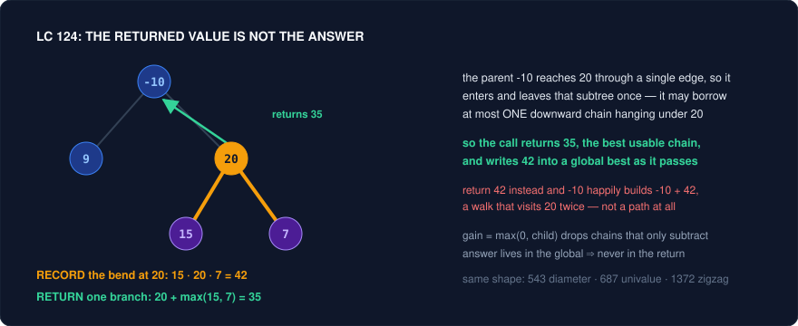

# Recursion Reframing — Designing the Contract, Not the Code

Tree recursion is the one family where the algorithm is never the obstacle. You know it is a DFS. You know it is postorder. You can type the null check and the two recursive calls before the interviewer finishes reading the prompt. And then you stall — not because you cannot write recursion, but because you cannot say what the recursive call is *for*. LC 124 Binary Tree Maximum Path Sum is the canonical humiliation: everyone writes `dfs(root->left)` immediately, and then discovers that whatever that call returns, it is either the wrong thing for the parent or the wrong thing for the answer, and there is no single number that is both.

That is a **contract failure**, not a code failure. A recursive function on a tree is a promise of the form *"given this node, I will return exactly X about the subtree rooted here, assuming you have already told me Y about the path above."* Once you can state X and Y in one sentence, the body writes itself in four lines and the base case is obvious. Until you can, you will thrash — adding parameters, adding globals, adding return values, none of which fix a specification you have not written down. The reframing move for this whole family is therefore the same: **stop writing the recursion and write its contract first.**

The six tricks below are the six contract shapes that cover nearly every tree and backtracking problem in an interview set. Return one thing while recording another when the answer's shape differs from what a parent can consume (Trick 1). Return a struct when the parent needs several facts at once (Trick 2). Decide deliberately whether each fact flows down as an argument or up as a return value (Trick 3). Return an enumerated *state* rather than a number when the parent must react differently to qualitatively different situations (Trick 4). Carry a mutable map down the path and undo it on the way back when you need to count path segments (Trick 5). And in backtracking, treat the deduplication rule as the actual content of the problem, because it is (Trick 6).

---

## Trick 1: Return one thing, record another

**The tell:** The optimal answer can *bend* through a node — it comes up one child, passes through the node, and goes down the other child — but a parent that wants to extend the answer can only attach through one edge. You try to return the bent value, and the parent immediately builds something illegal with it.

**The trick:** Split the two quantities. The function **returns** the best *single-branch* value (the best chain that starts at this node and goes strictly downward, which is the only thing a parent can legally extend), and separately **records** the best *bent* value into a global or captured variable before returning. The final answer is read out of the global, never out of the top-level return.

**Why it works:** A path in a tree enters a node from its parent edge and leaves through at most one child edge; it cannot enter and leave through two children, because that walk visits the node twice. So "best answer inside this subtree" and "best extendable chain from this node" are genuinely different quantities with different shapes, and no single return value can serve both. Returning the bend would let the parent glue its own edge onto a path that already uses both children — producing a shape that is not a path. The bend is nevertheless *complete* at that node: no ancestor can improve it, so the moment you compute it you can retire it into the global maximum and never think about it again. Every node is the highest point of exactly one candidate answer, so recording at every node considers every candidate exactly once.



**Template:**
```cpp
// LC 124 — returns the best DOWNWARD chain; records the best BEND
class Solution {
    int best = INT_MIN;                    // the actual answer lives here

    int gain(TreeNode* n) {                // CONTRACT: best sum of a chain
        if (!n) return 0;                  // that starts at n and goes down only
        int L = max(0, gain(n->left));     // a negative chain is worse than nothing
        int R = max(0, gain(n->right));
        best = max(best, n->val + L + R);  // RECORD: the bend, complete right here
        return n->val + max(L, R);         // RETURN: one branch, extendable by a parent
    }
public:
    int maxPathSum(TreeNode* root) { gain(root); return best; }
};
```

**Problems:**
| Problem | Difficulty | How the trick applies |
|---|---|---|
| 124. Binary Tree Maximum Path Sum | Hard | The flagship. Record `val + L + R`, return `val + max(L, R)`. The `max(0, ...)` clamp is the second half of the trick: an ancestor is never forced to take a negative chain, so pruning it is free. |
| 543. Diameter of Binary Tree | Easy | Identical skeleton with the values erased: return the **height**, record `heightL + heightR` (edge count) at each node. Solve this first — it is 124 with the arithmetic removed. |
| 687. Longest Univalue Path | Medium | Return the longest same-value chain going down, but only extend a child's chain when `child->val == n->val`; record `left + right` at the node. The equality guard is the only new idea. |
| 1372. Longest ZigZag Path in a Binary Tree | Medium | Return *two* numbers (best zigzag ending here going left, going right) and record the max of both. The zigzag rule couples them: going left extends the child's *right* value. Trick 1 crossed with Trick 2. |
| 1026. Maximum Difference Between Node and Ancestor | Medium | The information-flow variant: carry min and max of the ancestors **down**, record `max - min` at each node. Same "record, never return" discipline with the payload going the other way (see Trick 3). |
| 979. Distribute Coins in Binary Tree | Medium | Return the subtree's coin **surplus** (`coins - nodes`), record `abs(L) + abs(R)` as moves. The returned number and the accumulated answer are different units entirely, which is the tell in its purest form. |

**Pitfalls:**
- Returning `n->val + L + R`. This is the single most common tree bug in interviews and it silently produces wrong answers on trees where the best bend is not at the root. Say out loud which value is the return and which is the record before typing.
- Initialising `best = 0` on 124. Node values can be negative and a path must contain at least one node, so an all-negative tree must answer with the largest single value. Use `INT_MIN`.
- Forgetting the `max(0, ...)` clamp — or applying it to the *recorded* value. The clamp belongs on each child's contribution, before both the record and the return.
- Confusing nodes with edges on 543/687. Diameter is counted in **edges**, so the natural "height in nodes" return needs a `-1` somewhere; pick one convention and write it in the comment above the helper.

---

## Trick 2: Return a summary struct, not a number

**The tell:** The parent needs to know *several* things about each subtree — is it valid, how tall is it, what is its minimum, what is its sum — and your first draft calls a helper inside a helper (`isBalanced` calling `height`, `isValidBST` calling `getMax`). That nested call is the tell, and it is also the source of the accidental `O(n^2)`.

**The trick:** Define a small struct carrying every fact the parent needs, and return it from one postorder pass. Compute the parent's struct purely from its two children's structs — no re-descent, no helper inside the helper. Every node is visited exactly once and the pass is `O(n)`.

**Why it works:** Nested helpers recompute the same subtree facts once per ancestor, so a helper that is itself `O(n)` called at every node gives `O(n^2)` on a skewed tree (`O(n log n)` on a balanced one — which is why 110 written naively still passes the samples and dies on the deep test). Postorder is precisely the order in which every fact about both subtrees is already available, so any quantity that is a *function of the children's summaries* can be computed in constant time at the node. The design question is therefore never "how do I get this fact" but "what is the smallest set of facts closed under the parent's update rule" — add fields until the parent can compute its own struct without asking a subtree anything else. For BST problems that closure is `{isBST, min, max, sum, size}`, and the parent's rule is one line: this subtree is a BST when both children are BSTs and `left.max < val < right.min`.

**Template:**
```cpp
// LC 1373 — one postorder pass, every fact the parent needs in one struct
struct Info {
    bool isBST;
    int mn, mx;        // min and max value in this subtree
    int sum;           // sum of this subtree
};
int best = 0;

Info dfs(TreeNode* n) {
    if (!n) return {true, INT_MAX, INT_MIN, 0};   // identities: empty is a valid BST
    Info L = dfs(n->left), R = dfs(n->right);
    if (L.isBST && R.isBST && L.mx < n->val && n->val < R.mn) {
        int s = L.sum + n->val + R.sum;
        best = max(best, s);                       // Trick 1's record, layered on top
        return {true, min(L.mn, n->val), max(R.mx, n->val), s};
    }
    return {false, INT_MIN, INT_MAX, 0};           // fields below are never read again
}
```

```cpp
// LC 110 — the same idea with the struct collapsed into a sentinel return
int height(TreeNode* n) {                 // CONTRACT: height, or -1 if unbalanced below
    if (!n) return 0;
    int L = height(n->left);  if (L < 0) return -1;   // short-circuit, no second pass
    int R = height(n->right); if (R < 0) return -1;
    return abs(L - R) > 1 ? -1 : 1 + max(L, R);
}
bool isBalanced(TreeNode* root) { return height(root) >= 0; }
```

**Problems:**
| Problem | Difficulty | How the trick applies |
|---|---|---|
| 98. Validate Binary Search Tree | Medium | Two legal contracts: push the allowed `(lo, hi)` window **down** as arguments, or return `(isBST, min, max)` **up**. Both are `O(n)`; naming which one you are writing prevents the classic bug of comparing only against the immediate parent. |
| 110. Balanced Binary Tree | Easy | Returning height and validity together is the whole problem. The nested `height` inside `isBalanced` is `O(n log n)` at best and `O(n^2)` on a left chain; the `-1` sentinel makes it `O(n)`. |
| 1373. Maximum Sum BST in Binary Tree | Hard | Needs all five facts — validity, min, max, sum — plus Trick 1's global record. The clean statement of "what does a parent need from a child" for the entire BST family. |
| 333. Largest BST Subtree | Medium | Same struct with `size` instead of `sum`. Solve 333 first, then 1373 is a field rename. |
| 250. Count Univalue Subtrees | Medium | Return `(isUnivalue, value)`; a node is univalue when both children are and their values match its own. Increment a counter on success — Trick 1's record again. |
| 366. Find Leaves of Binary Tree | Medium | Return the node's height; the height *is* the removal round, so `buckets[h].push_back(val)` builds every answer layer in one pass instead of repeatedly stripping leaves. |
| 508. Most Frequent Subtree Sum | Medium | Return the subtree sum, tally frequencies in a hash map on the way up. The minimal case: one field, but stated as a contract. |
| 1080. Insufficient Nodes in Root to Leaf Paths | Medium | Combines both directions: the accumulated path sum flows down, the pruned subtree pointer flows up. Return `nullptr` to mean "I deleted myself" and the parent's update is one assignment. |

**Pitfalls:**
- Using `INT_MAX` / `INT_MIN` as the empty-subtree min/max and then comparing with `<=` against a node whose value is genuinely `INT_MAX`. Either use `long long` bounds, or return `(isBST, mn, mx)` where the parent checks emptiness explicitly.
- Returning garbage fields on the invalid branch and then reading them. Make invalidity *poisonous* — set `mn = INT_MIN, mx = INT_MAX` so any parent comparison fails — rather than relying on the parent to check the flag first.
- Writing `isValidBST` by comparing `node->val` only to its two children. It passes small tests and fails on `[5,1,7,null,null,4,8]`; the constraint is against the whole ancestor window, not the parent.
- Passing the struct by value in a hot recursion when it holds containers. Small POD structs are fine and are what you want here; if a field ever becomes a vector, return by reference into a preallocated table instead.

---

## Trick 3: Decide whether information flows down or up

**The tell:** You cannot decide whether a quantity should be a parameter or a return value, so you try both, get lost, and end up with a function that takes four arguments and returns a pair for no articulable reason.

**The trick:** Classify the quantity once. Facts about **the path from the root to here** — accumulated sum, the number so far, the max ancestor seen, the allowed BST window, the current depth — are **arguments flowing down**. Facts about **the subtree hanging below here** — height, sum, validity, "did I find the target" — are **return values flowing up**. Write the direction in a comment before you write the signature.

**Why it works:** Recursion has exactly two channels and they carry opposite time directions. Arguments are computed before the call, so they can only encode what is already known on the way in — that is the ancestry. Return values are computed after the call, so they can only encode what was discovered inside — that is the descendants. A fact placed in the wrong channel is not merely awkward, it is unavailable: you cannot return the root-to-node sum "upward" because siblings would corrupt it, and you cannot pass the subtree height "downward" because it does not exist yet. LC 236 is the sharp case, and it is sharp because both channels do work: nothing about the ancestry helps, so the entire contract is upward — *return the node itself if I am `p` or `q`, otherwise return whatever non-null my children returned.* The LCA is then simply the unique node where **two** non-null results meet, because that is the lowest node whose subtree contains both targets. No parent pointers, no path lists, no second pass.

**Template:**
```cpp
// DOWN: the path prefix is an argument. LC 129 — root-to-leaf numbers
int dfs(TreeNode* n, int cur) {                 // cur = number formed by ancestors
    if (!n) return 0;
    cur = cur * 10 + n->val;
    if (!n->left && !n->right) return cur;      // a leaf completes one number
    return dfs(n->left, cur) + dfs(n->right, cur);
}

// UP: the discovery is a return value. LC 236 — lowest common ancestor
TreeNode* lca(TreeNode* n, TreeNode* p, TreeNode* q) {
    if (!n || n == p || n == q) return n;        // found one, or fell off
    TreeNode* L = lca(n->left,  p, q);
    TreeNode* R = lca(n->right, p, q);
    if (L && R) return n;                        // the split point: both sides delivered
    return L ? L : R;                            // otherwise pass the single find upward
}
```

**Problems:**
| Problem | Difficulty | How the trick applies |
|---|---|---|
| 129. Sum Root to Leaf Numbers | Medium | Purely downward: `cur * 10 + val` is an argument, and leaves return it. Trying to build the number on the way up forces you to know the depth, which you do not have yet. |
| 1448. Count Good Nodes in Binary Tree | Medium | The max ancestor value flows **down**; the count of good nodes flows **up** (or into a global). One problem using both channels for different facts — the cleanest illustration in the set. |
| 236. Lowest Common Ancestor of a Binary Tree | Medium | Entirely upward. The answer is the node where two non-null child results meet; everything else forwards a single find. Six lines once the contract is stated, unsolvable while you are hunting for parent pointers. |
| 235. Lowest Common Ancestor of a BST | Medium | The BST ordering makes it downward instead: walk left when both targets are smaller, right when both are larger, stop when they split. Same problem, opposite channel, because the ordering supplies ancestry information. |
| 112. Path Sum | Easy | Subtract the value from the remaining target on the way **down**; return a bool up. Passing `target` down beats accumulating up because it makes the leaf test a single comparison. |
| 113. Path Sum II | Medium | Same descent plus a mutable `path` vector: `push_back` before recursing, `pop_back` after. The vector is downward state that must be **undone** — the backtracking discipline of Trick 5. |
| 1026. Maximum Difference Between Node and Ancestor | Medium | Min and max of ancestors flow down; the answer is recorded, not returned. Attempting it upward requires each node to know every descendant, which is a strictly bigger computation. |
| 863. All Nodes Distance K in Binary Tree | Medium | The honest signal that the channels are insufficient: distance can travel *upward* through a parent, which recursion has no channel for. Build a parent map first, then BFS — reframe to a graph rather than fighting the contract. |
| 111. Minimum Depth of Binary Tree | Easy | The trap that direction exposes: a node with one null child is not a leaf, so `min(L, R)` is wrong. Define "leaf" in the contract and the special case writes itself. |

**Pitfalls:**
- Accumulating downward state in a **global** without undoing it. If the state flows down it belongs in the parameter list; if it must be a shared container, every `push` needs a matching `pop` on the way out.
- Passing containers by value down a deep recursion. `vector<int> path` copied at every level is `O(n^2)` memory traffic; take it by reference and backtrack.
- On 236, checking whether `p` and `q` actually exist. The stated problem guarantees both are present — if a variant does not (1644), the short-circuit `return n` on match is wrong and you must search the full subtree and count matches.
- Writing the base case as `if (!n->left && !n->right)` before the null check. Order the guards: `!n` first, always.

---

## Trick 4: Return a three-state code, not a boolean

**The tell:** The parent must react *differently* to more than two situations below it. A child that is fine needs nothing; a child that is exposed demands action right now; a child that already acted changes what the parent itself needs. A `bool` cannot say which of those three happened.

**The trick:** Enumerate the states the parent must distinguish and return that code. For LC 968 the three are `0 = I am uncovered and need help`, `1 = I have a camera`, `2 = I am covered but have no camera`. Null returns `2` — an absent child never begs — and the parent places a camera exactly when some child returned `0`. For LC 337 the two states are "I was robbed" and "I was skipped", so return the **pair** of best values instead of recursing twice.

**Why it works:** A boolean forces you to merge two situations that call for different parent behaviour, and the merge is exactly where the recursion breaks. Collapse `has-camera` and `merely-covered` into "fine" and the parent can no longer tell whether it is itself watched; collapse `uncovered` and `covered` into "no camera" and the parent cannot tell whether it must act. Three states is the smallest alphabet closed under the parent's decision rule. The greedy on top is the second half: cameras go at the **parents of uncovered leaves**, never at leaves themselves, because a camera at a leaf covers two nodes while a camera at its parent covers three or more — the parent's position dominates, so no optimal solution is lost by always pushing the camera one level up. Postorder is what makes this greedy implementable: you learn a child is uncovered before you commit anything about the current node. For 337 the same principle appears as a pair — the `rob` and `skip` values must both be returned, because the parent's `skip` case needs the child's *better* value while its `rob` case needs the child's `skip` value specifically, and a single number cannot answer both without a second exponential descent.

**Template:**
```cpp
// LC 968 — 0 = needs cover, 1 = has camera, 2 = covered (no camera here)
class Solution {
    int cameras = 0;
    int dfs(TreeNode* n) {
        if (!n) return 2;                                  // null never demands a camera
        int L = dfs(n->left), R = dfs(n->right);
        if (L == 0 || R == 0) { cameras++; return 1; }     // a child is exposed: act NOW
        if (L == 1 || R == 1) return 2;                    // a child watches me
        return 0;                                          // both merely covered: I am not
    }
public:
    int minCameraCover(TreeNode* root) {
        int top = dfs(root);                               // sequence the side effect first
        return cameras + (top == 0);                       // the root may still be exposed
    }
};

// LC 337 — return {robbed, skipped} so the parent never recurses twice
pair<int,int> rob(TreeNode* n) {
    if (!n) return {0, 0};
    auto [lr, ls] = rob(n->left);
    auto [rr, rs] = rob(n->right);
    return { n->val + ls + rs,                   // rob n  => both children must be skipped
             max(lr, ls) + max(rr, rs) };        // skip n => each child takes its better
}
```

**Pitfalls:**
- Returning `2` for null on 968 by accident and calling it luck. State it: an empty child imposes no obligation, so it must be the state that triggers nothing. Return `0` there and every leaf's parent gets a needless camera.
- Forgetting the root. The recursion never gives the root a parent to rescue it, so `dfs(root) == 0` costs one more camera. Evaluate `dfs` into a variable first — reading `cameras` in the same expression as the call is unsequenced.
- Checking `L == 1 || R == 1` before `L == 0 || R == 0`. Order matters: an exposed child is an emergency and outranks being watched.
- On 337, writing `rob(n) = max(n->val + rob(gc)..., rob(child)...)` with four grandchild calls. It is exponential without memoisation; the pair return is the memoisation, structurally.

---

## Trick 5: Count paths through a node with a prefix map you undo

**The tell:** You are counting **downward path segments** (not root-to-leaf, not whole paths) that hit a target sum, and your first solution is "run a fresh descent from every node" — `O(n^2)`, and clearly re-walking the same edges.

**The trick:** Recognise that a downward segment is the difference of two root-prefix sums, exactly as in the subarray version on an array. Carry a hash map `count[prefixSum]` down the current root-to-node path; at each node, `cur += val` and add `count[cur - target]` to the answer; then register `count[cur]++` before recursing and `count[cur]--` after. The decrement is what keeps the map equal to *this path only*, never a sibling's.

**Why it works:** Any downward path ending at the current node starts at some ancestor `a`, and its sum is `prefix(node) - prefix(a)`. So the number of valid segments ending here is the number of ancestors whose prefix equals `cur - target` — a lookup, not a search. The map is a stack disguised as a hash table: it must contain exactly the ancestors on the current path, which is why the undo on the way back up is not an optimisation but a correctness requirement. Without it, a node in the left subtree would count "ancestors" that live in the right subtree and are not above it at all. The seed `count[0] = 1` accounts for segments that begin at the root itself, precisely as it does in LC 560.

**Template:**
```cpp
// LC 437 — O(n) with a prefix map that is pushed and popped along the path
class Solution {
    unordered_map<long long, int> cnt;      // prefix sums of ANCESTORS on this path only
    int total = 0, target;

    void dfs(TreeNode* n, long long cur) {
        if (!n) return;
        cur += n->val;
        auto it = cnt.find(cur - target);
        if (it != cnt.end()) total += it->second;   // every matching ancestor start

        cnt[cur]++;                                  // enter: I am now an ancestor
        dfs(n->left, cur);
        dfs(n->right, cur);
        cnt[cur]--;                                  // leave: undo, or siblings see me
    }
public:
    int pathSum(TreeNode* root, int t) {
        target = t;
        cnt[0] = 1;                                  // the empty prefix: paths from the root
        dfs(root, 0);
        return total;
    }
};
```

**Problems:**
| Problem | Difficulty | How the trick applies |
|---|---|---|
| 437. Path Sum III | Medium | The flagship. `O(n)` instead of `O(n^2)`, and the `cnt[cur]--` on the way out is the line interviewers watch for. Node values can be negative, so a sliding-window analogue does not exist — the map is required, not a shortcut. |
| 560. Subarray Sum Equals K | Medium | The same algorithm on a path of length `n`. Solve it first; 437 is 560 run on every root-to-node path simultaneously, with an undo. |
| 113. Path Sum II | Medium | The same enter/undo discipline on a `vector` instead of a map: `push_back` before, `pop_back` after. Shows the pattern is about *mutable downward state*, not about hash maps. |
| 1372. Longest ZigZag Path in a Binary Tree | Medium | Different payload, same channel: the length-so-far and the last turn direction ride down as arguments, so no undo is needed. Use it to see when the state can be a parameter instead of a shared container. |
| 129. Sum Root to Leaf Numbers | Medium | The degenerate case — the downward state is a single `int`, so it lives in the parameter list and the undo disappears for free. Prefer parameters whenever the state is small and copyable. |

**Pitfalls:**
- Omitting `cnt[0] = 1`. Every path that starts at the root is then missed, and the sample tests often do not catch it.
- Using `cnt[cur - target]` with `operator[]` on a lookup. That **inserts** a zero entry and quietly corrupts later counts; use `find`, or accept the insert and know why it is harmless in this particular ordering.
- Overflow. Sums along a long path with values up to `1e9` exceed `int`; make `cur` and the key `long long`.
- Undoing in the wrong place — after only one child, or before the recursion. The decrement belongs after **both** recursive calls, mirroring the increment before them.

---

## Trick 6: In backtracking, the deduplication rule is the problem

**The tell:** The input may contain duplicates and the output must not. Your clean solution produces `[1,2]` twice from `[1,2,2]`, and your instinct is to dump results into a `set` — which works, costs a `log` factor and a lot of hashing, and tells the interviewer you did not find the actual rule.

**The trick:** **Sort the array first.** Then, inside the loop at each level, skip a candidate when `i > start && nums[i] == nums[i-1]`. That single guard removes every duplicate branch at the source. For permutations, where every index is a candidate at every depth, the guard becomes `i > 0 && nums[i] == nums[i-1] && !used[i-1]`.

**Why it works:** Sorting makes equal values adjacent, so "have I already tried this value at this depth?" becomes "is the previous element equal to me?" — a `O(1)` question. The `i > start` guard is doing something precise: `i == start` is the **first** candidate considered at this depth, so it is always allowed; any later `i` with `nums[i] == nums[i-1]` is a *sibling* of a branch already explored from the same prefix, and a sibling with the same value generates literally the same set of completions. Note what the guard does **not** block: `nums[i] == nums[i-1]` where `i == start` means the previous equal element was consumed by the *parent* call, i.e. it is an ancestor, not a sibling — that is `[2,2]` in 90 Subsets II, which is a legitimate distinct answer. Duplicates across depth are fine; duplicates across breadth are not, and `i > start` is exactly the test that separates the two. For permutations the same logic reads through `used[]`: `!used[i-1]` means the identical earlier copy is not currently placed, so choosing this copy now would rebuild an arrangement already generated — canonically, equal values must be used left to right.

**Template:**
```cpp
// LC 90 / 40 — subsets and combinations with duplicates. Sort, then skip siblings.
void back(vector<int>& nums, int start, vector<int>& path, vector<vector<int>>& out) {
    out.push_back(path);                                  // 90: every node is an answer
    for (int i = start; i < nums.size(); i++) {
        if (i > start && nums[i] == nums[i - 1]) continue; // sibling duplicate: prune
        path.push_back(nums[i]);
        back(nums, i + 1, path, out);                     // i + 1: no reuse (39 uses i)
        path.pop_back();
    }
}
// caller: sort(nums.begin(), nums.end()); back(nums, 0, path, out);

// LC 47 — permutations with duplicates. Every index is a candidate, so guard via used[].
void perm(vector<int>& nums, vector<bool>& used, vector<int>& path, vector<vector<int>>& out) {
    if (path.size() == nums.size()) { out.push_back(path); return; }
    for (int i = 0; i < nums.size(); i++) {
        if (used[i]) continue;
        if (i > 0 && nums[i] == nums[i - 1] && !used[i - 1]) continue;  // use equals L->R
        used[i] = true;  path.push_back(nums[i]);
        perm(nums, used, path, out);
        path.pop_back(); used[i] = false;
    }
}
```

**Problems:**
| Problem | Difficulty | How the trick applies |
|---|---|---|
| 78. Subsets | Medium | The base skeleton with no dedup: record at every node, recurse with `i + 1`. Write it until it is muscle memory, because every problem below is this plus one guard. |
| 90. Subsets II | Medium | 78 plus `sort` plus `i > start && nums[i] == nums[i-1]`. The problem *is* the guard — be ready to explain why `[2,2]` survives it while the second `[2]` does not. |
| 46. Permutations | Medium | Every unused index is a candidate; a `used[]` array replaces `start`. The change of loop bound is the structural difference between permutations and combinations. |
| 47. Permutations II | Medium | Adds `!used[i-1]`, which enforces "equal values are consumed left to right" and is the single canonical representative of each multiset arrangement. |
| 39. Combination Sum | Medium | Reuse allowed, so recurse with `i` rather than `i + 1`; `start` alone prevents permutations of the same multiset. No duplicates in the input, so no guard. |
| 40. Combination Sum II | Medium | Each number used once (`i + 1`) *and* duplicates present (the guard). The problem that forces you to hold both dials in your head at the same time. |
| 131. Palindrome Partitioning | Medium | The candidate at each depth is a *prefix* rather than an element; `start` is a string index and the filter is a palindrome check. Same skeleton, different candidate generator. |
| 216. Combination Sum III | Medium | Fixed size `k` and a fixed pool `1..9`, so the pruning is on the bound (`sum > n`) rather than on duplicates. Good practice at separating pruning from dedup. |
| 22. Generate Parentheses | Medium | No array at all: the candidates are `(` and `)` and the guards are counts. Proof that the skeleton is "choose, recurse, undo", independent of the data. |
| 17. Letter Combinations of a Phone Number | Medium | Fixed depth, per-digit candidate set, no dedup. The warm-up shape. |
| 79. Word Search | Medium | Backtracking on a grid: mutate the cell to a sentinel before recursing and restore it after. The `pop_back` from the templates, wearing a different costume. |
| 51. N-Queens | Hard | The undo applies to three sets (column, both diagonals). Once the state is a set of constraints instead of a path, the dedup question disappears and pruning takes over. |

**Pitfalls:**
- Forgetting to sort. Every dedup guard above assumes adjacency of equal values; without the sort the guard silently prunes nothing and lets duplicates through.
- Writing `i > 0` instead of `i > start` in the combinations family. That also kills the legal `[2,2]` because it cannot distinguish an ancestor from a sibling.
- Using a `set<vector<int>>` to deduplicate. It gives the right answer and forfeits the point of the question; if you genuinely cannot recall the guard, say so and derive it, rather than hiding it.
- Mismatching `i` and `i + 1` in the recursive call. `i` means "this element may repeat" (39), `i + 1` means "consumed" (40, 90). One character, two entirely different problems.
- Forgetting to undo. `pop_back`, `used[i] = false`, and grid restoration must each mirror their entry exactly, and every one of them must sit *after* the recursive call, not inside a conditional.

---

## Family Cheat Sheet

| Trick | Tell | Move |
|---|---|---|
| 1. Return one thing, record another | The answer can bend through a node using both children, but a parent can only attach through one edge | Return the best single downward chain; write the bend into a global before returning; read the answer out of the global |
| 2. Return a summary struct | The parent needs several facts per subtree, and your draft calls a helper inside a helper (`O(n^2)`) | One postorder pass returning `{valid, min, max, sum, height}`; the parent computes its struct from the children's, never re-descends |
| 3. Decide down vs up | You cannot tell whether a quantity is a parameter or a return value | Ancestry facts (prefix sum, allowed window, max seen) go **down** as arguments; subtree facts (height, validity, "found it") come **up** as returns |
| 4. Three-state return | The parent must react differently to three situations; a `bool` merges two of them | Return an enum code (`needs-cover` / `has-camera` / `covered`) or a pair (`robbed`, `skipped`); place cameras at parents of uncovered leaves |
| 5. Prefix map with an undo | Counting downward path segments summing to a target; the naive fix re-descends from every node | Carry `count[prefixSum]` down the path, add `count[cur - target]`, seed `count[0] = 1`, and decrement after **both** recursive calls |
| 6. The dedup rule is the trick | Input has duplicates, output must not; you reach for a `set` of results | Sort, then `if (i > start && nums[i] == nums[i-1]) continue;` — the `i > start` guard keeps ancestors and kills siblings; permutations use `!used[i-1]` |
