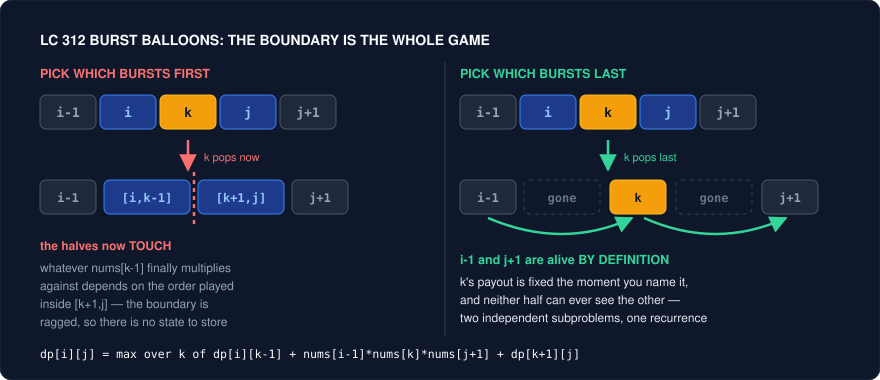
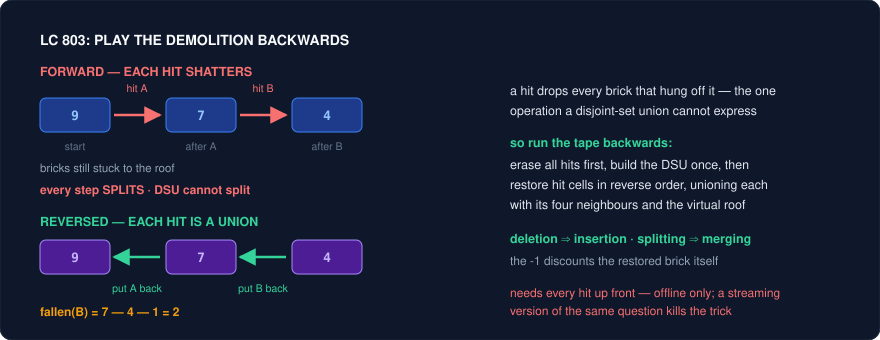

# Reversal — Running the Problem Backwards

Knowing the pattern is not the same as solving the problem. You can identify LC 312 Burst Balloons as interval DP inside ten seconds, sit down to write `dp[i][j]`, and discover that no transition you try produces a well-defined subproblem. The pattern was never the missing piece. The missing piece was a **reframing move**: asking which balloon bursts *last* instead of first. That single inversion turns an entangled mess into a textbook interval DP, and nothing about "knowing interval DP" hands it to you.

This folder catalogues those moves. This file covers the most productive one: **reversal** — running the problem backwards in time, backwards in scan order, backwards along edges, or backwards from the target. The reason reversal pays so well is that most problems are *stated* in the direction the world happens to run, and that direction is usually the hard one. Forward, your choices branch and the consequences of each choice reshape everything downstream. Backward, the same process is frequently deterministic, or its boundaries are fixed, or an operation your data structure cannot perform becomes the one it was built for. The information content is identical; the *conditioning* is not.

Concretely, reversal buys you one of four things, and the four tricks below are exactly those four. It fixes **boundaries** that were ragged (Trick 1). It converts an **unknown future into a known past** (Trick 2). It converts "who reaches me" into "what do I reach" (Trick 3). It converts **deletions into insertions**, which is the difference between impossible and trivial for union-find (Trick 4). And it collapses a branching forward search into a forced backward walk (Trick 5). When a problem feels one step too hard and you cannot name why, "what does this look like backwards?" is the highest-expected-value question in your toolkit — it costs thirty seconds and it is the intended solution surprisingly often.

---

## Trick 1: Ask which operation happens LAST, not first

**The tell:** Removing or combining an element changes what its *neighbours* are, so the "remaining" problem is no longer a clean subarray. You reach for `dp[i][j]`, try to split on the first move, and find you cannot say what the pieces are worth without knowing what happened outside them.

**The trick:** Enumerate the operation that happens **last** in the range, not first. Everything else in `(i, j)` is already gone when the last one fires, so its context is exactly the two elements just outside the interval — which are still standing, by definition of "this interval is what got consumed". Split the range around that last operation and recurse on the two sides, which are now provably independent.

**Why it works:** Choosing the first move fixes the *inside* and leaves the *outside* unknown; choosing the last move fixes the *outside* and leaves the inside as two smaller instances of the same question. In LC 312, if `k` bursts first, the two survivors `[i, k-1]` and `[k+1, j]` become adjacent, so the value of bursting `k-1` later depends on the order you play inside `[k+1, j]` — the halves are coupled and there is no state that captures the coupling. If `k` bursts **last**, then by the time `k` pops, every balloon in `[i, j]` except `k` has already gone, so `k`'s neighbours are `nums[i-1]` and `nums[j+1]` — outside the interval, therefore untouched, therefore known constants. `k` scores `nums[i-1] * nums[k] * nums[j+1]`, and the two halves are solved in the same "boundaries `i-1` and `k`" / "boundaries `k` and `j+1`" frame without ever interacting:

$$dp[i][j] = \max_{i \le k \le j}\big(dp[i][k-1] + nums[i-1]\cdot nums[k]\cdot nums[j+1] + dp[k+1][j]\big)$$



The general statement: **enumerate the choice that makes the subproblems independent.** "Last" is the usual answer because the last operation is the one that sees the original boundary conditions rather than mutated ones. On trees the same move wears a different hat — for LC 96/95 you pick the **root**, which is the node "removed last" when you dismantle the BST, and the left and right subtrees decouple for exactly the same reason.

**Template:**
```cpp
// LC 312 — pad with sentinel 1s so nums[i-1] and nums[j+1] always exist
int maxCoins(vector<int>& a) {
    int n = a.size();
    vector<int> v(n + 2, 1);
    for (int i = 0; i < n; i++) v[i + 1] = a[i];

    // dp[i][j] = best coins from bursting ALL of the open interval (i, j)
    vector<vector<int>> dp(n + 2, vector<int>(n + 2, 0));

    for (int len = 1; len <= n; len++)            // length of the closed range
        for (int i = 1; i + len - 1 <= n; i++) {
            int j = i + len - 1;
            for (int k = i; k <= j; k++)          // k bursts LAST in [i, j]
                dp[i][j] = max(dp[i][j],
                               dp[i][k - 1] + v[i - 1] * v[k] * v[j + 1] + dp[k + 1][j]);
        }
    return dp[1][n];
}
```

<details>
<summary>Java</summary>

```java
// LC 312 — pad with sentinel 1s so nums[i-1] and nums[j+1] always exist
int maxCoins(int[] a) {
    int n = a.length;
    int[] v = new int[n + 2];
    Arrays.fill(v, 1);
    for (int i = 0; i < n; i++) v[i + 1] = a[i];

    // dp[i][j] = best coins from bursting ALL of the open interval (i, j)
    int[][] dp = new int[n + 2][n + 2];

    for (int len = 1; len <= n; len++)            // length of the closed range
        for (int i = 1; i + len - 1 <= n; i++) {
            int j = i + len - 1;
            for (int k = i; k <= j; k++)          // k bursts LAST in [i, j]
                dp[i][j] = Math.max(dp[i][j],
                                    dp[i][k - 1] + v[i - 1] * v[k] * v[j + 1] + dp[k + 1][j]);
        }
    return dp[1][n];
}
```

</details>

**Problems:**
| Problem | Difficulty | How the trick applies |
|---|---|---|
| 312. Burst Balloons | Hard | The flagship. `k` bursts last, so it multiplies against `v[i-1]` and `v[j+1]`, which survive by construction. Pad with sentinel `1`s; the padding *is* the trick made concrete. |
| 1039. Minimum Score Triangulation of Polygon | Medium | Same skeleton, gentler: fix edge `(i, j)` and enumerate the apex `k` — the triangle removed **last** from the fan. `dp[i][j] = min(dp[i][k] + v[i]*v[k]*v[j] + dp[k][j])`. Solve this before 312 if 312 refuses to click. |
| 1547. Minimum Cost to Cut a Stick | Hard | Enumerate which cut in `(i, j)` is made **last**: its cost is the *whole* current segment `cuts[j] - cuts[i]`, a constant, precisely because no other cut inside has happened yet. Pick "first" and the cost of every later cut depends on unresolved order. |
| 1000. Minimum Cost to Merge Stones | Hard | The last merge fuses `k` piles into one, so you carry a third dimension: `dp[i][j][p]` = cost to reduce `[i, j]` to `p` piles. Split on where the final group's boundary falls; feasibility needs `(n - 1) % (k - 1) == 0`. |
| 546. Remove Boxes | Hard | The hard cousin: the state needs `dp[i][j][cnt]` (`cnt` boxes equal to `box[i]` glued to the left). The move is "decide what `box[i]` is removed *with*" — same idea, that later merge is committed to first so the pieces between it become an independent subproblem. |
| 96. Unique Binary Search Trees | Medium | Choose the root — the node dismantled last — and the counts multiply: `G[n] = sum G[k-1]*G[n-k]`. Independence of subtrees is the identical argument. |
| 95. Unique Binary Search Trees II | Medium | The constructive version: for each root, recurse on `[lo, root-1]` and `[root+1, hi]` and take the cross product. Same split, now materialised. |

**Pitfalls:**
- Writing `dp[i][j]` as "best for the closed range with the ends already gone" but then indexing `v[i-1]`/`v[j+1]` on the *unpadded* array. Pad first, index in 1-based, and the `i-1`/`j+1` reads can never fall off.
- Iterating `i` and `j` directly instead of by increasing **length**. The recurrence reads shorter intervals, so length must be the outer loop (or write it top-down with memoisation and stop thinking about order).
- Believing "last" is a magic word. It is shorthand for *"the choice under which the pieces stop interacting."* If enumerating the last move still leaves the halves coupled (546), the state is under-specified — add the dimension that carries the coupling rather than abandoning the frame.
- Off-by-one between open and closed interval conventions. Pick one, write it in a comment above the `dp` declaration, and never re-derive it mid-problem.

---

## Trick 2: Scan from the right

**The tell:** The answer at index `i` is defined in terms of elements *after* `i` — "the next greater", "how much water sits above this bar", "the product of everything except me", "can this character still appear later". A left-to-right pass keeps asking about a future it has not read yet.

**The trick:** Iterate `i` from `n-1` down to `0`. Everything to the right is already processed, so the "future" is now a maintained aggregate — a suffix max, a suffix count, a stack of candidates — and each answer is O(1) or amortised O(1). When both directions matter, run two passes and combine.

**Why it works:** A scan can only cheaply summarise what it has already seen. The direction of the scan therefore has to match the direction the dependencies point: dependencies pointing right demand a right-to-left pass, and the transformation is nothing more than relabelling "unknown future" as "known past". Monotonic stacks make this explicit — a right-to-left stack holds exactly the elements that are still viable next-greater candidates, and everything popped is dominated forever because a nearer, larger element shadows it. The same reasoning explains why some problems need *both* passes: LC 42's water level at `i` is `min(prefixMax[i], suffixMax[i])`, which is two one-directional scans because the constraint genuinely comes from both sides. If a right-to-left pass alone feels insufficient, the question to ask is not "wrong direction?" but "how many directions does the constraint have?"

**Template:**
```cpp
// Right-to-left monotonic stack: index of the next strictly greater element
vector<int> nextGreater(const vector<int>& a) {
    int n = a.size();
    vector<int> res(n, -1);
    stack<int> st;                       // indices, values strictly decreasing bottom->top
    for (int i = n - 1; i >= 0; i--) {
        while (!st.empty() && a[st.top()] <= a[i]) st.pop();   // shadowed forever
        if (!st.empty()) res[i] = st.top();
        st.push(i);
    }
    return res;
}

// Suffix aggregate: the "future" as one running number
vector<int> sufMax(n + 1, INT_MIN);
for (int i = n - 1; i >= 0; i--) sufMax[i] = max(sufMax[i + 1], a[i]);
```

<details>
<summary>Java</summary>

```java
// Right-to-left monotonic stack: index of the next strictly greater element
int[] nextGreater(int[] a) {
    int n = a.length;
    int[] res = new int[n];
    Arrays.fill(res, -1);
    Deque<Integer> st = new ArrayDeque<>();   // indices, values strictly decreasing bottom->top
    for (int i = n - 1; i >= 0; i--) {
        while (!st.isEmpty() && a[st.peek()] <= a[i]) st.pop();   // shadowed forever
        if (!st.isEmpty()) res[i] = st.peek();
        st.push(i);
    }
    return res;
}

// Suffix aggregate: the "future" as one running number
int[] sufMax = new int[n + 1];
Arrays.fill(sufMax, Integer.MIN_VALUE);
for (int i = n - 1; i >= 0; i--) sufMax[i] = Math.max(sufMax[i + 1], a[i]);
```

</details>

**Problems:**
| Problem | Difficulty | How the trick applies |
|---|---|---|
| 739. Daily Temperatures | Medium | Textbook. Sweep right to left with a decreasing stack; a day cooler than a nearer warmer day can never be anyone's answer, so popping is free. |
| 496. Next Greater Element I | Easy | Build the next-greater map on `nums2` with one right-to-left pass, then look up. The starter problem — write it from memory before attempting 503. |
| 503. Next Greater Element II | Medium | Circular: iterate `i` from `2n-1` down to `0` using `a[i % n]`, recording answers only on the second lap. Reversal plus the standard "double the array" wrap. |
| 42. Trapping Rain Water | Hard | `water[i] = min(prefixMax[i], sufMax[i]) - a[i]`. The suffix-max pass is the trick; the two-pointer O(1)-space version is the same insight with the weaker side advanced. |
| 238. Product of Array Except Self | Medium | Prefix products left to right, then a single running suffix product right to left folded into the output. The cleanest demonstration that a backward scan replaces an extra array. |
| 84. Largest Rectangle in Histogram | Hard | Each bar's rectangle spans to the next-smaller bar on each side — one pass per direction. Framing it as "two directional scans" is far easier to reconstruct under pressure than memorising the one-pass variant. |
| 316. Remove Duplicate Letters | Medium | Needs "does this letter appear again later?", i.e. suffix counts (or last-occurrence indices) — precompute backwards, then run the greedy stack forwards. Reversal supplies the lookahead the greedy needs. |
| 1081. Smallest Subsequence of Distinct Characters | Medium | Identical problem to 316; solve once, recognise twice. |
| 2454. Next Greater Element IV | Hard | The *second* greater element: an element promoted off the first stack onto a second one. Same right-to-left machinery, one extra tier — good evidence that the direction generalises where ad-hoc tricks do not. |

**Pitfalls:**
- `<=` versus `<` in the pop condition decides whether equal elements count as "greater". Read the statement; 739 and the strict variants disagree.
- Storing values on the stack instead of indices. You almost always need the distance (`res[i] = st.top() - i`), and recovering an index from a value is impossible with duplicates.
- Forgetting that leftover stack entries mean "no such element" — initialise the result array to `-1`/`0` up front rather than draining the stack afterwards.
- Reversing the array physically and forgetting to un-reverse the answers. Iterate the index backwards instead; it is one character of difference and zero bugs.

---

## Trick 3: Reverse the edges

**The tell:** The question is phrased *into* a node rather than out of it — "which nodes can reach the target", "the distance from every node to node `k`", "how many edges must point toward the capital", "which nodes are safe, where safety is defined by where you end up".

**The trick:** Build the transpose graph `G^T` (for every edge `u -> v`, store `v -> u`) and run the ordinary out-going algorithm on it. "Who reaches X" in `G` is "what X reaches" in `G^T`; "shortest path from all sources to one target" is "shortest path from one source to all targets" in `G^T`, which is a single Dijkstra or BFS instead of `n` of them.

**Why it works:** Every traversal you own — BFS, DFS, Dijkstra, Kahn's topological sort — is written to expand *outward* from a source along out-edges. A question about in-edges is not a different algorithm; it is the same algorithm applied to a different adjacency list, and transposing costs one O(V + E) pass. The payoff is asymptotic, not cosmetic: all-sources-to-one-target run forward is `n` separate searches, `O(n(E log V))`; transposed it is one, `O(E log V)`. LC 802 shows the second flavour, where reversal fixes a *dependency direction* rather than a cost: a node is safe when all its successors are safe, which is a condition on out-neighbours and therefore not something Kahn's algorithm — which peels nodes with in-degree zero — can consume directly. Reverse the edges and "safe" becomes "reachable only from terminals", so peeling out-degree-zero nodes in `G` is peeling in-degree-zero nodes in `G^T`, and the standard queue works untouched.

**Template:**
```cpp
// LC 802 — reverse graph + Kahn peeling from the terminal nodes
vector<int> eventualSafeNodes(vector<vector<int>>& g) {
    int n = g.size();
    vector<vector<int>> rev(n);
    vector<int> outdeg(n, 0);
    for (int u = 0; u < n; u++)
        for (int v : g[u]) { rev[v].push_back(u); outdeg[u]++; }

    queue<int> q;                                  // terminals: out-degree 0
    for (int u = 0; u < n; u++) if (!outdeg[u]) q.push(u);

    vector<char> safe(n, 0);
    while (!q.empty()) {
        int v = q.front(); q.pop();
        safe[v] = 1;
        for (int u : rev[v])                       // walk edges backwards
            if (--outdeg[u] == 0) q.push(u);       // all of u's exits are safe
    }
    vector<int> res;
    for (int u = 0; u < n; u++) if (safe[u]) res.push_back(u);
    return res;                                    // already sorted
}
```

<details>
<summary>Java</summary>

```java
// LC 802 — reverse graph + Kahn peeling from the terminal nodes
List<Integer> eventualSafeNodes(int[][] g) {
    int n = g.length;
    List<List<Integer>> rev = new ArrayList<>();
    for (int i = 0; i < n; i++) rev.add(new ArrayList<>());
    int[] outdeg = new int[n];
    for (int u = 0; u < n; u++)
        for (int v : g[u]) { rev.get(v).add(u); outdeg[u]++; }

    Deque<Integer> q = new ArrayDeque<>();          // terminals: out-degree 0
    for (int u = 0; u < n; u++) if (outdeg[u] == 0) q.add(u);

    boolean[] safe = new boolean[n];
    while (!q.isEmpty()) {
        int v = q.poll();
        safe[v] = true;
        for (int u : rev.get(v))                    // walk edges backwards
            if (--outdeg[u] == 0) q.add(u);         // all of u's exits are safe
    }
    List<Integer> res = new ArrayList<>();
    for (int u = 0; u < n; u++) if (safe[u]) res.add(u);
    return res;                                     // already sorted
}
```

</details>

**Problems:**
| Problem | Difficulty | How the trick applies |
|---|---|---|
| 802. Find Eventual Safe States | Medium | "All paths lead to a terminal" is an out-edge condition; reverse the graph and it becomes Kahn's in-degree peeling from terminals. The alternative is three-colour DFS cycle detection — know both, but the reversal is shorter and harder to get wrong. |
| 743. Network Delay Time | Medium | As stated it is one-source-to-all, so run Dijkstra directly. The reversal matters for the flipped ask, "minimum time for a signal to reach node `k` from every node" — transpose and run one Dijkstra from `k` instead of `n` from everywhere. |
| 1466. Reorder Routes to Make All Paths Lead to the City Zero | Medium | Store each edge twice, marked as forward or backward, then traverse outward from `0` on the undirected graph and count edges pointing away from the root. You are travelling opposite to the question's direction, and the tag does the accounting. |
| 1557. Minimum Number of Vertices to Reach All Nodes | Medium | "Which nodes can reach everything" collapses to "nodes with in-degree zero" — the reversal is so complete that the traversal disappears and only the in-degree count survives. |

**Pitfalls:**
- Transposing the edges but forgetting to transpose the *degrees* you peel on. In `G^T`, out-degree in `G` is what you decrement; mixing them silently returns an empty or complete answer.
- Reversing an undirected graph. There is nothing to reverse — for problems like 1466 the graph is undirected for traversal and directed only for scoring, so keep an orientation flag on each stored edge rather than building a second list.
- Assuming the reversal preserves edge weights' meaning. It does for shortest paths (path cost is a sum, order-independent), but *not* for anything with asymmetric costs, per-node tolls, or time-dependent edges. Check that the cost model commutes before flipping.
- Building the transpose with `unordered_map<int, vector<int>>` when the nodes are `0..n-1`. Use a `vector<vector<int>>`; the constant factor is not a rounding error at `V, E ~ 1e5`.

---

## Trick 4: Reverse time — replay deletions as insertions

**The tell:** The process is destructive and offline: bricks get hit, cells get flooded, edges get removed, and you are asked for connectivity or component size *after each step*. All operations are given up front as an array.

**The trick:** Apply every removal first to get the final, most-broken state. Build a union-find on that. Then walk the operation list from the last to the first, re-inserting each removed element and unioning it with its live neighbours. The answer for step `t` in the forward timeline is read off the change in structure caused by re-inserting operation `t`.

**Why it works:** Union-find is a one-way data structure. `union` is O(α(n)); *split* has no efficient counterpart, because path compression and union-by-rank destroy exactly the history a split would need. So a forward pass over deletions asks the DSU to do the one thing it cannot, and people respond by rebuilding connectivity from scratch per step — `O(q · n)` and too slow. Reverse the timeline and every deletion becomes an insertion, which is a union, which is what the structure was designed for. The whole problem collapses to `O((n + q) α(n))`. The price is that you must know all the operations in advance, since you have to fast-forward to the final state before you can start — this is the definition of an **offline** algorithm, and "all queries are given as an array" in the statement is the licence to use one.



**Template:**
```cpp
// Reverse-time DSU skeleton (LC 803 shape)
// 1. apply ALL removals to the grid
// 2. union everything still standing (plus a virtual node for the "anchor")
// 3. undo removals backwards; each undo is a union
vector<int> hitBricks(vector<vector<int>>& grid, vector<vector<int>>& hits) {
    int rows = grid.size(), cols = grid[0].size(), roof = rows * cols;
    DSU dsu(roof + 1);                        // one virtual node anchoring row 0
    for (auto& h : hits)
        if (grid[h[0]][h[1]] == 1) grid[h[0]][h[1]] = 2;   // mark, don't erase

    connectAllOnes(grid, dsu);                // full-state union pass, roof included

    vector<int> res(hits.size(), 0);
    for (int t = (int)hits.size() - 1; t >= 0; t--) {      // BACKWARDS
        int r = hits[t][0], c = hits[t][1];
        if (grid[r][c] != 2) continue;                     // no brick was there
        int before = dsu.size(dsu.find(roof));
        grid[r][c] = 1;                                    // put it back
        unionWithLiveNeighbours(r, c, dsu);                // and with roof if r == 0
        int after = dsu.size(dsu.find(roof));
        res[t] = max(0, after - before - 1);               // -1: the brick itself
    }
    return res;
}
```

<details>
<summary>Java</summary>

```java
// Reverse-time DSU skeleton (LC 803 shape)
// 1. apply ALL removals to the grid
// 2. union everything still standing (plus a virtual node for the "anchor")
// 3. undo removals backwards; each undo is a union
int[] hitBricks(int[][] grid, int[][] hits) {
    int rows = grid.length, cols = grid[0].length, roof = rows * cols;
    DSU dsu = new DSU(roof + 1);              // one virtual node anchoring row 0
    for (int[] h : hits)
        if (grid[h[0]][h[1]] == 1) grid[h[0]][h[1]] = 2;   // mark, don't erase

    // no C++ '&' needed: arrays and DSU are objects, so the helpers mutate the same instances
    connectAllOnes(grid, dsu);                // full-state union pass, roof included

    int[] res = new int[hits.length];
    for (int t = hits.length - 1; t >= 0; t--) {           // BACKWARDS
        int r = hits[t][0], c = hits[t][1];
        if (grid[r][c] != 2) continue;                     // no brick was there
        int before = dsu.size(dsu.find(roof));
        grid[r][c] = 1;                                    // put it back
        unionWithLiveNeighbours(r, c, dsu);                // and with roof if r == 0
        int after = dsu.size(dsu.find(roof));
        res[t] = Math.max(0, after - before - 1);          // -1: the brick itself
    }
    return res;
}
```

</details>

**Problems:**
| Problem | Difficulty | How the trick applies |
|---|---|---|
| 803. Bricks Falling When Hit | Hard | The canonical instance. A virtual "roof" node anchors row 0; re-adding a brick grows the roof component by the fallen count plus one, so `after - before - 1` is the answer, clamped at 0 for bricks that were never attached. |
| 305. Number of Islands II | Hard | The already-forward twin: positions arrive as insertions, so run it as given. Include it because it teaches the union-with-four-neighbours core that the reversed problems reuse verbatim. |
| 1970. Last Day Where You Can Still Cross | Hard | Cells flood forward; reversed, they dry out and become unions. Add two virtual nodes (top edge, bottom edge) and report the last day *before* those two nodes joined. Binary search + BFS also passes — the DSU version is one pass and states the invariant more cleanly. |
| 2382. Maximum Segment Sum After Removals | Hard | Array elements are deleted one by one; reversed, each is re-inserted and merged with a live left/right neighbour, and the running maximum segment sum only ever increases. Then reverse the answer array. The purest form of the trick — no grid, no geometry. |
| 1562. Find Latest Group of Size M | Medium | Bits are set forward, which is already insert-only; the value here is contrast — recognising when you *do not* need to reverse is the same skill applied in the negative. |

**Pitfalls:**
- Forgetting that a hit may target a cell that was already empty (or hit twice). Mark rather than erase during the fast-forward, and skip un-marked cells on the way back — this is the single most common wrong answer on 803.
- Reading the size *before* the union but computing `find(roof)` after. Take both readings against the current root, and re-`find` after every union; the root moves.
- Off-by-one on the self-count. The restored element joins the anchored component too, so subtract it — and clamp to `0` for the case where it never attached at all.
- Attempting this online. If operations arrive one at a time with answers required immediately, reverse-time is unavailable and you need link-cut trees or a rollback DSU with an offline divide-and-conquer over time.
- Union-by-size with path compression must be intact, and `size[]` must be maintained on the root only. Half-implemented DSUs turn an O(α) algorithm into O(n) per query and time out on exactly the tests that matter.

---

## Trick 5: Work backwards from the target

**The tell:** From the start state the legal moves branch (each state has several successors), but the target is a single specific value; or the operations are `*2`, `+1`, `x + y`-style, where forward growth explodes and backward steps are divisions or subtractions that are only legal one way.

**The trick:** Start at the target and invert every operation. Frequently only one inverse move is legal at each step — parity decides, or divisibility does — so a search with branching factor `k` forward becomes a deterministic walk backward. Stop when you hit the start (or overshoot it, which then has a closed-form remainder).

**Why it works:** Invertibility is not symmetric. Forward, `x -> 2x` and `x -> x - 1` are both always available, so a BFS explores exponentially. Backward, `y -> y/2` requires `y` to be even and `y -> y + 1` is the only alternative — so from an even `y` the halving is *strictly better* (it is the only way to shrink fast, and adding 1 to an even number just wastes a step before you must halve anyway), and from an odd `y` you have no choice at all. The branching factor is 1 and the search becomes a greedy loop. The same asymmetry drives LC 780: forward, `(x, y) -> (x+y, y)` or `(x, y+x)` branches; backward, since coordinates are positive, the larger coordinate *must* have been the one just formed, so the predecessor is forced — and the repeated subtraction is the Euclidean algorithm, which you then accelerate with `%`. Whenever the backward step is forced, backwards is not just easier, it is a different complexity class.

**Template:**
```cpp
// LC 991 — forward: x*2 or x-1. Backward from target: /2 (if even) or +1.
int brokenCalc(int startValue, int target) {
    int ops = 0;
    while (target > startValue) {
        if (target % 2 == 0) target /= 2;   // forced-good: the only fast shrink
        else target += 1;                   // forced: odd cannot have been a double
        ops++;
    }
    return ops + (startValue - target);     // only -1 remains, applied blindly
}
```

<details>
<summary>Java</summary>

```java
// LC 991 — forward: x*2 or x-1. Backward from target: /2 (if even) or +1.
int brokenCalc(int startValue, int target) {
    int ops = 0;
    while (target > startValue) {
        if (target % 2 == 0) target /= 2;   // forced-good: the only fast shrink
        else target += 1;                   // forced: odd cannot have been a double
        ops++;
    }
    return ops + (startValue - target);     // only -1 remains, applied blindly
}
```

</details>

**Problems:**
| Problem | Difficulty | How the trick applies |
|---|---|---|
| 991. Broken Calculator | Medium | Forward `*2`/`-1` branches without bound; backward, parity forces every move. The exchange argument fits in one sentence, which is why interviewers like it. |
| 780. Reaching Points | Hard | Backwards, the larger of `(tx, ty)` must be the freshly summed one, so the predecessor is unique. Replace the loop of subtractions with `tx %= ty` to survive the `1e9` bounds, and handle the final row/column with a divisibility check. |
| 650. 2 Keys Keyboard | Medium | Reaching `n` characters backwards means undoing the last paste block, which factors `n`; the answer is the sum of `n`'s prime factors. Working forward invites a DP that hides a cleaner fact. |
| 1104. Path In Zigzag Labelled Binary Tree | Medium | Walk from the label up to the root — parent index is `label/2` mirrored within its level — then reverse the collected path. Going downward from the root means searching; going upward is arithmetic. |

**Pitfalls:**
- Failing to handle `target <= startValue`. Once you are at or below the start only `-1` (or the analogous shrinking op) exists, so the remainder is a plain subtraction — bolt it on after the loop, not inside it.
- Repeated subtraction where a modulo is required. 780 with `tx -= ty` is `O(max)` and times out; `tx %= ty` is Euclid and is `O(log)`. Then guard `ty == 0` and the axis base cases separately.
- Assuming the backward move is forced when it is not. Verify it: if two inverse moves are legal from the same state, you are back to a search and reversal has only bought you a smaller frontier, not determinism.
- Integer overflow going forward "to check". Backward steps shrink, which is another quiet reason the direction is safer.

---

## Family Cheat Sheet

| Trick | Tell | Move |
|---|---|---|
| 1. Ask which happens LAST | Removing an element changes its neighbours; splitting on the first move leaves ragged boundaries | Enumerate the last operation in `(i, j)`; its context is `nums[i-1]`/`nums[j+1]`, which are alive by definition, and the halves decouple |
| 2. Scan from the right | Answer at `i` depends on elements after `i` — next greater, suffix max, "appears later" | Iterate `n-1` down to `0` with a suffix aggregate or a monotonic stack; run two passes when the constraint is two-sided |
| 3. Reverse the edges | Question points *into* a node: "who reaches X", "distance to `k`", "safe = all exits are safe" | Build `G^T` in one O(V+E) pass and run the ordinary outward BFS / Dijkstra / Kahn on it |
| 4. Reverse time | Offline destructive process — hits, floods, deletions — asking for connectivity after each step | Apply all removals, build the DSU, then undo backwards; each undo is a union and the answer is the size delta |
| 5. Work backwards from the target | Forward moves branch; backward moves are forced by parity, divisibility, or ordering | Invert the operations and walk from target to start; branching factor 1 turns search into a greedy loop |
