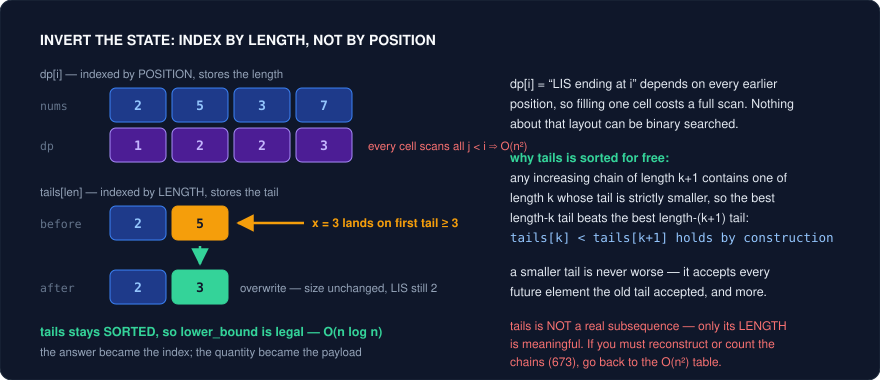
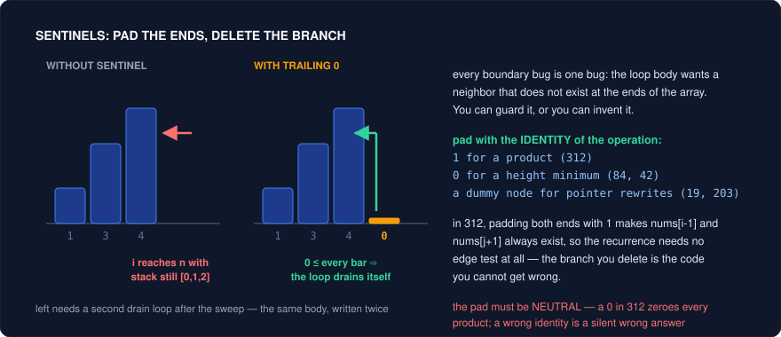

# State Design — When You Know It's DP and You're Still Stuck (C++)

You have already done the hard classification: the problem has overlapping subproblems, the choices interact, and greedy dies to a counterexample. So it's DP. And you are still staring at a blank editor, because **the recurrence is the easy part — choosing the state is the whole game.** Once the state is right, the transition usually writes itself in three lines; once the state is wrong, no amount of cleverness in the transition rescues it. LC 312 Burst Balloons is the canonical humiliation: knowing "this is interval DP" buys you nothing, because the obvious state (`dp[i][j]` = best score bursting the balloons in `[i, j]` **first**) is not well-defined — the score of a burst depends on neighbors that are still alive outside the interval. The unlock is not a pattern; it's a state-design move (burst `k` **last**, so its neighbors are exactly the interval's untouched borders).

That move, and the six others in this file, are the reframings that convert "I know the family" into "I can write the code." They are not about recognizing DP. They are about answering the one question that comes after: **what does a subproblem mean?** A state is a *sufficient summary of the past* — everything a future decision needs to know, and nothing more. Too little in the state and the transition is ill-defined (312). Too much and you blow the memory budget. Every trick below is either "add the thing the future needs" (Tricks 3, 6) or "throw away the thing it doesn't" (Tricks 1, 5, 7) or "make the boundary stop existing" (Trick 2).

The fastest way to find the right state is to stop staring at the array and read the constraints. **Constraint bounds are the setter telling you which state to pick.** `n <= 20` is not a small-input convenience, it is an instruction to enumerate subsets. `n <= 40` is not "slightly bigger", it is meet-in-the-middle in bold type. An `n` of 500 with a Hard tag is `O(n^3)`, which in DP means two range endpoints and a split. Read the bound first, derive the state shape from the budget, *then* think about the recurrence.

| Constraint | Time budget it implies | Intended state shape |
|---|---|---|
| `n <= 20` (sometimes 22) | `2^n` up to ~4e6, times `n` | Bitmask the set: `dp[mask]` or `dp[mask][last]` |
| `n <= 40` | `2^(n/2)` ~ 1e6 per half | Meet in the middle: enumerate both halves, sort/binary-search to join |
| `n <= 500` | `n^3` ~ 1.25e8 | Interval DP: `dp[i][j]` plus an enumerated split point `k` |
| `n <= 2000..5000` | `n^2` | Two indices (`dp[i][j]`), or one index with an inner scan |
| `n <= 1e5` | `n log n` | One-dimensional state; if that's still too big, make the *answer* the index (Trick 1) |
| `digits <= 18`, value up to `1e18` | length of the number | Digit DP: `dp[pos][...][tight][started]` |

---

## Trick 1: Swap the state and the value

**The tell:** The natural quantity you want to key on is unbounded or too large to index — a value up to `1e9`, a sum, a running total — but the *answer* is small (bounded by `n`) and monotone in a useful direction. Equivalently: your `dp[i]` is `O(n)` cells but each cell costs an `O(n)` scan, and the scan is looking for a *maximum over a prefix that satisfies an inequality*.

**The trick:** Flip the roles. Make the answer the index and the quantity the payload. LIS's textbook state is `dp[i] = length of the LIS ending at i`, filled by scanning every `j < i` — `O(n^2)`. Invert it into `tails[len] = the smallest possible tail of an increasing subsequence of length len + 1`. Now the array is indexed by *length* (at most `n` entries, and usually far fewer), and each new element is placed with a single `lower_bound`, giving `O(n log n)`.

**Why it works:** `tails` is sorted automatically, and that is the entire justification for binary searching it. Any increasing subsequence of length `k+1` contains an increasing subsequence of length `k` (drop its last element) whose tail is strictly smaller; therefore the *best* (smallest) length-`k` tail is no larger than the best length-`(k+1)` tail, so `tails[k] < tails[k+1]` holds by construction — you never sort it, it cannot be unsorted. The update is equally forced: a smaller tail is never worse, because it accepts every future element the old tail accepted and strictly more. So when `x` arrives you find the first tail that is **not smaller than** `x` and overwrite it — that length is now achievable with a better ending — and if no such tail exists, `x` extends the longest chain and you `push_back`. The array's contents are not a real subsequence at any moment; only its **size** is meaningful, and the size is exactly the LIS length.



**Template:**
```cpp
// tails[k] = smallest tail of an increasing subsequence of length k+1
int lengthOfLIS(vector<int>& nums) {
    vector<int> tails;
    for (int x : nums) {
        auto it = lower_bound(tails.begin(), tails.end(), x); // first tail >= x
        if (it == tails.end()) tails.push_back(x);            // x extends the longest chain
        else *it = x;                                         // x is a better tail for that length
    }
    return (int)tails.size();   // the SIZE is the answer; the contents are not a real subsequence
}
// strictly increasing -> lower_bound   |   non-decreasing -> upper_bound
```

<details>
<summary>Java</summary>

```java
// tails[k] = smallest tail of an increasing subsequence of length k+1
int lengthOfLIS(int[] nums) {
    int[] tails = new int[nums.length];
    int size = 0;                                             // logical length of tails
    for (int x : nums) {
        // Arrays.binarySearch has no lower_bound semantics: it returns an *arbitrary*
        // matching index when the key is present, and only gives an insertion point when
        // it is absent. We need "first index >= x" in both cases, so hand-roll it.
        int lo = 0, hi = size;
        while (lo < hi) {
            int mid = (lo + hi) >>> 1;
            if (tails[mid] < x) lo = mid + 1;                 // first tail >= x
            else hi = mid;
        }
        if (lo == size) tails[size++] = x;                    // x extends the longest chain
        else tails[lo] = x;                                   // x is a better tail for that length
    }
    return size;   // the SIZE is the answer; the contents are not a real subsequence
}
// strictly increasing -> tails[mid] < x   |   non-decreasing -> tails[mid] <= x
```

</details>

**Problems:**
| Problem | Difficulty | How the trick applies |
|---|---|---|
| 300. Longest Increasing Subsequence | Medium | The base case. Write both forms; the `O(n^2)` table is the one you must still be able to produce on demand, because the follow-ups need it. |
| 354. Russian Doll Envelopes | Hard | Two dimensions collapsed to one: sort width ascending, **height descending within equal widths** (so equal widths can never nest), then run LIS on heights. The descending tie-break is the whole problem — it encodes the strict inequality that LIS alone can't see. |
| 1671. Minimum Number of Removals to Make Mountain Array | Hard | Run the `tails` LIS left-to-right and right-to-left, take `lis[i] + lds[i] - 1` over indices where both sides have length `>= 2`, answer `n - best`. Two inverted-state passes glued at a peak. |
| 673. Number of Longest Increasing Subsequence | Medium | The boundary post: **counting** chains needs per-position information that `tails` has thrown away. Go back to `dp[i]` plus a parallel `cnt[i]`, `O(n^2)`. Knowing when the trick is illegal is worth as much as the trick. |

**Pitfalls:**
- Reconstructing the actual subsequence from `tails` — its contents are stale. If you need the sequence, keep a parallel array of predecessor indices and the length assigned to each position, then walk backwards.
- `lower_bound` vs `upper_bound`: strictly increasing needs `lower_bound` (an equal element replaces, never extends); non-decreasing needs `upper_bound`. Getting this backwards is an off-by-one on the whole answer.
- 354 with ascending height tie-break silently counts two same-width envelopes as nestable.
- Assuming the inverted form generalizes. It works because "smaller tail dominates" is a total order on the payload. If the transition has a second constraint (counts, sums, a second dimension you couldn't sort away), the domination argument fails and you owe the `O(n^2)` table.

---

## Trick 2: Pad with sentinels

**The tell:** Your state is right and your recurrence is right, and the code is a minefield of `if (i > 0)` and `if (j < n - 1)` and a second loop after the main loop that repeats the body. Or: the transition wants `arr[i-1]` / `arr[j+1]` / `node->prev`, and those don't exist at the ends.

**The trick:** Invent the missing neighbor. Add a fake element at each end whose value is the **identity** of the operation the loop performs, and the special cases stop existing — not "get handled", stop existing. In 312 you pad `nums` with `1` on both sides so that `nums[i-1] * nums[k] * nums[j+1]` is always in range. In 84 you append a `0` so the final sweep pops the whole stack without a duplicated drain loop. In linked-list rewrites you allocate a dummy head so deleting the first node is the same code as deleting any other node.

**Why it works:** Boundary bugs are not many different bugs, they are one bug wearing different hats: **the loop body assumes a neighbor and the array's edge violates that assumption.** You have exactly two options — test for the edge on every iteration, or make the edge unreachable. A sentinel is the second option, and it is strictly better because the branch you delete is the code you cannot get wrong. The requirement is that the padded value be *neutral* for the operation: `1` for a product, `0` for a height when the loop pops on "shorter than", `INT_MAX` for a running minimum, a dummy node for a pointer rewrite. Neutral means the sentinel participates in the transition without changing any answer it participates in. Get the identity wrong and the padding doesn't crash — it silently corrupts every result (a `0` pad in 312 zeroes every product; a tall bar in 84 never flushes the stack).



**Template:**
```cpp
// 312 Burst Balloons: pad with 1s so nums[i-1] and nums[j+1] always exist
int maxCoins(vector<int>& a) {
    int n = a.size();
    vector<int> v(n + 2, 1);
    for (int i = 0; i < n; i++) v[i + 1] = a[i];         // v[0] and v[n+1] are the sentinels

    vector<vector<int>> dp(n + 2, vector<int>(n + 2, 0));
    for (int len = 1; len <= n; len++)
        for (int i = 1; i + len - 1 <= n; i++) {
            int j = i + len - 1;
            for (int k = i; k <= j; k++)                 // k is burst LAST in [i, j]
                dp[i][j] = max(dp[i][j],
                               dp[i][k-1] + v[i-1]*v[k]*v[j+1] + dp[k+1][j]);
        }                                                 // no bounds check anywhere
    return dp[1][n];
}

// 84 Largest Rectangle: a trailing 0 flushes the stack inside the same loop
int largestRectangleArea(vector<int> h) {
    h.push_back(0);                       // sentinel: shorter than every real bar
    stack<int> st;
    int best = 0;
    for (int i = 0; i < (int)h.size(); i++) {
        while (!st.empty() && h[st.top()] >= h[i]) {
            int ht = h[st.top()]; st.pop();
            int left = st.empty() ? -1 : st.top();
            best = max(best, ht * (i - left - 1));
        }
        st.push(i);
    }
    return best;                          // no post-loop drain: the 0 already did it
}
```

<details>
<summary>Java</summary>

```java
// 312 Burst Balloons: pad with 1s so v[i-1] and v[j+1] always exist
int maxCoins(int[] a) {
    int n = a.length;
    int[] v = new int[n + 2];
    Arrays.fill(v, 1);
    for (int i = 0; i < n; i++) v[i + 1] = a[i];        // v[0] and v[n+1] are the sentinels

    int[][] dp = new int[n + 2][n + 2];
    for (int len = 1; len <= n; len++)
        for (int i = 1; i + len - 1 <= n; i++) {
            int j = i + len - 1;
            for (int k = i; k <= j; k++)                // k is burst LAST in [i, j]
                dp[i][j] = Math.max(dp[i][j],
                                    dp[i][k-1] + v[i-1]*v[k]*v[j+1] + dp[k+1][j]);
        }                                               // no bounds check anywhere
    return dp[1][n];
}

// 84 Largest Rectangle: a trailing 0 flushes the stack inside the same loop
int largestRectangleArea(int[] heights) {
    int n = heights.length;
    int[] h = Arrays.copyOf(heights, n + 1);  // Java arrays are fixed-size, so copy to "push_back"
    h[n] = 0;                                 // sentinel: shorter than every real bar
    Deque<Integer> st = new ArrayDeque<>();
    int best = 0;
    for (int i = 0; i < h.length; i++) {
        while (!st.isEmpty() && h[st.peek()] >= h[i]) {
            int ht = h[st.pop()];
            int left = st.isEmpty() ? -1 : st.peek();
            best = Math.max(best, ht * (i - left - 1));
        }
        st.push(i);
    }
    return best;                              // no post-loop drain: the 0 already did it
}
```

</details>

**Problems:**
| Problem | Difficulty | How the trick applies |
|---|---|---|
| 312. Burst Balloons | Hard | `1` on both ends. Combined with the last-burst framing (Trick 4), the recurrence becomes branch-free — this is the problem the whole file exists for. |
| 84. Largest Rectangle in Histogram | Hard | Trailing `0`. Some write a leading `0` too so `st.top()` after popping is always valid instead of the `st.empty() ? -1` ternary — two sentinels, zero conditionals. |
| 42. Trapping Rain Water | Medium | The stack solution takes the same trailing-bar treatment; the two-pointer solution instead uses `leftMax`/`rightMax` initialized to `0`, which is the same identity trick spelled as a variable rather than an array cell. |
| 19. Remove Nth Node From End of List | Medium | Dummy head. Removing the head node is the case everyone forgets; with a dummy it is not a case. |
| 203. Remove Linked List Elements | Easy | Dummy head. Leading nodes that match the target are the trap; the dummy makes the first deletion structurally identical to the last. |
| 206. Reverse Linked List | Easy | `prev = nullptr` is a sentinel: it is the identity for "the list built so far", which is why the new tail's `next` is correct without a special case. |
| 2. Add Two Numbers | Medium | Dummy head to avoid a "is this the first digit" branch; the `carry` variable surviving past both lists is the same idea in scalar form. |

**Pitfalls:**
- Forgetting the index shift. After padding, real element `i` lives at `i + 1`, and your answer is `dp[1][n]`, not `dp[0][n-1]`. Half of all sentinel bugs are this.
- Padding with a non-identity value. `0` for a product, `INT_MIN` for a maximum you then compare with `<=` — both compile and both lie.
- Sentinels in the *output*: if you pad a vector you must not return it, and if you pad a list with a dummy you must return `dummy->next`, never `dummy`.
- `>=` vs `>` in the pop condition of 84 with equal heights — the sentinel doesn't fix that, and equal bars are the standard test case.

---

## Trick 3: Put the unfinished commitment in the state

**The tell:** You try to write the transition and you cannot score the current decision, because its value depends on something that has not happened yet — you bought a stock but haven't sold it, you started a transaction but haven't closed it, you took a node so the child's option is now constrained. Symptom: your recurrence needs to "look ahead", or your `dp[i]` disagrees with itself depending on how you got to `i`.

**The trick:** Whatever is open, put it in the state. A single index is not a sufficient summary of the past when there is an outstanding obligation; add one dimension per open commitment. For stock problems that is `dp[i][k][holding]` — day, transactions used, and whether you are currently holding a share. For 337 it is a two-element return per node: the best when you take this node and the best when you don't. The added dimension is almost always tiny (a boolean, or `k <= 100`), which is why this is cheap.

**Why it works:** DP is only correct when the state is a **sufficient statistic** — two different histories that land in the same state must be interchangeable for all future decisions. "Day `i`, profit `p`" is not sufficient: one history is holding a share and the other isn't, and their futures differ. Adding `holding` restores sufficiency, and the recurrence becomes local again — `hold[i][k] = max(hold[i-1][k], free[i-1][k] - price[i])`, `free[i][k] = max(free[i-1][k], hold[i-1][k] + price[i])` — with the transaction counter incremented at exactly one of the two edges (pick buy or sell, consistently, and say which). This is also why the cooldown and fee variants are trivial once you see it: a cooldown is "the state must remember that yesterday was a sale", which is one more boolean (or one more array), and a fee is not a state change at all, just a constant subtracted on the closing edge. And in trees, "take this node" is an unfinished commitment aimed *downward*: the parent's decision constrains the child, so each node returns both worlds and the parent picks.

**Template:**
```cpp
// 188: dp over (transactions used, holding?) — rolled to O(k) space
int maxProfit(int k, vector<int>& prices) {
    int n = prices.size();
    if (n == 0 || k == 0) return 0;
    if (k >= n / 2) {                                  // unlimited: the counter stops binding
        int p = 0;
        for (int i = 1; i < n; i++) p += max(0, prices[i] - prices[i-1]);
        return p;
    }
    vector<int> hold(k + 1, INT_MIN / 2), freeC(k + 1, 0);
    for (int price : prices)
        for (int t = 1; t <= k; t++) {
            hold[t]  = max(hold[t],  freeC[t-1] - price);  // BUY consumes a transaction
            freeC[t] = max(freeC[t], hold[t] + price);     // sell closes it
        }
    return freeC[k];
}

// 337: each node returns { best if this node is NOT taken, best if it IS }
pair<int,int> dfs(TreeNode* r) {
    if (!r) return {0, 0};
    auto [ls, lt] = dfs(r->left);
    auto [rs, rt] = dfs(r->right);
    int notTake = max(ls, lt) + max(rs, rt);   // children are free to choose
    int take    = r->val + ls + rs;            // children must be skipped
    return {notTake, take};
}
```

<details>
<summary>Java</summary>

```java
// 188: dp over (transactions used, holding?) — rolled to O(k) space
int maxProfit(int k, int[] prices) {
    int n = prices.length;
    if (n == 0 || k == 0) return 0;
    if (k >= n / 2) {                                  // unlimited: the counter stops binding
        int p = 0;
        for (int i = 1; i < n; i++) p += Math.max(0, prices[i] - prices[i-1]);
        return p;
    }
    int[] hold = new int[k + 1], freeC = new int[k + 1];
    Arrays.fill(hold, Integer.MIN_VALUE / 2);          // freeC stays all-zero, as in C++
    for (int price : prices)
        for (int t = 1; t <= k; t++) {
            hold[t]  = Math.max(hold[t],  freeC[t-1] - price);  // BUY consumes a transaction
            freeC[t] = Math.max(freeC[t], hold[t] + price);     // sell closes it
        }
    return freeC[k];
}

// 337: each node returns { best if this node is NOT taken, best if it IS }
// Java has no std::pair / structured bindings, so return an int[]{notTake, take}
int[] dfs(TreeNode r) {
    if (r == null) return new int[]{0, 0};
    int[] l = dfs(r.left);                     // l[0] = ls, l[1] = lt
    int[] rt = dfs(r.right);                   // rt[0] = rs, rt[1] = rt-taken
    int notTake = Math.max(l[0], l[1]) + Math.max(rt[0], rt[1]);  // children are free to choose
    int take    = r.val + l[0] + rt[0];                           // children must be skipped
    return new int[]{notTake, take};
}
```

</details>

**Problems:**
| Problem | Difficulty | How the trick applies |
|---|---|---|
| 123. Best Time to Buy and Sell Stock III | Hard | `k = 2` hard-coded: four rolling variables (`buy1, sell1, buy2, sell2`). Write it as the general `k` loop first, then unroll — the unrolled version is unreadable if you didn't derive it. |
| 188. Best Time to Buy and Sell Stock IV | Hard | The general form. The `k >= n/2` short-circuit matters: without it the table is `O(nk)` with `k` up to `1e9` in some variants. |
| 309. Best Time to Buy and Sell Stock with Cooldown | Medium | The open commitment is "I sold yesterday". Three states — `hold`, `sold`, `rest` — and the only edge into `hold` comes from `rest`, never from `sold`. |
| 714. Best Time to Buy and Sell Stock with Transaction Fee | Medium | Same two states as unlimited trading, with the fee subtracted on exactly one edge. Charging it on both buy and sell is the standard double-count bug. |
| 337. House Robber III | Medium | The commitment points down the tree. Returning a pair beats memoizing on `(node, parentTaken)` — same information, no hash map. |

**Pitfalls:**
- Ordering inside the inner loop. In the rolled 188 above, `hold[t]` is updated before `freeC[t]` deliberately (a same-day buy-then-sell nets zero and is harmless); if you roll the day dimension carelessly in a problem where same-day round trips are *not* harmless, you get a phantom transaction.
- Initializing `hold` to `INT_MIN` and then adding a price — overflow. Use `INT_MIN / 2` or `long long`.
- Counting a transaction on both the buy and the sell edge, halving `k`.
- In 309, allowing `rest -> hold` and `sold -> hold` in the same line. The cooldown is precisely the missing edge.

---

## Trick 4: Make the state a range and enumerate the split

**The tell:** The problem deletes, merges, or matches elements, and doing so makes previously non-adjacent elements adjacent — so a state built on prefixes is meaningless, because "what's left" is not a prefix. `n` is small (typically `<= 100..500`), which is the setter budgeting for `O(n^3)`.

**The trick:** The state is a contiguous range, `dp[i][j]` = the best you can do on the subarray `[i, j]` **in isolation**. The transition enumerates a split point `k` inside the range, so the shape is three nested loops: length, left endpoint, split — `O(n^2)` states times `O(n)` transitions = `O(n^3)`. Iterate by increasing length (or memoize top-down), because `dp[i][j]` always depends on strictly shorter ranges.

**Why it works:** Range states are self-contained only if the range's answer doesn't depend on what's outside it — and that is precisely what the **last-operation framing** buys you (see [reversal-and-time.md](reversal-and-time.md) for the general move: if you can't reason forward from the first operation, reason backward from the last). In 312, "which balloon do I burst *first* in `[i, j]`" leaks: the first burst's score depends on neighbors that may be outside the range. "Which balloon `k` do I burst *last*" does not leak: by the time `k` pops, everything strictly inside `[i, j]` is gone, so its neighbors are exactly `i-1` and `j+1`, which are fixed borders of the subproblem. The split point becomes well-defined and the two sides `[i, k-1]` and `[k+1, j]` become genuinely independent. That is the whole trick and it recurs everywhere: in 1039 the split is the last triangle formed (fixed by the chord `i..j`), in 1000 it's the last merge, in 375 it's the number you guess first (which splits the range into two independent games and you pay the *worse* one, because the adversary answers). Whenever `dp[i][j]` seems to depend on the outside, you picked the wrong operation to condition on — flip to last.

**Template:**
```cpp
// The interval-DP skeleton: length -> left endpoint -> split point
for (int len = 2; len <= n; len++)
    for (int i = 0; i + len - 1 < n; i++) {
        int j = i + len - 1;
        for (int k = i; k < j; k++)                          // k = the split / last operation
            dp[i][j] = min(dp[i][j], dp[i][k] + dp[k+1][j] + cost(i, k, j));
    }
return dp[0][n-1];

// 516 Longest Palindromic Subsequence: a range DP whose transition needs no split
int longestPalindromeSubseq(string s) {
    int n = s.size();
    vector<vector<int>> dp(n, vector<int>(n, 0));
    for (int i = n - 1; i >= 0; i--) {          // i descending => dp[i+1][*] is ready
        dp[i][i] = 1;
        for (int j = i + 1; j < n; j++)
            dp[i][j] = (s[i] == s[j]) ? dp[i+1][j-1] + 2
                                      : max(dp[i+1][j], dp[i][j-1]);
    }
    return dp[0][n-1];
}
```

<details>
<summary>Java</summary>

```java
// The interval-DP skeleton: length -> left endpoint -> split point
for (int len = 2; len <= n; len++)
    for (int i = 0; i + len - 1 < n; i++) {
        int j = i + len - 1;
        for (int k = i; k < j; k++)                          // k = the split / last operation
            dp[i][j] = Math.min(dp[i][j], dp[i][k] + dp[k+1][j] + cost(i, k, j));
    }
return dp[0][n-1];

// 516 Longest Palindromic Subsequence: a range DP whose transition needs no split
int longestPalindromeSubseq(String s) {
    int n = s.length();
    int[][] dp = new int[n][n];
    for (int i = n - 1; i >= 0; i--) {          // i descending => dp[i+1][*] is ready
        dp[i][i] = 1;
        for (int j = i + 1; j < n; j++)
            dp[i][j] = (s.charAt(i) == s.charAt(j)) ? dp[i+1][j-1] + 2
                                                    : Math.max(dp[i+1][j], dp[i][j-1]);
    }
    return dp[0][n-1];
}
```

</details>

**Problems:**
| Problem | Difficulty | How the trick applies |
|---|---|---|
| 516. Longest Palindromic Subsequence | Medium | The gentlest range DP: the ends match or one of them is dropped, so there is no split loop — `O(n^2)`. Use it to lock the *iteration order* (descending `i`, ascending `j`) before adding a third loop. |
| 1039. Minimum Score Triangulation of Polygon | Medium | The purest split: fix the chord `(i, j)`, enumerate the apex `k` between them, pay `v[i]*v[k]*v[j]` plus both sub-polygons. Structurally the same recurrence as 312 with a different cost. |
| 312. Burst Balloons | Hard | Split = the balloon burst **last**, so its neighbors are the fixed borders `i-1` and `j+1`. Pair with Trick 2's padding and the code has no branches. |
| 1000. Minimum Cost to Merge Stones | Hard | The split is the last merge, but the state needs a third dimension (`dp[i][j][piles]` = cost to reduce `[i, j]` to `piles` piles) and the split must step by `k - 1`. Feasibility check first: `(n - 1) % (K - 1) != 0` is impossible. |
| 375. Guess Number Higher or Lower II | Medium | Minimax on a range: `dp[i][j] = min over k of (k + max(dp[i][k-1], dp[k+1][j]))`. The `max` is the adversary — using `min` there is the classic misread of "guarantee a win". |

**Pitfalls:**
- Iterating `i` and `j` in the naive ascending order, so `dp[i+1][j-1]` is read before it's written. Either loop by length, or loop `i` descending and `j` ascending, or memoize.
- Splitting on the *first* operation. If `dp[i][j]` needs to know about elements outside `[i, j]`, this is the bug — flip to last.
- Off-by-one on the split range: `k < j` vs `k <= j` differ between "split between two halves" (312 uses `k` in `[i, j]` as the last element; the merge form uses `k` in `[i, j)`), and both spellings appear in this family.
- `O(n^3)` with `n = 500` is ~1.25e8 — fine in C++ with a flat `vector<int>`, not fine with a `map` memo.

---

## Trick 5: Bitmask the set when n is around 20

**The tell:** The state you actually need is "which elements have I already used", the order matters or the elements are not interchangeable, and the constraints say `n <= 20` (occasionally 22, or 12-15 when there's an extra factor). That bound is not incidental — `2^20 = 1,048,576` is comfortable and `2^25` is not, so the setter chose it to tell you the state is a subset.

**The trick:** Encode the used set as an `int` bitmask and index the table by it. If order matters only through the most recent element, the state is `dp[mask][last]` — `2^n * n` cells, `n` transitions each. Iterate masks in increasing order for a forward DP (a mask always transitions to a strictly larger mask), or run BFS over `(mask, node)` when you want fewest steps rather than least cost.

**Why it works:** Subset DP is just memoized brute force with the *permutation* collapsed into a *set*. Naively there are `n!` orders; but for most of these problems the only thing the future cares about is which elements remain plus, at most, where you currently are — the order in which you consumed the used set is irrelevant. That collapse takes `n! = 2.4e18` down to `2^n * n = 2e7` for `n = 20`, and recognizing the bound in the constraints is genuinely the whole trick: everything after it is mechanical. The two shapes are worth naming. `dp[mask]` alone works when the elements are interchangeable given the set (1434: assign hats one at a time, mask = people already covered). `dp[mask][last]` is needed when the cost of adding an element depends on the previous one — 943's overlap between adjacent strings, 847's graph adjacency — which is the travelling-salesman shape. And 847 is a BFS, not a table, precisely because all edges cost 1 and you may **revisit** nodes: the state space `(mask, node)` is finite even though the walk isn't simple, which is why unbounded revisiting doesn't blow up.

**Template:**
```cpp
// dp[mask][last] — TSP shape: mask = set already used, last = element ending the arrangement
vector<vector<int>> dp(1 << n, vector<int>(n, INF));
for (int i = 0; i < n; i++) dp[1 << i][i] = start(i);

for (int mask = 1; mask < (1 << n); mask++)
    for (int last = 0; last < n; last++) {
        if (!(mask >> last & 1) || dp[mask][last] == INF) continue;
        for (int nxt = 0; nxt < n; nxt++) {
            if (mask >> nxt & 1) continue;                   // already used
            int nm = mask | (1 << nxt);
            dp[nm][nxt] = min(dp[nm][nxt], dp[mask][last] + cost(last, nxt));
        }
    }

// 847: BFS over (mask, node) — revisits allowed, so a plain visited-by-node set is wrong
int shortestPathLength(vector<vector<int>>& g) {
    int n = g.size(), full = (1 << n) - 1;
    queue<pair<int,int>> q;                                   // {node, mask}
    vector<vector<char>> seen(n, vector<char>(1 << n, 0));
    for (int i = 0; i < n; i++) { q.push({i, 1 << i}); seen[i][1 << i] = 1; }
    for (int steps = 0; ; steps++)
        for (int sz = q.size(); sz--; ) {
            auto [u, mask] = q.front(); q.pop();
            if (mask == full) return steps;
            for (int v : g[u]) {
                int nm = mask | (1 << v);
                if (seen[v][nm]) continue;
                seen[v][nm] = 1;
                q.push({v, nm});
            }
        }
}
```

<details>
<summary>Java</summary>

```java
// dp[mask][last] — TSP shape: mask = set already used, last = element ending the arrangement
int[][] dp = new int[1 << n][n];
for (int[] row : dp) Arrays.fill(row, INF);              // Java's memset equivalent
for (int i = 0; i < n; i++) dp[1 << i][i] = start(i);

for (int mask = 1; mask < (1 << n); mask++)
    for (int last = 0; last < n; last++) {
        if ((mask >> last & 1) == 0 || dp[mask][last] == INF) continue;
        for (int nxt = 0; nxt < n; nxt++) {
            if ((mask >> nxt & 1) != 0) continue;        // already used
            int nm = mask | (1 << nxt);
            dp[nm][nxt] = Math.min(dp[nm][nxt], dp[mask][last] + cost(last, nxt));
        }
    }
// __builtin_popcount(mask) -> Integer.bitCount(mask), e.g. when the position being filled
// is derivable from the mask (LC 526)

// 847: BFS over (mask, node) — revisits allowed, so a plain visited-by-node set is wrong
int shortestPathLength(int[][] g) {
    int n = g.length, full = (1 << n) - 1;
    Deque<int[]> q = new ArrayDeque<>();                      // {node, mask}
    boolean[][] seen = new boolean[n][1 << n];
    for (int i = 0; i < n; i++) { q.add(new int[]{i, 1 << i}); seen[i][1 << i] = true; }
    for (int steps = 0; ; steps++)
        for (int sz = q.size(); sz-- > 0; ) {
            int[] cur = q.poll();
            int u = cur[0], mask = cur[1];
            if (mask == full) return steps;
            for (int v : g[u]) {
                int nm = mask | (1 << v);
                if (seen[v][nm]) continue;
                seen[v][nm] = true;
                q.add(new int[]{v, nm});
            }
        }
}
```

</details>

**Problems:**
| Problem | Difficulty | How the trick applies |
|---|---|---|
| 847. Shortest Path Visiting All Nodes | Hard | `n <= 12`. BFS on `(node, mask)` with multi-source start. Revisiting nodes is legal and necessary — the mask, not the node, is what must not repeat. |
| 943. Find the Shortest Superstring | Hard | `n <= 12`. Precompute pairwise overlap, then exactly the `dp[mask][last]` template, plus a parent table to reconstruct the string. The reconstruction is half the work; write the parent array as you fill, not after. |
| 526. Beautiful Arrangement | Medium | `n <= 15`. `dp[mask]` where `popcount(mask)` *is* the position being filled — you don't need a second dimension because the position is derivable from the mask. That derivation is the elegant part. |
| 698. Partition to K Equal Sum Subsets | Medium | `n <= 16`. `dp[mask]` = the running remainder of the current bucket given the used set; a mask is feasible iff you can extend it. Sort descending and prune early — pure backtracking TLEs on adversarial inputs. |
| 1434. Number of Ways to Wear Different Hats to Each Other | Hard | The inversion that makes it fit: there are up to 40 hats but only `<= 10` people, so mask over **people** and iterate hats one at a time. Masking the larger side is the trap. |
| 691. Stickers to Spell Word | Hard | `target.size() <= 15`, so mask over the target's letters; `dp[mask]` = fewest stickers to cover that subset. Memoized DFS with a greedy "always cover the lowest unset bit" prune. |

**Pitfalls:**
- Masking the wrong side (1434). Count both dimensions and mask whichever is `<= 20`.
- Operator precedence: `mask & 1 << i` parses as `mask & (1 << i)` which happens to be right, but `mask >> i & 1` and `1 << i & mask` do not read the same to a reviewer — parenthesize.
- `1 << 20` allocated as `vector<vector<int>>` of size `2^20 x 20` is 80 MB as `int`. Flatten to one `vector<int>` of size `(1 << n) * n`, or use `short`/`char` when the values are small.
- Iterating masks in an order where a transition writes to a *smaller* mask. Forward DP requires that every transition strictly adds bits.
- In 847, marking `seen` by node only. The state is the pair.

---

## Trick 6: Carry `tight` and `started` through digit DP

**The tell:** The answer is "how many integers in `[0, N]` (or `[L, R]`) satisfy P", and `N` is up to `1e9` or `1e18`. You cannot iterate the range, but you *can* iterate the ~18 digits, so the state is a position in the decimal string plus whatever P needs to remember.

**The trick:** Recurse over digit positions, and carry two boolean flags beyond your problem-specific state. `tight` = "every digit chosen so far equals `N`'s digit", which caps the current digit at `N[pos]` instead of 9. `started` = "I have placed at least one non-zero digit", which distinguishes a genuine `0` digit from padding. Memoize only on states where `tight` is false (and usually where `started` is true), because tight states are visited once each anyway.

**Why it works:** The two flags exist for two different failure modes, and conflating them is why digit DP feels fiddly. `tight` enforces the **upper bound**: as long as you have matched `N`'s prefix exactly, choosing a digit greater than `N[pos]` would overshoot, so the digit range is `0..N[pos]`; the instant you choose something strictly smaller, every remaining position is free (`0..9`) and — crucially — that subtree's count depends only on `pos` and your problem state, which is exactly why memoization is sound there and unsound while tight. `started` enforces **numeric identity**: a 5-digit template representing the number 42 is `00042`, and those leading zeros are not digits of 42. Forget `started` and 902 will happily build numbers out of a digit set that doesn't contain zero by treating padding as chosen digits; 1012 will see `00042` as having repeated `0`s and reject a number with no repeats at all; 600 will count the same small number once per length. `started` is the flag that says "the number hasn't begun yet, so this position is not a digit, so none of my constraints apply to it yet."

**Template:**
```cpp
string S;                                   // decimal digits of N
int memo[20][/* problem state */ 2];        // only for !tight && started

long long go(int pos, int st, bool tight, bool started) {
    if (pos == (int)S.size()) return started ? 1 : 0;    // the empty number is not counted
    if (!tight && started && memo[pos][st] != -1) return memo[pos][st];

    int hi = tight ? S[pos] - '0' : 9;
    long long res = 0;
    for (int d = 0; d <= hi; d++) {
        if (!started && d == 0) {
            res += go(pos + 1, st, false, false);        // still padding: state untouched
            continue;                                     // tight is false: 0 < any leading digit
        }
        if (!allowed(st, d)) continue;                    // the problem's own constraint
        res += go(pos + 1, next(st, d), tight && d == hi, true);
    }
    if (!tight && started) memo[pos][st] = res;
    return res;
}
// count in [L, R]  =  go(R) - go(L - 1)
```

<details>
<summary>Java</summary>

```java
// C++ file-scope mutable state has no Java equivalent: make S and memo instance fields,
// initialised by the public entry point before it calls go(...)
private char[] S;            // decimal digits of N: Long.toString(N).toCharArray()
private long[][] memo;       // new long[20][/* problem state */ 2], only for !tight && started

long go(int pos, int st, boolean tight, boolean started) {
    if (pos == S.length) return started ? 1 : 0;         // the empty number is not counted
    if (!tight && started && memo[pos][st] != -1) return memo[pos][st];

    int hi = tight ? S[pos] - '0' : 9;
    long res = 0;
    for (int d = 0; d <= hi; d++) {
        if (!started && d == 0) {
            res += go(pos + 1, st, false, false);        // still padding: state untouched
            continue;                                     // tight is false: 0 < any leading digit
        }
        if (!allowed(st, d)) continue;                    // the problem's own constraint
        res += go(pos + 1, next(st, d), tight && d == hi, true);
    }
    if (!tight && started) memo[pos][st] = res;
    return res;
}
// memset(memo, -1, sizeof memo)  ->  for (long[] row : memo) Arrays.fill(row, -1L);
// count in [L, R]  =  go(R) - go(L - 1)   (reset memo between the two bounds)
```

</details>

**Problems:**
| Problem | Difficulty | How the trick applies |
|---|---|---|
| 902. Numbers At Most N Given Digit Set | Hard | The cleanest instance: no extra state at all, just `tight` and `started` (shorter numbers are all valid, and `started` is what lets you count them). The closed-form counting solution is faster but the digit DP is the one you can write under pressure. |
| 1012. Numbers With Repeated Digits | Hard | Count numbers **without** repeats and subtract from `N`. State = a 10-bit mask of used digits; `started` keeps leading zeros out of that mask. Complementary counting plus digit DP is the intended combination. |
| 600. Non-negative Integers without Consecutive Ones | Hard | Same machinery in **base 2**: state = the previous bit, `allowed` forbids two consecutive 1s. Proves the technique isn't about decimal. |
| 233. Number of Digit One | Hard | Counting occurrences rather than numbers, so the return value is a sum of contributions, not a count of leaves — carry "how many 1s placed so far" or return a pair `{count, ones}`. |

**Pitfalls:**
- Memoizing tight states. It looks harmless because the array is keyed by `pos`, and it silently returns a bound-free count for a bounded prefix.
- Dropping `started`. The most common digit-DP bug by a wide margin, and it produces answers that are close enough to look like an off-by-one.
- Not resetting `memo` between two calls when computing `f(R) - f(L-1)` — the two bounds have different digit strings.
- `L - 1` when `L == 0`, and `N == 0` in general. Decide up front whether 0 counts and test it.
- Overflow: counts to `1e18` need `long long`.

---

## Trick 7: Meet in the middle when n is around 40

**The tell:** A subset-selection problem — choose any subset to hit a target sum, minimize a difference, split into two groups — with `n <= 40` (sometimes 30-ish, sometimes `2n <= 30`) and values far too large to be a knapsack dimension. `n = 40` is a deliberate number: it is `2 * 20`.

**The trick:** `2^40` is about `1e12` and hopeless; `2 * 2^20` is about `2e6` and trivial. Split the array in half, enumerate all `2^(n/2)` subset sums of each half independently, then **join**: sort one side and, for each value on the other side, binary search the partner that best completes it. Total `O(2^(n/2) * n)`.

**Why it works:** Meet in the middle is not a DP state at all — it's the admission that no compact sufficient statistic exists, so you buy back the exponent by *factoring the search space* instead of summarizing it. It works exactly when the objective decomposes across the split: the total is `leftSum + rightSum`, so once a left subset is fixed, the best right subset is determined by a **one-dimensional query** (nearest value to `goal - leftSum`), and one-dimensional queries are what sorting and binary search are for. The square-root effect is the point — you replace one `2^n` enumeration with two `2^(n/2)` enumerations plus a `log` join, and `sqrt(1e12) = 1e6`. When the problem constrains the *size* of each side too (2035 and 805 need exactly `n/2` elements, or a matched fraction), you bucket each half's sums by popcount and only join buckets whose counts add up — same trick, one extra index. The moment the objective stops decomposing (the halves interact beyond their sums), the technique dies and you are back to searching with pruning.

**Template:**
```cpp
// Enumerate every subset sum of a half
vector<long long> subsetSums(const vector<int>& a) {
    int m = a.size();
    vector<long long> s(1 << m, 0);
    for (int mask = 1; mask < (1 << m); mask++) {
        int lb = mask & -mask, i = __builtin_ctz(mask);
        s[mask] = s[mask ^ lb] + a[i];              // build from the mask with one bit removed
    }
    return s;
}

// 1755: minimize |subsetSum - goal|
int minAbsDifference(vector<int>& nums, int goal) {
    int n = nums.size(), h = n / 2;
    vector<int> A(nums.begin(), nums.begin() + h), B(nums.begin() + h, nums.end());
    vector<long long> sa = subsetSums(A), sb = subsetSums(B);
    sort(sb.begin(), sb.end());

    long long best = LLONG_MAX;
    for (long long x : sa) {
        long long need = (long long)goal - x;
        auto it = lower_bound(sb.begin(), sb.end(), need);
        if (it != sb.end())      best = min(best, llabs(x + *it - goal));
        if (it != sb.begin())    best = min(best, llabs(x + *prev(it) - goal));  // check BOTH
    }
    return (int)best;
}
```

<details>
<summary>Java</summary>

```java
// Enumerate every subset sum of a half
long[] subsetSums(int[] a) {
    int m = a.length;
    long[] s = new long[1 << m];
    for (int mask = 1; mask < (1 << m); mask++) {
        int lb = mask & -mask, i = Integer.numberOfTrailingZeros(mask);  // __builtin_ctz
        s[mask] = s[mask ^ lb] + a[i];              // build from the mask with one bit removed
    }
    return s;
}

// 1755: minimize |subsetSum - goal|
int minAbsDifference(int[] nums, int goal) {
    int n = nums.length, h = n / 2;
    int[] A = Arrays.copyOfRange(nums, 0, h), B = Arrays.copyOfRange(nums, h, n);
    long[] sa = subsetSums(A), sb = subsetSums(B);
    Arrays.sort(sb);

    long best = Long.MAX_VALUE;
    for (long x : sa) {
        long need = (long) goal - x;
        // hand-rolled lower_bound again: we need the insertion index even when the key is
        // present, because both it and its predecessor have to be tested
        int lo = 0, hi = sb.length;
        while (lo < hi) {
            int mid = (lo + hi) >>> 1;
            if (sb[mid] < need) lo = mid + 1;
            else hi = mid;
        }
        if (lo < sb.length) best = Math.min(best, Math.abs(x + sb[lo] - goal));
        if (lo > 0)         best = Math.min(best, Math.abs(x + sb[lo - 1] - goal));  // check BOTH
    }
    return (int) best;
}
```

</details>

**Problems:**
| Problem | Difficulty | How the trick applies |
|---|---|---|
| 1755. Closest Subsequence Sum | Hard | `n <= 40`, the textbook statement. The only subtlety is checking the neighbor **below** the `lower_bound` as well as at it — the closest value is on either side. |
| 2035. Partition Array Into Two Arrays to Minimize Sum Difference | Hard | `2n <= 30`, and each side must contribute exactly `n/2 - k` elements — bucket each half's sums by popcount, then for a left bucket of size `k` binary search only the right bucket of size `n/2 - k`. |
| 805. Split Array With Same Average | Hard | Rewrite the average condition as "some subset of size `k` has sum `k * total / n`" by subtracting the mean, then meet in the middle over subset sums keyed by size. The algebraic rewrite comes first; the split is mechanical after it. |

**Pitfalls:**
- Forgetting the empty subset (`mask == 0`) on one side — it is a legal choice and often the optimal one.
- Only checking `lower_bound` and not its predecessor when minimizing `|difference|`.
- Sorting the *wrong* half, or sorting inside the loop. Sort once, `O(2^(n/2) * (n/2))`.
- `int` overflow on sums: 40 values up to `1e7` exceed `int`. Use `long long` throughout.
- Ignoring the size constraint (2035, 805) and joining all sums against all sums, which produces answers that are unreachable.

---

## Family Cheat Sheet

| Trick | Tell | Move |
|---|---|---|
| 1. Swap the state and the value | Values too large to index, answer small and monotone; `dp[i]` costs an `O(n)` scan | Make the answer the index: `tails[len] = smallest tail`; binary search, `O(n log n)` |
| 2. Pad with sentinels | Transition wants `arr[i-1]` / `arr[j+1]` / a previous node that doesn't exist at the ends | Add a fake element that is the **identity** of the operation; delete the branch |
| 3. Put the unfinished commitment in the state | You can't score the current decision because something is still open | Add one dimension per open obligation: `holding`, transactions used, take-or-not |
| 4. Make the state a range and enumerate the split | Deletions/merges make non-adjacent elements adjacent; `n <= 500` | `dp[i][j]` over ranges, loop by length, split on the **last** operation |
| 5. Bitmask the set | `n <= 20` and the state is "which elements are used" | `dp[mask]` or `dp[mask][last]`; BFS over `(mask, node)` for fewest steps |
| 6. Carry `tight` and `started` | Count integers in `[0, N]` with `N` up to `1e18` | Recurse over digits; `tight` caps the digit, `started` kills leading zeros; memoize only when `!tight` |
| 7. Meet in the middle | Subset selection with `n <= 40` and huge values | Enumerate `2^(n/2)` per half, sort one side, binary search the join |
